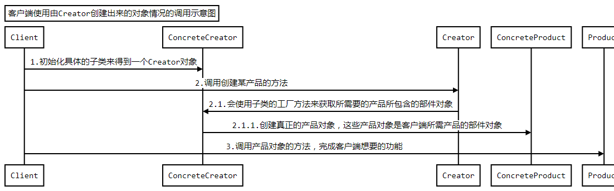
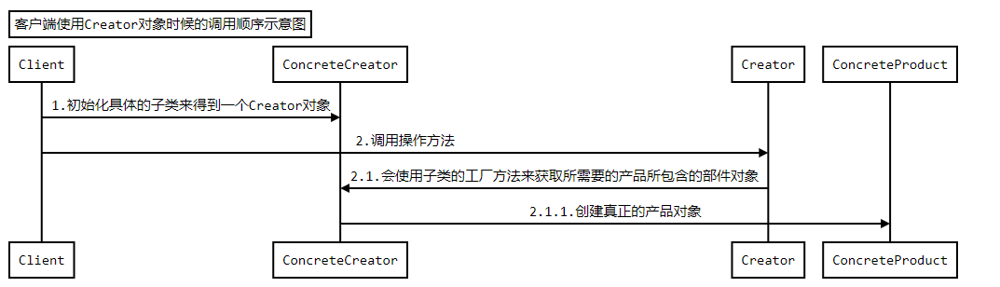

# 工厂方法模式

## 初识工厂方法模式
### 定义
定义一个用于创建对象的接口（接口是指一个通道，而并非单纯的指interface），`让子类决定实例化哪一个类`，FactoryMethod使一个类的`实例化延迟到其子类`


### 结构和说明：


* **Product：** 定义工厂方法所创建的对象的接口，也就是实际需要使用的对象的接口
* **ConcreteProduct：** 具体的product接口的实现对象
* **Creator：** 创建器，声明工厂方法
* **ConcreteCreator：** 具体的创建器对象，覆盖实现Creator定义的工厂方法，返回具体的Product实例

```java
/**
 * 工厂方法所创建的对象的接口
 */
public interface Product {
	//可以定义Product的方法
}
/**
 * 具体的Product对象
 */
public class ConcreteProduct implements Product {
	//实现Product要求的方法
}
/**
 * 创建器，声明工厂方法
 */
public abstract class Creator {
	/**
	 * 创建Product的工厂方法
	 * @return Product对象
	 */
	protected abstract Product factoryMethod();
	/**
	 * 示意方法，实现某些功能的方法
	 */
	public void someOperation() {
		//通常在这些方法实现中，需要调用工厂方法来获取Product对象
		Product product = factoryMethod();
	}

}
/**
 * 具体的创建器实现对象
 */
public class ConcreteCreator extends Creator {
	public Product factoryMethod() {
		//重定义工厂方法，返回一个具体的Product对象
		return new ConcreteProduct();
	}
}
```


## 体会工厂方法模式

### 问题：
**导出数据的应用框架：**
	考虑这样一个实际应用：实现一个导出数据的应用框架，来让客户选择数据的导出方式，并真正执行数据导出
	通常这种系统，在导出数据上，会有一些约定的方式，比如导出成：文本格式、数据库备份形式、excel格式、xml格式等等

### 不用模式的解决方案：
```java
/**
 * 导出的文件对象的接口
 */
public interface ExportFileApi {
	/**
	 * 导出内容成为文件
	 * @param data 示意：需要保存的数据
	 * @return 是否导出成功
	 */
	public boolean export(String data);
}
/**
 * 导出成文本文件格式的对象
 */
public class ExportTxtFile implements ExportFileApi{
	public boolean export(String data) {
		//简单示意一下，这里需要操作文件
		System.out.println("导出数据"+data+"到文本文件");
		return true;
	}
}
/**
 * 导出成数据库备份文件形式的对象
 */
public class ExportDB implements ExportFileApi{
	public boolean export(String data) {
		//简单示意一下，这里需要操作数据库和文件
		System.out.println("导出数据"+data+"到数据库备份文件");
		return true;
	}
}
/**
 * 实现导出数据的业务功能对象
 */
public class ExportOperate {
	/**
	 * 导出文件
	 * @param type 用户选择的导出类型
	 * @param data 需要保存的数据
	 * @return 是否成功导出文件
	 */
	public boolean export(int type,String data){
		ExportFileApi api = null;
		//根据类型来选择究竟要创建哪一种导出文件对象
		if(type == 1){
			api = new ExportTxtFile();
		}else if(type == 2){
			api = new ExportDB();
		}
		return api.export(data);
	}
}
public class Client {
	public static void main(String[] args) {
		ExportOperate operate = new ExportOperate();
		operate.export(2, "测试数据");
	}
}
```

**存在的问题：**

1. ExportOperate：职责不明确，只是使用接口，而不需要承担创建对象的功能;对于扩展来说，不灵活（开闭原则：不要通过修改来增加新的功能）
2. Client：客户端需要传递类型，去选择获得什么实例，不方便！万一人家传错了


对于实现导出数据的业务功能对象，它需要创建exportFileApi的具体实例对象，但是它只知道ExportFileApi接口，而不知道其具体的实现。那该怎么办呢？

### 使用模式的解决方案


* **ExportOperate ：** `使用api`，但是定义了一个`工厂方法`，把具体的实例实现延迟到了具体的子类，利用了继承，客户端使用，只需要创建对应的 operate 就成了
* **ExportOperate ：** `只知道接口，不知道实现，扩展灵活`。如需要扩展另外一种xml的格式打印，ExportOperate 中不需要修改代码，就能实现功能

```java
/**
 * 导出的文件对象的接口
 */
public interface ExportFileApi {
	/**
	 * 导出内容成为文件
	 * @param data 示意：需要保存的数据
	 * @return 是否导出成功
	 */
	public boolean export(String data);
}
/**
 * 导出成文本文件格式的对象
 */
public class ExportTxtFile implements ExportFileApi{
	public boolean export(String data) {
		//简单示意一下，这里需要操作文件
		System.out.println("导出数据"+data+"到文本文件");
		return true;
	}
}
/**
 * 导出成数据库备份文件形式的对象
 */
public class ExportDB implements ExportFileApi{
	public boolean export(String data) {
		//简单示意一下，这里需要操作数据库和文件
		System.out.println("导出数据"+data+"到数据库备份文件");
		return true;
	}
}
/**
 * 实现导出数据的业务功能对象
 */
public abstract class ExportOperate {
	/**
	 * 导出文件
	 * @param data 需要保存的数据
	 * @return 是否成功导出文件
	 */
	public boolean export(String data){
		//使用工厂方法
		ExportFileApi api = factoryMethod();
		return api.export(data);
	}
	/**
	 * 工厂方法，创建导出的文件对象的接口对象
	 * @return 导出的文件对象的接口对象
	 */
	protected abstract ExportFileApi factoryMethod();
}
/**
 * 具体的创建器实现对象，实现创建导出成文本文件格式的对象
 */
public class ExportTxtFileOperate extends ExportOperate{

	protected ExportFileApi factoryMethod() {
		//创建导出成文本文件格式的对象
		return new ExportTxtFile();
	}

}
/**
 * 具体的创建器实现对象，实现创建导出成数据库备份文件形式的对象
 */
public class ExportDBOperate extends ExportOperate{
	protected ExportFileApi factoryMethod() {
		//创建导出成数据库备份文件形式的对象
		return new ExportDB();
	}
}
public class Client {
	public static void main(String[] args) {
		//创建需要使用的Creator对象
		ExportOperate operate = new ExportDBOperate(); //如果需要替换其他的导出方式，只需要更改这里就ok，如果通过配置的形式，直接给定类名就ok。
		//调用输出数据的功能方法
		operate.export("测试数据");
	}
}

```


## 理解工厂方法模式

### 认识工厂方法模式

1. 工厂方法模式的功能
	工厂方法的主要功能是`让父类在不知道具体实现的情况下，完成自身的功能调用`，而且具体的实现延迟到子类来实现

2. 实现成抽象类
	工厂方法的实现中，`通常父类`会`是`一个`抽象类`，里面包含`创建`所需`对象的抽象方法`，这些抽象方法就是`工厂方法`。
	**抽象类：** 既要`约束子类的行为`(必须实现工厂方法，创建实例)，又要`为子类提供公共的功能`。

3. 实现成具体类
	也可以把`父类`实现称为一个`具体的类`，这种情况下，通常是在父类中`提供`获取所需`对象的默认实现方法`，这样就算没有具体的子类，也能够运行。

4. 工厂方法的参数和返回值
	工厂方法的实现中，可能需要参数，以便决定到底选用哪种具体的实现。
	`一般`工厂方法`返回`的是被创建`对象的接口对象`，当然也可以是抽象类或则一个具体的类的实例

5. 谁来使用工厂方法创建的对象

  1. 在`工厂方法模式里面`，应该是`Creator中的其他方法`在使用工厂方法创建的对象

  2. 客户端应该是使用Creator对象，或则是使用由Creator创建出来的对象，这个时候工厂方法创建的对象，是Creator中的某些方法使用
	假如说一个Abc类（私有化了无参构造，有参构造又需要一个Product实例（实例是由具体的创建器创建的）），那么就可以在创建器ExportOperate.java中 提供一个方法

    ```java
    publice Abc creatAbc(String name)｛
    	return new Abc（name， factoryMethod）  //在创建器中调用 工厂方法得到这个实例对象。
    ｝

    /**
     * 客户端使用Creator对象的情况下，Creator的基本实现结构
     */
    public abstract class Creator {
    	/**
    	 * 工厂方法，一般不对外
    	 * @return 创建的产品对象
    	 */
    	protected abstract Product factoryMethod();
    	/**
    	 * 提供给外部使用的方法，
    	 * 客户端一般使用Creator提供的这些方法来完成所需要的功能
    	 */
    	public void someOperation(){
    		//在这里使用工厂方法
    		Product p = factoryMethod();
    	}
    }
    public interface Product {

    }
    ```

  3. 在某些情况下，客户端可能会使用由Creator创建出来的对象，这个时候`工厂方法创建的对象`，是`构成客户端需要的对象的一部分`。

    ```java
    public interface Product {
    	public void setProduct1(Product1 p1);
    	public void setProduct2(Product2 p2);
    }
    public interface Product1{

    }
    public interface Product2{

    }
    public class ConcreteProduct implements Product{

    	public void setProduct1(Product1 p1) {
    		// TODO Auto-generated method stub
    	}

    	public void setProduct2(Product2 p2) {
    		// TODO Auto-generated method stub
    	}

    }

    /**
     * 客户端使用Creator来创建客户端需要的对象的情况下，Creator的基本实现结构
     */
    public abstract class Creator {
    	/**
    	 * 工厂方法，一般不对外，创建一个部件对象
    	 * @return 创建的产品对象，一般是另一个产品对象的部件
    	 */
    	protected abstract Product1 factoryMethod1();
    	/**
    	 * 工厂方法，一般不对外，创建一个部件对象
    	 * @return 创建的产品对象，一般是另一个产品对象的部件
    	 */
    	protected abstract Product2 factoryMethod2();
    	/**
    	 * 创建客户端需要的对象，客户端主要使用产品对象来完成所需要的功能
    	 * @return 客户端需要的对象
    	 */
    	public Product createProduct(){
    		//在这里使用工厂方法，得到客户端所需对象的部件对象
    		Product1 p1 = factoryMethod1();
    		Product2 p2 = factoryMethod2();
    		//工厂方法创建的对象是创建客户端对象所需要的
    		Product p = new ConcreteProduct();
    		p.setProduct1(p1);
    		p.setProduct2(p2);

    		return p;
    	}
    }
    ```

### 小结
在工厂方法模式里面，客户端要么使用`Creator对象`，要么使用`Creator创建的对象`，`一般`客户端`不直接使用工厂方法`。当然也可以直接把工厂方法暴露给客户端操作，但是一般不这么做。

### 调用顺序示意图
时序图就不画完整的返回虚线了，学java的都能看懂这个调用吧




### 工厂方法模式与Ioc/DI

#### 概念

**依赖注入：**` 应用程序`依赖`容器`创建并注入它所需要的外部资源

**控制反转：**` 容器控制`应用`程序`，由容器反向的向应用程序注入应用程序所需要的外部资源

#### 理解
1. **参与者都有谁？:** `应用程序`；`容器`

2. 依赖：
	1. **谁依赖于谁？: ** 应用程序依赖程序
	2. ** 为什么需要依赖？:** 应用程序需要外部资源，这些资源由容器创建并注入

3. 注入

	1. **谁注入谁？:** 容器注入程序
	2. **到底注入什么？:** 应用程序需要什么就注入什么

4. 控制反转：

	1. **谁控制谁？：** 容器控制应用程序
	2. **控制什么？：** 控制应用程序所需要的资源
	3. **为何叫反转（有反转就应该有正转了）？：** 反转相对于正转来说的，正转就是说，应用程序需要什么就去创建什么，而反转是，程序需要什么由容器来注入
5. 依赖注入和控制反转是同一概念么？

	严格说不是同一概念，但是都是描述的同一个事物。

	**依赖的理解：**
	* **名词：** 依赖关系
	* **动词：** 谁依赖谁
	* **依赖注入：** 依赖注入依赖；应用程序`依赖`容器`为它注入`依赖关系

#### 过程

**没有Ioc/Di的时候，常规的A类使用C类示意图**


**有了IOc/DI的时候，A类不再主动去创建C了**


**而是被动等待，等待IOC/DI的容器获取一个C的实例，然后反向的注入到A类中**


#### 思想

其实`IOC/DI`对编程带来的最大改变不是从代码上，而是`从思想`上，发生了`“主从换位”`的变化。

`应用程序原`本`是老大`，要获取什么资源都是`主动出击`，`但是在IOC/DI思想中`，应用程序`就变成被动`的了，被动的等待IOC/DI容器来创建并注入它所需要的资源了。

这么小小的一个改变其实是编程思想的一个大进步，这样就`有效`的`分离了对象`和它所需要的`外部资源`，使得他们`松散耦合`，有利于`功能复用`，更重要的是使得程序的`整个体系结构变得非常灵活`

------------


### 工厂方法模式和IOC/DI的关系

他们的思想很类似，都是❶`“主动变被动”`，进行`“主从换位”`，从而获得更灵活的程序结构

`注`❶：他不知道怎么去获取一个对象，所以从主动变为了被动，由子类去实现返回一个预期的对象来使用

```java
// ioc/di
public class A {
	/**
	 * 等待被注入进来
	 */
	private C c = null;
	/**
	 * 注入资源C的方法
	 * @param c 被注入的资源
	 */
	public void setC(C c){
		this.c = c;
	}
	public void t1(){
		//这里需要使用C类，可是又不让主动去创建C了，怎么办？
		//反正就要求从外部注入，这样更省心，
		//自己不用管怎么获取C，直接使用就好了
		c.tc();
	}
}
// 工厂方法模式
public abstract class A1 {
	/**
	 * 工厂方法，创建C1，类似于从子类注入进来的途径
	 * @return C1的对象实例
	 */
	protected abstract C1 createC1();
	public void t1(){
		//这里需要使用C1类，可是不知道究竟是用哪一个，也就不主动去创建C1了，怎么办？
		//反正会在子类里面实现，这样更省心，这里不用管怎么获取C1，直接使用就好了
		createC1().tc();
	}
}
public class A2 extends A1 {
	protected C1 createC1() {
		//真正的选择具体实现，并创建对象
		return new C2();
	}
}
public interface C {
	public void tc();
}
public interface C1 {
	public void tc();
}

public class C2 implements C1{

	public void tc() {
		// TODO Auto-generated method stub
	}

}
```

## 平行的类层次结构
### 什么是平行的类层次结构呢？

简单点说，假如有两个类层次结构，其中一个类层次中的每个类在另一个类层次中都有一个对应的类的结构，就被认为平行的类层次结构


硬盘 --> 台式机希捷硬盘 --> 硬盘对象的行为  --> 台式机希捷硬盘的行为

硬盘 --> 笔记本IBM硬盘 --> 硬盘对象的行为  --> 笔记本IBM硬盘的行为

**可以把上面的合成一个层次结构：**

硬盘 --> 台式机 和 笔记本 硬盘 --> 硬盘的行为 --＞　台式机希捷硬盘　和笔记本IBM硬盘的行为

这样的话，一个类的职责就过多了。难于扩展复用，如果需要加上电脑的属性，可以拆分成下面这样


```java
/**
 * 硬盘行为
 * @author zq
 *
 */
public interface HDOperate {
	/** 获取数据*/
	void getDate();
	/** 存储数据*/
	void saveDate();
}
/**
	希捷硬盘行为
*/
public class XDiskOper implements HDOperate {

	@Override
	public void getDate() {
		System.out.println("希捷硬盘获取数据");

	}

	@Override
	public void saveDate() {
		System.out.println("希捷硬盘存储数据");
	}
}
/**
 * 硬盘对象,工厂方法
 * @author zq
 *
 */
abstract public class MardDisk {

	abstract HDOperate creatHDOperate();
	public void getDate(){
		creatHDOperate().getDate();
	}
	public void saveDate(){
		creatHDOperate().saveDate();
	}
}
/**
 * 希捷硬盘
 * @author zq
 *
 */
public class XDisk extends MardDisk {

	@Override
	public HDOperate creatHDOperate() {
		return new XDiskOper();
	}

}

public class Client {
	public static void main(String[] args) {
		MardDisk m =  new XDisk();
		m.getDate();
		m.saveDate();
	}
}
```

### 这种平行的类层次结构用来干什么呢？

主要用来把一个`类层次结构`中的`某些行为分离出来`，让类层次中的类把原本属于自己的职责，`委托`给`分离出来的类去实现`，从而使得类层次本身变得简单，更`容易扩展和复用`

### 工厂方法模式跟平行的类层次结构有和关系呢？

可以使用`工厂方法模式来连接平行的类层次`。
上面的示例图，在每个硬盘对象里面，都有一个工厂方法CreateHDOperate，通过这个工厂方法，客户端就可以获取一个根硬盘对象相对应的行为对象。


## 参数化工厂方法

**所谓参数化工厂方法指的就是：** 通过给工厂方法传递参数，让工厂方法根据参数的不同来创建不同的产品对象。

```java
/**
 * 导出的文件对象的接口
 */
public interface ExportFileApi {
	/**
	 * 导出内容成为文件
	 * @param data 示意：需要保存的数据
	 * @return 是否导出成功
	 */
	public boolean export(String data);
}
/**
 * 导出成文本文件格式的对象
 */
public class ExportTxtFile implements ExportFileApi{
	public boolean export(String data) {
		//简单示意一下，这里需要操作文件
		System.out.println("导出数据"+data+"到文本文件");
		return true;
	}
}
/**
 * 导出成数据库备份文件形式的对象
 */
public class ExportDB implements ExportFileApi{
	public boolean export(String data) {
		//简单示意一下，这里需要操作数据库和文件
		System.out.println("导出数据"+data+"到数据库备份文件");
		return true;
	}
}
/**
 * 导出成xml文件的对象
 */
public class ExportXml implements ExportFileApi{
	public boolean export(String data) {
		//简单示意一下
		System.out.println("导出数据"+data+"到XML文件");
		return true;
	}
}
/**
 * 实现导出数据的业务功能对象
 */
public class ExportOperate {
	/**
	 * 导出文件
	 * @param type 用户选择的导出类型
	 * @param data 需要保存的数据
	 * @return 是否成功导出文件
	 */
	public boolean export(int type,String data){
		//使用工厂方法
		ExportFileApi api = factoryMethod(type);
		return api.export(data);
	}
	/**
	 * 工厂方法，创建导出的文件对象的接口对象
	 * @param type 用户选择的导出类型
	 * @return 导出的文件对象的接口对象
	 */
	protected ExportFileApi factoryMethod(int type){   //这个方法看上去有点像简单工厂，其实简单工厂就是工厂方法模式的一个特列
		ExportFileApi api = null;
		//根据类型来选择究竟要创建哪一种导出文件对象
		if(type==1){
			api = new ExportTxtFile();
		}else if(type==2){
			api = new ExportDB();
		}
		return api;
	}
}
/**
 * 扩展ExportOperate对象，加入可以导出XML文件
 */
public class ExportOperate2 extends ExportOperate{
	/**
	 * 覆盖父类的工厂方法，创建导出的文件对象的接口对象
	 * @param type 用户选择的导出类型
	 * @return 导出的文件对象的接口对象
	 */
	protected ExportFileApi factoryMethod(int type){
		ExportFileApi api = null;
		//可以全部覆盖，也可以选择自己感兴趣的覆盖，
		//这里只想添加自己新的实现，其他的不管
		if(type==3){
			api = new ExportXml();
		}else{
			//其他的还是让父类来实现
			api = super.factoryMethod(type);
		}
		return api;
	}
}
public class Client {
	public static void main(String[] args) {
//		//创建需要使用的Creator对象
//		ExportOperate operate = new ExportOperate();
//		//调用输出数据的功能方法，传入选择到处类型的参数
//		operate.export(1,"测试数据");

		//创建需要使用的Creator对象
		ExportOperate operate = new ExportOperate2();
		//下面变换传入的参数来测试参数化工厂方法
		operate.export(1,"Test1");
		operate.export(2,"Test2");
		operate.export(3,"Test3");
	}
}
```

当需要扩展新的实现，使用参数化工厂方法，扩展起来会非常的容易

### 工厂方法模式的写法:这个还要去确认下原书有没有写这一段

### 工厂方法模式的优缺点：
`优点：`

1. 可以在不知具实现的情况下编程
2. 更容易扩展对象的新版本
3. 连接平行的类层次结构

`缺点：`

1. 具体产品对象和工厂方法的耦合性（分离出去了，所以耦合很高）


------------


## 思考工厂方法模式
### 工厂方法模式的本质：

**工厂方法模式的本质是：** `延迟`到`子类来选择`实现

**简单工厂:** 就是工厂方法模式的一个特列,其实就是把 `选择功能` 从工厂方法模式中提取了出来。`只负责选择`，

**而工厂方法模式：**`选择 延迟到了子类`，他自己还需要实现其他的业务功能

### 对设计原则的体现：

工厂方法模式很好的体现了`“依赖倒置原则”`。

依赖倒置原则告诉我们`“要依赖抽象”`，`不要依赖于具体类`，简单点说就是：不能让高层组件依赖于底层组件，而且不管高层组件还是底层组件，都应该依赖于抽象。（和面向接口编程差不多的意思，这里是面向抽象编程）


虚线表示：Api接口是属于上层结构的。

### 何时选用工厂方法模式

1. 如果一个类需要`创建某个接口的对象`，但是又`不知道具体的实现`，这种情况可以选用工厂方法模式，把创建对象的工作延迟到子类去实现

2. 如果一个类`本身`就希望`由`它的`子类来创建所需的对象`的时候，应该使用工厂方法模式
	（spring data jpa 中封装条件查询的方法就应该使用的这种方式，如果有空，可以试着去实现下）
