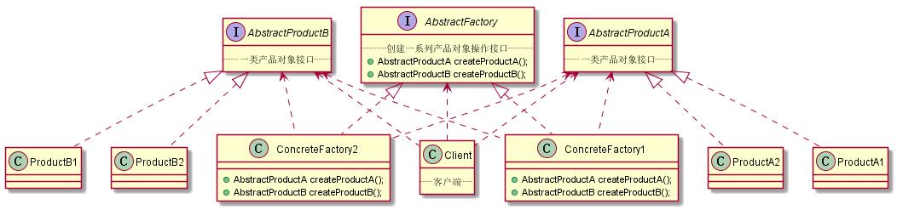
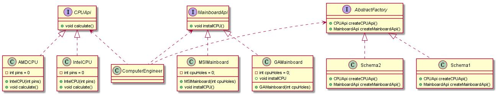
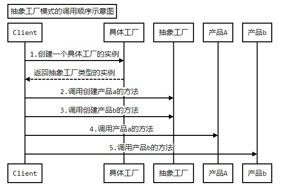
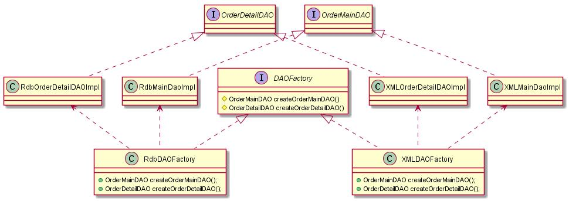

# 抽象工厂模式

## 初识抽象工厂模式
### 定义
提供一个`创建一系列相关或相互依赖对象`的接口，而无需指定他们具体的类。

### 结构和说明



* **AbstractFactory：** 抽象工厂，定义创建一系列产品对象的操作接口
* **ConcreteFactory：** 具体的工厂，实现抽象工厂定义的方法，具体实现一系列产品对象的创建
* **AbstractProduct：** 定义一类产品对象的接口
* **ConcreteProduct：** 具体的产品实现对象，通常在具体工厂里面，会选择具体的产品实现对象，来创建符合抽象工厂定义的方法返回的产品类型的对象。
* **Client：** 客户端，主要使用抽象工厂来获取`一系列`所需要的产品对象，然后面向这些产品对象的接口编程，以实现需要的功能

```java
/**
 * 抽象产品A的接口
 */
public interface AbstractProductA {
	//定义抽象产品A相关的操作
}
/**
 * 产品A的具体实现
 */
public class ProductA1 implements AbstractProductA {
	//实现产品A的接口中定义的操作
}
/**
 * 产品A的具体实现
 */
public class ProductA2 implements AbstractProductA {
	//实现产品A的接口中定义的操作
}
/**
 * 抽象产品B的接口
 */
public interface AbstractProductB {
	//定义抽象产品B相关的操作
}/**
 * 产品B的具体实现
 */
public class ProductB1 implements AbstractProductB {
	//实现产品B的接口中定义的操作
}/**
 * 产品B的具体实现
 */
public class ProductB2 implements AbstractProductB {
	//实现产品B的接口中定义的操作
}/**
 * 抽象工厂的接口，声明创建抽象产品对象的操作
 */
public interface AbstractFactory {
	/**
	 * 示例方法，创建抽象产品A的对象
	 * @return 抽象产品A的对象
	 */
	public AbstractProductA createProductA();
	/**
	 * 示例方法，创建抽象产品B的对象
	 * @return 抽象产品B的对象
	 */
	public AbstractProductB createProductB();
}/**
 * 具体的工厂实现对象，实现创建具体的产品对象的操作
 */
public class ConcreteFactory1 implements AbstractFactory {

	public AbstractProductA createProductA() {
		return new ProductA1();
	}
	public AbstractProductB createProductB() {
		return new ProductB1();
	}

}/**
 * 具体的工厂实现对象，实现创建具体的产品对象的操作
 */
public class ConcreteFactory2 implements AbstractFactory {

	public AbstractProductA createProductA() {
		return new ProductA2();
	}
	public AbstractProductB createProductB() {
		return new ProductB2();
	}

}public class Client {

	public static void main(String[] args) {
		//创建抽象工厂对象
		AbstractFactory af = new ConcreteFactory1();
		//通过抽象工厂来获取一系列的对象，如产品A和产品B
		af.createProductA();
		af.createProductB();
	}
}
```


------------

## 体会抽象工厂模式
**问题：**
1. 选择组装电脑的配件

	 举个生活中常见的例子 ---- 组装电脑：

   我们在组装电脑的时候，通常需要选择一系列的配件，比如：CP硬盘、内存、主板、电源、机箱等等。为了使讨论简单点，只考虑选择cpu和主板的问题。

   对于装机工程师而言，他只知道组装一台电脑，需要相应的配件，但是具体使用什么样的配件，还得由客户说了算。也就是说装机工程师只是负责组装，而客户负责选择装配所需要的具体的配件。

2. 问题出来了：

   现在需要使用程序来把这个装机的过程，尤其是选择组装电脑配件的过程实现出来，该如何实现呢？

### 不用模式的解决方案

```java
/**
 * CPU的接口
 */
public interface CPUApi {
	/**
	 * 示意方法，CPU具有运算的功能
	 */
	public void calculate();
}
/**
 *Intel的CPU实现
 */
public class IntelCPU implements CPUApi{
	/**
	 * CPU的针脚数目
	 */
	private int pins = 0;
	/**
	 * 构造方法，传入CPU的针脚数目
	 * @param pins CPU的针脚数目
	 */
	public IntelCPU(int pins){
		this.pins = pins;
	}

	public void calculate() {
		System.out.println("now in Intel CPU,pins="+pins);
	}
}
/**
 * AMD的CPU实现
 */
public class AMDCPU implements CPUApi{
	/**
	 * CPU的针脚数目
	 */
	private int pins = 0;
	/**
	 * 构造方法，传入CPU的针脚数目
	 * @param pins CPU的针脚数目
	 */
	public AMDCPU(int pins){
		this.pins = pins;
	}
	public void calculate() {
		System.out.println("now in AMD CPU,pins="+pins);
	}
}


/**
 * 主板的接口
 */
public interface MainboardApi {
	/**
	 * 示意方法，主板都具有安装CPU的功能
	 */
	public void installCPU();
}
/**
 * 微星的主板
 */
public class MSIMainboard implements MainboardApi{
	/**
	 * CPU插槽的孔数
	 */
	private int cpuHoles = 0;
	/**
	 * 构造方法，传入CPU插槽的孔数
	 * @param cpuHoles CPU插槽的孔数
	 */
	public MSIMainboard(int cpuHoles){
		this.cpuHoles = cpuHoles;
	}
	public void installCPU() {
		System.out.println("now in MSIMainboard,cpuHoles="+cpuHoles);
	}
}
/**
 * 技嘉的主板
 */
public class GAMainboard implements MainboardApi {
	/**
	 * CPU插槽的孔数
	 */
	private int cpuHoles = 0;
	/**
	 * 构造方法，传入CPU插槽的孔数
	 * @param cpuHoles CPU插槽的孔数
	 */
	public GAMainboard(int cpuHoles){
		this.cpuHoles = cpuHoles;
	}
	public void installCPU() {
		System.out.println("now in GAMainboard,cpuHoles="+cpuHoles);
	}
}

/**
 * 创建CPU的简单工厂
 */
public class CPUFactory {
	/**
	 * 创建CPU接口对象的方法
	 * @param type 选择CPU类型的参数
	 * @return CPU接口对象的方法
	 */
	public static CPUApi createCPUApi(int type){
		CPUApi cpu = null;
		//根据参数来选择并创建相应的CPU对象
		if(type==1){
			cpu = new IntelCPU(1156);
		}else if(type==2){
			cpu = new AMDCPU(939);
		}
		return cpu;
	}
}

/**
 * 创建主板的简单工厂
 */
public class MainboardFactory {
	/**
	 * 创建主板接口对象的方法
	 * @param type 选择主板类型的参数
	 * @return 主板接口对象的方法
	 */
	public static MainboardApi createMainboardApi(int type){
		MainboardApi mainboard = null;
		//根据参数来选择并创建相应的主板对象
		if(type==1){
			mainboard = new GAMainboard(1156);
		}else if(type==2){
			mainboard = new MSIMainboard(939);
		}
		return mainboard;
	}
}

/**
 * 装机工程师的类
 */
public  class ComputerEngineer {
	/**
	 * 定义组装机器需要的CPU
	 */
	private CPUApi cpu= null;
	/**
	 * 定义组装机器需要的主板
	 */
	private MainboardApi mainboard = null;

	/**
	 * 装机过程
	 * @param cpuType 客户选择所需CPU的类型
	 * @param mainboardType 客户选择所需主板的类型
	 */
	public void makeComputer(int cpuType,int mainboardType){
		//1：首先准备好装机所需要的配件
		prepareHardwares(cpuType,mainboardType);
		//2：组装机器

		//3：测试机器

		//4：交付客户
	}
	/**
	 * 准备装机所需要的配件
	 * @param cpuType 客户选择所需CPU的类型
	 * @param mainboardType 客户选择所需主板的类型
	 */
	private void prepareHardwares(int cpuType,int mainboardType){
		//这里要去准备CPU和主板的具体实现，为了示例简单，这里只准备这两个
		//可是，装机工程师并不知道如何去创建，怎么办呢？

		//直接找相应的工厂获取
		this.cpu = CPUFactory.createCPUApi(cpuType);
		this.mainboard = MainboardFactory.createMainboardApi(mainboardType);

		//测试一下配件是否好用
		this.cpu.calculate();
		this.mainboard.installCPU();
	}
}

public class Client {
	public static void main(String[] args) {
		//创建装机工程师对象
		ComputerEngineer engineer = new ComputerEngineer();
		//告诉装机工程师自己选择的配件，让装机工程师组装电脑
		engineer.makeComputer(1,2);
	}
}
```

**存在的问题：**

告诉装机工程师自己选择的配件，让装机工程师组装电脑

```java
engineer.makeComputer(1,2);   
```

从客户端调用来看，如果我不清楚，这些代表的是什么。很容易传入错误的类型，那么 cpu 和主板就不匹配

虽然上面的实现，通过简单工厂解决了这个事情：对于装机工程师，只知道cpu和主板的接口，而不知道具体的实现的问题，

但还有一个问题没有解决，什么问题呢？那就是这些 cpu 对象和主板对象其实是有关系的，是需要相互匹配的。


### 使用模式的解决方案：
先来看看使用模式的思路：

1. 装机工程师要组装电脑对象，需要一系列的产品对象，比如CPU、主板等，于是创建一个抽象工厂给装机工程师使用，在这个抽象工厂里面定义抽象的创建 cpu 和主板的方法，这个抽象工厂就相当于一个抽象的装机方案，在 装机方案里面，各个配件是能够相互匹配的。

2. 每个装机的客户，会提出他们自己的具体装机方案，或则是选择已有的装机方案，相当于为抽象工厂提供了具体的子类，在这些具体的装机方案类里面，会创建具体的 cpu 和主板实现对象。



```java
/**
 * CPU的接口
 */
public interface CPUApi {
	/**
	 * 示意方法，CPU具有运算的功能
	 */
	public void calculate();
}
/**
 * AMD的CPU实现
 */
public class AMDCPU implements CPUApi{
	/**
	 * CPU的针脚数目
	 */
	private int pins = 0;
	/**
	 * 构造方法，传入CPU的针脚数目
	 * @param pins CPU的针脚数目
	 */
	public AMDCPU(int pins){
		this.pins = pins;
	}
	public void calculate() {
		System.out.println("now in AMD CPU,pins="+pins);
	}
}
/**
 *Intel的CPU实现
 */
public class IntelCPU implements CPUApi{
	/**
	 * CPU的针脚数目
	 */
	private int pins = 0;
	/**
	 * 构造方法，传入CPU的针脚数目
	 * @param pins CPU的针脚数目
	 */
	public IntelCPU(int pins){
		this.pins = pins;
	}

	public void calculate() {
		System.out.println("now in Intel CPU,pins="+pins);
	}
}
/**
 * 主板的接口
 */
public interface MainboardApi {
	/**
	 * 示意方法，主板都具有安装CPU的功能
	 */
	public void installCPU();
}
/**
 * 微星的主板
 */
public class MSIMainboard implements MainboardApi{
	/**
	 * CPU插槽的孔数
	 */
	private int cpuHoles = 0;
	/**
	 * 构造方法，传入CPU插槽的孔数
	 * @param cpuHoles CPU插槽的孔数
	 */
	public MSIMainboard(int cpuHoles){
		this.cpuHoles = cpuHoles;
	}
	public void installCPU() {
		System.out.println("now in MSIMainboard,cpuHoles="+cpuHoles);
	}
}
/**
 * 技嘉的主板
 */
public class GAMainboard implements MainboardApi {
	/**
	 * CPU插槽的孔数
	 */
	private int cpuHoles = 0;
	/**
	 * 构造方法，传入CPU插槽的孔数
	 * @param cpuHoles CPU插槽的孔数
	 */
	public GAMainboard(int cpuHoles){
		this.cpuHoles = cpuHoles;
	}
	public void installCPU() {
		System.out.println("now in GAMainboard,cpuHoles="+cpuHoles);
	}
}

/**
 * 抽象工厂的接口，声明创建抽象产品对象的操作
 */
public interface AbstractFactory {
	/**
	 * 创建CPU的对象
	 * @return CPU的对象
	 */
	public CPUApi createCPUApi();
	/**
	 * 创建主板的对象
	 * @return 主板的对象
	 */
	public MainboardApi createMainboardApi();
}
/**
 * 装机方案一：Intel 的CPU + 技嘉的主板
 * 这里创建CPU和主板对象的时候，是对应的，能匹配上的
 */
public class Schema1 implements AbstractFactory{
	public CPUApi createCPUApi() {
		return new IntelCPU(1156);
	}
	public MainboardApi createMainboardApi() {
		return new GAMainboard(1156);
	}
}
/**
 * 装机方案二：AMD的CPU + 微星的主板
 * 这里创建CPU和主板对象的时候，是对应的，能匹配上的
 */
public class Schema2 implements AbstractFactory{
	public CPUApi createCPUApi() {
		return new AMDCPU(939);
	}
	public MainboardApi createMainboardApi() {
		return new MSIMainboard(939);
	}
}
/**
 * 装机工程师的类
 */
public  class ComputerEngineer {
	/**
	 * 定义组装机器需要的CPU
	 */
	private CPUApi cpu= null;
	/**
	 * 定义组装机器需要的主板
	 */
	private MainboardApi mainboard = null;

	/**
	 * 装机过程
	 * @param schema 客户选择的装机方案
	 */
	public void makeComputer(AbstractFactory schema){
		//1：首先准备好装机所需要的配件
		prepareHardwares(schema);
		//2：组装机器

		//3：测试机器

		//4：交付客户
	}
	/**
	 * 准备装机所需要的配件
	 * @param schema 客户选择的装机方案
	 */
	private void prepareHardwares(AbstractFactory schema){
		//这里要去准备CPU和主板的具体实现，为了示例简单，这里只准备这两个
		//可是，装机工程师并不知道如何去创建，怎么办呢？

		//使用抽象工厂来获取相应的接口对象
		this.cpu = schema.createCPUApi();
		this.mainboard = schema.createMainboardApi();

		//测试一下配件是否好用
		this.cpu.calculate();
		this.mainboard.installCPU();
	}
}
public class Client {
	public static void main(String[] args) {
		//创建装机工程师对象
		ComputerEngineer engineer = new ComputerEngineer();
		//客户选择并创建需要使用的装机方案对象
		AbstractFactory schema = new Schema1();
		//告诉装机工程师自己选择的装机方案，让装机工程师组装电脑
		engineer.makeComputer(schema);
	}
}

```

很明显的，客户端使用的时候，是一套一套的选择，就解决了上面乱选不匹配的问题出现。

------------

## 理解抽象工厂模式
### 认识抽象工厂模式

1. 模式的功能

	抽象工厂的功能是为`一系列相关对象`或`相互依赖的对象`创建一个接口。

	从某种意义上看，抽象工厂其实是一个产品系列，或则是产品簇

2. 实现成接口

	AbstractFactory 在 java 中`通常实现为接口`，大家不要被名称误导了，以为是实现成为抽象类

3. 使用工厂方法

  AbstractFactory 定义了创建产品所需要的接口，具体的实现是在`实现类里面`，通常在实现类里面就需要`选择多种`更具体的实现，所以 AbstractFactory 定义的`创建产品的方法`可以看成`是工厂方法`，而这些工厂方法的`具体实现`就`延迟`到了具体的工厂里面。也就是说使用工厂方法来实现抽象工厂。
4. 切换产品簇

  抽象工厂定义了一个产品簇，因此切换产品簇的时候提供不同的抽象工厂就好了

5. 抽象工厂模式的调用顺序示意图

  

### 定义可扩展的工厂
在前面的实例中，抽象工厂为每一种它能创建的产品对象都定义了相应的方法，比如创建 cpu 的方法和创建主板的方法等。

`这种实现有一个麻烦`，就是如果在产品簇中要`增加一种产品`，比如现在要求抽象工厂除了能够创建 cpu 和主板外，还要能够创建内存对象，那么就需要在抽象工厂里面添加创建内存的这么一个方法。当`抽象工厂一发生变化`，`所有`的具体工厂`实现`都要`发生变化`，这非常的不灵活

现在有一种相对灵活，但是不太安全的改进方式来解决这个问题，思路如下：

`抽象工厂`里面不需要定义那么多方法，`定义一个方法`就可以了，给这个方法`设置一个参数`，通过这个参数来`判断具体创建什么产品对象`；由于只有一个方法，在`返回类型`上就不能是具体的某个产品类型了，只能是所有的产品对象都继承或则实现这么一个类型，比如让所有的产品都实现某个`接口`，或则干脆使用Object类

```java
/**
 * CPU的接口
 */
public interface CPUApi {
	/**
	 * 示意方法，CPU具有运算的功能
	 */
	public void calculate();
}
/**
 *Intel的CPU实现
 */
public class IntelCPU implements CPUApi{
	/**
	 * CPU的针脚数目
	 */
	private int pins = 0;
	/**
	 * 构造方法，传入CPU的针脚数目
	 * @param pins CPU的针脚数目
	 */
	public IntelCPU(int pins){
		this.pins = pins;
	}

	public void calculate() {
		System.out.println("now in Intel CPU,pins="+pins);
	}
}
/**
 * AMD的CPU实现
 */
public class AMDCPU implements CPUApi{
	/**
	 * CPU的针脚数目
	 */
	private int pins = 0;
	/**
	 * 构造方法，传入CPU的针脚数目
	 * @param pins CPU的针脚数目
	 */
	public AMDCPU(int pins){
		this.pins = pins;
	}
	public void calculate() {
		System.out.println("now in AMD CPU,pins="+pins);
	}
}
/**
 * 主板的接口
 */
public interface MainboardApi {
	/**
	 * 示意方法，主板都具有安装CPU的功能
	 */
	public void installCPU();
}
/**
 * 微星的主板
 */
public class MSIMainboard implements MainboardApi{
	/**
	 * CPU插槽的孔数
	 */
	private int cpuHoles = 0;
	/**
	 * 构造方法，传入CPU插槽的孔数
	 * @param cpuHoles CPU插槽的孔数
	 */
	public MSIMainboard(int cpuHoles){
		this.cpuHoles = cpuHoles;
	}
	public void installCPU() {
		System.out.println("now in MSIMainboard,cpuHoles="+cpuHoles);
	}
}
/**
 * 技嘉的主板
 */
public class GAMainboard implements MainboardApi {
	/**
	 * CPU插槽的孔数
	 */
	private int cpuHoles = 0;
	/**
	 * 构造方法，传入CPU插槽的孔数
	 * @param cpuHoles CPU插槽的孔数
	 */
	public GAMainboard(int cpuHoles){
		this.cpuHoles = cpuHoles;
	}
	public void installCPU() {
		System.out.println("now in GAMainboard,cpuHoles="+cpuHoles);
	}
}
/**
 * 内存的接口
 */
public interface MemoryApi {
	/**
	 * 示意方法，内存具有缓存数据的能力
	 */
	public void cacheData();
}
/**
 * 现代内存的类
 */
public class HyMemory implements MemoryApi{
	public void cacheData() {
		System.out.println("现在正在使用现代内存");
	}
}
/**
 * 可扩展的抽象工厂的接口
 */
public interface AbstractFactory {
	/**
	 * 一个通用的创建产品对象的方法，为了简单，直接返回Object
	 * 也可以为所有被创建的产品定义一个公共的接口
	 * @param type 具体创建的产品类型标识
	 * @return 创建出的产品对象
	 */
	public Object createProduct(int type);
}
/**
 * 装机方案一：Intel 的CPU + 技嘉的主板
 * 这里创建CPU和主板对象的时候，是对应的，能匹配上的
 */
public class Schema1 implements AbstractFactory{
	public Object createProduct(int type) {
		Object retObj = null;
		//type为1表示创建CPU，type为2表示创建主板
		if(type==1){
			retObj = new IntelCPU(1156);
		}else if(type==2){
			retObj = new GAMainboard(1156);
		}
		return retObj;
	}
}
/**
 * 装机方案二：AMD的CPU + 微星的主板
 * 这里创建CPU和主板对象的时候，是对应的，能匹配上的
 */
public class Schema2 implements AbstractFactory{
	public Object createProduct(int type) {
		Object retObj = null;
		//type为1表示创建CPU，type为2表示创建主板
		if(type==1){
			retObj = new AMDCPU(939);
		}else if(type==2){
			retObj = new MSIMainboard(939);
		}
		return retObj;
	}
}
/**
 * 装机方案三：Intel 的CPU + 技嘉的主板 + 现代的内存
 */
public class Schema3 implements AbstractFactory{
	public Object createProduct(int type) {
		Object retObj = null;
		//type为1表示创建CPU，type为2表示创建主板，type为3表示创建内存
		if(type==1){
			retObj = new IntelCPU(1156);
		}else if(type==2){
			retObj = new GAMainboard(1156);
		}
		//创建新添加的产品
		else if(type==3){
			retObj = new HyMemory();
		}
		return retObj;
	}
}
/**
 * 装机工程师的类
 */
public  class ComputerEngineer {
	/**
	 * 定义组装机器需要的CPU
	 */
	private CPUApi cpu= null;
	/**
	 * 定义组装机器需要的主板
	 */
	private MainboardApi mainboard = null;
	/**
	 * 定义组装机器需要的内存
	 */
	private MemoryApi memory = null;

	/**
	 * 装机过程
	 * @param schema 客户选择的装机方案
	 */
	public void makeComputer(AbstractFactory schema){
		//1：首先准备好装机所需要的配件
		prepareHardwares(schema);
		//2：组装机器

		//3：测试机器

		//4：交付客户
	}
	/**
	 * 准备装机所需要的配件
	 * @param schema 客户选择的装机方案
	 */
	private void prepareHardwares(AbstractFactory schema){
		//这里要去准备CPU和主板的具体实现，为了示例简单，这里只准备这两个
		//可是，装机工程师并不知道如何去创建，怎么办呢？

		//使用抽象工厂来获取相应的接口对象
		this.cpu = (CPUApi)schema.createProduct(1);
		this.mainboard = (MainboardApi)schema.createProduct(2);
		this.memory = (MemoryApi)schema.createProduct(3);

		//测试一下配件是否好用
		this.cpu.calculate();
		this.mainboard.installCPU();
		if(memory!=null){
			this.memory.cacheData();
		}
	}
}
public class Client {
	public static void main(String[] args) {
		//创建装机工程师对象
		ComputerEngineer engineer = new ComputerEngineer();
		//客户选择并创建需要使用的装机方案对象
		AbstractFactory schema = new Schema3();
		//告诉装机工程师自己选择的装机方案，让装机工程师组装电脑
		engineer.makeComputer(schema);
	}
}


```

工程师使用该工厂的时候`不太安全`，因为涉及到强制类型转换。

**扩展：** 在产品簇里面添加判断方法。(没看想明白，在Schema中怎么判断返回？所以说是不安全的？ )

### 抽象工厂和DAO
知识回顾

1. DAO：数据访问对象，是 Data Access Object 首字母的简写

2. DAO 是 JEE（也称为 JavaEE ，原 J2EE ） 中的一个标准模式，通过它来解决访问数据对象所面临的问题，

   比如：数据源不同、存储类型的不同、访问方式不同、供应商不同、版本不同等等，这些不同会造成访问数据的实现上差别很大。

3. Dao 需要抽象和封装所有对数据的访问，Dao 承担和数据仓库的交互职责，这也意味着，访问数据所面临的所有问题，都需要 DAO 在内部来自行解决。

4. 使用 Dao 的系统结构图

  


### DAO 和抽象工厂的关系

在实现 DAO 模式的时候，一般场景的实现策略就是使用工厂的策略，而且多是通过抽象工厂模式来实现，当然在使用抽象工厂模式来实现的时候，可以结合工厂方法模式。因此 DAO 模式和抽象工厂模式有很大的联系

### DAO模式采用工厂方法模式来实现的策略


### DAO 模式采用抽象工厂模式来实现的策略


```java
/**
 * 订单主记录对应的DAO操作接口
 */
public interface OrderMainDAO {
	/**
	 * 示意方法，保存订单主记录
	 */
	public void saveOrderMain();
}
public class RdbMainDAOImpl implements OrderMainDAO{
	public void saveOrderMain() {
		System.out.println("now in RdbMainDAOImpl saveOrderMain");
	}
}

public class XmlMainDAOImpl implements OrderMainDAO{

	public void saveOrderMain() {
		System.out.println("now in XmlMainDAOImpl saveOrderMain");
	}

}
/**
 * 订单子记录对应的DAO操作接口
 */
public interface OrderDetailDAO {
	/**
	 * 示意方法，保存订单子记录
	 */
	public void saveOrderDetail();
}

public class XmlDetailDAOImpl implements OrderDetailDAO{

	public void saveOrderDetail() {
		System.out.println("now in XmlDAOImpl2 saveOrderDetail");
	}

}
public class RdbDetailDAOImpl implements OrderDetailDAO{
	public void saveOrderDetail() {
		System.out.println("now in RdbDetailDAOImpl saveOrderDetail");
	}
}
/**
 * 抽象工厂，创建订单主、子记录对应的DAO对象
 */
public abstract class DAOFactory {
	/**
	 * 创建订单主记录对应的DAO对象
	 * @return 订单主记录对应的DAO对象
	 */
	public abstract OrderMainDAO createOrderMainDAO();
	/**
	 * 创建订单子记录对应的DAO对象
	 * @return 订单子记录对应的DAO对象
	 */
	public abstract OrderDetailDAO createOrderDetailDAO();
}

public class RdbDAOFactory extends DAOFactory{
	public OrderDetailDAO createOrderDetailDAO() {
		return new RdbDetailDAOImpl();
	}
	public OrderMainDAO createOrderMainDAO() {
		return new RdbMainDAOImpl();
	}
}

public class XmlDAOFactory extends DAOFactory {
	public OrderDetailDAO createOrderDetailDAO() {
		return new XmlDetailDAOImpl();
	}
	public OrderMainDAO createOrderMainDAO() {
		return new XmlMainDAOImpl();
	}
}

public class BusinessObject {
	public static void main(String[] args) {
		//创建DAO的抽象工厂
		DAOFactory df = new RdbDAOFactory();
		//通过抽象工厂来获取需要的DAO接口
		OrderMainDAO mainDAO = df.createOrderMainDAO();
		OrderDetailDAO detailDAO = df.createOrderDetailDAO();
		//调用DAO来完成数据存储的功能
		mainDAO.saveOrderMain();
		detailDAO.saveOrderDetail();
	}
}
```

**工厂方法的策略**：因为只有一种实现方式，所以比较方便，

**抽象工厂模式**：有多种数据存储方式。使用该策略来把一系列相关的对象返回

### 抽象工厂模式的优缺点
**优点：**

1. 分离接口和实现
2. 使得切换产品簇变得容易

**缺点：**

1. 不太容易扩展新的产品（可扩展工厂来解决，但是有点不太安全）
2. 容易造成类层次复杂


------------

## 理解抽象工厂

**抽象工厂模式的本质是：**  `选择产品簇`的实现【简单工厂、工厂方法模式都是选择单个实现】

### 何时选用抽象工厂模式：

1. 如果希望一个系统独立于它的产品的创建，组合和表示的时候，换句话说，希望一个系统`只是知道产品的接口，而不关心实现`的时候

2. 如果一个系统要由多个产品系列中的一个来配置的时候，换句话说，就是可以`动态的切换产品簇`的时候

3. 如果要`强调一系列相关产品`的接口，以便`联合`使用他们的时候
