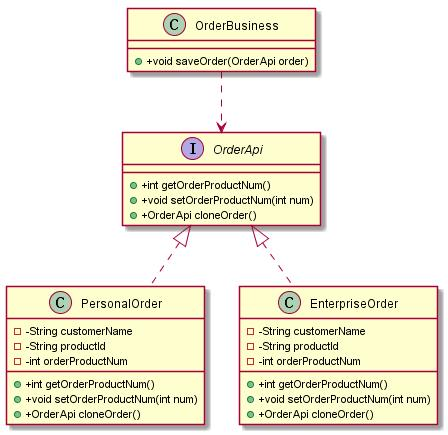

# 原型模式


------------

## 初识原型模式
### 定义
用原型实例指定创建对象的种类，并通过`拷贝`这些原型`创建新的对象`

### 结构和说明


**Prototype：**声明一个克隆自身的接口，用来约束想要克隆自己的类，要求他们都要实现这里定义的克隆方法。
**ConcretePrototype：**实现Prototype接口的类，这些类真正实现克隆自身的功能。
**Client：**使用原型的客户端，首先要获取到原型实例对象，然后通过原型实例克隆自身来创建新的对象实例

```java
/**
 * 声明一个克隆自身的接口
 */
public interface Prototype {
	/**
	 * 克隆自身的方法
	 * @return 一个从自身克隆出来的对象
	 */
	public Prototype clone();
}
/**
 * 克隆的具体实现对象
 */
public class ConcretePrototype1 implements Prototype {
	public Prototype clone() {
		//最简单的克隆，新建一个自身对象，由于没有属性，就不去复制值了
		Prototype prototype = new ConcretePrototype1();
		return prototype;
	}
}
/**
 * 克隆的具体实现对象
 */
public class ConcretePrototype2 implements Prototype {
	public Prototype clone() {
		//最简单的克隆，新建一个自身对象，由于没有属性，就不去复制值了
		Prototype prototype = new ConcretePrototype2();
		return prototype;
	}
}
/**
 * 使用原型的客户端
 */
public class Client {
	/**
	 * 持有需要使用的原型接口对象
	 */
	private Prototype prototype;
	/**
	 * 构造方法，传入需要使用的原型接口对象
	 * @param prototype 需要使用的原型接口对象
	 */
	public Client(Prototype prototype){
		this.prototype = prototype;
	}
	/**
	 * 示意方法，执行某个功能操作
	 */
	public void operation(){
		//会需要创建原型接口的对象
		Prototype newPrototype = prototype.clone();
	}
}
```

------------


## 体会原型模式
**问题：**

**订单处理系统：**考虑这样一个实际应用：订单处理系统

现在有一个订单处理的系统，里面有个保存订单业务功能，在这个业务功能里面，客户有这么一个需求：每当订单的预定产品数量超过1000的时候，就需要把订单拆分成两份订单来保存，如果拆分成两份订单后，还是超过1000，那就继续拆分，直到每份订单的预定产品数量不超过1000.至于为什么要拆分，原因是好进行订单的后续处理，后续是由人工来处理，每个人工工作小组的处理能力上限是1000
	(比如：京东的订单，在不同仓库，就自动拆分订单)

根据业务，目前的订单类型被分成两种：一种是个人订单，一种是公司订单。现在想要实现一个通用的订单处理系统，也就是说，不管具体是什么类型的订单，都要能够正常的处理。

### 不用模式的解决方案：

```java
/**
 * 订单的接口
 */
public interface OrderApi {
	/**
	 * 获取订单产品数量
	 * @return 订单中产品数量
	 */
	public int getOrderProductNum();
	/**
	 * 设置订单产品数量
	 * @param num 订单产品数量
	 */
	public void setOrderProductNum(int num);
}
/**
 * 个人订单对象
 */
public class PersonalOrder implements OrderApi{
	/**
	 * 订购人员姓名
	 */
	private String customerName;
	/**
	 * 产品编号
	 */
	private String productId;
	/**
	 * 订单产品数量
	 */
	private int orderProductNum = 0;

	public int getOrderProductNum() {
		return this.orderProductNum;
	}
	public void setOrderProductNum(int num) {
		this.orderProductNum = num;
	}
	public String getCustomerName() {
		return customerName;
	}
	public void setCustomerName(String customerName) {
		this.customerName = customerName;
	}
	public String getProductId() {
		return productId;
	}
	public void setProductId(String productId) {
		this.productId = productId;
	}
	public String toString(){
		return "本个人订单的订购人是="+this.customerName+"，订购产品是="+this.productId+"，订购数量为="+this.orderProductNum;
	}
}
/**
 * 企业订单对象
 */
public class EnterpriseOrder implements OrderApi{
	/**
	 * 企业名称
	 */
	private String enterpriseName;
	/**
	 * 产品编号
	 */
	private String productId;
	/**
	 * 订单产品数量
	 */
	private int orderProductNum = 0;
	public int getOrderProductNum() {
		return this.orderProductNum;
	}
	public void setOrderProductNum(int num) {
		this.orderProductNum = num;
	}
	public String getEnterpriseName() {
		return enterpriseName;
	}
	public void setEnterpriseName(String enterpriseName) {
		this.enterpriseName = enterpriseName;
	}
	public String getProductId() {
		return productId;
	}
	public void setProductId(String productId) {
		this.productId = productId;
	}
	public String toString(){
		return "本企业订单的订购企业是="+this.enterpriseName+"，订购产品是="+this.productId+"，订购数量为="+this.orderProductNum;
	}
}
/**
 * 处理订单的业务对象
 */
public class OrderBusiness {
	/**
	 * 创建订单的方法
	 * @param order 订单的接口对象
	 */
	public void saveOrder(OrderApi order){
		//根据业务要求，当订单的预定的产品数量超过1000的时候，就需要把订单拆成两份订单
		//当然如果要做好，这里的1000应该做成常量，这么做是为了演示简单

		//1：判断当前的预定产品数量是否大于1000
		while(order.getOrderProductNum() > 1000){
			//2：如果大于，还需要继续拆分
			//2.1再新建一份订单，跟传入的订单除了数量不一样外，其他都相同
			OrderApi newOrder = null;
			if(order instanceof PersonalOrder){
				//创建相应的新的订单对象
				PersonalOrder p2 = new PersonalOrder();
				//然后进行赋值，但是产品数量为1000
				PersonalOrder p1 = (PersonalOrder)order;
				p2.setCustomerName(p1.getCustomerName());
				p2.setProductId(p1.getProductId());			
				p2.setOrderProductNum(1000);
				//然后再设置给newOrder
				newOrder = p2;
			}else if(order instanceof EnterpriseOrder){
				//创建相应的订单对象
				EnterpriseOrder e2 = new EnterpriseOrder();
				//然后进行赋值，但是产品数量为1000
				EnterpriseOrder e1 = (EnterpriseOrder)order;
				e2.setEnterpriseName(e1.getEnterpriseName());
				e2.setProductId(e1.getProductId());
				e2.setOrderProductNum(1000);
				//然后再设置给newOrder
				newOrder = e2;
			}			

			//2.2原来的订单保留，把数量设置成减少1000
			order.setOrderProductNum(order.getOrderProductNum()-1000);

			//然后是业务功能处理，省略了，打印输出，看一下
			System.out.println("拆分生成订单=="+newOrder);
		}

		//3：不超过，那就直接业务功能处理，省略了，打印输出，看一下
		System.out.println("订单=="+order);

	}

//	public void saveOrder2(OrderApi order){
//		int oldNum = order.getOrderProductNum();
//		while(oldNum > 1000){
//			//定义一个表示被拆分出来的新订单对象
//			OrderApi newOrder = null;
//			
//			if(order instanceof PersonalOrder){
//				//创建相应的订单对象
//				PersonalOrder p2 = new PersonalOrder();
//				//然后进行赋值等，省略了
//				//然后再设置给newOrder
//				newOrder = p2;
//			}else if(order instanceof EnterpriseOrder){
//				//创建相应的订单对象
//				EnterpriseOrder e2 = new EnterpriseOrder();
//				//然后进行赋值等，省略了
//				//然后再设置给newOrder
//				newOrder = e2;
//			}			
//			//然后进行拆分和其他业务功能处理，省略了
//		}		
//	}
}
public class OrderClient {
	public static void main(String[] args) {
		//创建订单对象，这里为了演示简单，直接new了
		PersonalOrder op = new PersonalOrder();
		//设置订单数据
		op.setOrderProductNum(2925);
		op.setCustomerName("张三");
		op.setProductId("P0001");

		//这里获取业务处理的类，也直接new了，为了简单，连业务接口都没有做
		OrderBusiness ob = new OrderBusiness();
		//调用业务来保存订单对象
		ob.saveOrder(op);
	}
}

```

**存在的问题：**

要求是：不用关心具体是什么类型的订单。但是代码中使用了 instanceof 的代码来向下转型了

1. 既然想要实现通用的订单处理，那么对于订单处理的实现对象，是不应该知道订单的具体实现的，更不应该依赖订单的具体实现。但是上面的实现中，很明显订单处理的对象依赖了订单的具体实现对象。
2. 难以扩展新的订单类型。加入现在要加入一个大客户专用订单类型，那么就需要修改订单处理的对象，要在里面添加对新的订单类型的支持，这算哪门子的通用处理。

因此：上面的实现是不太好的，把上面的问题再抽象描述一下：已经有了某个对象实例后，如何能够快速简单地创建出更多的这种对象？？

### 使用模式的解决方案


```java
/**
 * 订单的接口，声明了可以克隆自身的方法
 */
public interface OrderApi {
	/**
	 * 获取订单产品数量
	 * @return 订单中产品数量
	 */
	public int getOrderProductNum();
	/**
	 * 设置订单产品数量
	 * @param num 订单产品数量
	 */
	public void setOrderProductNum(int num);
	/**
	 * 克隆方法
	 * @return 订单原型的实例
	 */
	public OrderApi cloneOrder();
}
/**
 * 个人订单对象
 */
public class PersonalOrder implements OrderApi{
	/**
	 * 订购人员姓名
	 */
	private String customerName;
	/**
	 * 产品编号
	 */
	private String productId;
	/**
	 * 订单产品数量
	 */
	private int orderProductNum = 0;

	public int getOrderProductNum() {
		return this.orderProductNum;
	}
	public void setOrderProductNum(int num) {
		this.orderProductNum = num;
	}
	public String getCustomerName() {
		return customerName;
	}
	public void setCustomerName(String customerName) {
		this.customerName = customerName;
	}
	public String getProductId() {
		return productId;
	}
	public void setProductId(String productId) {
		this.productId = productId;
	}
	public String toString(){
		return "本个人订单的订购人是="+this.customerName+"，订购产品是="+this.productId+"，订购数量为="+this.orderProductNum;
	}

	public OrderApi cloneOrder() {
		//创建一个新的订单，然后把本实例的数据复制过去
		PersonalOrder order = new PersonalOrder();
		order.setCustomerName(this.customerName);
		order.setProductId(this.productId);
		order.setOrderProductNum(this.orderProductNum);

		return order;
	}
}
/**
 * 企业订单对象
 */
public class EnterpriseOrder implements OrderApi{
	/**
	 * 企业名称
	 */
	private String enterpriseName;
	/**
	 * 产品编号
	 */
	private String productId;
	/**
	 * 订单产品数量
	 */
	private int orderProductNum = 0;
	public int getOrderProductNum() {
		return this.orderProductNum;
	}
	public void setOrderProductNum(int num) {
		this.orderProductNum = num;
	}
	public String getEnterpriseName() {
		return enterpriseName;
	}
	public void setEnterpriseName(String enterpriseName) {
		this.enterpriseName = enterpriseName;
	}
	public String getProductId() {
		return productId;
	}
	public void setProductId(String productId) {
		this.productId = productId;
	}
	public String toString(){
		return "本企业订单的订购企业是="+this.enterpriseName+"，订购产品是="+this.productId+"，订购数量为="+this.orderProductNum;
	}
	public OrderApi cloneOrder() {
		//创建一个新的订单，然后把本实例的数据复制过去
		EnterpriseOrder order = new EnterpriseOrder();
		order.setEnterpriseName(this.enterpriseName);
		order.setProductId(this.productId);
		order.setOrderProductNum(this.orderProductNum);

		return order;
	}

}
/**
 * 处理订单的业务对象
 */
public class OrderBusiness {
	/**
	 * 创建订单的方法
	 * @param order 订单的接口对象
	 */
	public void saveOrder(OrderApi order){
		//根据业务要求，当订单的预定的产品数量超过1000的时候，就需要把订单拆成两份订单
		//当然如果要做好，这里的1000应该做成常量，这么做是为了演示简单

		//1：判断当前的预定产品数量是否大于1000
		while(order.getOrderProductNum() > 1000){
			//2：如果大于，还需要继续拆分
			//2.1再新建一份订单，跟传入的订单除了数量不一样外，其他都相同
			OrderApi newOrder = order.cloneOrder();
			//然后进行赋值，产品数量为1000
			newOrder.setOrderProductNum(1000);

			//2.2原来的订单保留，把数量设置成减少1000
			order.setOrderProductNum(order.getOrderProductNum()-1000);

			//然后是业务功能处理，省略了，打印输出，看一下
			System.out.println("拆分生成订单=="+newOrder);
		}		
		//3：不超过，那就直接业务功能处理，省略了，打印输出，看一下
		System.out.println("订单=="+order);

	}
}
public class OrderClient {
	public static void main(String[] args) {
		//创建订单对象，这里为了演示简单，直接new了
		PersonalOrder op = new PersonalOrder();
		//设置订单数据
		op.setOrderProductNum(3925);
		op.setCustomerName("张三");
		op.setProductId("P0001");

		//这里获取业务处理的类，也直接new了，为了简单，连业务接口都没有做
		OrderBusiness ob = new OrderBusiness();
		//调用业务来保存订单对象
		ob.saveOrder(op);
	}
}

```

------------

## 理解原型模式

### 认识原型模式

1. 原型模式的功能

  ** 原型模式的功能实际上包含两个方面：**
	1. 一个是通过克隆来创建新的对象实例
	2. 另一个是为克隆出来的新的对象实例复制原型实例属性的值

	**原型模式要实现的主要功能就是：**`通过克隆来创建新的对象实例`。

	一般来讲，新创建出来的实例的数据是和原型实例一样的。但是具体如何实现克隆，需要由程序自行实现，原型模式并没有统一的要求和实现算法。

2. 原型与new

	原型模式从某种意义上说，就行是new操作，在前面的例子实现中，克隆方法就是使用new来实现的，但请注意，`只是“类似于new”而不是“就是new”`。

	**克隆方法和new操作最明显的不同就在于：**new一个对象实例，一般属性是没有值的，或则是只有默认值：如果是克隆得到 一个实例，通常属性是有值的，属性的值就是原型对象实例在克隆的时候，原型对象实例的属性的值。

3. 原型实例和克隆的实例

	原型实例和克隆出来的实例，本质上是不同的实例，克隆完成后，他们之间是偶关联的，如果克隆完成后，克隆出来的实例的属性的值发生了改变，是不会影响到原型实例的。

4. 原型模式的调用顺序示意图


### Java中的克隆方法

在Java语言中已经提供了clone方法，定义在object类中。需要克隆功能的类，值需要实现java.lang.cloneable接口，这个接口没有需要实现的方法，是一个标识接口。

```java
/**
 * 订单的接口，声明了可以克隆自身的方法
 */
public interface OrderApi {
	/**
	 * 获取订单产品数量
	 * @return 订单中产品数量
	 */
	public int getOrderProductNum();
	/**
	 * 设置订单产品数量
	 * @param num 订单产品数量
	 */
	public void setOrderProductNum(int num);

}
/**
 * 个人订单对象,利用Java的Clone功能
 */
public class PersonalOrder implements Cloneable  , OrderApi{
	/**
	 * 订购人员姓名
	 */
	private String customerName;
	/**
	 * 产品编号
	 */
	private String productId;
	/**
	 * 订单产品数量
	 */
	private int orderProductNum = 0;

	public int getOrderProductNum() {
		return this.orderProductNum;
	}
	public void setOrderProductNum(int num) {
		this.orderProductNum = num;
	}
	public String getCustomerName() {
		return customerName;
	}
	public void setCustomerName(String customerName) {
		this.customerName = customerName;
	}
	public String getProductId() {
		return productId;
	}
	public void setProductId(String productId) {
		this.productId = productId;
	}
	public String toString(){
		return "本个人订单的订购人是="+this.customerName+"，订购产品是="+this.productId+"，订购数量为="+this.orderProductNum;
	}
	public Object clone(){
		//克隆方法的真正实现，直接调用父类的克隆方法就可以了
		Object obj = null;
		try {
			obj = super.clone();
		} catch (CloneNotSupportedException e) {
			e.printStackTrace();
		}
		return obj;
	}
}
public class Client {
	public static void main(String[] args) {
		//先创建原型实例
		PersonalOrder oa1 = new PersonalOrder();

		//设置原型实例的订单数量的值
		oa1.setOrderProductNum(100);
		//为了简单，这里仅仅输出数量
	    System.out.println("这是第一次获取的对象实例==="+oa1.getOrderProductNum());

		//通过克隆来获取新的实例
	    PersonalOrder oa2 = (PersonalOrder)oa1.clone();
		//修改它的数量
		oa2.setOrderProductNum(80);
		//输出克隆出来的对象的值
		System.out.println("输出克隆出来的实例==="+oa2.getOrderProductNum());

		//再次输出原型实例的值
		System.out.println("再次输出原型实例==="+oa1.getOrderProductNum());
	}
}
```


### 浅度克隆和深度克隆

**什么是浅度克隆？什么是深度克隆呢？简单的解释下:**

1. **浅度克隆：**只负责克隆按值传递的数据（比如：基本数据类型、String类型）
2. **深度克隆：**除了浅度克隆要克隆的值外，还负责克隆引用类型的数据，基本上就是被克隆实例所有的属性的数据都会被克隆出来

```java
/**
 * 订单的接口，声明了可以克隆自身的方法
 */
public interface OrderApi {
	/**
	 * 获取订单产品数量
	 * @return 订单中产品数量
	 */
	public int getOrderProductNum();
	/**
	 * 设置订单产品数量
	 * @param num 订单产品数量
	 */
	public void setOrderProductNum(int num);
	/**
	 * 克隆方法
	 * @return 订单原型的实例
	 */
	public OrderApi cloneOrder();
}
/**
 * 个人订单对象
 */
public class PersonalOrder implements OrderApi{
	/**
	 * 订购人员姓名
	 */
	private String customerName;
	/**
	 * 产品对象
	 */
	private Product product = null;
	/**
	 * 订单产品数量
	 */
	private int orderProductNum = 0;

	public int getOrderProductNum() {
		return this.orderProductNum;
	}
	public void setOrderProductNum(int num) {
		this.orderProductNum = num;
	}
	public String getCustomerName() {
		return customerName;
	}
	public void setCustomerName(String customerName) {
		this.customerName = customerName;
	}
	public Product getProduct() {
		return product;
	}
	public void setProduct(Product product) {
		this.product = product;
	}

	public String toString(){
		//简单点输出
		return "订购产品是="+this.product.getName()+"，订购数量为="+this.orderProductNum;
	}

	public OrderApi cloneOrder() {
		//创建一个新的订单，然后把本实例的数据复制过去
		PersonalOrder order = new PersonalOrder();
		order.setCustomerName(this.customerName);
		order.setOrderProductNum(this.orderProductNum);
		//对于对象类型的数据，深度克隆的时候需要继续调用这个对象的克隆方法
		order.setProduct((Product)this.product.cloneProduct());		
		return order;
	}
}

/**
 * 声明一个克隆产品自身的接口
 *
 */
public interface ProductPrototype {
	/**
	 * 克隆产品自身的方法
	 * @return 一个从自身克隆出来的产品对象
	 */
	public ProductPrototype cloneProduct();
}
/**
 * 产品对象
 */
public class Product implements ProductPrototype{
	/**
	 * 产品编号
	 */
	private String productId;
	/**
	 * 产品名称
	 */
	private String name;


	public String getName() {
		return name;
	}
	public void setName(String name) {
		this.name = name;
	}
	public String getProductId() {
		return productId;
	}
	public void setProductId(String productId) {
		this.productId = productId;
	}
	public String toString(){
		return "产品编号="+this.productId+"，产品名称="+this.name;
	}
	public ProductPrototype cloneProduct() {
		//创建一个新的订单，然后把本实例的数据复制过去
		Product product = new Product();
		product.setProductId(this.productId);
		product.setName(this.name);		
		return product;
	}
}
public class Client {
	public static void main(String[] args) {
		//先创建原型实例
		PersonalOrder oa1 = new PersonalOrder();

		//设置原型实例的值
		Product product = new Product();
		product.setName("产品1");
		oa1.setProduct(product);
		oa1.setOrderProductNum(100);

	    System.out.println("这是第一次获取的对象实例="+oa1);

		//通过克隆来获取新的实例
	    PersonalOrder oa2 = (PersonalOrder)oa1.cloneOrder();
		//修改它的值
	    oa2.getProduct().setName("产品2");
		oa2.setOrderProductNum(80);
		//输出克隆出来的对象的值
		System.out.println("输出克隆出来的实例="+oa2);

		//再次输出原型实例的值
		System.out.println("再次输出原型实例="+oa1);
	}
}

```

**深度克隆还有一个特点**: 如果被克隆的对象里面的属性数据是引用类型，也就是属性的类型也是对象，那么需要一直递归的克隆下去。这也意味着，要想深度克隆成功，必须要整个克隆所涉及的对象都要正确实现克隆方法，如果其中有一个没有正确 实现克隆，那么就会导致克隆失败。

**java中的克隆接口的写法：**super.clone的实现方式：对于引用类型，是直接克把引用地址给克隆了。

```java
/**
 * 订单的接口
 */
public interface OrderApi {
	/**
	 * 获取订单产品数量
	 * @return 订单中产品数量
	 */
	public int getOrderProductNum();
	/**
	 * 设置订单产品数量
	 * @param num 订单产品数量
	 */
	public void setOrderProductNum(int num);

}
/**
 * 个人订单对象
 */
public class PersonalOrder implements Cloneable , OrderApi{
	/**
	 * 订购人员姓名
	 */
	private String customerName;
	/**
	 * 产品对象
	 */
	private Product product = null;
	/**
	 * 订单产品数量
	 */
	private int orderProductNum = 0;

	public int getOrderProductNum() {
		return this.orderProductNum;
	}
	public void setOrderProductNum(int num) {
		this.orderProductNum = num;
	}
	public String getCustomerName() {
		return customerName;
	}
	public void setCustomerName(String customerName) {
		this.customerName = customerName;
	}
	public Product getProduct() {
		return product;
	}
	public void setProduct(Product product) {
		this.product = product;
	}

	public String toString(){
		//简单点输出
		return "订购产品是="+this.product.getName()+"，订购数量为="+this.orderProductNum;
	}

	public Object clone(){
		PersonalOrder obj=null;
		try {
			obj =(PersonalOrder)super.clone();
			//这一句话不可少 ，super.clone的实现方式：对于引用类型，是直接克把引用地址给克隆了。
//			obj.setProduct((Product)this.product.clone());
		} catch (CloneNotSupportedException e) {
			e.printStackTrace();
		}		
		return obj;
	}

}

/**
 * 产品对象
 */
public class Product implements Cloneable{
	/**
	 * 产品编号
	 */
	private String productId;
	/**
	 * 产品名称
	 */
	private String name;


	public String getName() {
		return name;
	}
	public void setName(String name) {
		this.name = name;
	}
	public String getProductId() {
		return productId;
	}
	public void setProductId(String productId) {
		this.productId = productId;
	}
	public String toString(){
		return "产品编号="+this.productId+"，产品名称="+this.name;
	}
	public Object clone() {
		Object obj = null;
		try {
			obj = super.clone();
		} catch (CloneNotSupportedException e) {
			e.printStackTrace();
		}
		return obj;
	}
}
public class Client {
	public static void main(String[] args) {
		//先创建原型实例
		PersonalOrder oa1 = new PersonalOrder();

		//设置原型实例的值
		Product product = new Product();
		product.setName("产品1");
		oa1.setProduct(product);
		oa1.setOrderProductNum(100);

	    System.out.println("这是第一次获取的对象实例="+oa1);

		//通过克隆来获取新的实例
	    PersonalOrder oa2 = (PersonalOrder)oa1.clone();
		//修改它的值
	    oa2.getProduct().setName("产品2");
		oa2.setOrderProductNum(80);
		//输出克隆出来的对象的值
		System.out.println("输出克隆出来的实例="+oa2);

		//再次输出原型实例的值
		System.out.println("再次输出原型实例="+oa1);
	}
}

```

### 原型管理器（其实就是一个缓存的实现）

如果一个系统中`原型的数目不固定`，比如系统中的`原型可以被动态的创建和销毁`，那么就需要在系统中`维护`一个当前`可用的原型的注册表`，这个注册表就被成为`原型管理器`。

其实如果把原型当成一个资源的话，原型管理器就相当于一个资源管理器，在系统开始运行的时候初始化，然后运行期间可用动态的添加资源和销毁资源。从这个角度看，原型管理器就可用相当于一个缓存资源的实现，只不过里面缓存和管理的是原型实例而已。

有了原型管理器过后，一般情况下，除了想原型管理器里面添加原型对象的时候是通过new来创造的对象，其余时候都是过向原型管理器来请求原型实例，然后通过克隆方法来获取新的对象实例，这就可以实现动态管理、或则动态切换具体的对象实例。

```java
public interface Prototype {
	public Prototype clone();
	public String getName();
	public void setName(String name);
}
/**
 * 克隆的具体实现对象
 */
public class ConcretePrototype1 implements Prototype {
	private String name;
	public String getName() {
		return name;
	}
	public void setName(String name) {
		this.name = name;
	}

	public Prototype clone() {
		ConcretePrototype1 prototype = new ConcretePrototype1();
		prototype.setName(this.name);
		return prototype;
	}
	public String toString(){
		return "Now in Prototype1，name="+name;
	}
}
/**
 * 克隆的具体实现对象
 */
public class ConcretePrototype2 implements Prototype {
	private String name;
	public String getName() {
		return name;
	}
	public void setName(String name) {
		this.name = name;
	}

	public Prototype clone() {
		ConcretePrototype2 prototype = new ConcretePrototype2();
		prototype.setName(this.name);
		return prototype;
	}

	public String toString(){
		return "Now in Prototype2，name="+name;
	}
}
/**
 * 原型管理器
 */
public class PrototypeManager {
	/**
	 * 用来记录原型的编号和原型实例的对应关系
	 */
	private static Map<String,Prototype> map = new HashMap<String,Prototype>();
	/**
	 * 私有化构造方法，避免外部无谓的创建实例
	 */
	private PrototypeManager(){
		//
	}
	/**
	 * 向原型管理器里面添加或是修改某个原型注册
	 * @param prototypeId 原型编号
	 * @param prototype 原型实例
	 */
	public synchronized static void setPrototype(String prototypeId,Prototype prototype){
		map.put(prototypeId, prototype);
	}
	/**
	 * 从原型管理器里面删除某个原型注册
	 * @param prototypeId 原型编号
	 */
	public synchronized static void removePrototype(String prototypeId){
		map.remove(prototypeId);
	}
	/**
	 * 获取某个原型编号对应的原型实例
	 * @param prototypeId 原型编号
	 * @return 原型编号对应的原型实例
	 * @throws Exception 如果原型编号对应的原型实例不存在，报出例外
	 */
	public synchronized static Prototype getPrototype(String prototypeId)throws Exception{
		Prototype prototype = map.get(prototypeId);
		if(prototype == null){
			throw new Exception("您希望获取的原型还没有注册或已被销毁");
		}
		return prototype;
	}

}

public class Client {
	public static void main(String[] args) {
		try {
			// 初始化原型管理器
			Prototype p1 = new ConcretePrototype1();
			PrototypeManager.setPrototype("Prototype1", p1);

			// 获取原型来创建对象
			Prototype p3 = PrototypeManager.getPrototype("Prototype1").clone();
			p3.setName("张三");
			System.out.println("第一个实例：" + p3);

			// 有人动态的切换了实现
			Prototype p2 = new ConcretePrototype2();
			PrototypeManager.setPrototype("Prototype1", p2);

			// 重新获取原型来创建对象
			Prototype p4 = PrototypeManager.getPrototype("Prototype1").clone();
			p4.setName("李四");
			System.out.println("第二个实例：" + p4);

			// 有人注销了这个原型
			PrototypeManager.removePrototype("Prototype1");

			// 再次获取原型来创建对象
			Prototype p5 = PrototypeManager.getPrototype("Prototype1").clone();
			p5.setName("王五");
			System.out.println("第三个实例：" + p5);
		} catch (Exception err) {
			System.err.println(err.getMessage());
		}
	}
}
```

### 原型模式的优缺点
**优点：**

1. 对客户端隐藏具体的实现类型
2. 在允许时动态改变具体的实现类型

**缺点：**

1. 深度克隆方法实现会比较困难

------------


## 理解原型模式

**原型模式的本质是： **克隆生成对象【重点是克隆】

### 何时选原型模式：

1. 如果一个系统想要独立于它想要使用的对象时，可以使用原型模式，让系统只面向接口变成，在系统需要新的对象的时候，可以通过克隆原型来得到
2. 如果需要实例化的类是在原型时刻动态那个时，可以使用原型模式，通过克隆原型来得到需要的实例。
