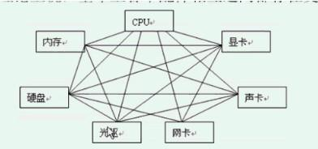
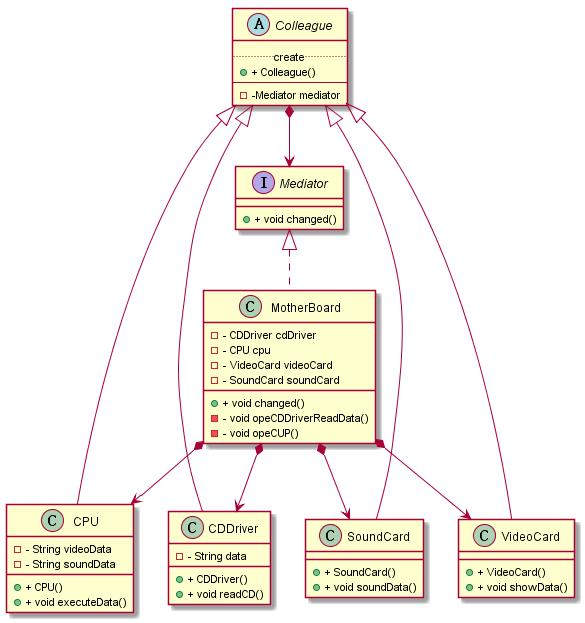

# 中介者模式


------------

## 初识中介者模式
### 定义
用一个`中介对象来封装一系列的对象交互`。中介者是的各对象不需要显式地互相引用，从而使其耦合松散，而且可以独立的改变他们之间的交互。

### 结构和说明
实际上就是一个职责分离的体系


**Mediator：**中介者接口。在里面定义各个同事之间交互需要的方法，可以是公共的通讯方法，比如changed方法，大家都用，也可以是小范围的交互方法。
**ConcreteMediator：**具体中介者实现对象。它需要了解并维护各个同事对象，并负责具体的协调同事对象的交互关系。
**Colleague：**同事类的定义，通常实现成为抽象类，主要负责约束同事对象的类型，并实现一些具体同事类之间的公共功能，比如：每个具体同事类都应该知道中介者对象，也就是具体同事类都会持有中介者对象。就可以定义到这个类里面。
**ConcreteColleague：**具体的同事类，实现自己的业务，在需要与其他同事通讯的时候，就与持有的中介者通信，中介者会负责与其它的同事交互。

```java
/**
 * 中介者，定义各个同事对象通信的接口
 */
public interface Mediator {
	/**
	 * 同事对象在自身改变的时候来通知中介者的方法，
	 * 让中介者去负责相应的与其他同事对象的交互
	 * @param colleague 同事对象自身，好让中介者对象通过对象实例
	 *                  去获取同事对象的状态
	 */
	public void changed(Colleague colleague);
}
/**
 * 具体的中介者实现
 */
public class ConcreteMediator implements Mediator {

	/**
	 * 持有并维护同事A
	 */
	private ConcreteColleagueA colleagueA;
	/**
	 * 持有并维护同事B
	 */
	private ConcreteColleagueB colleagueB;

	/**
	 * 设置中介者需要了解并维护的同事A对象
	 * @param colleague 同事A对象
	 */
	public void setConcreteColleagueA(ConcreteColleagueA colleague) {
		colleagueA = colleague;
	}
	/**
	 * 设置中介者需要了解并维护的同事B对象
	 * @param colleague 同事B对象
	 */
	public void setConcreteColleagueB(ConcreteColleagueB colleague) {
		colleagueB = colleague;
	}

	public void changed(Colleague colleague) {
		//某个同事类发生了变化，通常需要与其他同事交户
		//具体协调相应的同事对象来实现协作行为
	}

}
/**
 * 同事类的抽象父类
 */
public abstract class Colleague {
	/**
	 * 持有中介者对象，每一个同事类都知道它的中介者对象
	 */
	private Mediator mediator;
	/**
	 * 构造方法，传入中介者对象
	 * @param mediator 中介者对象
	 */
	public Colleague(Mediator mediator) {
		this.mediator = mediator;
	}
	/**
	 * 获取当前同事类对应的中介者对象
	 * @return 对应的中介者对象
	 */
	public Mediator getMediator() {
		return mediator;
	}
}
/**
 * 具体的同事类A
 */
public class ConcreteColleagueA extends Colleague {
	public ConcreteColleagueA(Mediator mediator) {
		super(mediator);
	}
	/**
	 * 示意方法，执行某些业务功能
	 */
	public void someOperation() {
		//在需要跟其他同事通信的时候，通知中介者对象
		getMediator().changed(this);
	}
}
/**
 * 具体的同事类B
 */
public class ConcreteColleagueB extends Colleague {
	public ConcreteColleagueB(Mediator mediator) {
		super(mediator);
	}
	/**
	 * 示意方法，执行某些业务功能
	 */
	public void someOperation() {
		//在需要跟其他同事通信的时候，通知中介者对象
		getMediator().changed(this);
	}
}
```

------------


## 体会中介者模式
### 问题：如果没有主板

如果电脑里面没有了主板，那么各个配件之间就必须自行相互交互，以互相传送数据，理论上说，基本上各个配件相互之间都存在交互数据的可能。

画图表示的话。就是一团乱。

有了主板，各个配件的交互完全通过主板来完成，每个配件都只需要和主板交互，而主板知道如何和所有的配件打交道，那就简单多了。

### 存在的问题（对象之间太耦合了）
如果上面的情况发生在软件开发上呢？

如果把每个电脑配件都抽象成为一个类或则是子系统，那就相当于出现了多个类之间相互交互，而且交互还很繁琐，导致每个类都必须知道所有需要交互的类，也就是我们常说的类和类的耦合了，是不是很麻烦？

这样一来，不但开发的时候每个类会复杂，因为要兼顾其他的类，更要命的是每个类在发生改动的时候，需要通知所有相关的类一起修改，因为接口或则是功能发生了变动，使用它的地方都得变，太可怕了吧！

那该如何来简化这种关系呢？

### 不用模式的解决方案
	不演示了，太烦乱！

### 使用模式的解决方案：使用电脑来看电影
为了演示，考虑一个稍微具体点的功能。在日常生活中，我们经常使用电脑来看电影，把这个过程描述出来，这里仅仅考虑正常的 ，也就是有主板的情况，简化后假定会有如下的交互过程：

1. 首先是光驱要读取光盘上的数据，然后告诉主板，它的状态改变了。
2. 主板去得到光驱的数据，把这些数据交给CPU进行分析处理
3. CPU处理完后，把数据分成了视频数据和音频数据，通知主板，它处理完了。
4. 主板去得到CPU处理过后的数据，分别把数据交给显卡和声卡，，去显示出视频和发出声音


当然这是一个持续的、不断重复的过程，从而形成不间断的视频和声音，具体的运行过程不再讨论之列，假设就有如上简单的交互关系就可以了，也就是说想看电影，把光盘放入光驱，光驱开始读盘，就可以看电影了

这种实现的好处，同事类之间松散耦合了。比如：光驱只管读取数据，读完之后交给主板，由主板来协调对应的具体同事类去处理

```java
/**
 * 同事类的抽象父类
 */
public abstract class Colleague {
	/**
	 * 持有中介者对象，每一个同事类都知道它的中介者对象
	 */
	private Mediator mediator;
	/**
	 * 构造方法，传入中介者对象
	 * @param mediator 中介者对象
	 */
	public Colleague(Mediator mediator) {
		this.mediator = mediator;
	}
	/**
	 * 获取当前同事类对应的中介者对象
	 * @return 对应的中介者对象
	 */
	public Mediator getMediator() {
		return mediator;
	}
}
/**
 * 光驱类，一个同事类
 */
public class CDDriver extends Colleague{
	public CDDriver(Mediator mediator) {
		super(mediator);
	}
	/**
	 * 光驱读取出来的数据
	 */
	private String data = "";
	/**
	 * 获取光驱读取出来的数据
	 * @return 光驱读取出来的数据
	 */
	public String getData(){
		return this.data;
	}
	/**
	 * 读取光盘
	 */
	public void readCD(){
		//逗号前是视频显示的数据，逗号后是声音
		this.data = "设计模式,值得好好研究";
		//通知主板，自己的状态发生了改变
		this.getMediator().changed(this);
	}
}
/**
 * CPU类，一个同事类
 */
public class CPU extends Colleague{
	public CPU(Mediator mediator) {
		super(mediator);
	}
	/**
	 * 分解出来的视频数据
	 */
	private String videoData = "";
	/**
	 * 分解出来的声音数据
	 */
	private String soundData = "";
	/**
	 * 获取分解出来的视频数据
	 * @return 分解出来的视频数据
	 */
	public String getVideoData() {
		return videoData;
	}
	/**
	 * 获取分解出来的声音数据
	 * @return 分解出来的声音数据
	 */
	public String getSoundData() {
		return soundData;
	}
	/**
	 * 处理数据，把数据分成音频和视频的数据
	 * @param data 被处理的数据
	 */
	public void executeData(String data){
		//把数据分解开，前面的是视频数据，后面的是音频数据
		String [] ss = data.split(",");
		this.videoData = ss[0];
		this.soundData = ss[1];
		//通知主板，CPU的工作完成
		this.getMediator().changed(this);
	}

}
/**
 * 声卡类，一个同事类
 */
public class SoundCard extends Colleague{
	public SoundCard(Mediator mediator) {
		super(mediator);
	}

	/**
	 * 按照声频数据发出声音
	 * @param data 发出声音的数据
	 */
	public void soundData(String data){
		System.out.println("画外音："+data);
	}

}
/**
 * 显卡类，一个同事类
 */
public class VideoCard extends Colleague{
	public VideoCard(Mediator mediator) {
		super(mediator);
	}

	/**
	 * 显示视频数据
	 * @param data 被显示的数据
	 */
	public void showData(String data){
		System.out.println("您正观看的是："+data);
	}

}
/**
 * 中介者对象的接口
 */
public interface Mediator {
	/**
	 * 同事对象在自身改变的时候来通知中介者的方法，
	 * 让中介者去负责相应的与其他同事对象的交互
	 * @param colleague 同事对象自身，好让中介者对象通过对象实例
	 *                  去获取同事对象的状态
	 */
	public void changed(Colleague colleague);
}
/**
 * 主板类，实现中介者接口
 */
public class MotherBoard implements Mediator{
	/**
	 * 需要知道要交互的同事类——光驱类
	 */
	private CDDriver cdDriver = null;
	/**
	 * 需要知道要交互的同事类——CPU类
	 */
	private CPU cpu = null;
	/**
	 * 需要知道要交互的同事类——显卡类
	 */
	private VideoCard videoCard = null;
	/**
	 * 需要知道要交互的同事类——声卡类
	 */
	private SoundCard soundCard = null;

	public void setCdDriver(CDDriver cdDriver) {
		this.cdDriver = cdDriver;
	}
	public void setCpu(CPU cpu) {
		this.cpu = cpu;
	}
	public void setVideoCard(VideoCard videoCard) {
		this.videoCard = videoCard;
	}
	public void setSoundCard(SoundCard soundCard) {
		this.soundCard = soundCard;
	}

	public void changed(Colleague colleague) {
		if(colleague == cdDriver){
			//表示光驱读取数据了
			this.opeCDDriverReadData((CDDriver)colleague);
		}else if(colleague == cpu){
			//表示CPU处理完了
			this.opeCPU((CPU)colleague);
		}
	}
	/**
	 * 处理光驱读取数据过后与其他对象的交互
	 * @param cd 光驱同事对象
	 */
	private void opeCDDriverReadData(CDDriver cd){
		//1：先获取光驱读取的数据
		String data = cd.getData();
		//2：把这些数据传递给CPU进行处理
		this.cpu.executeData(data);
	}
	/**
	 * 处理CPU处理完数据后与其他对象的交互
	 * @param cpu CPU同事类
	 */
	private void opeCPU(CPU cpu){
		//1：先获取CPU处理过后的数据
		String videoData = cpu.getVideoData();
		String soundData = cpu.getSoundData();
		//2：把这些数据传递给显卡和声卡展示出来
		this.videoCard.showData(videoData);
		this.soundCard.soundData(soundData);
	}

}
public class Client {
	public static void main(String[] args) {
		//1：创建中介者——主板对象
		MotherBoard mediator = new MotherBoard();
		//2：创建同事类
		CDDriver cd = new CDDriver(mediator);
		CPU cpu = new CPU(mediator);
		VideoCard vc = new VideoCard(mediator);
		SoundCard sc = new SoundCard(mediator);
		//3：让中介者知道所有的同事
		mediator.setCdDriver(cd);
		mediator.setCpu(cpu);
		mediator.setVideoCard(vc);
		mediator.setSoundCard(sc);

		//4：开始看电影，把光盘放入光驱，光驱开始读盘
		cd.readCD();
	}
}

```


------------

## 理解中介者模式
### 认识中介者模式

1. `中介者的功能非常简单，就是`封装对象之间的交互`。如果`一个对象的操作`会`引起其他相关对象的变化`，或则是`某个操作需要引起其他对象的后续或连带操作`，`而这个对象`又`不希望自己来处理这些关系`，那么就可以找中介者，把所有的麻烦扔给它，只在需要的时候通知中介者，其他的就让中介者去处理就可以了。

	反过来，`其他`的`对象在操作`的时候，`可能会引起这个对象的变化`，也可以这么做。最后`对象之间就完全分离了`，谁都不直接跟其他对象交互，那么相互的关系，全部被集中到中介者对象里面了，所有的对象就只是跟中介者对象进行通信，相互之间不再有联系。

	把所有对象之间的交互都封装在中介者当中，无形中还得到另外一个好处，就是`能够集中的控制这些对象的交互关系`，这样有什么变化的时候，`修改起来就很方便`。

2. 需要Mediator接口吗？

	有没有使用Mediator接口的必要，`取决于是否会提供多个不同的中介者实现`。如果中介者实现只有一个的话，而且预计中也没有需要扩展的要求， 就可以不定义Mediator接口，让各个同事对象直接使用中介者实现对象；如果中介者实现不只一个，或则预计中有扩展的要求，那么就需要定义Mediator接口，让各个同事对象来面向中介者接口编程，而无需关心具体的中介者实现。

3. 同事关系

	在中介者模式中，要求这些类都要`继承相同的类`，也就是说，这些对象`从某个角度讲是同一个类型，算是兄弟对象`。
	正因为这些同事兄弟之间交互关系很复杂，才需要中介者来中介

4. 同事和中介者的关系

	`中介者`对象和`同事`对象之间是`相互依赖的`。

5. 如何实现同事和中介者的通信

	1. 在`mediator接口`中定义一个`特殊的通知接口`，作为一个通用的方法，让各个同事类来调用这个方法。
	2. 可以采用观察者模式。把Mediator实现成为观察者具体实现 ，而各个同事类实现成为subject具体的目标实现对象，这样同事类发生了改变，会通知mediator。Mediator在接到通知后，会与相应的同事对象进行交互。

6. 中介者模式的调用顺序示意图


### 广义中介者
**标准的中介者模式在实际使用中的困难**

1. 是否有必要为同事对象定义一个公共的父类？

	大家都知道，java是单继承的，为了使用中介者模式，就让这些同事对象继承一个父类，这是很不好的；
	再说了，这个父类目前也没有特别的公共功能，也就是说继承它也得不到多少好处。
	在实际开发中，很多相互交互的对象本身是没有公共父类的，强行加上一个父类，会让这些对象实现起来特别别扭。
2. 同事类有必要持有中介者么？

	同事类需要知道中介者对象，以便当他们发生改变的时候，能够通知中介者对象，但是否需要作为属性，并通过构造方法传入，这么强的依赖关系呢？
	也可以有简单的方式去通知中介者对象，比如把中介者对象做成单列，直接在同事类的方法里面去调用中介者对象。
3. 是否需要中介者接口？

	在实际开发中，很常见的情况是不需要中介者接口的，而且中介者对象也不需要创建很多实例，因为中介者是用来封装和处理同事对象的关系的，它一般是没有状态需要维护的，因此中介者通常可以实现成单列。
4. 中介者对象是否需要持有所有的同事？

	虽说中介者对象需要知道所有的同事类，这样中介者才能与他们交互。但是是否需要作为属性这么强烈的依赖关系？而且中介者对象在不同的关系维护上，可能会需要不同的同事对象的实例，因此可以在中介者处理的方法里面去创建、或则获取、或则从参数传入需要的同事对象。
5. 中介者对象只是提供一个公共的方法，来接受同事对象的通知吗？

	从示例就可以看出来，在公共方法里，还是要去区分到底是谁调过来，这还是简单的，还没有去区分到底是什么样的业务出发调用过来的，因为不同的业务，引起的与其他对象的交互是不一样的。
	因此在实际开发中，通常会提供具体的业务通知方法，这样就不用挨个再去判断到底是什么对象，具体是什么业务了。

### 对标准的中介者模式在实际使用中的改进

基于上面的考虑，在实际应用开发中，经常会简化中介者模式，来使开发变得简单，比如有如下的简化：

1. 通常会去调同事对象的父类，这样就可以让任意的对象，只要需要相互交互，就可以成为同事；
2. 还有通常不定义Mediator接口，把具体的中介者对象实现成为单例；
3. 另外一点就是同事对象不再持有中介者，而是在需要的时候直接获取中介者对象并调用；中介者也不再持有同事对象，而是在具体处理方法里面去创建、或则获取、或则从参数传入需要的同事对象。

`把这样经过简化、变形使用的情况称为广义中介者`。

### 广义中介者示例----部门与人员
1. 部门和人员的关系：是多对多
2. 问题的出现（对象之间的多对多，就是对象互相之间持有对方的集合）

	想想部门和人员的功能交互，举几个常见的功能：
	1. 部门被撤销
	2. 部门之间进行合并
	3. 人员离职
	4. 人员从一个部门调职到另外一个部门

	**想要实现这些功能，按照前面的设计，该怎么做呢？**

		1. 系统运行期间，部门被撤销了，就意味者这个部门不存在了，可是原来这个部门下所有的人员，每个人员的所属部门中都有这个部门呢，那么就需要先通知所有的人员，把这个部门从他们的所属部门中去掉，然后才可以清除这个部门。
		2. 部门合并，是合并成一个新的部门呢？还是把一个部门并入到另一个部门？如果是合并成一个新的部门，那么需要把原有的两个部门撤销，然后再新增一个部门，如果是把一个部门合并到另一个部门里面，那就是撤销掉一个部门，然后把这个部门下的人员移动到这个部门。不管是那种情况，都面临着需要通知相应的人员进行更改这样的问题。
		3. 人员离职了，反过来就需要通知他所属于的部门，从部门的拥有人员的记录中去除掉这个人员。
		4. 人员调职，同样需要通知相关的部门，先从原来的部门中去除掉，然后再到新的部门添加上。

		**上了上述的描述，觉得糟糕之极！**
		**产生该问题的原因在于：**
			部门和人员之间的耦合，这样导致操作人员的时候，需要操作所有相关的部门，而操作部门的时候又需要操所有相关的人员，使得部门和人员搅合在了一起

3. 中介者来解决

	找到了根源就好办了，采用中介者模式，引入一个中介者对象来管理部门和人员之间的关系，就能解决这些问题了。
	如果采用标准的中介者模式，想想上面提出的那些问题点吧，就知道实现起来会很别扭。因此采用广义的中介者来解决，这样部门和人员就完全解耦了，也就是说部门不知道人员，人员也不知道部门，他们完全分开，他们之间的关系就完全由中介者对象来管理了。

```java
/**
 * 部门类
 */
public class Dep{
	/**
	 * 描述部门编号
	 */
	private String depId;
	/**
	 * 描述部门名称
	 */
	private String depName;
	public String getDepId() {
		return depId;
	}
	public void setDepId(String depId) {
		this.depId = depId;
	}
	public String getDepName() {
		return depName;
	}
	public void setDepName(String depName) {
		this.depName = depName;
	}
	/**
	 * 撤销部门
	 * @return 是否撤销成功
	 */
	public boolean deleteDep(){
		//1：要先通过中介者去清除掉所有与这个部门相关的部门和人员的关系
		DepUserMediatorImpl mediator = DepUserMediatorImpl.getInstance();
		mediator.deleteDep(depId);
		//2：然后才能真的清除掉这个部门
		//请注意在实际开发中，这些业务功能可能会做到业务层去，
		//而且实际开发中对于已经使用的业务数据通常是不会被删除的，
		//而是会被做为历史数据保留
		return true;
	}
}
/**
 * 人员类
 */
public class User{
	/**
	 * 人员编号
	 */
	private String userId;
	/**
	 * 人员名称
	 */
	private String userName;
	public String getUserId() {
		return userId;
	}
	public void setUserId(String userId) {
		this.userId = userId;
	}
	public String getUserName() {
		return userName;
	}
	public void setUserName(String userName) {
		this.userName = userName;
	}
	/**
	 * 人员离职
	 * @return 是否处理成功
	 */
	public boolean dimission(){
		//1：要先通过中介者去清除掉所有与这个人员相关的部门和人员的关系
		DepUserMediatorImpl mediator = DepUserMediatorImpl.getInstance();
		mediator.deleteUser(userId);
		//2：然后才能真的清除掉这个人员
		//请注意，实际开发中，人员离职，是不会真的删除人员记录的，
		//通常是把人员记录的状态或者是删除标记设置成已删除，
		//只是不再参加新的业务，但是已经发生的业务记录是不会被清除掉的

		return true;
	}
}
/**
 *	描述部门和人员关系的类
 */
public class DepUserModel {
	/**
	 * 用于部门和人员关系的编号，用做主键
	 */
	private String depUserId;
	/**
	 * 部门的编号
	 */
	private String depId;
	/**
	 * 人员的编号
	 */
	private String userId;
	public String getDepUserId() {
		return depUserId;
	}
	public void setDepUserId(String depUserId) {
		this.depUserId = depUserId;
	}
	public String getDepId() {
		return depId;
	}
	public void setDepId(String depId) {
		this.depId = depId;
	}
	public String getUserId() {
		return userId;
	}
	public void setUserId(String userId) {
		this.userId = userId;
	}
}
/**
 * 实现部门和人员交互的中介者实现类
 * 说明：为了演示的简洁性，只示例实现撤销部门和人员离职的功能
 */
public class DepUserMediatorImpl{
	private static DepUserMediatorImpl mediator = new DepUserMediatorImpl();
	private DepUserMediatorImpl(){
		//调用初始化测试数据的功能
		initTestData();
	}
	public static DepUserMediatorImpl getInstance(){
		return mediator;
	}

	/**
	 * 测试用，记录部门和人员的关系
	 */
	private Collection<DepUserModel> depUserCol = new ArrayList<DepUserModel>();
	/**
	 * 初始化测试数据
	 */
	private void initTestData(){
		//准备一些测试数据
		DepUserModel du1 = new DepUserModel();
		du1.setDepUserId("du1");
		du1.setDepId("d1");
		du1.setUserId("u1");		
		depUserCol.add(du1);

		DepUserModel du2 = new DepUserModel();
		du2.setDepUserId("du2");
		du2.setDepId("d1");
		du2.setUserId("u2");		
		depUserCol.add(du2);

		DepUserModel du3 = new DepUserModel();
		du3.setDepUserId("du3");
		du3.setDepId("d2");
		du3.setUserId("u3");		
		depUserCol.add(du3);

		DepUserModel du4 = new DepUserModel();
		du4.setDepUserId("du4");
		du4.setDepId("d2");
		du4.setUserId("u4");		
		depUserCol.add(du4);

		DepUserModel du5 = new DepUserModel();
		du5.setDepUserId("du5");
		du5.setDepId("d2");
		du5.setUserId("u1");		
		depUserCol.add(du5);
	}
	/**
	 * 完成因撤销部门的操作所引起的与人员的交互，需要去除相应的关系
	 * @param depId 被撤销的部门对象的编号
	 * @return 是否已经正确的处理了因撤销部门所引起的与人员的交互
	 */
	public boolean deleteDep(String depId) {
		//请注意：为了演示简单，部门撤销后，原部门的人员怎么处理等后续业务处理，这里就不管了

		//1：到记录部门和人员关系的集合里面，寻找跟这个部门相关的人员
		//设置一个临时的集合，记录需要清除的关系对象
		Collection<DepUserModel> tempCol = new ArrayList<DepUserModel>();
		for(DepUserModel du : depUserCol){
			if(du.getDepId().equals(depId)){
				//2：需要把这个相关的记录去掉，先记录下来
				tempCol.add(du);
			}
		}
		//3：从关系集合里面清除掉这些关系
		depUserCol.removeAll(tempCol);

		return true;
	}
	/**
	 * 完成因人员离职引起的与部门的交互
	 * @param userId 离职的人员的编号
	 * @return 是否正确处理了因人员离职引起的与部门的交互
	 */
	public boolean deleteUser(String userId) {
		//1：到记录部门和人员关系的集合里面，寻找跟这个人员相关的部门
		//设置一个临时的集合，记录需要清除的关系对象
		Collection<DepUserModel> tempCol = new ArrayList<DepUserModel>();
		for(DepUserModel du : depUserCol){
			if(du.getUserId().equals(userId)){
				//2：需要把这个相关的记录去掉，先记录下来
				tempCol.add(du);
			}
		}
		//3：从关系集合里面清除掉这些关系
		depUserCol.removeAll(tempCol);

		return true;
	}
	/**
	 * 测试用，在内部打印显示一下一个部门下的所有人员
	 * @param dep 部门对象
	 */
	public void showDepUsers(Dep dep) {
		for(DepUserModel du : depUserCol){
			if(du.getDepId().equals(dep.getDepId())){
				System.out.println("部门编号="+dep.getDepId()+"下面拥有人员，其编号是："+du.getUserId());
			}
		}
	}
	/**
	 * 测试用，在内部打印显示一下一个人员所属的部门
	 * @param user 人员对象
	 */
	public void showUserDeps(User user) {
		for(DepUserModel du : depUserCol){
			if(du.getUserId().equals(user.getUserId())){
				System.out.println("人员编号="+user.getUserId()+"属于部门编号是："+du.getDepId());
			}
		}
	}
	/**
	 * 完成因人员调换部门引起的与部门的交互
	 * @param userId 被调换的人员的编号
	 * @param oldDepId 调换前的部门的编号
	 * @param newDepId 调换后的部门的编号
	 * @return 是否正确处理了因人员调换部门引起的与部门的交互
	 */
	public boolean changeDep(String userId,String oldDepId, String newDepId) {
		//本示例不去实现了
		return false;
	}


	/**
	 * 完成因部门合并操作所引起的与人员的交互
	 * @param colDepIds 需要合并的部门的编号集合
	 * @param newDep 合并后新的部门对象
	 * @return 是否正确处理了因部门合并操作所引起的与人员的交互
	 */
	public boolean joinDep(Collection<String> colDepIds, Dep newDep) {
		//本示例不去实现了		
		return false;
	}
}
public class Client {
	public static void main(String[] args) {
		DepUserMediatorImpl mediator = DepUserMediatorImpl.getInstance();
		//准备要撤销的部门，仅仅需要一个部门编号
		Dep dep = new Dep();
		dep.setDepId("d1");
		Dep dep2 = new Dep();
		dep2.setDepId("d2");
		//准备用于测试的人员，也只需要一个人员编号
		User user = new User();
		user.setUserId("u1");

		//测试撤销部门，在运行之前，输出一下，看这个人员属于哪些部门		
		System.out.println("撤销部门前------------------");
		mediator.showUserDeps(user);

		//真正执行业务，撤销这个部门
		dep.deleteDep();

		//再次输出一下，看这个人员属于哪些部门
		System.out.println("撤销部门后------------------");
		mediator.showUserDeps(user);

		//测试人员离职，在运行之前，输出一下，看这个部门下都有哪些人员
		System.out.println("---------------------------------");
		System.out.println("人员离职前------------------");
		mediator.showDepUsers(dep2);

		//真正执行业务，人员离职
		user.dimission();

		//再次输出一下，看这个部门下都有哪些人员
		System.out.println("人员离职后------------------");
		mediator.showDepUsers(dep2);
	}
}
```

`？：我咋感觉这个就是平时web开发中的service呢？`

### 中介者模式的优缺点
**优点：**
1. 松散耦合
2. 集中控制交互
3. 多对多变成一对多

**缺点：**
1. 过度集中化

------------


## 思考中介者模式

**中介者模式的本质是： **封装交互【重点是封装】

### 何时选用中介者模式

1. 如果一组对象之间的通信方式比较复杂，导致相互依赖、结构混乱，可以采用中介者模式，把这些对象相互的交互管理起来，各个对象都只需要和中介者交互，从而使得各个对象松散耦合，结构也更清晰易懂
2. 如果一个对象引用很多的对象，并直接跟这些对象交互，导致难以复用该对象。可以采用中介者模式，把这个对象跟其他对象的交互封装到中介者对象里面，这个对象就只需要和中介者对象交互就可以了。
