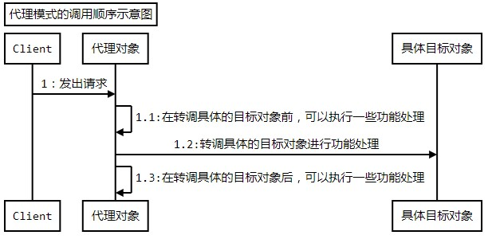

# 代理模式


------------
## 初识代理模式
### 定义
为其他对象提供一种代理以`控制对这个对象的访问`。

### 结构和说明


**Proxy：**代理对象，通常具有如下功能：
1. 实现与具体的目标对象一样的接口，这样就可以使用代理来代替具体的目标对象
2. 保存一个指向具体目标对象的引用，可以在需要的时候调用具体的目标对象
3. 可以控制对具体目标对象的访问，并可能负责创建和删除它

**Subject：**目标接口，定义代理和具体目标对象的接口，这样就可以在任何使用具体目标对象的地方使用代理对象
**RealSubject：**具体的目标对象，真正实现目标接口要求的功能。

```java
/**
 * 抽象的目标接口，定义具体的目标对象和代理公用的接口
 */
public interface Subject {
	/**
	 * 示意方法：一个抽象的请求方法
	 */
	public void request();
}
/**
 * 具体的目标对象，是真正被代理的对象
 */
public class RealSubject implements Subject{

	public void request() {
		//执行具体的功能处理
	}

}
/**
 * 代理对象
 */
public class Proxy implements Subject{
	/**
	 * 持有被代理的具体的目标对象
	 */
	private RealSubject realSubject=null;
	/**
	 * 构造方法，传入被代理的具体的目标对象
	 * @param realSubject 被代理的具体的目标对象
	 */
	public Proxy(RealSubject realSubject){
		this.realSubject = realSubject;
	}

	public void request() {
		//在转调具体的目标对象前，可以执行一些功能处理

		//转调具体的目标对象的方法
		realSubject.request();

		//在转调具体的目标对象后，可以执行一些功能处理
	}

}
```
------------


## 体会代理模式
### 访问多条数据

考虑这样一个实际应用：要一次性访问多条数据

**这个功能的背景是这样的：**在一个HR（人力资源）应用项目中客户提出，当选择一个部门或是分公司的时候，要把这个部门或分公司下的所有员工都显示出来，而且不要翻页，好方便他们进行业务处理。在显示全部员工的时候，只需要显示名称即可，但是也需要提供如下的功能：在必要的时候可以选择并查看某位员工的详细信息。

客户方是一个集团公司，有些部门或则分公司可能有好几百人，不让翻页，也就是要求一次性获取这么多条数据并展示出来。

该怎么样实现呢？

### 不用模式的解决方案
	不就是要获取某个部门或则某个分公司下的所有员工的信息码？直接使用sql语句从 中查询就可以得到，示意性的sql大致如下
```java
/**
 * 描述用户数据的对象
 */
public class UserModel {
	/**
	 * 用户编号
	 */
	private String userId;
	/**
	 * 用户姓名
	 */
	private String name;
	/**
	 * 部门编号
	 */
	private String depId;
	/**
	 * 性别
	 */
	private String sex;

	public String getUserId() {
		return userId;
	}
	public void setUserId(String userId) {
		this.userId = userId;
	}
	public String getName() {
		return name;
	}
	public void setName(String name) {
		this.name = name;
	}
	public String getDepId() {
		return depId;
	}
	public void setDepId(String depId) {
		this.depId = depId;
	}
	public String getSex() {
		return sex;
	}
	public void setSex(String sex) {
		this.sex = sex;
	}

	@Override
	public String toString(){
		return "userId="+userId+",name="+name+",depId="+depId+",sex="+sex+"\n";
	}
}
/**
 * 实现示例要求的功能
 */
public class UserManager {

	/**
	 * 根据部门编号来获取该部门下的所有人员
	 * @param depId 部门编号
	 * @return 该部门下的所有人员
	 */
	public Collection<UserModel> getUserByDepId(String depId)throws Exception{
		Collection<UserModel> col = new ArrayList<UserModel>();
		Connection conn = null;
		try{
			conn = this.getConnection();
			String sql = "select * from tbl_user u,tbl_dep d "
				+"where u.depId=d.depId and d.depId like ?";

			PreparedStatement pstmt = conn.prepareStatement(sql);
			pstmt.setString(1, depId+"%");

			ResultSet rs = pstmt.executeQuery();
			while(rs.next()){
				UserModel um = new UserModel();
				um.setUserId(rs.getString("userId"));
				um.setName(rs.getString("name"));
				um.setDepId(rs.getString("depId"));
				um.setSex(rs.getString("sex"));

				col.add(um);
			}

			rs.close();
			pstmt.close();
		}finally{
			conn.close();
		}
		return col;
	}
	/**
	 * 获取与数据库的连接
	 * @return 数据库连接
	 */
	private Connection getConnection() throws Exception {
		Class.forName("oracle.jdbc.driver.OracleDriver");
		return DriverManager.getConnection(
				"jdbc:oracle:thin:@localhost:1521:orcl", "test", "test");
	}
}
public class Client {
	public static void main(String[] args) throws Exception{
		UserManager userManager = new UserManager();
		Collection<UserModel> col = userManager.getUserByDepId("0101");
		System.out.println(col);
	}
}
```
### 存在的问题
上面的实现看起来很简单，功能也正确，但是蕴含一个较大的问题，那就是：当一次性访问的数据条数过多，而且每条描述的数据量又很大的话，那会消耗较多的内存。

对于用户表，事实上是有很多字段的，不仅仅是示列的那么几个，再加上不使用翻页，一次性访问的数据就可能会有很多条。如果一次性需要访问的数据较多的话，内存开销会比较大。

而且从客户使用角度来说，有很大的随机性，客户既可能访问每一条数据，也可能一条都不访问。也就是说，一次性访问很多条数据，消耗了大量内存，但是很可能是浪费掉了，客户根本就不会去访问那么多数据，对于每条数据，客户只需要看看姓名而已。

那么该怎么实现，才能既把多条用户数据 姓名显示出来，而又能节省内存空间，当然还要实现在客户想要看到更多数据的时候，能正确访问到数据呢？

### 使用模式的解决方案


```java
/**
 * 定义用户数据对象的接口
 */
public interface UserModelApi {
	public String getUserId();
	public void setUserId(String userId);
	public String getName();
	public void setName(String name);
	public String getDepId();
	public void setDepId(String depId);
	public String getSex();
	public void setSex(String sex);
}
/**
 * 描述用户数据的对象
 */
public class UserModel implements UserModelApi{
	/**
	 * 用户编号
	 */
	private String userId;
	/**
	 * 用户姓名
	 */
	private String name;
	/**
	 * 部门编号
	 */
	private String depId;
	/**
	 * 性别
	 */
	private String sex;

	public String getUserId() {
		return userId;
	}
	public void setUserId(String userId) {
		this.userId = userId;
	}
	public String getName() {
		return name;
	}
	public void setName(String name) {
		this.name = name;
	}
	public String getDepId() {
		return depId;
	}
	public void setDepId(String depId) {
		this.depId = depId;
	}
	public String getSex() {
		return sex;
	}
	public void setSex(String sex) {
		this.sex = sex;
	}

	@Override
	public String toString(){
		return "userId="+userId+",name="+name+",depId="+depId+",sex="+sex+"\n";
	}
}
/**
 * 代理对象,代理用户数据对象
 */
public class Proxy implements UserModelApi{
	/**
	 * 持有被代理的具体的目标对象
	 */
	private UserModel realSubject=null;
	/**
	 * 构造方法，传入被代理的具体的目标对象
	 * @param realSubject 被代理的具体的目标对象
	 */
	public Proxy(UserModel realSubject){
		this.realSubject = realSubject;
	}
	/**
	 * 标示是否已经重新装载过数据了
	 */
	private boolean loaded = false;


	public String getUserId() {
		return realSubject.getUserId();
	}
	public void setUserId(String userId) {
		realSubject.setUserId(userId);
	}
	public String getName() {
		return realSubject.getName();
	}
	public void setName(String name) {
		realSubject.setName(name);
	}


	public void setDepId(String depId) {
		realSubject.setDepId(depId);
	}
	public void setSex(String sex) {
		realSubject.setSex(sex);
	}

	public String getDepId() {
		//需要判断是否已经装载过了
		if(!this.loaded){
			//从数据库中重新装载
			reload();
			//设置重新装载的标志为true
			this.loaded = true;
		}
		return realSubject.getDepId();
	}
	public String getSex() {
		if(!this.loaded){
			reload();
			this.loaded = true;
		}
		return realSubject.getSex();
	}

	/**
	 * 重新查询数据库以获取完整的用户数据
	 */
	private void reload(){
		System.out.println("重新查询数据库获取完整的用户数据，userId=="+realSubject.getUserId());
		Connection conn = null;
		try{
			conn = this.getConnection();
			String sql = "select * from tbl_user where userId=? ";

			PreparedStatement pstmt = conn.prepareStatement(sql);
			pstmt.setString(1, realSubject.getUserId());

			ResultSet rs = pstmt.executeQuery();
			if(rs.next()){
				//只需要重新获取除了userId和name外的数据
				realSubject.setDepId(rs.getString("depId"));
				realSubject.setSex(rs.getString("sex"));
			}

			rs.close();
			pstmt.close();
		}catch(Exception err){
			err.printStackTrace();
		}finally{
			try {
				conn.close();
			} catch (SQLException e) {
				e.printStackTrace();
			}
		}
	}
	public String toString(){
		return "userId="+getUserId()+",name="+getName()
		+",depId="+getDepId()+",sex="+getSex()+"\n";
	}

	private Connection getConnection() throws Exception {
		Class.forName("oracle.jdbc.driver.OracleDriver");
		return DriverManager.getConnection(
				"jdbc:oracle:thin:@localhost:1521:orcl", "test", "test");
	}
}

/**
 * 实现示例要求的功能
 */
public class UserManager {
	/**
	 * 根据部门编号来获取该部门下的所有人员
	 * @param depId 部门编号
	 * @return 该部门下的所有人员
	 */
	public Collection<UserModelApi> getUserByDepId(String depId)throws Exception{
		Collection<UserModelApi> col = new ArrayList<UserModelApi>();
		Connection conn = null;
		try{
			conn = this.getConnection();
			//只需要查询userId和name两个值就可以了
			String sql = "select u.userId,u.name "
				+"from tbl_user u,tbl_dep d "
				+"where u.depId=d.depId and d.depId like ?";

			PreparedStatement pstmt = conn.prepareStatement(sql);
			pstmt.setString(1, depId+"%");

			ResultSet rs = pstmt.executeQuery();
			while(rs.next()){
				//这里是创建的代理对象，而不是直接创建UserModel的对象
				Proxy proxy = new Proxy(new UserModel());
				//只是设置userId和name两个值就可以了
				proxy.setUserId(rs.getString("userId"));
				proxy.setName(rs.getString("name"));

				col.add(proxy);
			}

			rs.close();
			pstmt.close();
		}finally{
			conn.close();
		}
		return col;
	}
	/**
	 * 获取与数据库的连接
	 * @return 数据库连接
	 */
	private Connection getConnection() throws Exception {
		Class.forName("oracle.jdbc.driver.OracleDriver");
		return DriverManager.getConnection(
				"jdbc:oracle:thin:@localhost:1521:orcl", "test", "test");
	}
}
public class Client {
	public static void main(String[] args) throws Exception{
		UserManager userManager = new UserManager();
		Collection<UserModelApi> col = userManager.getUserByDepId("0101");

		//如果只是显示用户名称，那么不需要重新查询数据库
		for(UserModelApi umApi : col){
			System.out.println("用户编号：="+umApi.getUserId()+",用户姓名：="+umApi.getName());
		}
		//如果访问非用户编号和用户姓名外的属性，那就会重新查询数据库
		for(UserModelApi umApi : col){
			System.out.println("用户编号：="+umApi.getUserId()+",用户姓名：="+umApi.getName()+",所属部门：="+umApi.getDepId());
		}
	}
}

// 这里是典型的以时间换空间，访问数据库次数过了。时间就长了，性能换来了内存空间
//产生了1+n此查询的问题
//hibernate中的 Lazy Load == 》 实现机制就是代理，不过他是使用的是动态代理。现在这个是写死的代理
```

## 理解代理模式
### 认识代理模式

1. 代理模式的功能

	代理模式是通过创建一个代理对象，用这个`代理对象`去`代表真实的对象`，客户端得到这个代理对象过后，对客户端没有什么影响，就跟得到了真实对象一样来使用。

	当客户端操作这个代理对象时，实际上功能最终还是会由真实的对象 完成，只不过是通过代理操作的，也就是`客户端操作代理，代理操作真正的对象`。

	正是因为有代理对象夹在客户端和被代理的真实对象中间，相当于一个中转，那么在中转的时候就有很多花招可以玩，比如：判断一下权限，如果没有足够的权限那就不给你中转了，等等。
2. 代理的分类

	1. **虚代理：**根据需要来创建开销很大的对象，该对象只有在需要的时候才会被真正创建。
	2. **远程代理：**用来在不同的地址空间上代表同一个对象，这个不同的地址空间可以是在本机，也可以在其他机器上，在java里面最典型的就是RMI技术
	3. **copy-on-write代理：**在客户端操作的时候，只有对象确实改变了，才会真的拷贝（或克隆）一个目标对象，算是虚代理的一个分支
	4. **保护代理：**控制对原始对象的访问、如果有需要，可以给不同的用户提供不同的访问权限，以控制他们对 对象的访问。
	5. **Cache代理：**为那些昂贵的操作的操作的结果提供临时的存储空间，以便多个客户端可以共享这些结果
	6. **防火墙代理：**保护对象不被恶意用户访问和操作
	7. **同步代理：**使用多个用户能够同时访问目标对象而没有冲突
	8. **智能指引：**在访问对象时执行一些附加操作，比如：对指向实际对象的引用次数、第一次引用一个持久对象时，将它装入内存等。
	**在这些代理类型中，`最常见的是`：**`虚代理、保护代理、远程代理和智能指引`这几种。我们主要来学习虚代理和保护代理，这是实际开发中使用频率最高的。

3. 虚代理的示例

前面的列子就是一个典型的虚代理的实现

4. copy-on-write

	拷贝一个大的对象是很消耗资源的，如果这个被拷贝的对象从上次操作以来，根本就没有被修改过，那么再拷贝这个对象是没有必要的，白白消耗资源而已。那么就可以使用代理来延迟拷贝的过程，可以等到对象被修改的时候才真正的对它进行拷贝。

	copy-on-write可以大大降低拷贝大对象的开销，因此它算是一种优化方式，可以根据需要来拷贝或则克隆对象。

5. 具体目标和代理的关系

	从代理模式的结构图来看，好像是`有一个具体目标类就有一个代理类，其实不是这样的`。如果代理类能完全通过接口来操作它所代理的目标对象，那么代理对象就不需要知道具体的目标对象，这样就无须为每一个具体目标类都创建一个代理类了。

	但是，如果代理类必须要实例化它代理的目标对象，那么代理类就必须知道具体被代理的对象，这种情况下，一个具体目标类通常会有一个代理类。这种情况多出现在虚代理的实现里面

6. 代理模式的调用顺序示意图



### 保护代理
保护代理是一种`控制对原始对象访问`的代理，多用于对象应该有不同的访问权限的时候。保护代理会检查调用者是否具有请求所必须的访问权限，如果没有相应的权限，那么就不会调用目标对象，从而实现对目标对象的保护。

**示例需求：**
		现在有一个订单系统，要求是：一旦订单被创建，只有订单的创建人才可以修改订单中的数据，其他人不能修改
		相当与现在如果有了一个订单对象，那么就需要控制外部对它的访问，满足条件的可以访问，而不满足条件的就不能访问了。
```java
/**
 * 订单对象的接口定义
 */
public interface OrderApi {
	/**
	 * 获取订单订购的产品名称
	 * @return 订单订购的产品名称
	 */
	public String getProductName();
	/**
	 * 设置订单订购的产品名称
	 * @param productName 订单订购的产品名称
	 * @param user 操作人员
	 */
	public void setProductName(String productName,String user);
	/**
	 * 获取订单订购的数量
	 * @return 订单订购的数量
	 */
	public int getOrderNum();
	/**
	 * 设置订单订购的数量
	 * @param orderNum 订单订购的数量
	 * @param user 操作人员
	 */
	public void setOrderNum(int orderNum,String user);
	/**
	 * 获取创建订单的人员
	 * @return 创建订单的人员
	 */
	public String getOrderUser();
	/**
	 * 设置创建订单的人员
	 * @param orderUser 创建订单的人员
	 * @param user 操作人员
	 */
	public void setOrderUser(String orderUser,String user);
}
/**
 * 订单对象
 */
public class Order implements OrderApi{
	/**
	 * 订单订购的产品名称
	 */
	private String productName;
	/**
	 * 订单订购的数量
	 */
	private int orderNum;
	/**
	 * 创建订单的人员
	 */
	private String orderUser;

	/**
	 * 构造方法，传入构建需要的数据
	 * @param productName 订单订购的产品名称
	 * @param orderNum 订单订购的数量
	 * @param orderUser 创建订单的人员
	 */
	public Order(String productName,int orderNum,String orderUser){
		this.productName = productName;
		this.orderNum = orderNum;
		this.orderUser = orderUser;
	}

	public String getProductName() {
		return productName;
	}
	public void setProductName(String productName,String user) {
		this.productName = productName;
	}
	public int getOrderNum() {
		return orderNum;
	}
	public void setOrderNum(int orderNum,String user) {
		this.orderNum = orderNum;
	}
	public String getOrderUser() {
		return orderUser;
	}
	public void setOrderUser(String orderUser,String user) {
		this.orderUser = orderUser;
	}
}
/**
 * 订单的代理对象
 */
public class OrderProxy implements OrderApi{
	/**
	 * 持有被代理的具体的目标对象
	 */
	private Order order=null;
	/**
	 * 构造方法，传入被代理的具体的目标对象
	 * @param realSubject 被代理的具体的目标对象
	 */
	public OrderProxy(Order realSubject){
		this.order = realSubject;
	}
	public void setProductName(String productName,String user) {
		//控制访问权限，只有创建订单的人员才能够修改
		if(user!=null && user.equals(this.getOrderUser())){
			order.setProductName(productName, user);
		}else{
			System.out.println("对不起"+user+"，您无权修改订单中的产品名称。");
		}
	}
	public void setOrderNum(int orderNum,String user) {
		//控制访问权限，只有创建订单的人员才能够修改
		if(user!=null && user.equals(this.getOrderUser())){
			order.setOrderNum(orderNum, user);
		}else{
			System.out.println("对不起"+user+"，您无权修改订单中的订购数量。");
		}
	}
	public void setOrderUser(String orderUser,String user) {
		//控制访问权限，只有创建订单的人员才能够修改
		if(user!=null && user.equals(this.getOrderUser())){
			order.setOrderUser(orderUser, user);
		}else{
			System.out.println("对不起"+user+"，您无权修改订单中的订购人。");
		}
	}
	public int getOrderNum() {
		return this.order.getOrderNum();
	}
	public String getOrderUser() {
		return this.order.getOrderUser();
	}
	public String getProductName() {
		return this.order.getProductName();
	}
	public String toString(){
		return "productName="+this.getProductName()+",orderNum="+this.getOrderNum()+",orderUser="+this.getOrderUser();
	}
}
public class Client {
	public static void main(String[] args) {
		//张三先登录系统创建了一个订单
		OrderApi order = new OrderProxy(new Order("设计模式",100,"张三"));
		//李四想要来修改，那就会报错
		order.setOrderNum(123, "李四");
		//输出order
		System.out.println("李四修改后订单记录没有变化："+order);
		//张三修改就不会有问题
		order.setOrderNum(123, "张三");
		//再次输出order
		System.out.println("张三修改后，订单记录："+order);
	}
}
```

### Java中的代理

1. Java的静态代理
	通常把前面自己实现的代理模式，称为Java的静态代理。这种实现方式有一个较大的缺点，就是如果Subject接口发生变化，那么代理类和具体的目标实现都要变化，不是很灵活。
2. Java的动态代理
	通常把使用Java内建的对代理模式支持的功能来实现的代理称为Java的动态代理。动态代理跟静态代理相比，明显的变化是：
	1. 静态代理实现的时候，在Subject接口上定义很多的方法，代理类里面自然也要实现很多方法；
	2. 动态代理实现的时候，虽然Subject接口上定义了很多方法，但是动态代理类始终只有一个invoke方法。这样当Subject接口发生变化的时候，动态代理的接口就不需要跟着变化了。

```java
/**
 * 订单对象的接口定义
 */
public interface OrderApi {
	/**
	 * 获取订单订购的产品名称
	 * @return 订单订购的产品名称
	 */
	public String getProductName();
	/**
	 * 设置订单订购的产品名称
	 * @param productName 订单订购的产品名称
	 * @param user 操作人员
	 */
	public void setProductName(String productName,String user);
	/**
	 * 获取订单订购的数量
	 * @return 订单订购的数量
	 */
	public int getOrderNum();
	/**
	 * 设置订单订购的数量
	 * @param orderNum 订单订购的数量
	 * @param user 操作人员
	 */
	public void setOrderNum(int orderNum,String user);
	/**
	 * 获取创建订单的人员
	 * @return 创建订单的人员
	 */
	public String getOrderUser();
	/**
	 * 设置创建订单的人员
	 * @param orderUser 创建订单的人员
	 * @param user 操作人员
	 */
	public void setOrderUser(String orderUser,String user);
}
/**
 * 订单对象
 */
public class Order implements OrderApi{
	/**
	 * 订单订购的产品名称
	 */
	private String productName;
	/**
	 * 订单订购的数量
	 */
	private int orderNum;
	/**
	 * 创建订单的人员
	 */
	private String orderUser;

	/**
	 * 构造方法，传入构建需要的数据
	 * @param productName 订单订购的产品名称
	 * @param orderNum 订单订购的数量
	 * @param orderUser 创建订单的人员
	 */
	public Order(String productName,int orderNum,String orderUser){
		this.productName = productName;
		this.orderNum = orderNum;
		this.orderUser = orderUser;
	}

	public String getProductName() {
		return productName;
	}
	public void setProductName(String productName,String user) {
		this.productName = productName;
	}
	public int getOrderNum() {
		return orderNum;
	}
	public void setOrderNum(int orderNum,String user) {
		this.orderNum = orderNum;
	}
	public String getOrderUser() {
		return orderUser;
	}
	public void setOrderUser(String orderUser,String user) {
		this.orderUser = orderUser;
	}
	public String toString(){
		return "productName="+this.getProductName()+",orderNum="+this.getOrderNum()+",orderUser="+this.getOrderUser();
	}
}
/**
 * 使用Java中的动态代理
 */
public class DynamicProxy implements InvocationHandler{
	/**
	 * 被代理的对象
	 */
	private OrderApi order = null;
	/**
	 * 获取绑定好代理和具体目标对象后的目标对象的接口
	 * @param order 具体的订单对象，相当于具体目标对象
	 * @return 绑定好代理和具体目标对象后的目标对象的接口
	 */
	public OrderApi getProxyInterface(Order order){
		//设置被代理的对象，好方便invoke里面的操作
		this.order = order;
		//把真正的订单对象和动态代理关联起来
		OrderApi orderApi = (OrderApi) Proxy.newProxyInstance(
				order.getClass().getClassLoader(),
				order.getClass().getInterfaces(),
				this);
		return orderApi;
	}

	public Object invoke(Object proxy, Method method, Object[] args)
			throws Throwable {
		//如果是调用setter方法就需要检查权限
		if(method.getName().startsWith("set")){
			//如果不是创建人，那就不能修改
			if(order.getOrderUser()!=null && order.getOrderUser().equals(args[1])){
				//可以操作
				return method.invoke(order, args);
			}else{
				System.out.println("对不起，"+args[1]+"，您无权修改本订单中的数据");
			}
		}else{
			//不是调用的setter方法就继续运行
			return method.invoke(order, args);
		}
		return null;
	}
}
public class Client {
	public static void main(String[] args) {
		//张三先登录系统创建了一个订单
		Order order = new Order("设计模式",100,"张三");

		//创建一个动态代理
		DynamicProxy dynamicProxy = new DynamicProxy();		
		//然后把订单和动态代理关联起来
		OrderApi orderApi = dynamicProxy.getProxyInterface(order);

		//以下就需要使用被代理过的接口来操作了
		//李四想要来修改，那就会报错
		orderApi.setOrderNum(123, "李四");
		//输出order
		System.out.println("李四修改后订单记录没有变化："+orderApi);
		//张三修改就不会有问题
		orderApi.setOrderNum(123, "张三");
		//再次输出order
		System.out.println("张三修改后，订单记录："+orderApi);

	}
}
```


### 代理模式的优缺点
`代理模式在客户和`被客户`访问的对象之间`，引入了一定程度的`间接性`，客户是直接使用代理，让代理来与被访问的对象进行交互。不同代理类型，这种附加的间接性有不同的用途，也就是有不同的特点：
1. 远程代理
	隐藏了一个对象存在与不同的地址空间的事实，也即是客户通过远程代理去访问一个对象，根本就不关心这个对象在哪里，也不关系如何通过网络去访问到这个对象，从客户的角度来讲，它只是在使用代理对象而已。
2. 虚代理
	可以根据需要来创建“大”对象，只有到必须创建对象的时候，虚代理才会创建对象，从而大大加快程序运行速度，并节省资源。通过虚代理可以对系统进行优化。
3. 保护代理
	可以在访问一个对象的前后，执行很多附加的操作，除了想权限控制之外，还可以进行很多跟业务相关的处理，而不需要修改被代理的对象。也就是说，可以通过代理来给目标对象增加功能。
4. 智能指引
	跟保护代理类似，也是允许在访问一个对象的前后，执行很多附加操作，这样依赖就可以做很多额外的事情，比如：引用计数等。

------------

## 思考代理模式

**代理模式的本质是：** `控制`对象访问【重点是控制】

代理模式实现一般使用：

1. 对象组合和委托来实现（一般少使用对象继承，因为java是单继承）对象组合其实就是让代理和目标对象看起来是一个类型。
2. 还可以使用继承来实现

```java
/**
 * 订单对象
 */
public class Order{
	/**
	 * 订单订购的产品名称
	 */
	private String productName;
	/**
	 * 订单订购的数量
	 */
	private int orderNum;
	/**
	 * 创建订单的人员
	 */
	private String orderUser;

	/**
	 * 构造方法，传入构建需要的数据
	 * @param productName 订单订购的产品名称
	 * @param orderNum 订单订购的数量
	 * @param orderUser 创建订单的人员
	 */
	public Order(String productName,int orderNum,String orderUser){
		this.productName = productName;
		this.orderNum = orderNum;
		this.orderUser = orderUser;
	}

	public String getProductName() {
		return productName;
	}
	public void setProductName(String productName,String user) {
		this.productName = productName;
	}
	public int getOrderNum() {
		return orderNum;
	}
	public void setOrderNum(int orderNum,String user) {
		this.orderNum = orderNum;
	}
	public String getOrderUser() {
		return orderUser;
	}
	public void setOrderUser(String orderUser,String user) {
		this.orderUser = orderUser;
	}
}
/**
 * 订单的代理对象
 */
public class OrderProxy extends Order{

	public OrderProxy(String productName,int orderNum,String orderUser){
		super(productName,orderNum,orderUser);
	}

	public void setProductName(String productName,String user) {
		//控制访问权限，只有创建订单的人员才能够修改
		if(user!=null && user.equals(this.getOrderUser())){
			super.setProductName(productName, user);
		}else{
			System.out.println("对不起"+user+"，您无权修改订单中的产品名称。");
		}
	}
	public void setOrderNum(int orderNum,String user) {
		//控制访问权限，只有创建订单的人员才能够修改
		if(user!=null && user.equals(this.getOrderUser())){
			super.setOrderNum(orderNum, user);
		}else{
			System.out.println("对不起"+user+"，您无权修改订单中的订购数量。");
		}
	}
	public void setOrderUser(String orderUser,String user) {
		//控制访问权限，只有创建订单的人员才能够修改
		if(user!=null && user.equals(this.getOrderUser())){
			super.setOrderUser(orderUser, user);
		}else{
			System.out.println("对不起"+user+"，您无权修改订单中的订购人。");
		}
	}

	public String toString(){
		return "productName="+this.getProductName()+",orderNum="+this.getOrderNum()+",orderUser="+this.getOrderUser();
	}
}
public class Client {
	public static void main(String[] args) {
		//张三先登录系统创建了一个订单
		Order order = new OrderProxy("设计模式",100,"张三");
		//李四想要来修改，那就会报错
		order.setOrderNum(123, "李四");
		//输出order
		System.out.println("李四修改后订单记录没有变化："+order);
		//张三修改就不会有问题
		order.setOrderNum(123, "张三");
		//再次输出order
		System.out.println("张三修改后，订单记录："+order);
	}
}

```

### 何时选用代理模式

1. 需要为一个对象在`不同的地址空间提供局部代表`的时候，可以使用`远程代理`
2. 需要`按`照`需`要`创建开销很大的对象`的时候，可以使用`虚代理`
3. 需要`控制`对 对象的`访问`的时候，可以使用`保护代理`
4. 需要在访问对象的时候执行一些`附加操作`的时候，可以使用`智能指引代理`
