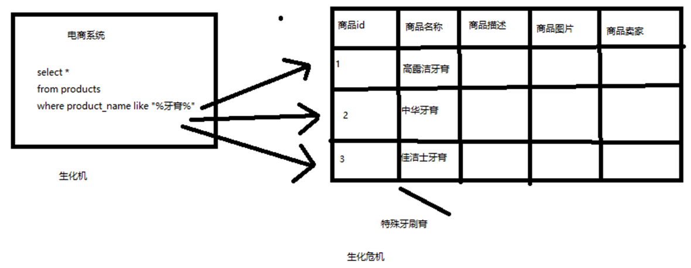
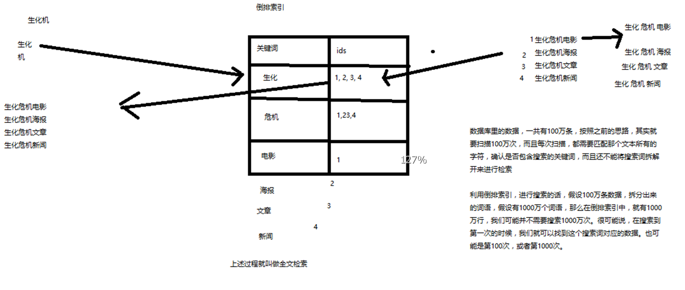

# 用大白话告诉你什么是 Elasticsearch

Elasticsearch，分布式，高性能，高可用，可伸缩的搜索和分析系统

1. 什么是搜索？
2. 如果用数据库做搜索会怎么样？
3. 什么是全文检索、倒排索引和Lucene？
4. 什么是Elasticsearch？

## 什么是搜索？

百度：我们比如说想找寻任何的信息的时候，就会上百度去搜索一下，比如说找一部自己喜欢的电影，或者说找一本喜欢的书，或者找一条感兴趣的新闻（提到搜索的第一印象）
百度 != 搜索，这是不对的

垂直搜索（站内搜索）

互联网的搜索：电商网站，招聘网站，新闻网站，各种app
IT系统的搜索：OA软件，办公自动化软件，会议管理，日程管理，项目管理，员工管理，搜索“张三”，“张三儿”，“张小三”；有个电商网站，卖家，后台管理系统，搜索“牙膏”，订单，“牙膏相关的订单”

搜索，就是在任何场景下，找寻你想要的信息，这个时候，会输入一段你要搜索的关键字，然后就期望找到这个关键字相关的有些信息

## 如果用数据库做搜索会怎么样？

做软件开发的话，或者对IT、计算机有一定的了解的话，都知道，数据都是存储在数据库里面的，比如说电商网站的商品信息，招聘网站的职位信息，新闻网站的新闻信息，等等吧。所以说，很自然的一点，如果说从技术的角度去考虑，如何实现如说，电商网站内部的搜索功能的话，就可以考虑，去使用数据库去进行搜索。

假如下图：电商系统的商品搜索
1. 搜索含有牙膏的商品
2. 在数据库中商品名称字段中存储有关键字

数据库来处理的话，不考虑数据库的全文索引什么的，假如商品有 1000万 个，那么基本上就要查找 1000 万次，且每次都需要加载商品的名称字段的整段字符串，并挨个寻找。

1. 比方说，每条记录的指定字段的文本，可能会很长，比如说“商品描述”字段的长度，有长达数千个，甚至数万个字符，这个时候，每次都要对每条记录的所有文本进行扫描，懒判断说，你包不包含我指定的这个关键词（比如说“牙膏”）

2. 还不能将搜索词拆分开来，尽可能去搜索更多的符合你的期望的结果，比如输入“生化机”，就搜索不出来“生化危机”

用数据库来实现搜索，是不太靠谱的。通常来说，性能会很差的。

## 什么是全文检索和Lucene？

1. 全文检索，倒排索引
2. lucene，就是一个 jar 包，

    里面包含了封装好的各种建立倒排索引，以及进行搜索的代码，包括各种算法。

    我们就用 java 开发的时候，引入 lucene jar，然后基于 lucene 的 api 进行去进行开发就可以了。用 lucene，我们就可以去将已有的数据建立索引，lucene 会在本地磁盘上面，给我们组织索引的数据结构。另外的话，我们也可以用 lucene 提供的一些功能和 api 来针对磁盘上的数据进行搜索

## 全文索检索和倒排索引简述
简单说就如下图

场景：搜索“生化机”（有可能是手抖打错了，本来是生化危机），但是期望需要出来右侧的 4条 记录

1. 有 4条 数据
2. 将每条数据进行词条拆分。如“生化危机电影”拆成：生化、危机、电影 关键词（拆分结果与策略算法有关）
3. 每个关键词将对应包含此关键词的数据 ID
4. 搜索的时候，直接匹配这些关键词，就能拿到包含关键词的数据

这个过程就叫做全文检索。而词条拆分和词条对应的 ID 这个就是倒排索引的的基本原理

## 什么是Elasticsearch？

我们可以使用 lucene 开发搜索服务，部署在一台机器上面，但是无法解决当数据量增大的时候出现的问题（图上右侧）。那么 elasticsearch 就是解决这种场景的工具；

1. 自动维护数据的分布到多个节点的索引建立、检索请求分布到多个节点的执行
2. 自动维护数据的冗余副本，保证一些机器宕机了，不会丢失任何数据
3. 封装了更多的高级功能

   给我们提供更多高级的支持，让我们快速的开发应用，开发更加复杂的应用；
   复杂的搜索功能，聚合分析的功能，基于地理位置的搜多（距离我当前位置 1公里 以内的烤肉店）
