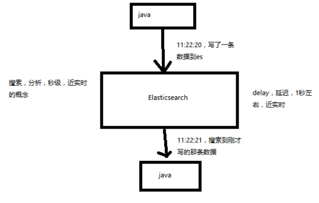
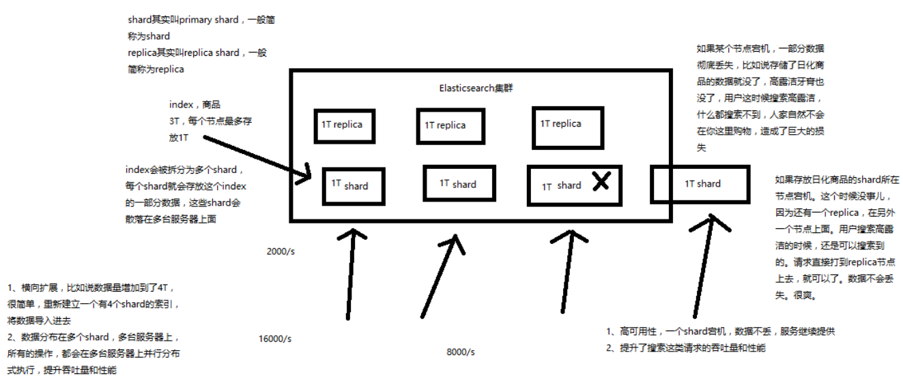

# Elasticsearch 核心概念
[[toc]]

1. lucene 和 elasticsearch 的前世今生
2. elasticsearch 的核心概念
3. elasticsearch 核心概念 vs 数据库核心概念

## lucene 和 elasticsearch 的前世今生

lucene，最先进、功能最强大的搜索库；直接基于 lucene 开发，非常复杂，api 复杂（实现一些简单的功能，写大量的 java 代码），需要深入理解原理（各种索引结构）

elasticsearch 基于 lucene，隐藏复杂性，提供简单易用的 restful api 接口、java api 接口（还有其他语言的api接口）

1. 分布式的文档存储引擎
2. 分布式的搜索引擎和分析引擎
3. 分布式，支持PB级数据

开箱即用，优秀的默认参数，不需要任何额外设置，完全开源

关于 elasticsearch 的一个传说，有一个程序员失业了，陪着自己老婆去英国伦敦学习厨师课程。程序员在失业期间想给老婆写一个菜谱搜索引擎，觉得 lucene 实在太复杂了，就开发了一个封装了 lucene 的开源项目 compass。后来程序员找到了工作，是做分布式的高性能项目的，觉得 compass 不够，就写了 elasticsearch，让 lucene 变成分布式的系统。


## elasticsearch 的核心概念

1. Near Realtime（NRT）近实时

    两个意思：

    从写入数据到数据可以被搜索到有一个小延迟（大概1秒）；

    基于es执行搜索和分析可以达到秒级

    

2. Cluster 集群

    包含多个节点，每个节点属于哪个集群是通过一个配置（集群名称，默认是 elasticsearch ）来决定的，对于中小型应用来说，刚开始一个集群就一个节点很正常
3. Node 节点

    集群中的一个节点，节点也有一个名称（默认是随机分配的），节点名称很重要（在执行运维管理操作的时候），默认节点会去加入一个名称为 “elasticsearch” 的集群，如果直接启动一堆节点，那么它们会自动组成一个 elasticsearch 集群，当然一个节点也可以组成一个 elasticsearch 集群

4. Document&field 文档

    es中的最小数据单元，一个 document 可以是一条客户数据，一条商品分类数据，一条订单数据，通常用 JSON 数据结构表示

    一个 index 下的 type 中，都可以去存储多个 document。

    一个 document 里面有多个 field，每个field就是一个数据字段。
    ```JSON
    product document

    {
      "product_id": "1",
      "product_name": "高露洁牙膏",
      "product_desc": "高效美白",
      "category_id": "2",
      "category_name": "日化用品"
    }
    ```
5. Index 索引

    包含一堆有相似结构的文档数据，比如可以有一个客户索引，商品分类索引，订单索引，索引有一个名称。

    一个 index 包含很多 document，一个 index 就代表了一类类似的或者相同的 document。比如说建立一个 product index，商品索引，里面可能就存放了所有的商品数据，所有的商品 document。
6. Type 类型

    每个索引里都可以有一个或多个 type，type 是 index 中的一个逻辑数据分类，一个 type 下的 document，都有相同的 field，比如博客系统，有一个索引，可以定义用户数据 type，博客数据 type，评论数据 type。

    商品index，里面存放了所有的商品数据，商品 document

    但是商品分很多种类，每个种类的 document 的 field 可能不太一样，比如说电器商品，可能还包含一些诸如售后时间范围这样的特殊 field；生鲜商品，还包含一些诸如生鲜保质期之类的特殊 field

    type，日化商品 type，电器商品 type，生鲜商品 type

    日化商品 type：product_id，product_name，product_desc，category_id，category_name

    电器商品 type：product_id，product_name，product_desc，category_id，category_name，service_period

    生鲜商品 type：product_id，product_name，product_desc，category_id，category_name，eat_period

    每一个 type 里面，都会包含一堆 document

    ```json
    {
      "product_id": "2",
      "product_name": "长虹电视机",
      "product_desc": "4k高清",
      "category_id": "3",
      "category_name": "电器",
      "service_period": "1年"
    }

    {
      "product_id": "3",
      "product_name": "基围虾",
      "product_desc": "纯天然，冰岛产",
      "category_id": "4",
      "category_name": "生鲜",
      "eat_period": "7天"
    }
    ```

    - index ：可以看成是一个数据库
    - type ：可以看成是数据库中的表
    - document：可以看成是表中的记录

7. shard 分片

    单台机器无法存储大量数据，es 可以将一个索引中的数据切分为多个 shard，分布在多台服务器上存储。有了 shard 就可以横向扩展，存储更多数据，让搜索和分析等操作分布到多台服务器上去执行，提升吞吐量和性能。每个 shard 都是一个 lucene index。
8. replica 复制集/副本

    任何一个服务器随时可能故障或宕机，此时 shard 可能就会丢失，因此可以为每个 shard 创建多个 replica副本。replica 可以在 shard 故障时提供备用服务，保证数据不丢失，多个 replica 还可以提升搜索操作的吞吐量和性能。

    - primary shard（建立索引时一次设置，不能修改，默认5个）
    - replica shard（随时修改数量，默认1个）

    默认每个索引 10 个 shard，5个 primary shard，5个 replica shard，最小的高可用配置，是 2台 服务器。




## 核心概念 vs 数据库核心概念


Elasticsearch | 数据库
--------------|-------
Document      | 行
Type          | 表
Index         | 库
