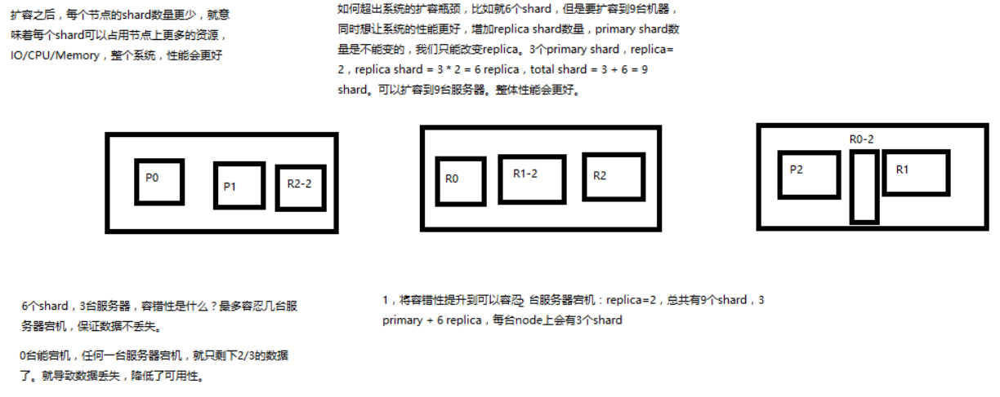

# 横向扩容机制浅析

图解横向扩容过程，如何超出扩容极限，以及如何提升容错性

1. primary&replica 自动负载均衡，6个shard，3 primary，3 replica

2. 每个 node 有更少的 shard，IO/CPU/Memory 资源给每个 shard 分配更多，每个 shard 性能更好

3. 扩容的极限，6个 shard（3 primary，3 replica），最多扩容到 6台 机器，每个 shard 可以占用单台服务器的所有资源，性能最好

4. 超出扩容极限，动态修改 replica 数量，9个 shard（3primary，6 replica），扩容到 9台 机器，比 3台 机器时，拥有 3倍 的读吞吐量

5. 3台 机器下，9个 shard（3 primary，6 replica），资源更少，但是容错性更好，最多容纳 2台机器宕机，6个 shard 只能容纳 1台 机器宕机

6. 这里的这些知识点，你综合起来看，就是说，一方面告诉你扩容的原理，怎么扩容，怎么提升系统整体吞吐量；另一方面要考虑到系统的容错性，怎么保证提高容错性，让尽可能多的服务器宕机，保证数据不丢失

自己总结：

1. 横向扩容简单，只需要增加 replica 的数量即可，es 会完成副本的同步
2. rep 会可接受读请求，分担 master 的压力
3. 当副本在每台机器上都存在的时候，容错性增加，但是空间增多，这就是以空间换取性能和容错性

## 纠错

前面的讲解中，有一个地方说错了：3台 机器，6个 shard，不能有机器宕机；这个说错了。

看下图：就是一个排列的问题，3 台机器上怎么才能保证至少 2台机器上至少存在一份数据。这个是可以做到的

