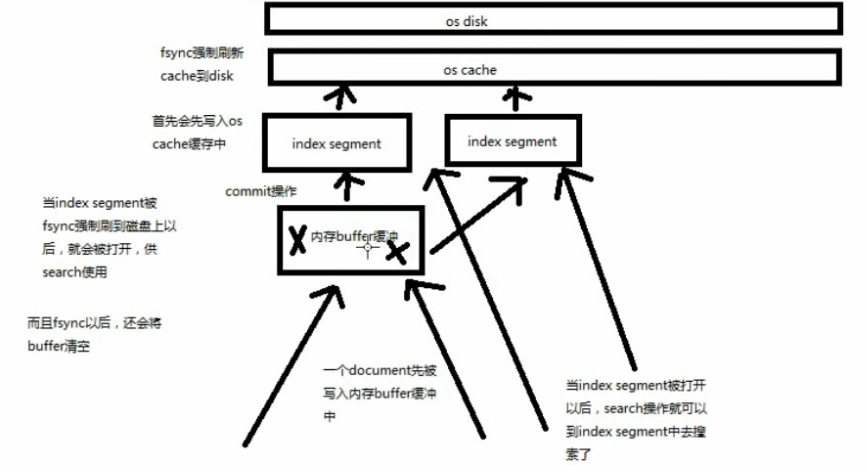
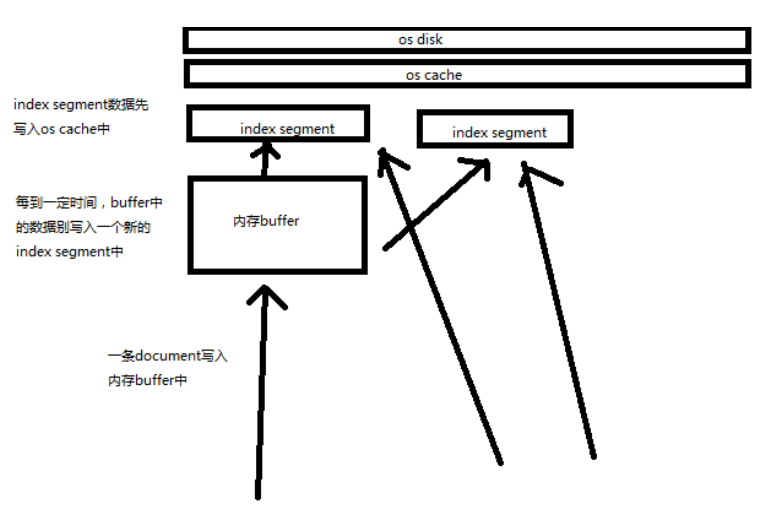

# 内核原理解密

本章会记录原始以下章节内容

- 67. 内核原理探秘_倒排索引组成结构以及其索引可变原因揭秘
- 68. 内核原理探秘_深度图解剖析 document 写入原理（buffer，segment，commit）
- 69. 内核原理探秘_优化写入流程实现 NRT 近实时（filesystem cache，refresh）
- 70. 内核原理探秘_继续优化写入流程实现 durability 可靠存储（translog，flush）
- 71. 内核原理探秘_最后优化写入流程实现海量磁盘文件合并（segment merge，optimize）

[[toc]]


倒排索引，是适合用于进行搜索的

## 倒排索引的结构

倒排索引其实并不是像之前说的那样很简单的，结构，但是核心却就是这样。

```
word		doc1		doc2

dog		  *		      *
hello		*
you			*
```

还包括其他的一些数据，可以看出来如下数据基本上都是用来算相关度评分的

- 包含这个关键词的 document list
- 包含这个关键词的所有 document 的数量：IDF（inverse document frequency）
- 这个关键词在每个 document 中出现的次数：TF（term frequency）
- 这个关键词在这个 document 中的次序
- 每个 document 的长度：length norm
- 包含这个关键词的所有 document 的平均长度


## 倒排索引不可变的好处

- 不需要锁，提升并发能力，避免锁的问题
- 数据不变，一直保存在 os cache 中，只要 cache 内存足够
- filter cache 一直驻留在内存，因为数据不变
- 可以压缩，节省 cpu 和 io 开销（因为不可变，所以可以压缩不存在修改）

## 倒排索引不可变的坏处

每次都要重新构建整个索引。

在之前的讲解中，一个重要概念，对于 document 的变更，内部都是先标记延迟删除，再新增一个文档

## document 写入原理

会涉及到三个概念：

- buffer：内存
- segment：lucene 底层的 index 是分为多个 segment 的，每个 segment 都会存放部分数据
- commit：将 buffer 的数据写入到 segment 中



一个 document 的写入如上图流程：

1. 数据写入 buffer
2. commit point
3. buffer 中的数据写入新的 index segment
4. 等待在 os cache 中的 index segment 被 fsync 强制刷到磁盘上
5. 新的 index sgement 被打开，供 search 使用
6. buffer 被清空

## document 删除原理

每次 commit point 时，会有一个 `.del` 文件，标记了哪些 segment 中的哪些 document 被标记为 deleted 了

搜索的时候，会依次查询所有的 segment，从旧的到新的，
比如被修改过的 document，在旧的 segment 中，会标记为 deleted，在新的 segment 中会有其新的数据

::: tip
对于这个原理概念思路的东西，听一听就好了，至于怎么实现的，貌似所有书籍教程基本上都不会解说
:::


## NRT 实现

前面流程的问题，每次都必须等待 fsync 将 segment 刷入磁盘，
才能将 segment 打开供 search 使用，这样的话，从一个 document 写入，到它可以被搜索，可能会超过1分钟！！！

这就不是近实时的搜索了！！！主要瓶颈在于 fsync 实际发生磁盘IO写数据进磁盘，是很耗时的。

写入流程别改进如下：

1. 数据写入 buffer
2. 每隔一定时间，buffer 中的数据被写入 segment 文件，但是先写入 os cache
3. 只要 segment 写入 os cache，那就直接打开供 search 使用，不立即执行 commit

数据写入 os cache，并被打开供搜索的过程，叫做 refresh，默认是每隔 1秒 refresh 一次。
也就是说，每隔一秒就会将 buffer 中的数据写入一个新的 index segment file，先写入 os cache 中。所以，es 是近实时的，数据写入到可以被搜索，默认是 1秒。



## refresh 间隔修改

`POST /my_index/_refresh`，可以手动 refresh，一般不需要手动执行，没必要，让 es 自己搞就可以了

比如说，我们现在的时效性要求，比较低，只要求一条数据写入 es，一分钟以后才让我们搜索到就可以了，那么就可以调整 refresh interval

```json
PUT /my_index
{
  "settings": {
    "refresh_interval": "30s"
  }
}
```

这里支持刷新到 os cache 中，commit （将 os cache 中的内容刷新到硬盘上）操作是什么时候调用的呢？稍后就会讲。。。

## durability 可靠存储

再次优化的写入流程(增加了 translog 文件)

1. 数据写入 buffer 缓冲和 translog 日志文件
2. 每隔一秒钟，buffer 中的数据被写入新的 segment file，并进入 os cache，此时 segment 被打开并供 search 使用
3. buffer 被清空
4. 重复 1~3，新的 segment 不断添加，buffer 不断被清空，而 translog 中的数据不断累加
5. 当 translog 长度达到一定程度的时候，commit 操作发生

    1. buffer 中的所有数据写入一个新的 segment，并写入 os cache，打开供使用
    2. buffer 被清空
    3. 一个 commit ponit 被写入磁盘，标明了所有的 index segment
    4. filesystem cache 中的所有 index segment file 缓存数据，被 fsync 强行刷到磁盘上


## 宕机后数据恢复流程

基于 translog 和 commit point，如何进行数据恢复


> flush 操作

fsync + 清空 translog，就是 flush，默认每隔 30分钟 flush 一次，或者当 translog 过大的时候，也会 flush

`POST /my_index/_flush`，一般来说别手动 flush，让它自动执行就可以了

> translog

每隔 5秒 被 fsync 一次到磁盘上。在一次增删改操作之后，当 fsync 在 primary shard 和 replica shard 都成功之后，那次增删改操作才会成功

但是这种在一次增删改时强行 fsync translog 可能会导致部分操作比较耗时，也可以允许部分数据丢失，设置异步 fsync translog
```json
PUT /my_index/_settings
{
    "index.translog.durability": "async",
    "index.translog.sync_interval": "5s"
}
```

## 海量磁盘文件合并

每秒一个 segment file，文件过多，而且每次 search 都要搜索所有的 segment，很耗时

默认会在后台执行 segment merge 操作，在 merge 的时候，被标记为 deleted 的 document 也会被彻底物理删除

每次 merge 操作的执行流程

1. 选择一些有相似大小的 segment，merge 成一个大的 segment
2. 将新的 segment flush 到磁盘上去
3. 写一个新的 commit point，包括了新的 segment，并且排除旧的那些 segment
4. 将新的 segment 打开供搜索
5. 将旧的 segment 删除


## `_optimize`

也就是上述讲解的 segment merge 操作

`OST /my_index/_optimize?max_num_segments=1`，尽量不要手动执行，让它自动默认执行就可以了

可以在 `elasticsearch-5.2.0\data\nodes\0\indices\7jrPOaovTP6-Z0X9bUIowA\0` 看到一些文件

```
index/segments_1
translog/translog-1.tlog
```
