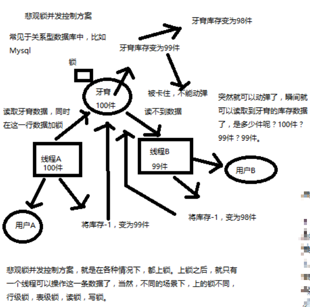
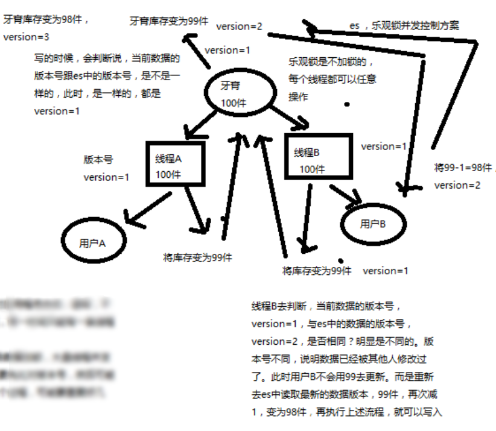

# 并发更新冲突
本章记录 5 个小结的笔记；他们都是讲解如何解决更新冲突

[[toc]]

- 18-深度图解剖析 Elasticsearch 并发冲突问题
- 19-深度图解剖析悲观锁与乐观锁两种并发控制方案
- 20-图解 Elasticsearch 内部基于 `_version` 如何进行乐观锁并发控制
- 21-上机动手实战演练基于`_version`进行乐观锁并发控制
- 22-上机动手实战演练基于 external version 进行乐观锁并发控制

## 深度图解剖析 Elasticsearch 并发冲突问题

并发修改这个在很多数据库中都存在问题，一个场景：

一个商品库存是 2 个，一共 3 个人购买，3个人同时下单，如果没有并发控制，那么久会超卖。

为什么会超卖，这个就太基础了，不记录笔记了；


## 深度图解剖析悲观锁与乐观锁两种并发控制方案

### 悲观锁
悲观锁：通过锁定某一条数据（独占），进行解决并发控制



### 乐观锁

乐观锁：不加锁，通过条件（版本号）来更新数据；

大致流程：

1. version = 1; 期望版本等于 1 的时候更新数据
2. 如果此时数据库中的数据版本变为了 2，那么此时不更新
3. 再次获取数据的版本号，再重复第 1、2步。

::: tip
关于条件更新：是需要依赖数据库的按指定条件更新的功能，而不是自行在程序中处理
:::



### 优缺点

**悲观锁**：

优点：

  - 方便，直接加锁
  - 对程序透明，不需要做额外操作

缺点：并发能力很低，同一时间只能有一条线程操作数据


**乐观锁**：

优点

  - 并发能力很高，不给数据加锁
  - 大量线程并发操作

缺点：

  - 麻烦，每次更新都要对比版本号
  - 可能多次加载数据，再次修改

## 图解 Elasticsearch 内部基于 `_version` 如何进行乐观锁并发控制

前面说的是概念，现在说说 es 内部对于并发修改是如何控制的；

`_version` 的产生：在创建的时候值为 0 ，在修改和删除的时候回自动增加 1

es 内部是基于 `_version` 版本号控制。


对于上图流程总结：

1. 假设 a 操作修改条件是 version = 1;
2. 假设 b 操作修改条件也是 version = 1；
3. 那一条数据被先执行则生效，后到的则被丢弃

反正这一小节还是没有解决我心中的疑惑， es 到底是怎么实现并发版本的控制的，如果不加锁，怎么保证获取数据，再修改版本号的原子操作？

对于 [cas](https://blog.csdn.net/mmoren/article/details/79185862) 在同一台机器中是硬件保证的，那么对于 es 这种分布式的呢？我没有明白


## 实战 `_version` 进行乐观锁并发控制

实战的步骤也很简单，利用 es api 进行操作；

1. 先添加一条数据,此时 version = 1

    ```json
    PUT /test_index/test_type/7
    {
      "test_field": "test test"
    }
    ```
2. 带上 version = 1 更新数据，客户端1 更新成功

    ```json
    PUT /test_index/test_type/7?version=1
    {
      "test_field": "test client 1"
    }
    ```

3. 带上 version = 1 更新数据

    ```json
    PUT /test_index/test_type/7?version=1
    {
      "test_field": "test client 2"
    }
    ```

    因为客户端1 已结更新成功，那么此时再用版本1 更新将会返回失败信息

    ```json
    {
      "error": {
        "root_cause": [
          {
            "type": "version_conflict_engine_exception",
            "reason": "[test_type][7]: version conflict, current version [2] is different than the one provided [1]",
            "index_uuid": "g4RJx2v8TXK95LdwlhRx5A",
            "shard": "0",
            "index": "test_index"
          }
        ],
        "type": "version_conflict_engine_exception",
        "reason": "[test_type][7]: version conflict, current version [2] is different than the one provided [1]",
        "index_uuid": "g4RJx2v8TXK95LdwlhRx5A",
        "shard": "0",
        "index": "test_index"
      },
      "status": 409
    }
    ```

    那么想要这条数据更新成功怎么办呢？
    需要获取到这条数据的版本号，再带上新的版本号去更新即可


那么此次更新步骤就是 jdk 中的 cas，在并发频繁的时候，该步骤可能要尝试好多次才能更新进去

## 实战 external version 进行乐观锁并发控

**external version 是什么？**

1. 这个值不是 es 中的 `_version`,是你自己维护的（比如 mysql 中数据的版本）
2. 但是提供的值是与 es 中的 `_version` 比较的
3. 提供的值必须比 `_vesion` 的值大，才能更新成功

::: tip
内部版本号并发控制策略是提供的版本号必须一致才能更新成功
:::

### 语法

```
?version
?version=1&version_type=externalon=1

只是多了一个 type ，其他的都是一致的，除了上面说的值比较有区别外
```
