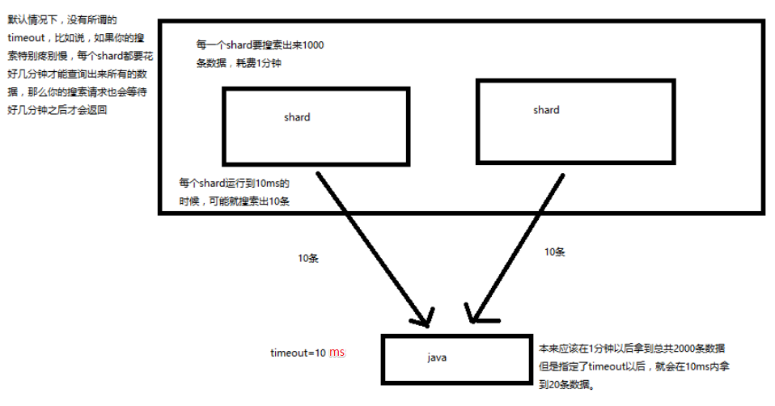

# search 结果深入解析（timeout 机制揭秘）
[[toc]]


1. 我们如果发出一个搜索请求的话，会拿到一堆搜索结果，本节课，我们来讲解一下，这个搜索结果里的各种数据，都代表了什么含义
2. 我们来讲解一下，搜索的 timeout 机制，底层的原理，画图讲解

## 搜索结果返回字段含义

```json
GET /_search

-------------- 响应

{
  "took": 4,
  "timed_out": false,
  "_shards": {
    "total": 9,
    "successful": 9,
    "failed": 0
  },
  "hits": {
    "total": 13,
    "max_score": 1,
    "hits": [
      {
        "_index": ".kibana",
        "_type": "config",
        "_id": "5.2.0",
        "_score": 1,
        "_source": {
          "buildNum": 14695
        }
      }
    ]
  }
  ....
}
```

- took：整个搜索请求花费了多少毫秒
- hits.total：本次搜索，返回了几条结果

    ::: tip
    这里解说可能是有问题的，这里的 total 是搜索结果总条数（通过 `GET /_cat/indices?v` 中的 docs.count 计算对比）
    :::
- hits.max_score：本次搜索的所有结果中，最大的相关度分数是多少

    每一条 document 对于 search 的相关度，越相关，`_score` 分数越大，排位越靠前
- hits.hits：默认查询前 10条 数据，完整数据，`_score` 降序排序

- shards：

    shards fail 的条件（primary 和 replica 全部挂掉），不影响其他shard。

    默认情况下来说，一个搜索请求，会打到一个 index 的所有 primary shard 上去，当然了，
    每个 primary shard 都可能会有一个或多个 replic shard，所以请求也可以到 primary shard 的其中一个 replica shard 上去。

- timeout：默认无 timeout


## timeout 机制
默认无 timeout ，可以手动指定 timeout， latency completeness （延迟平衡完整性），

**latency completeness 是什么意思？**

我们有些搜索应用，对时间是很敏感的。

比如说电商网站，你不能让用户等 10分钟，才能等到一次搜索请求的结果，人早走了

timeout 机制：指定每个 shard 就只能在 timeout 时间范围内，将搜索到的部分数据（也有可能是全部搜索到的数据）
直接返回给 client 程序，而不是等到所有的数据全都搜索出来后再返回

确保一次搜索请求可以再用户指定 timeout 时长内完成。为一些时间敏感的搜索应用提供良好的支持



简单说：在指定超时时长内返回结果，这个结果可能不是所有结果；

## timeout 语法

```json
GET /_search?timeout=1ms

单位：timeout=10ms，timeout=1s，timeout=1m
```
