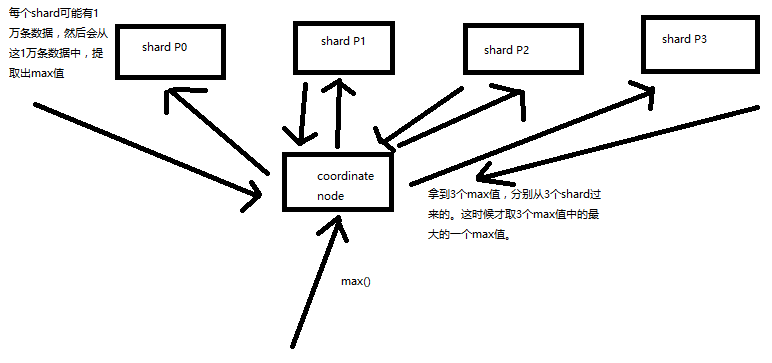

# 聚合算法讲解
[[toc]]

## 易并行算法 max
有些聚合分析的算法，是很容易就可以并行的，比如说 max，流程如下：

- 假设有 3 和 shard 查找最大值
- 每个 shard 查找并返回一个最大值
- 在聚合节点上会拿到 3 个值，然后在这三个值中排序出最大的一个即可

有些聚合分析的算法是不好并行的，比如说 `count(distinct)`（去重后统计剩余数量，也就是唯一值个数），
并不是说在每个 node 上直接就出一些 distinct value 就可以的，因为每个 shard 之间可能还有重复的数据，所以就不准的，
这个时候就需要从每个 shard 上把所有相关数据都获取过来，然后计算
如下图

不易并行算法进行聚合的时候，由于数据量可能太大会导致内存占用过多，性能严重影响，甚至内存溢出，
这个时候 es 会采取近似聚合的方式，就是采用在每个 node 上进行近估计的方式，
得到最终的结论，如：`cuont(distcint)` 本来是 100 万，可能会返回 105 万，
近似估计后的结果，不完全准确，但是速度会很快，一般会达到完全精准的算法的性能的数十倍。

这就会出现一个概念，三角选择原则
## 三角选择原则
精准 + 实时 + 大数据只能选择 2 个

- 精准+实时: 没有大数据，数据量很小，那么一般就是单机跑，随便你则么玩儿就可以
- 精准+大数据：hadoop 批处理，非实时，可以处理海量数据，保证精准，可能会跑几个小时
- 大数据+实时：es，不精准，近似估计，可能会有百分之几的错误率

## 近似聚合算法
- 如果采取近似估计的算法：延时在 100ms 左右，0.5% 错误
- 如果采取 100% 精准的算法：延时一般在 ns~几十s，甚至几十分钟，几小时， 0% 错误

::: tip
对于这个错误率不知道是怎么出来的，就是一句话数据量非百分百准确
:::
