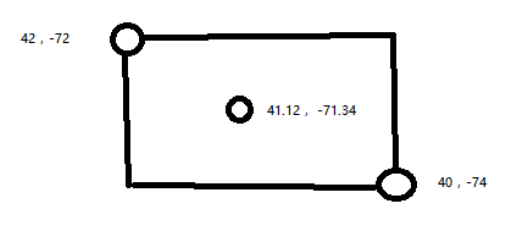

# 学习使用 geo point 地理位置数据类型
当前和后面几章节会讲解地理位置相关的知识，主要是 es 支持基于地理位置的搜索，和聚合分析

举个例子：你如果做了一个酒店 o2o app，让你的用户在任何地方，都可以根据当前所在的位置，
找到自己身边的符合条件的一些酒店，那么此时就完全可以使用 es 来实现，非常合适

再比如：我现在在上海某个大厦附近，我要搜索到距离我 2 公里以内的 5 星级的带游泳池的一个酒店，用 es 就完全可以实现类似这样的基于地理位置的搜索引擎

## 建立 geo_point 类型的 mapping

```json
PUT /my_index
{
  "mappings": {
    "my_type": {
      "properties": {
        "location":{
          "type": "geo_point"
        }
      }
    }
  }  
}
```

## 写入 geo_point 有三种方式

> 第一种

```json
PUT my_index/my_type/1
{
  "text": "Geo-point as an object",
  "location": {
    "lat": 41.12,
    "lon": -71.34
  }
}
```

- lat：latitude 维度
- lon：longitude 经度

> 第二种

```json
PUT my_index/my_type/2
{
  "text": "Geo-point as a string",
  "location": "41.12,-71.34"
}
```

> 第三种

```json
PUT my_index/my_type/4
{
  "text": "Geo-point as an array",
  "location": [ -71.34, 41.12 ]
}

```

后两种不建议使用，因为第一种比较清晰明了

## geo_bounding_box 根据地理位置进行查询

最最简单的，根据地理位置查询一些点，geo_bounding_box 查询某个矩形的地理位置范围内的坐标点

什么叫某个矩形地址位置范围呢？下图给出说明



左上角坐标和右下角坐标可以绘制出一个矩形，这个矩形覆盖的范围就是要搜索的数据坐标

```json
GET /my_index/my_type/_search
{
  "query": {
    "geo_bounding_box": {
      "location": {
        "top_left": {
          "lat": 42,
          "lon": -72
        },
        "bottom_right": {
          "lat": 40,
          "lon": -74
        }
      }
    }
  }
}

{
  "took": 117,
  "timed_out": false,
  "_shards": {
    "total": 5,
    "successful": 5,
    "failed": 0
  },
  "hits": {
    "total": 3,
    "max_score": 1,
    "hits": [
      {
        "_index": "my_index",
        "_type": "my_type",
        "_id": "2",
        "_score": 1,
        "_source": {
          "text": "Geo-point as a string",
          "location": "41.12,-71.34"
        }
      },
      {
        "_index": "my_index",
        "_type": "my_type",
        "_id": "4",
        "_score": 1,
        "_source": {
          "text": "Geo-point as an array",
          "location": [
            -71.34,
            41.12
          ]
        }
      },
      {
        "_index": "my_index",
        "_type": "my_type",
        "_id": "1",
        "_score": 1,
        "_source": {
          "text": "Geo-point as an object",
          "location": {
            "lat": 41.12,
            "lon": -71.34
          }
        }
      }
    ]
  }
}
```

比如 41.12,-71.34 就是一个酒店，然后我们现在搜索的是从 42,-72（代表了大厦A）和 40,-74（代表了马路 B）作为矩形的范围，在这个范围内的酒店，是什么
