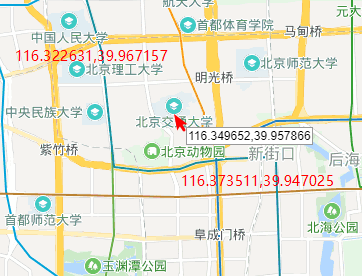

# 酒店 o2o 搜索案例以及搜索指定区域内的酒店

稍微真实点的案例，酒店 o2o app 作为一个背景，用各种各样的方式，去搜索你当前所在的地理位置附近的酒店

搜索指定区域范围内的酒店，比如说，我们可以在搜索的时候，指定两个地点，就要在东方明珠大厦和上海路组成的矩阵的范围内，搜索我想要的酒店

## maping 与 数据插入

```json
PUT /hotel_app
{
    "mappings": {
        "hotels": {
            "properties": {
                "pin": {
                    "properties": {
                        "location": {
                            "type": "geo_point"
                        }
                    }
                }
            }
        }
    }
}

PUT /hotel_app/hotels/1
{
    "name": "喜来登大酒店",
    "pin" : {
        "location" : {
            "lat" : 40.12,
            "lon" : -71.34
        }
    }
}
```

## geo_bounding_box 矩形范围搜索
上一张节讲过的

```json
GET /hotel_app/hotels/_search
{
  "query": {
    "bool": {
      "must": [
        {
          "match_all": {}
        }
      ],
      "filter": {
        "geo_bounding_box": {
          "pin.location": {
            "top_left": {
              "lat": 40.73,
              "lon": -74.1
            },
            "bottom_right": {
              "lat": 40.01,
              "lon": -71.12
            }
          }
        }
      }
    }
  }
}

{
  "took": 2,
  "timed_out": false,
  "_shards": {
    "total": 5,
    "successful": 5,
    "failed": 0
  },
  "hits": {
    "total": 1,
    "max_score": 1,
    "hits": [
      {
        "_index": "hotel_app",
        "_type": "hotels",
        "_id": "1",
        "_score": 1,
        "_source": {
          "name": "喜来登大酒店",
          "pin": {
            "location": {
              "lat": 40.12,
              "lon": -71.34
            }
          }
        }
      }
    ]
  }
}
```


## geo_polygon 多边形范围搜索

```json
GET /hotel_app/hotels/_search
{
  "query": {
    "bool": {
      "must": [
        {
          "match_all": {}
        }
      ],
      "filter": {
        "geo_polygon": {
          "pin.location": {
            "points": [
              {"lat" : 40.73, "lon" : -74.1},
              {"lat" : 40.01, "lon" : -71.12},
              {"lat" : 50.56, "lon" : -90.58}
            ]
          }
        }
      }
    }
  }
}
```

## 真实地理位置坐标体验


- 北京理工大学：116.322631,39.967157
- 北京交通大学：116.349652,39.957866
- 新街口：116.373511,39.947025

以上图片和经纬度是 [百度地图拾取坐标系统](http://api.map.baidu.com/lbsapi/getpoint/index.html) 中获取的

```json
PUT /hotel_app/hotels/5
{
    "name": "北京交通大学",
    "pin" : {
        "location" : {
            "lat" : 39.957866,
            "lon" : 116.349652
        }
    }
}
```

```json
GET /hotel_app/hotels/_search
{
  "query": {
    "bool": {
      "must": [
        {
          "match_all": {}
        }
      ],
      "filter": {
        "geo_bounding_box": {
          "pin.location": {
            "top_left": {
              "lat": 39.967157,
              "lon": 116.322631
            },
            "bottom_right": {
              "lat": 39.947025,
              "lon": 116.373511
            }
          }
        }
      }
    }
  }
}

{
  "took": 2,
  "timed_out": false,
  "_shards": {
    "total": 5,
    "successful": 5,
    "failed": 0
  },
  "hits": {
    "total": 1,
    "max_score": 1,
    "hits": [
      {
        "_index": "hotel_app",
        "_type": "hotels",
        "_id": "5",
        "_score": 1,
        "_source": {
          "name": "北京交通大学",
          "pin": {
            "location": {
              "lat": 39.957866,
              "lon": 116.349652
            }
          }
        }
      }
    ]
  }
}
```

实验成功
