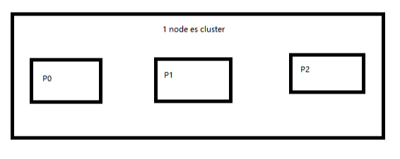

# 单节点 shard & replica 机制
[[toc]]

1. shard & replica 机制再次梳理
2. 图解单 node 环境下创建 index 是什么样子的

## shard & replica 机制再次梳理

1. index 包含多个 shard
2. 每个 shard 都是一个最小工作单元，承载部分数据，是一个 lucene 实例，完整的建立索引和处理请求的能力
3. 增减节点时，shard 会自动在 nodes 中负载均衡
4. primary shard 和 replica shard，每个 document 肯定只存在于某一个 primary shard 以及其对应的 replica shard 中，不可能存在于多个 primary shard
5. replica shard 是 primary shard 的副本，负责容错，以及承担读请求负载
6. primary shard 的数量在创建索引的时候就固定了，replica shard 的数量可以随时修改
7. primary shard 的默认数量是 5，replica 默认是 1，默认有 10个 shard，5个 primary shard，5个 replica shard
8. primary shard 不能和自己的 replica shard 放在同一个节点上（否则节点宕机，primary shard 和副本都丢失，起不到容错的作用），但是可以和其他 primary shard 的 replica shard 放在同一个节点上

对于 shard 和 replica 的总结：

1. pri : primary shard
2. rep : replica shard
3. 所以一个 es 实例叫做 shard
4. rep 的配置是针对于每个 pri 的副本个数

如：test 的 pri=2，rep=2；那么将产生 2个 primary shard 和 4个 replica shard


## 图解单 node 环境下创建 index 是什么样子的

1. 单 node 环境下，创建一个 index，有 3个 primary shard，3个 replica shard
2. 集群 status 是 yellow
3. 这个时候，只会将 3个 primary shard 分配到仅有的一个 node 上去，另外 3个 replica shard 是无法分配的
4. 集群可以正常工作，但是一旦出现节点宕机，数据全部丢失，而且集群不可用，无法承接任何请求

```json
PUT /test_index
{
  "settings": {
    "number_of_shards": 3,
    "number_of_replicas": 1
  }
}
```

```json
GET /_cat/health?v

epoch      timestamp cluster       status node.total node.data shards pri relo init unassign pending_tasks max_task_wait_time active_shards_percent
1546323256 14:14:16  elasticsearch yellow          1         1      9   9    0    0        9             0                  -                 50.0%
```

```json
GET /_cat/indices?v

health status index      uuid                   pri rep docs.count docs.deleted store.size pri.store.size
yellow open   ecommerce  ZpGp7bIBQBaZFk9SYmbJVQ   5   1          4            0     22.2kb         22.2kb
yellow open   test_index g4RJx2v8TXK95LdwlhRx5A   3   1          0            0       390b           390b
yellow open   .kibana    id1SV_oGSjyGosKxeJApww   1   1          1            0      3.1kb          3.1kb
```

来计算下是否是正确的：这个单节点集群有 9个 shards ，9个 pri，有 9个 unassign；

再来统计下这 3个 索引一共有 9个 pri，每个索引都有 1个 rep，那么一共会产生 9个 rep。
9个 unassign 全是这 9个 rep，因为 同一份数据的 pri 和 rep 不能在一台机器上;

也就是说，一共会产生 18 个 shard；这里只有 9个，还有 9个没有被分配



而 pri 的数据却可以再同一台机器上，这里创建的 3个 pri 都会在这个 node 上存在
