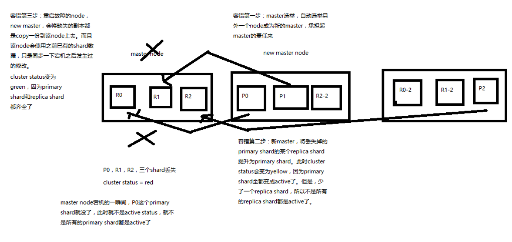

# 容错机制浅析

图解 Elasticsearch 容错机制：master 选举，replica 容错，数据恢复

还是使用上一章的例子，9 shard，3 node 来说明 es 的一个最基本的容错机制

1. master node 宕机，自动 master 选举，red
2. replica容错：新 master 将 replica 提升为 primary shard，yellow
3. 重启宕机 node，master copy replica 到该 node，使用原有的 shard 并同步宕机后的修改，green
