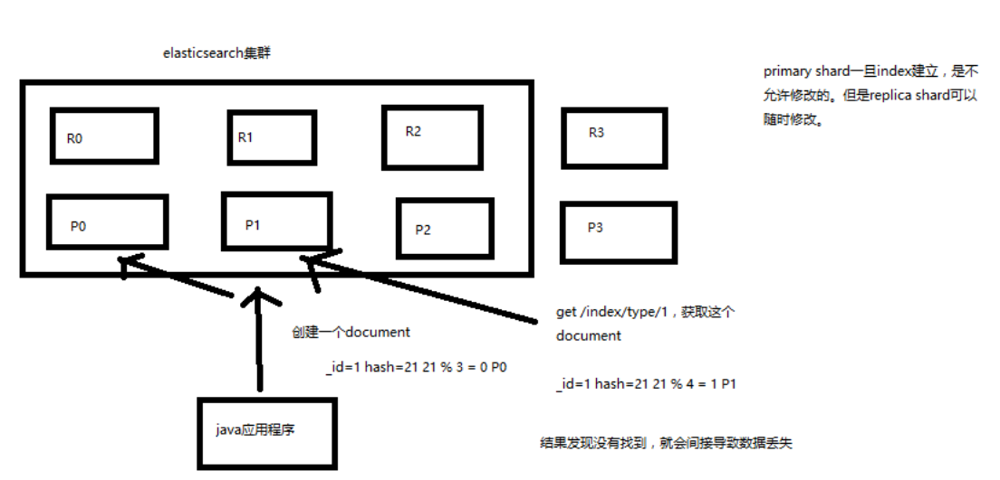

# 深度图解剖析 document 数据路由原理

## 什么是数据路由？

我们知道，一个 index 的数据会被分为多片，每片都在一个 shard 中，
所以一个 document ，只能存在于一个 shard 中

当客户端创建 document 的时候，es 此时就需要决定这个 document 存放在哪一个 shard 上。

这个过程，就称之为 docum routing （数据路由）

## 路由算法

- shard = hash(routing) % number_of_primary_shards
- routing = `_id` or custom routing value

举个例子，一个 index 有3个 primary shard，P0，P1，P2

每次增删改查一个 document 的时候，都会带过来一个 routing number，
默认就是这个 document 的 `_id`（可能是手动指定，也可能是自动生成）

- `routing = _id`，假设 `_id=1`
- hash(1) % 3 = 0; 假设 hash 值为 6

## 手动指定 routing

默认的 routing 就是 `_id`

也可以在发送请求的时候，手动指定一个 routing value，比如说 `put /index/type/id?routing=user_id`

手动指定 routing value 是很有用的，可以保证说，某一类 document 一定被路由到一个 shard 上去，
那么在后续进行应用级别的负载均衡，以及提升批量读取的性能的时候，是很有帮助的

## primary shard 数量不可变的谜底

路由算法限制，更改之后，那么就有部分旧数据的路由错误

