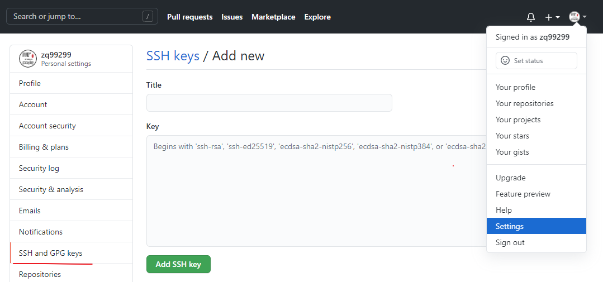
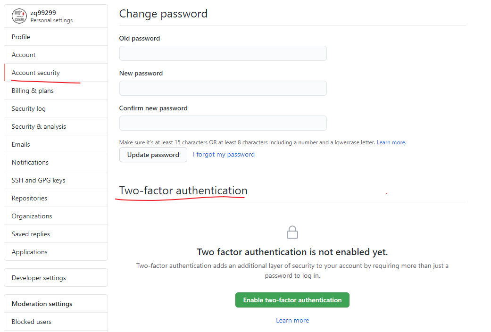

# 账户的创建和配置

账户注册到：[https://github.com](https://github.com/) 进行注册

## SSH 访问

现在，你完全可以使用 `https://` 协议，通过你刚刚创建的用户名和密码访问 Git 版本库。 但是，如果仅仅克隆公有项目，你甚至不需要注册——刚刚我们创建的账户是为了以后 fork 其它项目，以及推送我们自己的修改。

如果你习惯使用 SSH 远程，你需要配置一个公钥。 （如果你没有公钥，参考 [生成 SSH 公钥](../04/03.md)。） 使用窗口右上角的链接打开你的账户设置：

`SSH and GPG keys  -> New SSH key`

给你的公钥起一个名字，将你的 `~/.ssh/id_rsa.pub`（或者自定义的其它名字）公钥文件的内容粘贴到文本区，然后点击 `Add SSH key`。

::: tip

确保给你的 SSH 密钥起一个能够记得住的名字。 你可以为每一个密钥起名字（例如，“我的笔记本电脑” 或者 “工作账户” 等），以便以后需要吊销密钥时能够方便地区分。

:::

## 头像

下一步，如果愿意的话，你可以将生成的头像换成你喜欢的图片。 

头像的作用：在网站任意有你参与的位置，人们都可以在你的用户名旁边看到你的头像。

如果你已经把头像上传到了流行的 Gravatar 托管服务（Wordpress 账户经常使用），默认就会使用这个头像，因此，你就不需要进行这一步骤了。

## 邮件地址

GitHub 使用用户邮件地址 **区分 Git 提交**。 如果你在自己的提交中使用了多个邮件地址，希望 GitHub 可以正确地将它们连接起来，你需要在管理页面的 Emails 部分添加你拥有的所有邮箱地址。

我们可以看到一些不同的状态。 顶部的地址是通过验证的，并且被设置为 **主要地址**，这意味着该地址会接收到所有的通知和回复。 第二个地址是通过验证的，如果愿意的话，可以将其设置为主要地址。 最后一个地址是未通过验证的，这意味着你不能将其设置为主要地址。 当 GitHub 发现任意版本库中的任意提交信息包含了这些地址，它就会将其链接到你的账户。

## 两步验证

最后，为了额外的安全性，你绝对应当设置两步验证，简写为 “2FA”。 两步验证是一种用于降低因你的密码被盗而带来的账户风险的验证机制，现在已经变得越来越流行。 开启两步验证，GitHub 会要求你用两种不同的验证方法，这样，即使其中一个被攻破，攻击者也不能访问你的账户。

你可以在 Account settings 页面的 Security 标签页中找到 Two-factor Authentication 设置。

点击  `Set up two-factor authentication` 按钮，会跳转到设置页面。该页面允许你选择是要在登录时使用手机 app 生成辅助码（一种基于时间的一次性密码），还是要 GitHub 通过 SMS 发送辅助码。

选择合适的方法后，按照提示步骤设置 2FA，你的账户会变得更安全，每次登录 GitHub 时都需要提供除密码以外的辅助码。

新版本的 GitHub 是下图这样

