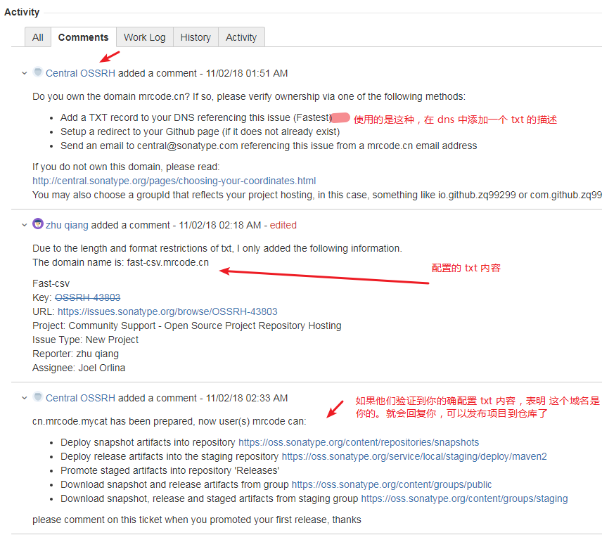
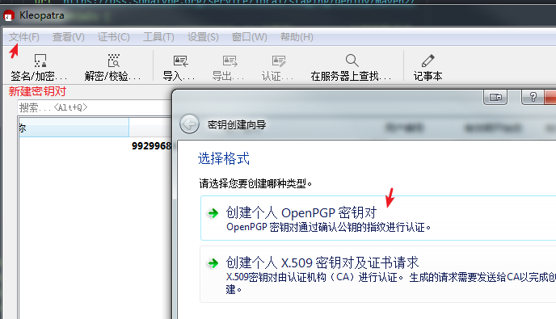

# 发布包到 maven 仓库


## 在 sonatype 做准备工作

效果：发布到 https://oss.sonatype.org/#nexus-search;quick~mrcode 仓库中

首先需要到这个页面注册账户：https://issues.sonatype.org/

登录之后，创建点击顶部导航栏的 create 创建项目


创建完成之后就会出一个 issues, 比如这个： https://issues.sonatype.org/browse/OSSRH-43803



流程：

1. 创建账户
2. 创建 issues 类型为新项目
3. 他们工作人员会要求你证明你提供的 group id 的域名是属于你自己的
  1. 如果不能提供证明，你将不能使用这个域名作为你的 group id
  2. 他也告知你可以使用 github 等域名作为你的 group id
3. 证明 group id 是你的域名之后，就可以发布包到仓库了。

我选择的是在 dns 中增加 txt；如下图，很快就通过认证了


## gradle 配置

```
plugins {
    id 'java'
    id 'maven-publish'  // 添加插件
}

group 'cn.mrcode.mycat'
version '0.1.0-SNAPSHOT'

sourceCompatibility = 1.8

compileJava {
    sourceCompatibility = 1.8
    targetCompatibility = 1.8
    [compileJava]*.options*.encoding = 'UTF-8'
}
compileTestJava {
    sourceCompatibility = 1.8
    targetCompatibility = 1.8
    [compileTestJava]*.options*.encoding = 'UTF-8'
}
repositories {
    mavenCentral()
}

dependencies {
    compile 'org.slf4j:slf4j-api:1.7.25'
    testCompileOnly 'junit:junit:4.12'
    testCompileOnly 'org.apache.commons:commons-lang3:3.8.1'
    testCompileOnly 'ch.qos.logback:logback-core:1.1.7'
    testCompileOnly 'ch.qos.logback:logback-classic:1.1.7'
    testCompileOnly 'org.apache.commons:commons-csv:1.6'
}

// 最主要的是这里
publishing {
    publications {
        // 这一个推送项目名称，mavenJava 相当于是一个 task name
        mavenJava(MavenPublication) {
            groupId project.group
            artifactId project.name
            version "${version}"
            from components.java
            artifact sourceJar

            // 添加 pom 相关信息
            // https://docs.gradle.org/current/dsl/org.gradle.api.publish.maven.MavenPublication.html
            pom {
                name = "fast-csv"
                description = "load csv file for Mycat"
                url = "https://github.com/zq99299/fast-csv"
                licenses {
                    license {
                        name = "The Apache License, Version 2.0"
                        url = "http://www.apache.org/licenses/LICENSE-2.0.txt"
                    }
                }
                developers {
                    // 添加开发者描述，这个id不知道是什么
                    developer {
                        id = "zq99299"
                        name = "mrcode"
                        email = "99299684@qq.com"
                    }
                }
                // 添加你的 git 仓库 信息
                scm {
                    connection = "scm:git:https://github.com/zq99299/fast-csv.git"
                    developerConnection = "scm:git:https://github.com/zq99299/fast-csv.git"
                    url = "https://github.com/zq99299/fast-csv"
                }
            }
        }
    }
    repositories {
        // 添加一个远程仓库地址
        // releases 仓库
        maven {
            // 在对 task 中会生成对应的名称 publishMavenJavaPublicationToxxx
            // 后面的 xxx 就是你这里的名称，表示你要把jar 上传到这个仓库中
            name 'sonatypeRepository'  // 为你这个仓库起名
            url 'https://oss.sonatype.org/service/local/staging/deploy/maven2/'
            credentials {
                username = "${NEXUS_USERNAME}"  // 之前在 sonatype 注册的账户名
                password = "${NEXUS_PASSWORD}" // 对应的密码
            }
        }
        // snapshots 仓库
        maven {
            name = 'sonatypeSnapshotRepository'
            url = 'https://oss.sonatype.org/content/repositories/snapshots/'
            credentials {
                username = "${NEXUS_USERNAME}"
                password = "${NEXUS_PASSWORD}"
            }
        }
    }
}
task sourceJar(type: Jar, dependsOn: classes) {
    description = "打包源码"
    classifier = 'sources'
    from sourceSets.main.allSource
}
```

## 发布
对于发布来说，有两个地址：

- releases  ：
  - 表示正式版，稳定版本
  - 听说需要 gpg 签名才可以发布成功
  - 不需要  -SNAPSHOT 后缀
- snapshots ：
  - 快照版， 不稳定的，开发的时候常用；
  - 必须携带 -SNAPSHOT 后缀

上面的配置对于 snapshots 已经可以发布了，只要执行 task publishMavenJavaPublicationToxxx 对应的仓库名称即可；

## GPG 生成
配置之前需要你现有 gpg 的签名文件，我这里下载 windows 的软件

gpg4win-3.1.5 ：https://gpg4win.org/thanks-for-download.html

这个软件支持中文。创建很简单。直接新建密钥对即可。



下一步后面的信息都是选填的。傻瓜式下一步即可生成。


- 导出 ： 可以导出一个 .gpg 的文件
- 在服务器上发布。弹出询问框，同意之后，会发自动上传到公共服务器上。
- 细节：相当于一个详细信息。里面包含了你这个秘钥的指纹。后面配置需要用到这个指纹的后8位

注意：这个 gpg 你在上传到服务器之前需要生成 吊销证书.rev 。以后还可以使用这个证书进行取消的。不然就没法取消了

> gpg 的详细教程可以参考 阮一峰的教程：http://www.ruanyifeng.com/blog/2013/07/gpg.html


## 签名配置

首先在顶部 plugins 中增加签名插件     id 'signing'

在配置一下依赖，让插件任务运行
```
// 1. 签名配置
signing {
    sign configurations.archives
}

// 2.
// 这里的 dependsOn 依赖了 signArchives 这个被插件自动添加的任务
// 目的是在 source 前执行签名
task sourceJar(type: Jar, dependsOn: [classes, signArchives]) {
    description = "配置source的路径"
    classifier = 'sources'
    from sourceSets.main.allSource
}

// 3. 在之前的配中增加一项
publishing {
    publications {
        mavenJava(MavenPublication) {
            groupId project.group
            artifactId project.name
            version "${version}"
            from components.java
            artifact sourceJar
            // 增加这个签名名称所在的位置，
            // signArchives 输出文件中以你项目名作为的 key。这里获取这一个签名文件
            artifact signArchives.outputFiles.get('fast_csv')

```

这里可以执行 gradle task publishToMavenLocal 这个任务来查看打到本地 maven 仓库的jar

可以发现如下的目录结构
```
fast-csv-0.1.0-SNAPSHOT.asc   -> 签名文件
fast-csv-0.1.0-SNAPSHOT.jar
fast-csv-0.1.0-SNAPSHOT.pom
fast-csv-0.1.0-SNAPSHOT-sources.jar
maven-metadata-local.xml
```

这一步执行肯定会报错的，因为你没有指定你的签名信息：

在 gradle 中增加以下配置
```
signing.keyId=上面说过 gpg 的秘钥指纹后八位
signing.password=你创建 gpg 密钥对的设置的密码
signing.secretKeyRingFile=C:/Users/Administrator/Desktop/xxxx.gpg   // gpg 路径
```

对于生成之后的这个目录，jar 文件。我们也可以使用之前生成密钥对的工具进行校验


