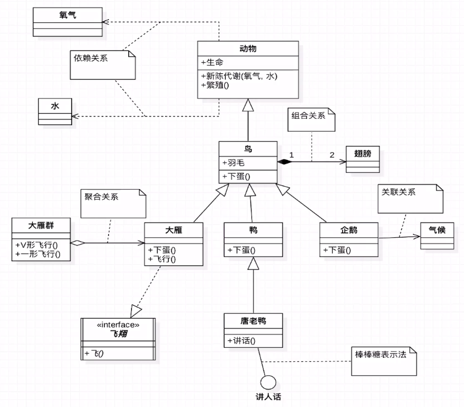

# UML 类图讲解

* `+` : public 最大的
* `-` : private 最小的
* `#` : protected
* `~` : default 默认的
* `下划线` ： static

* `斜体` ：代表抽象方法；这里的类名应该修改为斜体

## UML 类图讲解-自上而下

该图摘自大话设计模式，这张图如果理解透了就比较厉害了，关系比较全面

* 先看动物类：依赖关系，依赖氧气和水
* 鸟 ：组合关系，1只鸟一般有2只翅膀
* 企鹅 ：关联关系，一般在自身声明一个属性，关联一个气候
* 大雁 ：聚合关系，大雁群由多个大雁组成

## UML 类图讲解-对比讲解联想记忆

* 依赖关系 - 关联关系： 一个虚线，一个实现。
  - 虚线：虚无缥缈的，只有使用新陈代谢的时候才会用到氧气和谁，一般用作行为
  - 实线：关系稳定，一般作为属性

* 聚合关系 - 组合关系： 一个空心菱形，一个实心菱形
  - 箭头方向
  - 聚合是整体和局部的关系，拥有独立的生命周期

    如：一群大雁，其中有一只生病了，挂了，那么这个大雁群还是存在，挂了的大雁生命周期已结束
  - 组合关系：也是整体和局部的关系，但是拥有相同的生命周期

    如：一只鸟生病，挂了，那么翅膀也会没有生命了

* 继承 - 实现：都是空心三角形，一个实线，一个虚线
  - 继承：比较铁，都实体
  - 实现：比较虚，没有实体，需要有类来实现

## 本章总结

* 定义
* 特点
* 分类
* 类图
* 时序图
* 记忆技巧
