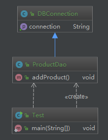

# 合成复用原则

合成（组合）/ 聚合复用原则

**定义**：尽量使用对象组合/聚合，而不是继承关系达到软件复用的目的

* 聚合 has-A
* 组合 contains-A
* 继承 is-A

**优点**：可以使系统更加灵活，降低类与类之间的耦合度，一个类的变化对其他类造成的影响相对较少

## 何时使用合成/聚合、继承

聚合：大雁去群的例子；笔记本和 U 盘，笔记本没了，U 盘还能独立存在
组合：集成显卡和笔记本，显卡坏了，你电脑也不能用了，看不见，不能操作了

代码场景：a 类中有一个 b类的引用
* 聚合：除了 a 类以外，还有其他地方对 b 类的引用，就算 a 类结束了，b 还存活着
* 组合：只有 a 类引用，那么当 a 类结束时， b 类跟着一起结束


## Coding

场景：Dao 层获取数据库连接；

```java
public class DBConnection {
    public String getConnection() {
        return "使用 Mysql 数据库连接";
    }
}

public class ProductDao extends DBConnection {
    public void addProduct() {
        String connection = super.getConnection();
        System.out.println("使用 " + connection + " 添加产品");
    }
}

public class Test {
    public static void main(String[] args) {
        ProductDao productDao = new ProductDao();
        productDao.addProduct();
    }
}
```


需求来了：增加了 Postgresql 数据库，要切换数据源怎么办？

在上面的示例中，可能的修改如下：

* 增加 PostgresqlConnection 修改 ProductDao的继承类
* 在 DBConnection 中新增获取 PostgresqlConnection 的方法

上面这样做，都破坏了开闭原则。下面使用合成/复用原则来改造

## 合成/复用 改造场景

```java
public interface DBConnection {
    String getConnection();
}

public class MysqlDBConnection implements DBConnection {
    @Override
    public String getConnection() {
        return "使用 Mysql 数据库连接";
    }
}

public class PostgreesqlDBConnection implements DBConnection {
    @Override
    public String getConnection() {
        return "使用 Postgreesql 数据库连接";
    }
}


public class ProductDao {
    private DBConnection dbConnection;

    public void addProduct() {
        String connection = dbConnection.getConnection();
        System.out.println("使用 " + connection + " 添加产品");
    }

    public void setDbConnection(DBConnection dbConnection) {
        this.dbConnection = dbConnection;
    }
}

public class Test {
    public static void main(String[] args) {
        ProductDao productDao = new ProductDao();
        productDao.setDbConnection(new MysqlDBConnection());
//        productDao.setDbConnection(new PostgreesqlDBConnection());
        productDao.addProduct();
    }
}
```


组合，一对一，强依赖。符合开闭原则，也符合里氏替换原则。随意替换数据源
