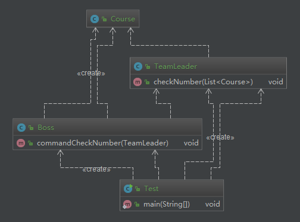

# 迪米特原则

**定义**：一个对象应该对其他对象保持最少的了解。又叫最少知道原则

**核心**：尽量降低类与类之间的耦合

**优点**：降低类之间的耦合

**强调**：只和朋友交流，不和陌生人说话

  什么是朋友？出现在成员变量、方法的输入、输出参数中的类称为朋友类，而出现在方法体内部的类不属于朋友类

## coding

场景：老板给小组长下达指令，查询在线课程数量

```java
public class Boss {
    public void commandCheckNumber(TeamLeader teamLeader) {
        // 老板获取到所有的课程
        List<Course> list = new ArrayList<>();
        for (int i = 0; i < 20; i++) {
            list.add(new Course());
        }
        // 对小组长下达检查指令
        teamLeader.checkNumber(list);
    }
}
```

```java
public class TeamLeader {
    public void checkNumber(List<Course> list) {
        // 假设在检查逻辑
        System.out.println("在线课程数量是：" + list.size());
    }
}
```

```java
public class Course {
}
```

```java
public class Test {
    public static void main(String[] args) {
        Boss boss = new Boss();
        TeamLeader teamLeader = new TeamLeader();
        boss.commandCheckNumber(teamLeader);
    }
}
```

```
在线课程数量是：20
```



对于这个场景来说，boss 是不需要知道 Course 的，只要给 TeamLeader 下达指令，然后 TeamLeader 报告结果即可。

哪些是 Boss 的朋友？ TeamLeader （入参）

哪些不是 Boss 的朋友？ Course，既不是成员变量、方法的输入、输出参数，而只是方法体内部的类。

## 迪米特原则改造


只是把非朋友类逻辑移动到 TeamLeader 中了。

```java
public class TeamLeader {
    public void checkNumber() {
        // 老板获取到所有的课程
        List<Course> list = new ArrayList<>();
        for (int i = 0; i < 20; i++) {
            list.add(new Course());
        }
        System.out.println("在线课程数量是：" + list.size());
    }
}
```

这里对于 TeamLeader 来说，Course 貌似又不是它的朋友了，但是这个是属于 TeamLeader 的职责
