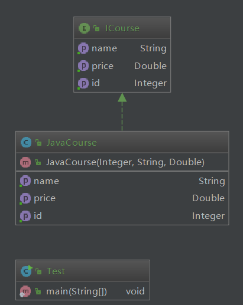
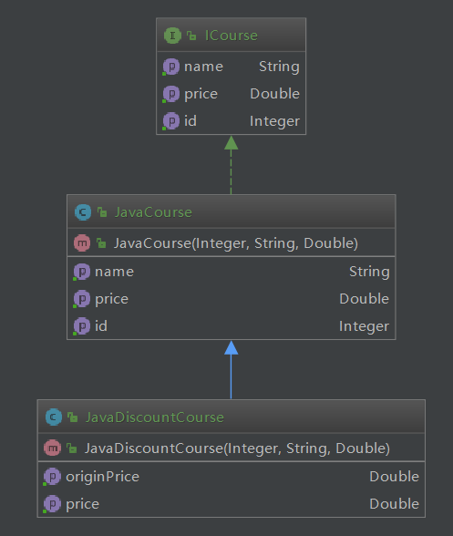

# 开闭原则

**定义**：一个软件实体如类，模块和函数应该对扩展开放，对修改关闭

开闭，是对扩展和修改两个行为的描述

**强调的是**：用抽象构建框架，用实现扩展细节

优点：提高软件系统的可复用性及可维护性

在生活中有一个例子体现：每天工作 8 小时，8 小时是关闭的，什么时候来？什么时候走？这个是开放的

**开闭原则的核心**：面向抽象编程，抽象相对来说是稳定的，对修改关闭；

如：一个校验逻辑，先校验什么，后校验什么。扩展一个校验，也就是功能增强，而不要去修改已有的校验功能，这是对修改关闭

## 开闭原则 coding

一个场景：慕课网的课程表述；

```java
/**
 * 课程
 * @author : zhuqiang
 * @version : V1.0
 * @date : 2018/8/23 23:38
 */
public interface ICourse {
    Integer getId();

    String getName();

    Double getPrice();
}

```

```java
package cn.mrcode.newstudy.design.pattern.principle.openclose;

/**
 * java 类课程;还有js，算法等课程，需要分开
 * @author : zhuqiang
 * @version : V1.0
 * @date : 2018/8/23 23:40
 */
public class JavaCourse implements ICourse {
    private Integer id;
    private String name;
    private Double price;

    public JavaCourse(Integer id, String name, Double price) {
        this.id = id;
        this.name = name;
        this.price = price;
    }

    @Override
    public Integer getId() {
        return this.id;
    }

    @Override
    public String getName() {
        return this.name;
    }

    @Override
    public Double getPrice() {
        return this.price;
    }
}

```

```java{3}
public class Test {
    public static void main(String[] args) {
        JavaCourse javaCourse = new JavaCourse(96, "设计模式", 389d);
        System.out.println("ID:" + javaCourse.getId() +
                "，课程名称：" + javaCourse.getName() +
                "，价格：" + javaCourse.getPrice());
    }
}
```



注意看现在的类图结构：JavaCourse 继承了 ICourse （实心箭头）

输出如下

```
ID:96，课程名称：设计模式，价格：389.0
```

**需求2**：双11到了，搞活动，打8折

那么方案有以下几种，都能满足需求，来说说不足的地方

1. 直接在输出的地方价格乘以 0.8
  - 如果只是某些课程打折呢？
2. 在 JavaCourse 类中 getPrice 方法中乘以 0.8
  - 如果要获取原价呢?
  - 如果还有要求说是价格大于300的课程才打折呢？
3. 在 ICourse 接口中增加打折方法：discountCourse
  - 如果有很多课程，那么影响范围巨大，除非一开始就已经定义了这种接口

一看业务变化，上面的方案对于维护来说都是个不好的办法，那么应该怎么办呢？

**开闭原则**：模块和函数应该对扩展开放，对修改关闭

那么增加一个打折的子类即可；

```java
package cn.mrcode.newstudy.design.pattern.principle.openclose;

/**
 * java课程打折
 * @author : zhuqiang
 * @version : V1.0
 * @date : 2018/8/24 0:13
 */
public class JavaDiscountCourse extends JavaCourse {

    public JavaDiscountCourse(Integer id, String name, Double price) {
        super(id, name, price);
    }

    @Override
    public Double getPrice() {
        // 这里可以针对业务进行范围的判定等操作
        return super.getPrice() * 0.8;
    }

    /** 获取原价 */
    public Double getOriginPrice() {
        return super.getPrice();
    }
}

```

```java
public static void main(String[] args) {
    ICourse iCourse = new JavaDiscountCourse(96, "设计模式", 389d);
    JavaDiscountCourse javaCourse = (JavaDiscountCourse) iCourse;
    System.out.println("ID:" + javaCourse.getId() +
            "，课程名称：" + javaCourse.getName() +
            "，价格：" + javaCourse.getPrice() +
            ", 原价：" + javaCourse.getOriginPrice()
    );
}
```

输出如下：

```
ID:96，课程名称：设计模式，价格：311.20000000000005, 原价：389.0
```



看现在的类图：这里没有严格按照我们之前讲解的图形来演示，而是有颜色和标识，反正差别不大，更容易看明白

主要是这里的类图结构和增强之前的类图结构对比；阐述了开闭原则，而对于上面所说的那些维护问题相对来说也更方便维护，结构上也更容易理解（杠精请绕道，一般的web开发，基本上不会这样做）
