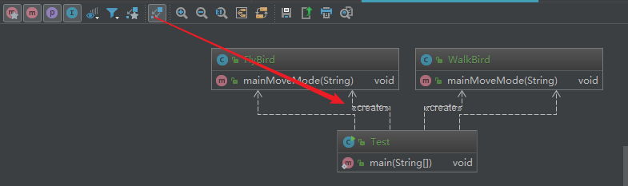

# 单一职责原则

**定义**：不要存在多于一个导致类变更的原因

理解：比如：一个类负责了 2 个功能，在修改功能 1 时，导致功能 2 发生了故障；两个功能在需求变更的时候都有可能导致类变更，那么该类存在两个导致类变更的原因


**体现**： 一个类、接口、方法只负责一项职责

**优点**：

* 降低类的复杂度
* 提高类的可读性
* 提高系统的可维护性
* 降低变更引起的风险
  - 变更是必然的，单一职责原则遵循的好，可以降低变更引起的风险
  - 单一职责也适用于模块化设计

开始coding

## 基本场景
场景：鸟的动作

```java
public class Bird {
    // 主要移动方式
    public void mainMoveMode(String birdName) {
        System.out.println(birdName + "用翅膀飞");
    }
}

```

```java
public class Test {
    public static void main(String[] args) {
        Bird bird = new Bird();
        bird.mainMoveMode("大雁");
        bird.mainMoveMode("鸵鸟");
    }
}
```

```
大雁用翅膀飞
鸵鸟用翅膀飞
```

这里的结果就有问题了：鸵鸟主要移动方式是用脚走路。那么进行修改

```java
public class Bird {
    public void mainMoveMode(String birdName) {
        if ("鸵鸟".equals(birdName)) {
            System.out.println(birdName + "用脚走");
        } else {
            System.out.println(birdName + "用翅膀飞");
        }
    }
}
```

这个示例说实在的，我自己平时在开发的时候就经常这样做，这样做的原因有多种，比如

* 时间关系
* 感觉这个业务不怎么复杂，这样改动是最方便最快捷的

如果还有更多的不同移动方式的鸟类呢？这里的逻辑则会更多的判定。如果在一段很复杂的业务逻辑中，就很容易出错。这里就破坏了单一职责原则-降低变更引起的风险

## 类单一职责演示
把上面负责多职责的拆分成单一职责

```java
// 会飞的鸟
public class FlyBird {
    public void mainMoveMode(String birdName) {
        System.out.println(birdName + "用翅膀飞");
    }
}
```

```java
// 用脚走的鸟
public class WalkBird {
    public void mainMoveMode(String birdName) {
        System.out.println(birdName + "用脚走");
    }
}
```
由应用层来判定，什么鸟适合什么行走方式
```java
FlyBird flyBird = new FlyBird();
flyBird.mainMoveMode("大雁");

WalkBird walkBird = new WalkBird();
walkBird.mainMoveMode("鸵鸟");
```



## 接口级别
```java
public interface ICourse {
    // ~-----------  课程信息
    String getCourseName();
    byte[] getCourseVideo();

    // ~-----------  课程管理
    /** 学习课程 */
    void studyCourrse();
    /** 退款这门课程 */
    void refundCourse();
}
```
对于这个接口来说，有两个大的职责：获取课程信息和课程管理。

如果当课程被退掉的时候，这门课程的信息就获取不到了，也就是说 refundCourse 会影响获取课程信息相关的功能。

```java
public interface ICourseContent {
    // ~-----------  课程信息
    String getCourseName();

    byte[] getCourseVideo();
}
```

```java
public interface ICourseManager {
    // ~-----------  课程管理
    /** 学习课程 */
    void studyCourrse();
    /** 退款这门课程 */
    void refundCourse();
}
```

```java
public class CourseImpl implements ICourseContent, ICourseManager {
    @Override
    public String getCourseName() {
        return null;
    }

    @Override
    public byte[] getCourseVideo() {
        return new byte[0];
    }

    @Override
    public void studyCourrse() {

    }

    @Override
    public void refundCourse() {

    }
}
```


由具体的实现选择来组合实现哪些功能（也可以只实现其中一个），

* 在接口级别上两个接口的职责是清晰的，隔离的。
* 复杂度也降低了，可读性也变高了
* 降低变更引起的风险，可维护性变高了
* 一个接口的修改不影响另一个接口的功能

## 方法级别

```java
public void updateUserInfo(String userName, String address, boolean bool) {
        if (bool) {
            // 逻辑1
        } else {
            // 逻辑2
        }
}
```

这种的逻辑，很明确的是两个功能逻辑，就可以完全拆分成两个方法来处理这不同的功能，而不是用一个标志来处理
