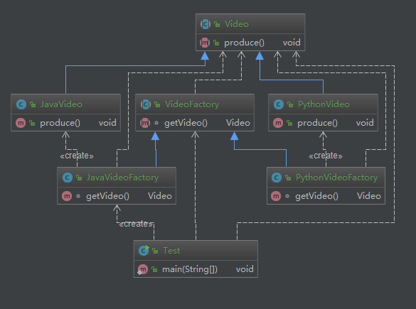

# 工厂方法模式

> 关联阅读 [李兴华-工厂方法](/chapter/design_pattern/工厂方法.md)

**定义**：定义一个创建对象的接口，但让实现这个接口的类来决定实例化哪个类，
工厂方法让类的实例化推迟到子类进行

**类型**：创建型

## 适用场景

* 创建对象需要大量重复代码
* 客户端（应用层）不依赖于产品类实例如何被创建，实现等细节
* 一个类通过其子类来指定创建哪个对象

使用多态和里氏替换原则。

## 优点

* 用户只需要关心所需产品对应的工厂，无须关心创建细节
* 加入新产品符合开闭原则，提高可扩展性

## 缺点

* 类的个数容易过多，增加复杂度
* 增加了系统的抽象性和理解难度

## Coding



代码很简单，改造之前简单工厂为工厂方法。创建了抽象类 VideoFactory，具体的课程由专门的课程工厂去创建实例

这里贴一下客户端的使用，使用哪一种课程，则用它的工厂来创建实例即可

```java
public class Test {
    public static void main(String[] args) {
        VideoFactory factory = new JavaVideoFactory();
        Video video = factory.getVideo();
        video.produce();
    }
}
```

## 源码解析 jdk + logback

### `java.util.Collection#iterator`

`java.util.Collection#iterator`  方法，对于 ArrayList 的以下方法来说.
就是一个工厂方法模式，因为 iterator 方法的实现类有很多，返回的都是具体集合的 iterator 产品；

在这里对应名词是：

* 抽象产品：工厂方法所创建的接口对象，Iterator
* 产品实现对象：具体的产品实现对象，Itr
* 创建器：声明工厂方法的接口 Collection
* 创建者：具体的创建者对象，返回产品 Iterator

> 强烈建议，先跟着慕课的课程进度学习，学完之后，再去看李兴华的设计模式课程，收获很大

```java
public class ArrayList<E> extends AbstractList<E>
        implements List<E>, RandomAccess, Cloneable, java.io.Serializable
{
  public Iterator<E> iterator() {
      return new Itr();
  }

  /**
   * An optimized version of AbstractList.Itr
   */
  private class Itr implements Iterator<E> {
  }
}
```

### URLStreamHandlerFactory

```java
package java.net;

public interface URLStreamHandlerFactory {
    /**
     * Creates a new {@code URLStreamHandler} instance with the specified
     * protocol.
     *
     * @param   protocol   the protocol ("{@code ftp}",
     *                     "{@code http}", "{@code nntp}", etc.).
     * @return  a {@code URLStreamHandler} for the specific protocol.
     * @see     java.net.URLStreamHandler
     */
    URLStreamHandler createURLStreamHandler(String protocol);
}

sun.misc.Launcher 类中的 Factory 实现了这个工厂方法
/*
 * The stream handler factory for loading system protocol handlers.
 */
private static class Factory implements URLStreamHandlerFactory {
    private static String PREFIX = "sun.net.www.protocol";

    public URLStreamHandler createURLStreamHandler(String protocol) {
        String name = PREFIX + "." + protocol + ".Handler";
        try {
            Class<?> c = Class.forName(name);
            return (URLStreamHandler)c.newInstance();
        } catch (ReflectiveOperationException e) {
            throw new InternalError("could not load " + protocol +
                                    "system protocol handler", e);
        }
    }
}
```

### slfj 的 ILoggerFactory

```java
org.slf4j.LoggerFactory 类中的 ILoggerFactory，这就是一个工厂方法接口
public static Logger getLogger(String name) {
    ILoggerFactory iLoggerFactory = getILoggerFactory();
    return iLoggerFactory.getLogger(name);
}
```
