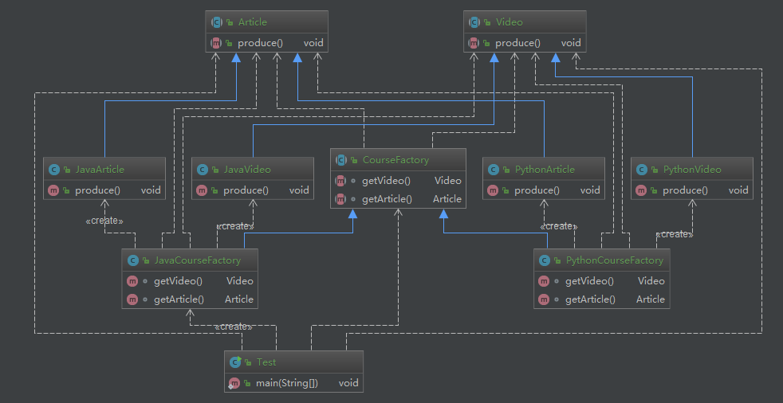

# 抽象工厂

> 关联阅读 [李兴华-简单工厂](/chapter/design_pattern/抽象工厂模式.md)

**定义**：抽象工厂模式提供一个创建一系列相关或相互依赖对象的接口。

* 无须指定他们具体的类

**类型**：创建型

## 使用场景

* 客户端（应用层）不依赖于产品类实例如何被创建、实现等细节
* 强调一系列相关的产品对象（属于同一产品族）一起使用创建对象需要大量重复代码
* 提供一个产品类的库，所有的产品以同样的接口出现，从而使客户端不依赖于具体实现

## 优缺点

**优点**：

1. 具体产品在应用层代码隔离，无须关心创建细节
2. 将一个系列的产品族统一到一起创建

**缺点**：

1. 规定了所有可能被创建的产品集合，产品族中扩展新的产品困难，需要修改抽象工厂的接口
2. 增加了系统的抽象性和理解难度

## 产品登记结构与产品族


产品族：相同颜色的代表一个产品族。

产品等级：形状一样的为产品等级。

如果：第一排，美的电视，美的洗衣机，美的空调。竖着来看（椭圆形），美的空调，海尔空调，格力空调

工厂方法是针对 产品等级结构，抽象工厂针对的是产品族


----

## coding

场景：慕课网课程不单是 video 了，视频 + 手记( Article ) 才被视为一个课程

```java
// 抽象工厂接口
public abstract class CourseFactory {
    abstract Video getVideo();

    abstract Article getArticle();
}

// 产品族的产品抽象接口
public abstract class Video {
    public abstract void produce();
}
public abstract class Article {
    public abstract void produce();
}

// java 抽象工厂实现
public class JavaCourseFactory extends CourseFactory {
    @Override
    Video getVideo() {
        return new JavaVideo();
    }

    @Override
    Article getArticle() {
        return new JavaArticle();
    }
}
// java 产品
public class JavaVideo extends Video {
    @Override
    public void produce() {
        System.out.println("录制 Java 课程");
    }
}
public class JavaArticle extends Article{
    @Override
    public void produce() {
        System.out.println("编写 Java 手记");
    }
}

Python 课程的和这个结构一样，就不贴代码了，直接看类图吧


public class Test {
    public static void main(String[] args) {
        // 通过 java 产品族抽象工厂获取的产品一定都是 java 的产品
        CourseFactory factory = new JavaCourseFactory();
        Video video = factory.getVideo();
        Article article = factory.getArticle();
        video.produce();
        article.produce();
    }
}
```


依赖关系就是下面这样



可以看到，客户端只依赖抽象工厂，然后获取一系列的产品，比如这里的 java 的产品

如果再增加产品族的话也是比较方便的，符合开闭原则，但是一定要选择适合的场景。

比如：产品族中的产品变更很频繁，今天增加一个，明天增加一个，后天又减少一个
这种的场景就不适合抽象工厂，因为需要在抽象工厂接口中增加或则减少产品，
那么会影响所有的的抽象工厂实现类发生修改。

所以一般会选择相对固定的业务场景

## jdk 中的 源码

```java
java.sql.Connection

public interface Connection  extends Wrapper, AutoCloseable {

    Statement createStatement() throws SQLException;

    PreparedStatement prepareStatement(String sql)
        throws SQLException;


java.sql.Statement
// 这个类也是，返回的都是 statement相关的产品
public interface Statement extends Wrapper, AutoCloseable {

    ResultSet executeQuery(String sql) throws SQLException;

    int executeUpdate(String sql) throws SQLException;
```
该接口就是一个抽象工厂的影子，返回的都是某一系列产品族的产品，如果引入了 mysql 驱动包，
就会看到 mysql 实现了该类，返回的肯定都是 mysql 相关的产品

mybatis 的 SqlSessionFactory 也是一个抽象工厂

```java
org.apache.ibatis.session.SqlSessionFactory

public interface SqlSessionFactory {

  SqlSession openSession();

  SqlSession openSession(boolean autoCommit);
  SqlSession openSession(Connection connection);
  SqlSession openSession(TransactionIsolationLevel level);

  SqlSession openSession(ExecutorType execType);
  SqlSession openSession(ExecutorType execType, boolean autoCommit);
  SqlSession openSession(ExecutorType execType, TransactionIsolationLevel level);
  SqlSession openSession(ExecutorType execType, Connection connection);

  Configuration getConfiguration();

}

// DefaultSqlSession 就是一个工厂实现

org.apache.ibatis.session.defaults.DefaultSqlSessionFactory#openSession(boolean)

@Override
public SqlSession openSession(boolean autoCommit) {
  return openSessionFromDataSource(configuration.getDefaultExecutorType(), null, autoCommit);
}

private SqlSession openSessionFromDataSource(ExecutorType execType, TransactionIsolationLevel level, boolean autoCommit) {
  Transaction tx = null;
  try {
    final Environment environment = configuration.getEnvironment();
    final TransactionFactory transactionFactory = getTransactionFactoryFromEnvironment(environment);
    tx = transactionFactory.newTransaction(environment.getDataSource(), level, autoCommit);
    final Executor executor = configuration.newExecutor(tx, execType);

    // 在这里返回了 DefaultSqlSession （SqlSession的实现类）
    return new DefaultSqlSession(configuration, executor, autoCommit);
  } catch (Exception e) {
    closeTransaction(tx); // may have fetched a connection so lets call close()
    throw ExceptionFactory.wrapException("Error opening session.  Cause: " + e, e);
  } finally {
    ErrorContext.instance().reset();
  }
}
```
