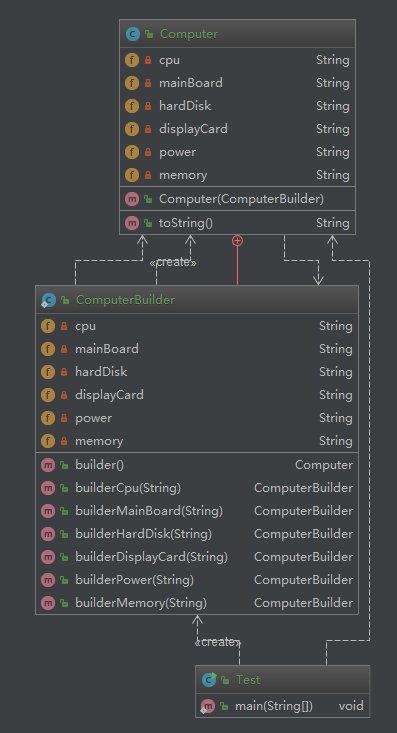

# 建造者模式

> 关联阅读 [李兴华-生成器模式](/chapter/design_pattern/生成器模式.md)

> 强烈建议阅读，不然这一章直接懵逼,这里直接看出来了这个课程就是把李兴华这个简化了讲解的，李兴华这个讲得很不错，很深入，初学者真的很难看懂

**定义**：将一个复制对象的构建与它的表示分离，使得同样的构建过程可以创建不同的表示

* 用户只需指定需要建造的类型就可以得到他们，建造过程及细节不需要知道

**类型**：创建型

## 适用场景

* 如果一个对象有非常复杂的内部结构（很多属性）
* 想把复杂对象的创建和适用分离

## 优缺点

**优点**：

* 封装性好，创建和适用分离
* 扩展性好、建造类之间独立、一定程序上解耦

**缺点**：

* 产生多于的 Builder 对象
* 产品内部发生变化，建造者都要修改，成本比较大

## 建造者与工厂模式区别

建造者模式：
  * 更注重于方法的调用顺序
  * 粒度：创建复杂的产品，由各种复杂的部件组成
工厂模式：
  * 注重于创建产品
  * 粒度：创建的都是一种类型的

## coding

场景：用户找电脑城老板装电脑，实际干活的是员工

```java
// 建造者接口
public abstract class Builder {
    public abstract Computer createComputer();

    public abstract void buildCPU(String cpu);

    public abstract void buildMainBoard(String mainBoard);

    public abstract void buildHardDisk(String hardDisk);

    public abstract void buildDisplayCard(String displayCard);

    public abstract void buildPower(String power);

    public abstract void buildMemory(String memory);
}

// 实际的建造者，可以认为是 员工
public class ActualBuilder extends Builder {
    private Computer computer = new Computer();

    @Override
    public Computer createComputer() {
        return computer;
    }

    @Override
    public void buildCPU(String cpu) {
        computer.setCPU(cpu);
    }

    @Override
    public void buildMainBoard(String mainBoard) {
        computer.setMainBoard(mainBoard);
    }

    @Override
    public void buildHardDisk(String hardDisk) {
        computer.setHardDisk(hardDisk);
    }

    @Override
    public void buildDisplayCard(String displayCard) {
        computer.setDisplayCard(displayCard);
    }

    @Override
    public void buildPower(String power) {
        computer.setPower(power);
    }

    @Override
    public void buildMemory(String memory) {
        computer.setMemory(memory);
    }
}

public class Computer {
    private String CPU;
    private String mainBoard;
    private String hardDisk;
    private String displayCard;
    private String power;
    private String memory;
    ... 省略setter...
}

// 老板
public class DirectorBoss {
    private Builder builder;

    public void setBuilder(Builder builder) {
        this.builder = builder;
    }

    public Computer createComputer(
            String cpu,
            String mainBoard,
            String hardDisk,
            String displayCard,
            String power,
            String memory
    ) {
        // 指挥员工装机，并且按照老板的装机顺序装机
        builder.buildCPU(cpu);
        builder.buildMainBoard(mainBoard);
        builder.buildHardDisk(hardDisk);
        builder.buildDisplayCard(displayCard);
        builder.buildPower(power);
        builder.buildMemory(memory);
        return builder.createComputer();
    }
}

public class Test {
    public static void main(String[] args) {
        DirectorBoss boss = new DirectorBoss();
        boss.setBuilder(new ActualBuilder());
        Computer computer = boss.createComputer(
                "酷睿I7",
                "华硕主板",
                "三星硬盘",
                "七彩虹显卡",
                "金河田电源",
                "万紫千红内存"
        );
        System.out.println(computer);
    }
}
```


应用层代码是不需要知道创建的逻辑的，这里看起来其实就优点繁琐了，实际的业务可能会更繁琐复杂

DirectorBoss 不是必须的，创建的工作是员工（实际创建者）创建的。对于这里的参数也是非常的多。可以使用一个流式构建，抽到创建者中去

```java
package cn.mrcode.newstudy.design.pattern.creational.builder.v2;

/**
 * @author : zhuqiang
 * @version : V1.0
 * @date : 2018/8/30 22:27
 */
public class Computer {
    private String cpu;
    private String mainBoard;
    private String hardDisk;
    private String displayCard;
    private String power;
    private String memory;

    public Computer(ComputerBuilder computerBuilder) {
        this.cpu = computerBuilder.cpu;
        this.mainBoard = computerBuilder.mainBoard;
        this.hardDisk = computerBuilder.hardDisk;
        this.displayCard = computerBuilder.displayCard;
        this.power = computerBuilder.power;
        this.memory = computerBuilder.memory;
    }

    public static class ComputerBuilder {
        private String cpu;
        private String mainBoard;
        private String hardDisk;
        private String displayCard;
        private String power;
        private String memory;

        public Computer builder() {
            return new Computer(this);
        }

        public ComputerBuilder builderCpu(String cpu) {
            this.cpu = cpu;
            return this;
        }

        public ComputerBuilder builderMainBoard(String mainBoard) {
            this.mainBoard = mainBoard;
            return this;
        }

        public ComputerBuilder builderHardDisk(String hardDisk) {
            this.hardDisk = hardDisk;
            return this;
        }

        public ComputerBuilder builderDisplayCard(String displayCard) {
            this.displayCard = displayCard;
            return this;
        }

        public ComputerBuilder builderPower(String power) {
            this.power = power;
            return this;
        }

        public ComputerBuilder builderMemory(String memory) {
            this.memory = memory;
            return this;
        }
    }

    @Override
    public String toString() {
        return "Computer{" +
                "CPU='" + cpu + '\'' +
                ", mainBoard='" + mainBoard + '\'' +
                ", hardDisk='" + hardDisk + '\'' +
                ", displayCard='" + displayCard + '\'' +
                ", power='" + power + '\'' +
                ", memory='" + memory + '\'' +
                '}';
    }
}

public class Test {
    public static void main(String[] args) {
        Computer computer = new Computer.ComputerBuilder()
                .builderCpu("酷睿I7")
                .builderDisplayCard("七彩虹显卡")
                .builder();
        System.out.println(computer);
    }
}
```



可以看到，通过流式构建者进行参数的选择，然后执行构建得到一个计算机
