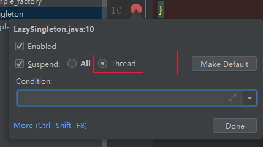
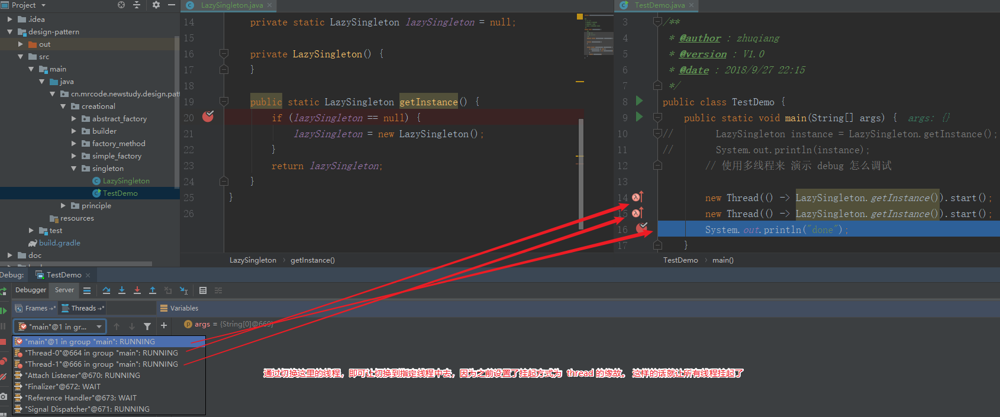
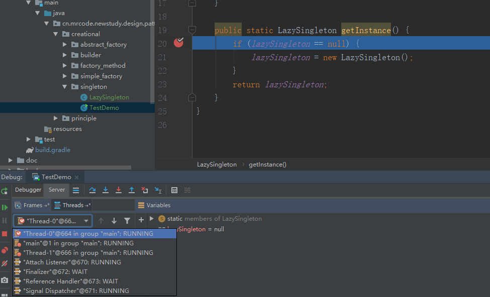
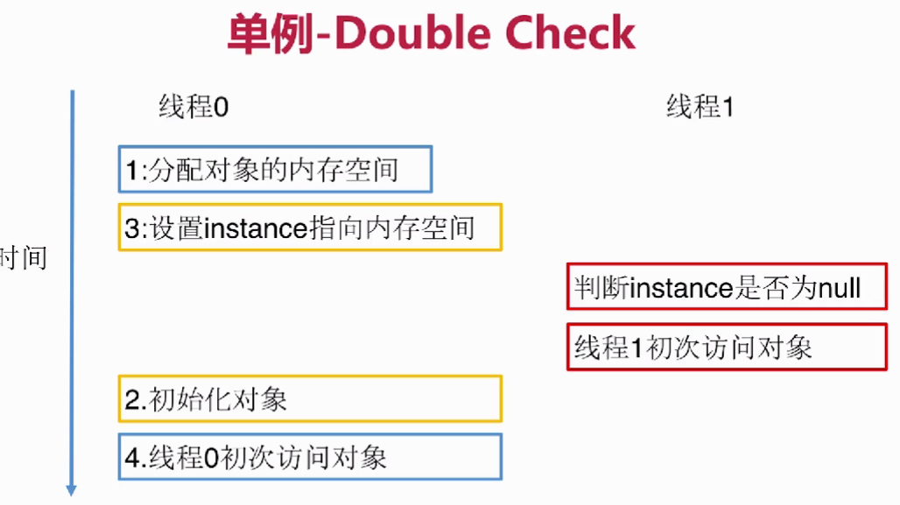
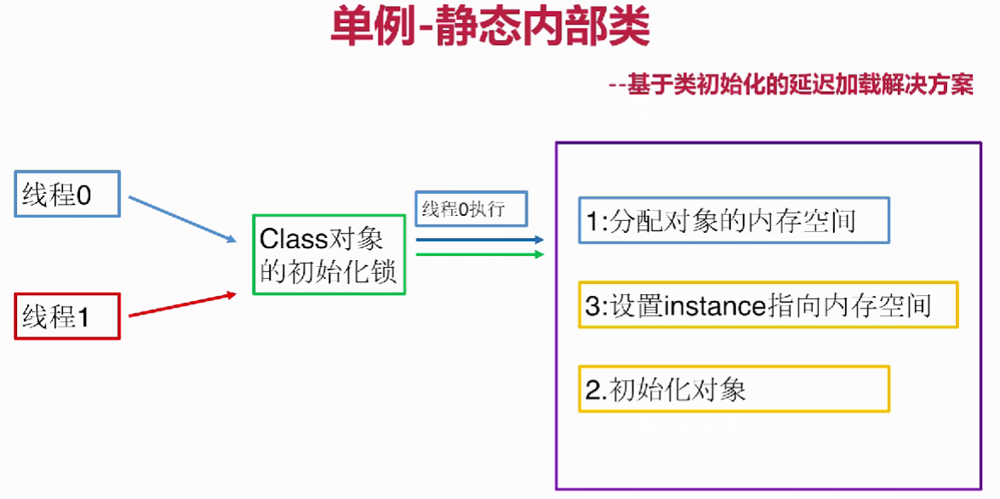

# 单例模式

> 关联阅读 [李兴华-单例模式](/design_pattern/06_singleton/singleton.md)
>
> 这一节的内容李兴华老师的课程就略显干货不足了。

**定义**：保证一个类仅有一个实例，并提供一个全局访问点

**类型**：创建型

## 适用场景

想确保任何情况下都绝对只有一个实例

## 优缺点

**优点**：

* 在内存里只有一个实例，减少了内存开销
* 可以避免对资源的多重占用
* 设置全局访问点，严格控制访问

**缺点**：

* 没有接口，扩展困难

## 重点

* 私有构造器：防止在外部创建对象
* 线程安全
* 延迟加载：使用的时候才创建
* 序列化和反序列化安全
* 反射：防止反射攻击

## 实用技能

* 反编译
* 内存原理
* 多线程 Debug

## 相关的设计模式

* 单例模式和工厂模式
* 单例模式和享元模式

## coding

## 懒汉式单例模式

线程不安全的懒汉式单例模式比较简单，两个要点：

1. 私有构造
2. 内部持有一个实例，在访问的时候再初始化

```java
cn.mrcode.newstudy.design.pattern.creational.singleton.LazySingleton
public class LazySingleton {

    private static LazySingleton lazySingleton = null;

    private LazySingleton() {
    }

    public static LazySingleton getInstance() {
        if (lazySingleton == null) {
            lazySingleton = new LazySingleton();
        }
        return lazySingleton;
    }
}
```

```java
public class TestDemo {
    public static void main(String[] args) {
//        LazySingleton instance = LazySingleton.getInstance();
//        System.out.println(instance);
        // 使用多线程来 演示 debug 怎么调试

        new Thread(() -> LazySingleton.getInstance()).start();
        new Thread(() -> LazySingleton.getInstance()).start();
        System.out.println("done");
    }
}
```

## 多线程 debug 教程


先打上断点，然后在断点上右键，即可出现上图中的内容；选择 thread 方式，并设置为默认



看上图，因为现在在 main 线程中，使用 debug 停留了。

切换到 线程0 中，可以看到一直阻塞在这里的。这样一来多线程调试就更方便了




## 懒汉式 - synchronized

保证线程安全最简单的就是加 synchronized 关键字；

```java
public synchronized static LazySingleton getInstance() {
    if (lazySingleton == null) {
        lazySingleton = new LazySingleton();
    }
    return lazySingleton;
}
```

但是这样会有一个问题，就是每个线程获取都会被阻塞。如果在一个很繁忙的系统中，这里的性能就大大降低了。

可以使用双重检查来优化这个地方，实际上就是减少锁的粒度

```java
public class LazyDoubleCheckSingleton {
    private static LazyDoubleCheckSingleton lazyDoubleCheckSingleton = null;

    private LazyDoubleCheckSingleton() {
    }

    public static LazyDoubleCheckSingleton getInstance() {
        // 第一层不加锁，有值则返回
        if (lazyDoubleCheckSingleton == null) {
            // 假设有2个线程进入到这里在等待了
            synchronized (LazyDoubleCheckSingleton.class) {
                // 那么当第一个线程创建之后，其实是有值的了
                // 所以这里还需要判定一下，有值则不创建了
                // 所以这里是双重判定
                if (lazyDoubleCheckSingleton == null) {
                    lazyDoubleCheckSingleton = new LazyDoubleCheckSingleton();
                    // 这里有一个内存可见性的问题
                    // 上面这一句话其实分为三步
                    // 1. 分配内存给这个对象
                    // 2. 初始化对象
                    // 3. 设置 lazyDoubleCheckSingleton 指向刚分配的内存
                }
            }
        }
        return lazyDoubleCheckSingleton;
    }
}
```

对于这个内存可见性的问题。步骤 2 和步骤 3 可能被重排序。在多线程情况下，如果被重排序了

那么在第一层判断的时候就会判断有值，但是实际上对象还未被初始化。

？：我怎么记忆中是这里初始化了，因为内存可见性，其他线程会认为看不到已经改变

也就是下图中描述的情况；




要解决这个问题：
1. volatile 变量：

  对于一个 volatile 域的写，happens-before 于任意后续对这个 volatile 的读
  但是，不保证写是原子的；
  所以：这里使用 volatile 只是保证一个线程的写对另一个线程可见，加上 synchronized 保证写操作是原子的。在 synchronized 域中可重排序。但是在释放锁的时候，保证结果正确

2. 禁止重排序：使用内部类，让 jvm 来保证两个操作直接的禁止重排

保证 lazyDoubleCheckSingleton 的可见性；给该变量加上 volatile 关键字即可；

volatile ：会让其他 cpu 中缓存的数据失效，读取主存中的数据。即可保证内存对其他线程课件

## 懒汉式 - 内部类

```java
public class StaticInnerClassSingleton {
    private static class InnerClass {
        private static StaticInnerClassSingleton instance = new StaticInnerClassSingleton();
    }

    public static StaticInnerClassSingleton getInstance() {
        return InnerClass.instance;
    }
}
```

静态内部类很简单。下面代码来测试是否是延迟的情况

```java
public class StaticInnerClassSingleton {
    {
        System.out.println("单例类初始化");
    }

    private static class InnerClass {
        static {
            System.out.println("内部类初始化");
        }

        private static StaticInnerClassSingleton instance = new StaticInnerClassSingleton();
    }

    public static void print() {
        System.out.println("测试是否是延迟初始化的");
    }

    public static StaticInnerClassSingleton getInstance() {
        return InnerClass.instance;
    }
}
```

执行测试代码
```java
  StaticInnerClassSingleton instance = StaticInnerClassSingleton.getInstance();

  输出：

  内部类初始化
  单例类初始化
```

执行测试代码

```java
StaticInnerClassSingleton.print();

输出

测试是否是延迟初始化的
```

可以看到，只有在使用该实例的时候，才会被初始化，而这个初始化时 jvm 保证线程安全性的；

原理是：



在类初始化的时候 jvm 会获取一个初始化锁，保证多个线程对同一个对象的初始化安全问题

这里有一个遗留问题：上面的代码中。没有对单例类私有构造。一定要加深认识


## 饿汉式

```java
public class HungrySingleton {
    private final static HungrySingleton hungrySingleton = new HungrySingleton();

    private HungrySingleton() {
    }

    public static HungrySingleton getInstance() {
        return hungrySingleton;
    }
}
```

在类加载的时候完成赋值；

在之前差不多把单例模式修补得比较完善了，现在来破坏单例模式。

## 破坏单例模式

使用序列化，再反序列化，那么这个对象还是之前的那个对象吗？

```java
@Test
public void test() throws IOException, ClassNotFoundException {
    HungrySingleton instance = HungrySingleton.getInstance();


    // 序列化到文件
    ObjectOutputStream oos = new ObjectOutputStream(new FileOutputStream("HungrySingleton"));
    oos.writeObject(instance);

    // 从文件读取出来

    ObjectInputStream ois = new ObjectInputStream(new FileInputStream("HungrySingleton"));
    HungrySingleton instanceFromFile = (HungrySingleton) ois.readObject();

    System.out.println(instance);
    System.out.println(instanceFromFile);
    System.out.println(instance == instanceFromFile);
}
```

输出

```java
cn.mrcode.newstudy.design.pattern.creational.singleton.HungrySingleton@7494e528
cn.mrcode.newstudy.design.pattern.creational.singleton.HungrySingleton@7d0587f1
false
```

那么怎么破解这个问题呢？很简单在单例类中增加一个方法

```java
private Object readResolve() {
    return hungrySingleton;
}
```

原理是什么呢？这个要看源码

```java
java.io.ObjectInputStream#readObject
java.io.ObjectInputStream#readObject0

case TC_OBJECT:
    return checkResolve(readOrdinaryObject(unshared));

找到这一行。继续跟踪

private Object readOrdinaryObject(boolean unshared)
      throws IOException
  {
      if (bin.readByte() != TC_OBJECT) {
          throw new InternalError();
      }

      ObjectStreamClass desc = readClassDesc(false);
      desc.checkDeserialize();

      Class<?> cl = desc.forClass();
      if (cl == String.class || cl == Class.class
              || cl == ObjectStreamClass.class) {
          throw new InvalidClassException("invalid class descriptor");
      }

      Object obj;
      try {
          // 首先先通过反射创建实例
          // 当实现了 serializable/externalizable 接口的时候，则返回 true
          obj = desc.isInstantiable() ? desc.newInstance() : null;
      } catch (Exception ex) {
          throw (IOException) new InvalidClassException(
              desc.forClass().getName(),
              "unable to create instance").initCause(ex);
      }

      passHandle = handles.assign(unshared ? unsharedMarker : obj);
      ClassNotFoundException resolveEx = desc.getResolveException();
      if (resolveEx != null) {
          handles.markException(passHandle, resolveEx);
      }

      if (desc.isExternalizable()) {
          readExternalData((Externalizable) obj, desc);
      } else {
          readSerialData(obj, desc);
      }

      handles.finish(passHandle);

      // 这里再判定 是否有读解析方法
      if (obj != null &&
          handles.lookupException(passHandle) == null &&
          desc.hasReadResolveMethod())
      {
          Object rep = desc.invokeReadResolve(obj);
          if (unshared && rep.getClass().isArray()) {
              rep = cloneArray(rep);
          }
          if (rep != obj) {
              handles.setObject(passHandle, obj = rep);
          }
      }

      return obj;
  }

  // 这里判定这个方法是否存在
  // 也就是说，如果你中的类中定义了 readResolve 方法，那么将会调用该方法
  // 也就是不允许外部实例化
  // 这里一定要看注释，英文的也要认证翻译看。不然光看这个代码，是看不出来什么的
  boolean hasReadResolveMethod() {
      return (readResolveMethod != null);
  }
  /** class-defined readResolve method, or null if none */
  private Method readResolveMethod;

  // 可以搜索下这个变量在哪里赋值的,这里就可以看到了，定义了这么一个字符串，去查找这个方法
  readResolveMethod = getInheritableMethod(
                        cl, "readResolve", null, Object.class);
```

## 反射攻击解决方案及原理分析

### 类加载就初始化的单例模式

针对恶汉单例模式来测试，使用反射和正常获取实例的对比是否是同一个实例。
```java
@Test
public void test2() throws NoSuchMethodException, IllegalAccessException, InvocationTargetException, InstantiationException {
    Class<HungrySingleton> objectClass = HungrySingleton.class;
    Constructor<HungrySingleton> constructor = objectClass.getDeclaredConstructor();
    HungrySingleton instance = HungrySingleton.getInstance();
    // java.lang.IllegalAccessException: Class cn.mrcode.newstudy.design.pattern.creational.singleton.HungrySingletonTest can not access a member of class cn.mrcode.newstudy.design.pattern.creational.singleton.HungrySingleton with modifiers "private"
    // 解决私有构造不能访问的限制
    constructor.setAccessible(true);
    HungrySingleton objectInstance = constructor.newInstance();


    System.out.println(instance);
    System.out.println(objectInstance);
    System.out.println(instance == objectInstance);
}
```
结果很明显，不是同一个。原因：

1. final static 修饰的是在**类加载**的时候完成的初始化
2. 这里反射是调用空参构造

所以这里出来的不是同一个对象。那么这里的防御攻击就很简单了。

```java
// 在私有构造中判定一下即可
private HungrySingleton() {
      if (hungrySingleton != null) {
          throw new IllegalStateException("单例模式不允许使用反射创建");
      }
}
```

### 懒汉式防御解析
首先，结论是，懒汉式没有办法防御反射攻击。原因：使用的时候才会初始化，没有办法保证只初始化一次。
```java
public class LazySingleton {
    private static LazySingleton lazySingleton = null;

    private LazySingleton() {

    }

    public synchronized static LazySingleton getInstance() {
        if (lazySingleton == null) {
            lazySingleton = new LazySingleton();
        }
        return lazySingleton;
    }
}
```

这里使用前面恶汉式的方式来演示之后就明白了。

```java
private LazySingleton() {
    if (lazySingleton != null) {
        throw new IllegalStateException("单例模式不允许使用反射创建");
    }
}
```
测试代码

```java
@Test
public void test4() throws NoSuchMethodException, IllegalAccessException, InvocationTargetException, InstantiationException {
    LazySingleton instance = LazySingleton.getInstance();
    System.out.println(instance);

    Class<LazySingleton> lazySingletonClass = LazySingleton.class;
    Constructor<LazySingleton> declaredConstructor = lazySingletonClass.getDeclaredConstructor();
    declaredConstructor.setAccessible(true);
    LazySingleton lazySingleton = declaredConstructor.newInstance();
    System.out.println(lazySingleton);
    System.out.println(instance == lazySingleton);
}
```

现在这个测试代码是可以防御到的，因为先运行了 LazySingleton.getInstance()，
但是吧他们的顺序改变下，就不能防御了，或者是在多线程程序中也是不能防御的。

问题根源就在于：如果先用反射创建，那么变量没有赋值。

所以这里可以增加一个状态，来记录是否可以创建对象。当然这里只能限制只被执行一次

```java
private static boolean flag = true;

private LazySingleton() {
    if (flag) {
        // 构造只能被调用一次
        flag = false;
    } else {
        throw new IllegalStateException("单例模式不允许使用反射创建");
    }
}
```
测试代码可以使用上一次的，这里演示为什么说添加变量的方式也没有办法阻止。
因为变量也是成员，也可以通过反射的方式修改。下面演示

```java
@Test
 public void test5() throws NoSuchMethodException, IllegalAccessException, InvocationTargetException, InstantiationException, NoSuchFieldException {
     LazySingleton instance = LazySingleton.getInstance();
     System.out.println(instance);

     Class<LazySingleton> lazySingletonClass = LazySingleton.class;

     // 只是增加了这一段代码，把标志变量修改了
     Field flag = lazySingletonClass.getDeclaredField("flag");
     flag.setAccessible(true);
     flag.set(instance, true);

     Constructor<LazySingleton> declaredConstructor = lazySingletonClass.getDeclaredConstructor();
     declaredConstructor.setAccessible(true);
     LazySingleton lazySingleton = declaredConstructor.newInstance();
     System.out.println(lazySingleton);
     System.out.println(instance == lazySingleton);
 }
```

通过实验得知：懒汉式的无法防止反射攻击。因为它不是类加载的时候被初始化，无法保证初始化顺序

## 枚举单例模式

```java
public enum EnumInstance {
    INSTANCE;

    private Object data;


    public static EnumInstance getInstance() {
        return INSTANCE;
    }

    public Object getData() {
        return data;
    }

    public void setData(Object data) {
        this.data = data;
    }
}
```
### 枚举单例模式序列化攻击测试

```java
@Test
public void test6() throws IOException, ClassNotFoundException {
    EnumInstance instance = EnumInstance.getInstance();
    instance.setData(new Date());

    // 序列化到文件
    ObjectOutputStream oos = new ObjectOutputStream(new FileOutputStream("EnumInstance"));
    oos.writeObject(instance);

    // 从文件读取出来

    ObjectInputStream ois = new ObjectInputStream(new FileInputStream("EnumInstance"));
    EnumInstance instanceFromFile = (EnumInstance) ois.readObject();

    System.out.println(instance);
    System.out.println(instanceFromFile);
    System.out.println(instance == instanceFromFile);
    System.out.println("===== 查看实例里面的 变量是否是同一个");
    System.out.println(instance.getData());
    System.out.println(instanceFromFile.getData());
    System.out.println(instance.getData() == instanceFromFile.getData());
}
```
这个是为什么呢? 源码会告诉我们答案

```java
java.io.ObjectInputStream#readObject  入口

找到读取枚举的地方
case TC_ENUM:
      return checkResolve(readEnum(unshared));

java.io.ObjectInputStream#readEnum

Enum<?> result = null;
  Class<?> cl = desc.forClass();
  if (cl != null) {
      try {
          @SuppressWarnings("unchecked")
          // 直接通过名称和class获取的
          Enum<?> en = Enum.valueOf((Class)cl, name);
          result = en;
      } catch (IllegalArgumentException ex) {
          throw (IOException) new InvalidObjectException(
              "enum constant " + name + " does not exist in " +
              cl).initCause(ex);
      }
      if (!unshared) {
          handles.setObject(enumHandle, result);
      }
  }
```

### 枚举反射攻击测试

```java
// 枚举反射攻击
  @Test
  public void test7() throws NoSuchMethodException, IllegalAccessException, InvocationTargetException, InstantiationException {
      EnumInstance instance = EnumInstance.getInstance();
      System.out.println(instance);

      Class<EnumInstance> enumInstanceClass = EnumInstance.class;

      Constructor<EnumInstance> declaredConstructor = enumInstanceClass.getDeclaredConstructor();
      declaredConstructor.setAccessible(true);
      EnumInstance enumInstance = declaredConstructor.newInstance();
      System.out.println(enumInstance);
      System.out.println(instance == enumInstance);
  }
```

运行发现,找不到无参构造，这是怎么回事呢？

```java
java.lang.NoSuchMethodException: cn.mrcode.newstudy.design.pattern.creational.singleton.EnumInstance.<init>()

	at java.lang.Class.getConstructor0(Class.java:3082)
	at java.lang.Class.getDeclaredConstructor(Class.java:2178)
	at cn.mrcode.newstudy.design.pattern.creational.singleton.SingletonTest.test7(SingletonTest.java:135)
```
## 反编译 - jad 查看 class 文件
需要看下编译后的 class 文件，idea 自带的可以查看，但是我发现并没有编译后的任何迹象，不知道是为什么。

那么使用 http://jd.benow.ca/ （jd-gui) 来查看编译后的 class 文件。会发现和 idea 中查看到的文件内容一模一样

https://varaneckas.com/jad/ 使用该 jad ，是一个命令行工具。Windows 版本解压后，就是一个 jad.exe ，配置好环境变量。找到 idea 生成的 class 文件。运行以下命令

```java
jad EnumInstance.class

就会生成 EnumInstance.jad 文件。使用记事本等文本编辑器打开即可查看
在 Windows10 中配置了环境变量，暂时未生效，只能暂时进入该软件的目录中运行了
```
生成的文件内容如下

```java
// Decompiled by Jad v1.5.8g. Copyright 2001 Pavel Kouznetsov.
// Jad home page: http://www.kpdus.com/jad.html
// Decompiler options: packimports(3)
// Source File Name:   EnumInstance.java

package cn.mrcode.newstudy.design.pattern.creational.singleton;


public final class EnumInstance extends Enum
{

    public static EnumInstance[] values()
    {
        return (EnumInstance[])$VALUES.clone();
    }

    public static EnumInstance valueOf(String name)
    {
        return (EnumInstance)Enum.valueOf(cn/mrcode/newstudy/design/pattern/creational/singleton/EnumInstance, name);
    }

    private EnumInstance(String s, int i)
    {
        super(s, i);
    }

    public static EnumInstance getInstance()
    {
        return INSTANCE;
    }

    public Object getData()
    {
        return data;
    }

    public void setData(Object data)
    {
        this.data = data;
    }

    public static final EnumInstance INSTANCE;
    private Object data;
    private static final EnumInstance $VALUES[];

    static
    {
        INSTANCE = new EnumInstance("INSTANCE", 0);
        $VALUES = (new EnumInstance[] {
            INSTANCE
        });
    }
}

```

通过以上内容可以总结出：

1. INSTANCE 变量是  static final 修饰的
2. `private EnumInstance(String s, int i)` 私有化的参数构造方法
3. 使用静态代码块来构造枚举对象实例

这里就真相了，反射的时候使用无参构造，报错找不到方法。

## 枚举单例模式续
那么这里使用有参的继续下去；

```java
@Test
public void test7() throws NoSuchMethodException, IllegalAccessException, InvocationTargetException, InstantiationException {
    EnumInstance instance = EnumInstance.getInstance();
    System.out.println(instance);

    Class<EnumInstance> enumInstanceClass = EnumInstance.class;

    Constructor<EnumInstance> declaredConstructor = enumInstanceClass.getDeclaredConstructor(String.class,int.class);
    declaredConstructor.setAccessible(true);
    // 这里还是根据 jad 里面的内容来传参数
    EnumInstance enumInstance = declaredConstructor.newInstance("INSTANCE", 0);
    System.out.println(enumInstance);
    System.out.println(instance == enumInstance);
}
```
结果发现还是不行,报错信息明确的说明了 不能通过反射创建枚举对象
```java
java.lang.IllegalArgumentException: Cannot reflectively create enum objects

	at java.lang.reflect.Constructor.newInstance(Constructor.java:416)
  at cn.mrcode.newstudy.design.pattern.creational.singleton.SingletonTest.test7(SingletonTest.java:137)
```

跟源码

```java
public T newInstance(Object ... initargs)
       throws InstantiationException, IllegalAccessException,
              IllegalArgumentException, InvocationTargetException
   {
       if (!override) {
           if (!Reflection.quickCheckMemberAccess(clazz, modifiers)) {
               Class<?> caller = Reflection.getCallerClass();
               checkAccess(caller, clazz, null, modifiers);
           }
       }
       // 进行了检查，枚举类型直接异常了
       if ((clazz.getModifiers() & Modifier.ENUM) != 0)
           throw new IllegalArgumentException("Cannot reflectively create enum objects");
```

### 枚举类小结

1. INSTANCE 变量是  static final 修饰的
2. `private EnumInstance(String s, int i)` 私有化的参数构造方法
3. 使用静态代码块来构造枚举对象实例
4. 序列化和反序列化是由序列化相关的类保证的
5. 反射攻击是由反射相关类保证的，而它自己不保证这些

> 由于本文篇幅很大了，下一章节继续
