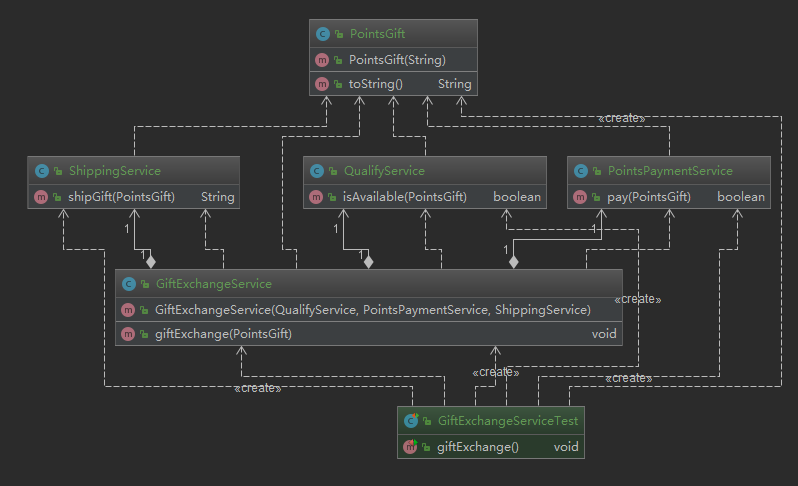

# 外观模式

**定义**：又叫门面模式，提供了一个统一的接口，用来访问子系统中的一群接口

**特点**：定义了一个高层接口，让子系统更容易使用

**类型**：结构型

## 适用场景

- 子系统越来越复杂，增加外观模式提供简单调用接口
- 构建多层系统接口，利用外观对象作为每层的入口，简化层间调用

## 优点

- 简化了调用过程，无需了解深入子系统，防止带来风险
- 减少系统以来、松散耦合
- 更好的划分访问层次
- 符合迪米特法则，即最少知道原则

## 缺点

- 增加子系统、扩展子系统行为容易引起风险
- 不符合开闭原则

## 相关设计模式

- 中介则模式
  - 中介则模式：关注的是子系统内部之间的交互
  - 外观模式：关注的是外界和子系统的交互

- 单例模式：通常可以吧外观对象做成单例使用

- 抽象工程：外观类可以通过工厂类获取子系统的实例


## 代码
假设一个场景：慕课网的积分兑换，那么可能的子系统有：

1. 库存校验系统
2. 积分支付系统
3. 物流系统

```java
/**
 * 积分礼物
 *
 * @author : zhuqiang
 * @date : 2018/12/24 9:47
 */
public class PointsGift {
    private String name;

    public PointsGift(String name) {
        this.name = name;
    }

    @Override
    public String toString() {
        return "PointsGift{" +
                "name='" + name + '\'' +
                '}';
    }
}
```

```java
/**
 * 资格校验：积分校验，库存校验
 *
 * @author : zhuqiang
 * @date : 2018/12/24 9:49
 */
public class QualifyService {
    public boolean isAvailable(PointsGift pointsGift) {
        System.out.println("校验" + pointsGift + " 积分通过，库存通过");
        return true;
    }
}
```

```java
/**
 * 积分支付服务
 *
 * @author : zhuqiang
 * @date : 2018/12/24 9:48
 */
public class PointsPaymentService {
    public boolean pay(PointsGift pointsGift) {
        System.out.println(pointsGift + " 支付扣减积分成功");
        return true;
    }
}
```

```java
/**
 * 物流服务
 *
 * @author : zhuqiang
 * @date : 2018/12/24 9:52
 */
public class ShippingService {
    public String shipGift(PointsGift pointsGift) {
        // 物流系统对接逻辑
        System.out.println(pointsGift + " 进入物流系统");
        String shippingOrderNo = "6666";
        return shippingOrderNo;
    }
}
```

三个子系统服务，外部如果要使用，必须知道流程，这个时候就可以封装一个外观服务；
一个积分礼物兑换的服务暴露，这也符合迪米特法则，即最少知道原则；
```java
/**
 * 外观模式服务
 *
 * @author : zhuqiang
 * @date : 2018/12/24 10:00
 */
public class GiftExchangeService {
    private QualifyService qualifyService;
    private PointsPaymentService pointsPaymentService;
    private ShippingService shippingService;

    public GiftExchangeService(QualifyService qualifyService, PointsPaymentService pointsPaymentService, ShippingService shippingService) {
        this.qualifyService = qualifyService;
        this.pointsPaymentService = pointsPaymentService;
        this.shippingService = shippingService;
    }

    /**
     * 礼物兑换
     */
    public void giftExchange(PointsGift pointsGift) {
        if (qualifyService.isAvailable(pointsGift)
                && pointsPaymentService.pay(pointsGift)) {
            String shippingOrderNo = shippingService.shipGift(pointsGift);
            System.out.println(pointsGift + " 返回的订单号 " + shippingOrderNo);
        }
    }
}
```


可以看到外观服务组合了三个子系统（菱形）

测试代码

```java
@Test
 public void giftExchange() {
     GiftExchangeService giftExchangeService = new GiftExchangeService(new QualifyService(), new PointsPaymentService(), new ShippingService());
     giftExchangeService.giftExchange(new PointsGift("iphone8"));
 }

=====================
校验PointsGift{name='iphone8'} 积分通过，库存通过
PointsGift{name='iphone8'} 支付扣减积分成功
PointsGift{name='iphone8'} 进入物流系统
PointsGift{name='iphone8'} 返回的订单号 6666
```



如果上图，客户端其实是不需要创建子系统的，在这里不是分布式的服务所以能看到客户端创建了子系统；
抛开这个因素，可以看到，客户端只和外观类交互了；

来模拟下上面所说的，让外观类去创建子系统服务，就如下图了，下图才是外观类使用的一个标准类图：
客户端只和外观类交互


对于不经常变化的来说，直接使用实体外观类，如果对于经常变化的，就需要使用抽象外观类了

## 外观模式源码解析
springjdbc+myabtis+tomcat

org.springframework.jdbc.support.JdbcUtils

```java
public static void closeConnection(@Nullable Connection con) {
  if (con != null) {
    try {
      con.close();
    }
    catch (SQLException ex) {
      logger.debug("Could not close JDBC Connection", ex);
    }
    catch (Throwable ex) {
      // We don't trust the JDBC driver: It might throw RuntimeException or Error.
      logger.debug("Unexpected exception on closing JDBC Connection", ex);
    }
  }
}
```
该类的方法基本上都是对 java.sql 的外观封装，如上面关闭连接

org.apache.ibatis.session.Configuration

该类中 newXX 的方法就是外观方法
```java
public ParameterHandler newParameterHandler(MappedStatement mappedStatement, Object parameterObject, BoundSql boundSql) {
  ParameterHandler parameterHandler = mappedStatement.getLang().createParameterHandler(mappedStatement, parameterObject, boundSql);
  parameterHandler = (ParameterHandler) interceptorChain.pluginAll(parameterHandler);
  return parameterHandler;
}
```

### tomcat
> [源码下载](https://tomcat.apache.org/download-90.cgi) 强选择该页面下的 Source Code Distributions 部分中的 zip。解压之后导入 IDEA 查看。

org.apache.catalina.connector.Request
org.apache.catalina.connector.RequestFacade

Request 是 javax.servlet.http.HttpServletRequest 的实现；
RequestFacade 是对 Request 的一个外观类，在外部获取 getRequest 的时候，返回的就是这个外观类

```java
/**
 * The facade associated with this request.
 */
protected RequestFacade facade = null;


/**
 * @return the <code>ServletRequest</code> for which this object
 * is the facade.  This method must be implemented by a subclass.
 */
public HttpServletRequest getRequest() {
    if (facade == null) {
        facade = new RequestFacade(this);
    }
    if (applicationRequest == null) {
        applicationRequest = facade;
    }
    return applicationRequest;
}
```

比较下 外观类 和具体类的方法实现
```java
org.apache.catalina.connector.Request#getAttribute
@Override
public Object getAttribute(String name) {
    // Special attributes
    SpecialAttributeAdapter adapter = specialAttributes.get(name);
    if (adapter != null) {
        return adapter.get(this, name);
    }

    Object attr = attributes.get(name);

    if (attr != null) {
        return attr;
    }

    attr = coyoteRequest.getAttribute(name);
    if (attr != null) {
        return attr;
    }
    ..... 省略很多代码
```

```java
org.apache.catalina.connector.RequestFacade#getAttribute
@Override
public Object getAttribute(String name) {

    if (request == null) {
        throw new IllegalStateException(
                        sm.getString("requestFacade.nullRequest"));
    }

    return request.getAttribute(name);
}
```

在 TOMCAT 源码中大量的使用了外观模式
