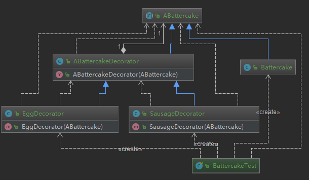
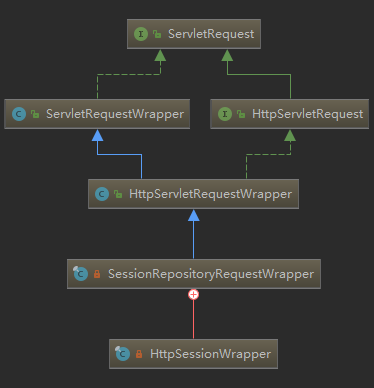

# 装饰者模式

**定义**：在不改变原有对象的基础之上，将功能附加到对象上

  提供了比继承更有弹性的替代方案（扩展原有对象功能）

**类型**：结构型

生活中的例子：房子装修，礼品包装盒等

## 适用场景

- 扩展一个类的功能或给一个雷添加附加职责
- 动态的给一个对象添加功能，这些功能可以再动态的撤销

## 优点

- 继承的有力补充，比继承灵活，不改变原有对象的情况下给一个对象扩展功能

  继承是写死的，而装饰可以根据使用者自行组合。
- 通过使用不同装饰类以及这些装饰类的排列组合，可以实现不同效果
- 符合开闭原则

## 缺点

- 会出现更多的代码，更多的类，增加程序复杂性
- 动态装饰时，多层装饰时会更复查

## 相关设计模式

- 代理模式：关注于控制对对象的访问
- 适配器模式：适配器和被适配的类具有不同的接口，有部分是可能重合的。

## 代码
场景代入：吃早餐，买煎饼，加烤肠、鸡蛋 价格计算是如何的？

### 不适用模式
```java
/**
 * 煎饼
 *
 * @author : zhuqiang
 * @date : 2018/12/24 15:39
 */
public class Battercake {
    protected String getDesc() {
        return "煎饼";
    }

    /** 费用 */
    protected int getCost() {
        return 8;
    }
}
```

```java
/**
 * 加鸡蛋的煎饼
 *
 * @author : zhuqiang
 * @date : 2018/12/24 15:41
 */
public class BattercakeWithEgg extends Battercake {
    @Override
    protected String getDesc() {
        return super.getDesc() + " 加一个鸡蛋";
    }

    @Override
    protected int getCost() {
        return super.getCost() + 1;
    }
}
```

```java
/**
 * 加鸡蛋和香肠的煎饼
 *
 * @author : zhuqiang
 * @date : 2018/12/24 15:43
 */
public class BattercakeWithEggSausage extends BattercakeWithEgg {
    @Override
    protected String getDesc() {
        return super.getDesc() + " 加一根香肠";
    }

    @Override
    protected int getCost() {
        return super.getCost() + 2;
    }
}
```

测试

```java
@Test
public void fun1() {
    Battercake battercake = new Battercake();
    System.out.println(battercake.getDesc() + " 花费 " + battercake.getCost());

    BattercakeWithEgg battercakeWithEgg = new BattercakeWithEgg();
    System.out.println(battercakeWithEgg.getDesc() + " 花费 " + battercakeWithEgg.getCost());

    BattercakeWithEggSausage battercakeWithEggSausage = new BattercakeWithEggSausage();
    System.out.println(battercakeWithEggSausage.getDesc() + " 花费 " + battercakeWithEggSausage.getCost());
}

=========================

煎饼 花费 8
煎饼 加一个鸡蛋 花费 9
煎饼 加一个鸡蛋 加一根香肠 花费 11
```

这几个顾客的购买需求都能满足，如果有一个顾客需要加 2 个鸡蛋的呢？这就没有办法了

### 使用模式的代码

```java
/**
 * 被装饰者抽象类 - 煎饼
 *
 * @author : zhuqiang
 * @date : 2018/12/24 15:49
 */
public abstract class ABattercake {
    protected abstract String getDesc();

    /**
     * 费用
     */
    protected abstract int getCost();
}
/**
 * 煎饼
 *
 * @author : zhuqiang
 * @date : 2018/12/24 15:39
 */
public class Battercake extends ABattercake {
    @Override
    protected String getDesc() {
        return "煎饼";
    }

    @Override
    protected int getCost() {
        return 8;
    }
}
```

```java
/**
 * 装饰者抽象类
 *
 * @author : zhuqiang
 * @date : 2018/12/24 15:51
 */
public class ABattercakeDecorator extends ABattercake {
    protected ABattercake battercake;

    // 通过构造传入一个抽象煎饼,这样 装饰者和被装饰者就建立起了联系
    public ABattercakeDecorator(ABattercake battercake) {
        this.battercake = battercake;
    }

    @Override
    protected String getDesc() {
        return this.battercake.getDesc();
    }

    @Override
    protected int getCost() {
        return this.battercake.getCost();
    }
}
/**
 * 加鸡蛋的装饰器
 *
 * @author : zhuqiang
 * @date : 2018/12/24 15:56
 */
public class EggDecorator extends ABattercakeDecorator {
    public EggDecorator(ABattercake battercake) {
        super(battercake);
    }

    @Override
    protected String getDesc() {
        return super.getDesc() + " 加一个鸡蛋";
    }

    @Override
    protected int getCost() {
        return super.getCost() + 1;
    }
}
/**
 * 加香肠的装饰器
 *
 * @author : zhuqiang
 * @date : 2018/12/24 15:57
 */
public class SausageDecorator extends ABattercakeDecorator {
    public SausageDecorator(ABattercake battercake) {
        super(battercake);
    }

    @Override
    protected String getDesc() {
        return super.getDesc() + " 加一根香肠";
    }

    @Override
    protected int getCost() {
        return super.getCost() + 2;
    }
}
```

测试

```java
@Test
   public void fun2() {
       ABattercake battercake;
       battercake = new Battercake(); // 一个标准煎饼
       battercake = new EggDecorator(battercake); // 加一个鸡蛋的
       battercake = new EggDecorator(battercake); // 再加一个鸡蛋的
       battercake = new SausageDecorator(battercake); // 在加一根香肠的
       System.out.println(battercake.getDesc() + " 花费 " + battercake.getCost());
   }

=====================

煎饼 加一个鸡蛋 加一个鸡蛋 加一根香肠 花费 12
```

可以看出来这个结构，装饰器也是被装饰者类型，但是它是持有被装饰者，
这样就可以无限装饰。



对于这里的抽象装饰类来说，没有抽象相关的成员也能完成功能，那么这里的抽象装饰类存在的意义不太大。

一般在有额外的功能的时候需要具体的装饰者实现的时候意义才大，这个就要取决于使用场景和需求了，比如，在制作烤肠煎饼的时候，需要额外的动作功能等。

## 源码解析
spring-session mybatis jdk servlet

java.io.BufferedReader

```java
// 继承 Reader
public class BufferedReader extends Reader {
    // 持有 Reader
    private Reader in;

    // 通过构造传入
    public BufferedReader(Reader in, int sz) {
      super(in);  

```

org.springframework.cache.transaction.TransactionAwareCacheDecorator

```java
//实现 Cache ,并持有(组合) Cache
public class TransactionAwareCacheDecorator implements Cache {

	private final Cache targetCache;
  public TransactionAwareCacheDecorator(Cache targetCache) {
  Assert.notNull(targetCache, "Target Cache must not be null");
    this.targetCache = targetCache;
  }
```

javax.servlet.ServletRequestWrapper
```java
// 基本上都是如此，实现/继承被装饰者，并持有它
public class ServletRequestWrapper implements ServletRequest {

    private ServletRequest request;
    public ServletRequestWrapper(ServletRequest request) {
        if (request == null) {
            throw new IllegalArgumentException("Request cannot be null");   
        }
        this.request = request;
    }
```

org.springframework.session.web.http.SessionRepositoryFilter.SessionRepositoryRequestWrapper

也是，看下面的类图



适配器模式和装饰者模式有时候也统称包装模式

org.apache.ibatis.cache.decorators
该包下面的都是装饰器，对缓存接口 org.apache.ibatis.cache.Cache 的装饰；

比如：org.apache.ibatis.cache.decorators.FifoCache 先进先出

```java
public class FifoCache implements Cache {
  // 被装饰者，也是委派对象
  private final Cache delegate;
  private Deque<Object> keyList;
  private int size;

  public FifoCache(Cache delegate) {
    this.delegate = delegate;
    this.keyList = new LinkedList<Object>();
    this.size = 1024;
  }
```

