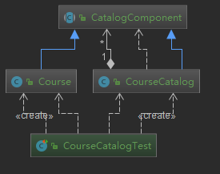
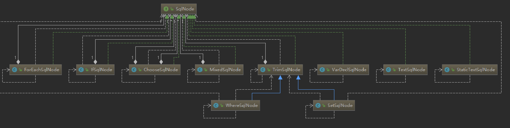

# 组合模式

**定义**：将对象组合成树形结构以表示“部分-整体”的层次结构

组合模式使客户端对单个对象和组合对象保持一致的方式处理

**类型**：结构型


## 适用场景

- 希望客户端可以忽略对象与单个对象的差异时
- 处理一个树形结构时

## 优点

- 清楚地分层次的复杂对象，表示对象的全部或部分层级
- 让客户端忽略了层次的差异，方便对整个层次结构进行控制
- 简化客户端代码
- 符合开闭原则

## 缺点

- 限制类型时会较为复杂
- 使设计变得更加抽象

## 相关设计模式

- 访问者模式：可以使用访问模式来递归访问组合模式中的树形结构


## 代码

场景：目录、课程 目录下可以包含课程，或者子级目录；这就是一个树形结构

```java
/**
 * 目录组件，把课程和目录都认为是目录组件
 *
 * @author : zhuqiang
 * @date : 2018/12/26 21:44
 */
public abstract class CatalogComponent {

    /**
     * 既然是目录，那么久有添加，移除等操作
     */
    public void add(CatalogComponent catalogComponent) {
        throw new UnsupportedOperationException("不支持添加操作");
    }

    public void remove(CatalogComponent catalogComponent) {
        throw new UnsupportedOperationException("不支持删除操作");
    }

    public String getName() {
        throw new UnsupportedOperationException("不支持获取名称操作");
    }

    public double getPrice() {
        throw new UnsupportedOperationException("不支持获取价格操作操作");
    }

    public void print() {
        throw new UnsupportedOperationException("不支持打印操作");
    }
}
```

```java
/**
 * 课程
 *
 * @author : zhuqiang
 * @date : 2018/12/26 21:50
 */
public class Course extends CatalogComponent {
    private String name;
    private double price;

    public Course(String name, double price) {
        this.name = name;
        this.price = price;
    }

    @Override
    public String getName() {
        return this.name;
    }

    @Override
    public double getPrice() {
        return this.price;
    }

    @Override
    public void print() {
        System.out.println("CourseName：" + name + " Price：" + price);
    }
}

/**
 * 课程目录,根据业务场景选择的重写组件方法
 *
 * @author : zhuqiang
 * @date : 2018/12/26 21:52
 */
public class CourseCatalog extends CatalogComponent {
    private String name;
    private List<CatalogComponent> items = new ArrayList<>();

    public CourseCatalog(String name) {
        this.name = name;
    }

    @Override
    public void add(CatalogComponent catalogComponent) {
        items.add(catalogComponent);
    }

    @Override
    public void remove(CatalogComponent catalogComponent) {
        items.remove(catalogComponent);
    }

    @Override
    public String getName() {
        return this.name;
    }

    @Override
    public void print() {
        // 业务：课程目录打印的时候，需要打印该目录下的所有 item 的信息
        System.out.println(name);
        for (CatalogComponent item : items) {
            // 排版有层级
            System.out.print("  ");
            item.print();
        }
    }
}

```

测试

```java
@Test
  public void fun1() {
      Course linux = new Course("Linux系统", 90);
      Course windows = new Course("Windows系统", 80);

      CourseCatalog javaCourseCatalog = new CourseCatalog("Java课程目录");
      Course c1 = new Course("实战java虚拟机", 22);
      Course c2 = new Course("Spring技术内幕", 33);
      Course c3 = new Course("深入分析java虚拟机", 44);
      javaCourseCatalog.add(c1);
      javaCourseCatalog.add(c2);
      javaCourseCatalog.add(c3);

      CourseCatalog imoocCourseCatalog = new CourseCatalog("慕课网课程目录");
      imoocCourseCatalog.add(linux);
      imoocCourseCatalog.add(windows);
      imoocCourseCatalog.add(javaCourseCatalog);
      imoocCourseCatalog.print();
  }

============================

慕课网课程目录
  CourseName：Linux系统 Price：90.0
  CourseName：Windows系统 Price：80.0
  Java课程目录
  CourseName：实战java虚拟机 Price：22.0
  CourseName：Spring技术内幕 Price：33.0
  CourseName：深入分析java虚拟机 Price：44.0

```



可以看到这个排版，是有层级的，而且是一个树形结构。把课程和目录都以相同的抽象操作；

但是这里就有一个问题了，子目录中没有层级了；那么这个就是一个缺点，限制类型时较为复杂；

这里选择添加一个 层级属性，来解决这个问题；给所有目录都添加层级 level 属性,构造目录的时候传递进去，如下是修改打印排版逻辑，内部依赖特殊操作(课程没有层级)来限制类型

```java
CourseCatalog javaCourseCatalog = new CourseCatalog("Java课程目录", 2);
CourseCatalog imoocCourseCatalog = new CourseCatalog("慕课网课程目录", 1);
@Override
public void print() {
   // 业务：课程目录打印的时候，需要打印该目录下的所有 item 的信息
   System.out.println(name);
   for (CatalogComponent item : items) {
       if (level != null) {
           for (int i = 0; i < level; i++) {
               // 排版有层级
               System.out.print("  ");
           }
       }
       item.print();
   }
}

======================================
慕课网课程目录
  CourseName：Linux系统 Price：90.0
  CourseName：Windows系统 Price：80.0
  Java课程目录
    CourseName：实战java虚拟机 Price：22.0
    CourseName：Spring技术内幕 Price：33.0
    CourseName：深入分析java虚拟机 Price：44.0   
```

## 源码解析

组合模式的识别：可以通过行为方法来识别，把多个对象组合成一个对象，简化对对象的访问

java.awt.Container
```java
// 实现父类
public class Container extends Component {

  // 可以添加父类实例
  public Component add(Component comp) {
    addImpl(comp, null, -1);
    return comp;
  }
```

```java
public class HashMap<K,V> extends AbstractMap<K,V>
    implements Map<K,V>, Cloneable, Serializable {

  public void putAll(Map<? extends K, ? extends V> m) {
    putMapEntries(m, true);
  }

```

```java
public class ArrayList<E> extends AbstractList<E>
        implements List<E>, RandomAccess, Cloneable, java.io.Serializable

    public boolean addAll(Collection<? extends E> c) {
        Object[] a = c.toArray();
        int numNew = a.length;
        ensureCapacityInternal(size + numNew);  // Increments modCount
        System.arraycopy(a, 0, elementData, size, numNew);
        size += numNew;
        return numNew != 0;
    }    
```

org.apache.ibatis.scripting.xmltags.SqlNode

一条 SQL 语句的解析，就有很多 node，实现类如下图


通过 org.apache.ibatis.scripting.xmltags.MixedSqlNode 将多个 sqlNode 聚合成一个对象的，
相当于练习代码中的目录类

```java
public class MixedSqlNode implements SqlNode {
  private List<SqlNode> contents;

  public MixedSqlNode(List<SqlNode> contents) {
    this.contents = contents;
  }

  @Override
  public boolean apply(DynamicContext context) {
    for (SqlNode sqlNode : contents) {
      sqlNode.apply(context);
    }
    return true;
  }
}
```

SqlNode 这个接口在开源框架中是对组合模式描述得很清楚的一个功能，建议深入研究

## 学习源码方法之一
通过查看类图：找到接口，然后右键->show implementations 就能显示所有的实现类，选中实现类后就会出现在类图中了



如图，对于 sqlNode 的结构一幕了然，有一对多的，有不是一对多的，对于这些差异，也可以着重看一下

还可以打开方法、字段进行对比，了解大概是什么功能等
