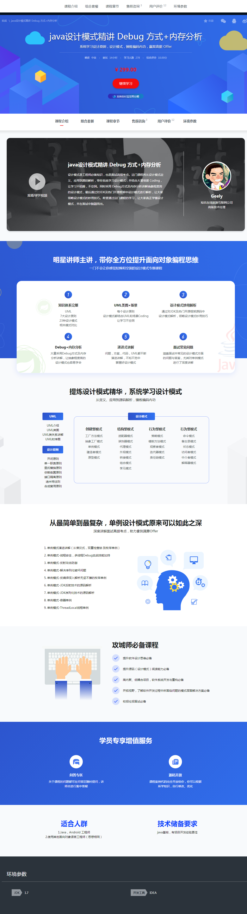

# JAVA设计模式精讲

课程：JAVA设计模式精讲 Debug 方式+内存分析 笔记

## 主图介绍

设计模式是工程师必备知识，也是面试高频考点。

这门课程将从设计模式定义、应用到源码解析，带你系统学习设计模式，并结合大量场景 Coding，让学习不枯燥，不空洞。

同时采用 Debug方式及内存分析讲解抽象程度高的设计模式，最后通过对JDK及热门开源框架中设计模式进行解析，让大家领略设计模式的妙用技巧。

希望通过这门课程的学习，让大家真正学懂设计模式，并在面试中脱颖而出。

> 我自己使用jdk8.

## 导航目录

* 第1章 课程导学

  本章节主要讲解大家能收获什么，课程具体包含哪些内容，通过哪些方式来学习设计模式，以及怎么讲，怎么安排，通过本章的学习，让大家为整个课程高效的学习打下基础。
  - [课程导学](01/)

* 第2章 UML急速入门

  本章节主要讲解UML基础、UML类图、UML类关系、UML时序图、UML类关系记忆技巧等，让大家急速入门UML，从而为后面设计模式的学习做好准备。

  - [本章导航](./02_uml/)
  - [UML 类图讲解](./02_uml/01.md)

* 第3章 软件设计七大原则

  本章节主要讲解软件设计七大原则，同时结合业务场景及演进手把手coding，让大家更好的理解软件设计原则。
  - [本章导航](./03_design_principles/)
  - [开闭原则](./03_design_principles/open_close.md)
  - [依赖倒置原则](./03_design_principles/dependency_inversion.md)
  - [单一职责原则](./03_design_principles/single_responsibility.md)
  - [接口隔离原则](./03_design_principles/interface_segregation.md)
  - [迪米特原则](./03_design_principles/demeter.md)
  - [里氏替换原则](./03_design_principles/liskov_substitution.md)
  - [合成复用原则](./03_design_principles/composition_aggeregation.md)
* 第4章 简单工厂讲解+Coding+源码解析

  本章节主要讲解简单工厂定义及理解，适用场景，优缺点及扩展。并引入业务场景，一边coding一边讲解，最后对简单工厂在框架(jdk+slf4j等)源码中的应用进行解析，让大家领略简单工厂的妙用技巧。

  - [简单工厂](./04_simple_factory/simple_factory.md)

* 第5章 工厂方法模式讲解+Coding+源码解析

  本章节主要讲解工厂方法模式定义及理解，适用场景，优缺点及扩展。并引入业务场景，一边coding一边讲解，最后对工厂方法模式在框架(jdk+slf4j等)源码中的应用进行解析，让大家领略工厂方法模式的妙用技巧。

  - [工厂方法模式](./05_factory_method/factory_method.md)

* 第6章 抽象工厂模式讲解+Coding+源码解析

  本章节主要讲解抽象工厂模式定义及理解，适用场景，优缺点及扩展。并引入业务场景，一边coding一边讲解，最后对抽象工厂模式在框架(jdk+mybatis等)源码中的应用进行解析，让大家领略抽象工厂模式的妙用技巧。

  - [抽象工厂模式](./06_abstract_factory/abstract_factory.md)

* 第7章 建造者模式讲解+Coding+源码解析

  本章节主要讲解建造者模式定义及理解，适用场景，优缺点及扩展。并引入业务场景，手一边coding一边讲解，最后对建造者模式在框架(jdk+guava等)源码中的应用进行解析，让大家领略建造者模式的妙用技巧。

  - [建造者模式](./07_builder/builder.md)

* 第8章 单例模式讲解+Coding+源码解析

  本章节为面试高频环节，所以讲的比较深入，主要讲解单例模式定义及理解，适用场景，优缺点及扩展。并引入业务场景，一边coding一边讲解，最后对单例模式在框架(jdk，mybatis等)源码中的应用进行解析，让大家领略单例模式的妙用技巧。...

  - [单列模式一](./08_singleton/singleton.md)
  - [单列模式二](./08_singleton/singleton2.md)
* 第9章 原型模式讲解+Coding+源码解析

  本章节主要讲解原型模式定义及理解，适用场景，优缺点及扩展。并引入业务场景，一边coding一边讲解，同时讲解原型模式在框架(jdk+mybatis)源码中的应用进行解析，让大家领略原型模式的妙用技巧。课程中还会向前呼应讲解单例模式中的克隆破坏问题。让大家理解更深刻。...
  
* 第10章 外观模式讲解+Coding+源码解析

  本章节主要讲解外观模式定义及理解，适用场景，优缺点及扩展。并引入业务场景，一边coding一边讲解，最后对外观模式在框架(springjdbc+servlet等)源码中的应用进行解析，让大家领略外观模式的妙用技巧。
* 第11章 装饰者模式讲解+Coding+源码解析

  本章节主要讲解装饰者模式定义及理解，适用场景，优缺点及扩展。并引入业务场景，一边coding一边讲解，最后对装饰者模式在框架(jdk+spring等)源码中应用进行解析，，让大家领略装饰者模式的妙用技巧。
* 第12章 适配器模式讲解+Coding+源码解析

  本章节主要讲解适配器模式定义及理解，适用场景，优缺点及扩展。并引入业务场景，一边coding一边讲解，最后对适配器模式在框架(jdk+spring等)源码中的应用进行解析，，让大家领略适配器模式的妙用技巧。
* 第13章 享元模式讲解+Coding+源码解析

  本章节主要讲解享元模式定义及理解，适用场景，优缺点及扩展。并引入业务场景，一边coding一边讲解，最后对享元模式在框架(jdk+apache-common-pool)源码中的应用进行解析，让大家领略享元模式的妙用技巧。
* 第14章 组合模式讲解+Coding+源码解析

  本章节主要讲解组合模式定义及理解，适用场景，优缺点及扩展。并引入业务场景，一边coding一边讲解，最后对组合模式在框架(jdk+mybatis)源码中的应用进行解析，让大家领略组合模式的妙用技巧。

* 第15章 桥接模式讲解+Coding+源码解析

  本章节主要讲解桥接模式定义及理解，适用场景，优缺点及扩展。并引入业务场景，一边coding一边讲解，最后对桥接模式在框架源码中的应用进行解析，让大家领略桥接模式的妙用技巧。
* 第16章 代理模式讲解+Coding+源码解析

  本章节主要讲解代理模式定义及理解，适用场景，优缺点及扩展。并引入业务场景，一边coding一边讲解，最后对代理模式在框架源码中的应用进行解析，让大家领略代理模式的妙用技巧。
* 第17章 模板方法模式讲解+Coding+源码解析

  本章节主要讲解模板方法模式定义及理解，适用场景，优缺点及扩展。并引入业务场景，一边coding一边讲解，最后对模板方法模式在框架源码中的应用进行解析，让大家领略模板方法模式的妙用技巧。
* 第18章 迭代器模式讲解+源码解析

  迭代器模式在实际工作中使用率很低，但为了大家学习的完整性，对迭代器模式定义，使用场景，优缺点等进行讲解后，直接给出案例代码进行讲解，最后并对迭代器模式在框架源中的应用进行解析，让大家领略迭代器模式的妙用技巧。...
* 第19章 策略模式讲解+Coding+源码解析

  本章节主要讲解策略模式定义及理解，适用场景，优缺点及扩展。并引入业务场景，一边coding一边讲解，最后对策略模式在框架源码中的应用进行解析，让大家领略策略模式的妙用技巧。
* 第20章 解释器模式讲解+源码解析

  解释器模式在实际工作中使用率很低，但为了大家学习的完整性，对解释器模式定义，使用场景，优缺点等进行讲解后，直接给出案例代码进行讲解，最后并对解释器模式在框架源中的应用进行解析，让大家领略解释器模式的妙用技巧。...
* 第21章 观察者模式讲解+Coding+源码解析

  本章节主要讲解观察者模式定义及理解，适用场景，优缺点及扩展。并引入业务场景，一边coding一边讲解，最后对观察者模式在框架源码中的应用进行解析，让大家领略观察者模式的妙用技巧。
* 第22章 备忘录模式讲解+源码解析

  备忘录模式在实际工作中使用率很低，但为了大家学习的完整性，对备忘录模式定义，使用场景，优缺点等进行讲解后，直接给出案例代码进行讲解，最后并对备忘录模式在框架源中的应用进行解析，让大家领略备忘录模式的妙用技巧。...
* 第23章 命令模式讲解+Coding+源码解析

  本章节主要讲解命令模式定义及理解，适用场景，优缺点及扩展。并引入业务场景，一边coding一边讲解，最后对命令模式在框架源码中的应用进行解析，让大家领略命令模式的妙用技巧。
* 第24章 中介者模式讲解+源码解析

  中介者模式在实际工作中使用率很低，但为了大家学习的完整性，对中介者模式定义，使用场景，优缺点等进行讲解后，直接给出案例代码进行讲解，最后并对中介者模式在框架源中的应用进行解析，让大家领略中介者模式的妙用技巧。...
* 第25章 责任链模式讲解+Coding+源码解析

  本章节主要讲解责任链模式定义及理解，适用场景，优缺点及扩展。并引入业务场景，一边coding一边讲解，最后对责任链模式在框架源码中的应用进行解析，让大家领略责任链模式的妙用技巧。
* 第26章 访问者模式讲解+源码解析

  访问者模式在实际工作中使用率很低，但为了大家学习的完整性，对访问者模式定义，使用场景，优缺点等进行讲解后，直接给出案例代码进行讲解，最后并对访问者模式在框架源中的应用进行解析，让大家领略访问者模式的妙用技巧。...
* 第27章 状态模式讲解+Coding+源码解析

  本章节主要讲解状态模式定义及理解，适用场景，优缺点及扩展。并引入业务场景，一边coding一边讲解，最后对状态模式在框架源码中的应用进行解析，让大家领略状态模式的妙用技巧。
* 第28章 课程总结

  恭喜同学们，到这里的时候，说明你们已经学完本课程了，希望大家学有所获，同时在这里和大家一起总结回顾下本课程的重难点，帮助大家巩固所学知识，同时我也期待与大家进一步交流（课程问答区里等着大家）
