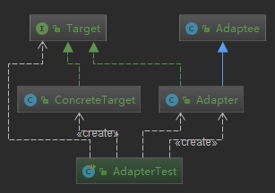

# 适配器模式
**定义**：将一个类的接口转换成客户期望的另一个接口

  使原本接口不兼容的类可以一起工作

**类型**：结构型

例如：笔记本电源适配器
## 适用场景

- 已经存在的类，它的方法和需求不匹配时（方法结果相同或相似）
- 不是软件设计阶段考虑的设计模式

  是随着软件维护，由于不同产品、不同厂家造成功能类似
而接口不相同情况下的解决方案

## 优点

- 能提高类的透明性和复用，现有的类复用但不需要改变
- 目标类和适配器类解耦，提高程序扩展性
- 符合开闭原则

## 缺点

- 适配器编写过程需要全面考虑，可能会增加系统的复杂性
- 增加系统代码可读的难度

## 适配器扩展

- 对象适配器：组合委托
- 类适配器：类继承

## 相关设计模式

- 外观模式：都是对现有的类、系统进行封装

  - 外观：定义新的接口，提供一个比较方便的统一入口
  - 适配器：复用原有的，使原有的两个接口协同工作
## 代码

### 类适配器

```java
/**
 * 目标接口
 *
 * @author : zhuqiang
 * @date : 2018/12/25 20:39
 */
public interface Target {
    void request();
}

/**
 * 具体的实现目标
 *
 * @author : zhuqiang
 * @date : 2018/12/25 20:35
 */
public class ConcreteTarget implements Target {
    @Override
    public void request() {
        System.out.println("目标方法");
    }
}

/**
 * 被适配者
 *
 * @author : zhuqiang
 * @date : 2018/12/25 20:36
 */
public class Adaptee {
    public void adapteeRequest() {
        System.out.println("被适配者方法");
    }
}

/**
 * 适配器
 *
 * @author : zhuqiang
 * @date : 2018/12/25 20:44
 */
public class Adapter extends Adaptee implements Target {
    @Override
    public void request() {
        super.adapteeRequest();
    }
}

```
测试
```java
@Test
public void fun1() {
    Target target = new ConcreteTarget();
    target.request();

    Adapter adapter = new Adapter();
    adapter.request();
}
================
目标方法
被适配者方法
```

出现的角色解释：

比如：Set 的 put 方法，要适配成 ArrayList 的 add 方法，那么

- Target：就是 List
- ConcreteTarget：具体实现 ArrayList
- Adaptee：被适配者 Set
- Adapter：适配器

类图里面是以继承为主的，所有被称为类适配器




### 对象适配器

其他的都不需要改变，只需要改变适配器即可

```java
/**
 * 适配器
 *
 * @author : zhuqiang
 * @date : 2018/12/25 20:44
 */
public class Adapter implements Target {
    private Adaptee adaptee = new Adaptee();

    @Override
    public void request() {
      // 其他代码，这里有点类似代理模式
        adaptee.adapteeRequest();
    }
}
```

可以看到，这里是适配器持有了被适配者，适配成目标方法; adapter 是 target 的实现类。

也就是上面说的，在使用 set 的时候希望像使用 arraylst 一样的感觉


### 场景
充电器，家用电 220V,手机充电器 5V.使用适配器来实现这个场景

```java
/**
 * 交流电-被适配者
 *
 * @author : zhuqiang
 * @date : 2018/12/25 21:25
 */
public class AC220 {
    public int outputAC220V() {
        int output = 220;
        System.out.println("交流电" + output + "V");
        return output;
    }
}
```
```java
/**
 * 直流电
 *
 * @author : zhuqiang
 * @date : 2018/12/25 21:26
 */
public interface DC5 {
    int outputDC5V();
}
/**
 * 充电器适配器
 *
 * @author : zhuqiang
 * @date : 2018/12/25 21:27
 */
public class PowerAdapter implements DC5 {
    private AC220 ac220 = new AC220();

    @Override
    public int outputDC5V() {
        int adapterIntput = ac220.outputAC220V();
        // 假设这个是变压器工作逻辑
        int adapterOutput = adapterIntput / 44;
        System.out.println("PowerAdapter 输出直流电" + adapterOutput + "V");
        return adapterOutput;
    }
}
```

测试，从这里可以看出来，需要一个 5V 的直流电，把 220V 交流电适配成了直流电

```java
@Test
public void fun1() {
    DC5 dc5 = new PowerAdapter();
    dc5.outputDC5V();
}
================
交流电220V
PowerAdapter 输出直流电5V
```

## 源码解析

javax.xml.bind.annotation.adapters.XmlAdapter

xml 相关的序列化和反序列化适配器，使用方法就是实现该接口，自定义序列化和反序列化，如自定义的时间 适配器

org.springframework.aop.framework.adapter.AdvisorAdapter

Aop 相关的适配器
```java
public interface AdvisorAdapter {

	boolean supportsAdvice(Advice advice);

  // 把 Advisor 适配成 MethodInterceptor，方法拦截器
	MethodInterceptor getInterceptor(Advisor advisor);
}
```
如一个方法执行前的适配器实现类 org.springframework.aop.framework.adapter.MethodBeforeAdviceAdapter

```java
class MethodBeforeAdviceAdapter implements AdvisorAdapter, Serializable {

	@Override
	public boolean supportsAdvice(Advice advice) {
		return (advice instanceof MethodBeforeAdvice);
	}

	@Override
	public MethodInterceptor getInterceptor(Advisor advisor) {
		MethodBeforeAdvice advice = (MethodBeforeAdvice) advisor.getAdvice();
		return new MethodBeforeAdviceInterceptor(advice);
	}

}
```

org.springframework.orm.jpa.JpaVendorAdapter
org.springframework.orm.jpa.vendor.HibernateJpaVendorAdapter
org.springframework.orm.jpa.vendor.EclipseLinkJpaVendorAdapter

JPA 的一个适配器

org.springframework.web.servlet.HandlerAdapter 有如下部分实现类

- org.springframework.web.servlet.mvc.SimpleControllerHandlerAdapter
- org.springframework.web.servlet.mvc.method.annotation.RequestMappingHandlerAdapter

那么该适配器在 mvc 中到底解决了什么呢？

打开该方法：org.springframework.web.servlet.DispatcherServlet#doDispatch

```java
protected void doDispatch(HttpServletRequest request, HttpServletResponse response) throws Exception {
  HttpServletRequest processedRequest = request;
  HandlerExecutionChain mappedHandler = null;
  boolean multipartRequestParsed = false;

  WebAsyncManager asyncManager = WebAsyncUtils.getAsyncManager(request);

  try {
    ModelAndView mv = null;
    Exception dispatchException = null;

    try {
      processedRequest = checkMultipart(request);
      multipartRequestParsed = (processedRequest != request);

      // Determine handler for the current request.
      mappedHandler = getHandler(processedRequest);
      if (mappedHandler == null) {
        noHandlerFound(processedRequest, response);
        return;
      }
      // 获取适配器
      // Determine handler adapter for the current request.
      HandlerAdapter ha = getHandlerAdapter(mappedHandler.getHandler());

      // Process last-modified header, if supported by the handler.
      String method = request.getMethod();
      boolean isGet = "GET".equals(method);
      if (isGet || "HEAD".equals(method)) {
        long lastModified = ha.getLastModified(request, mappedHandler.getHandler());
        if (logger.isDebugEnabled()) {
          logger.debug("Last-Modified value for [" + getRequestUri(request) + "] is: " + lastModified);
        }
        if (new ServletWebRequest(request, response).checkNotModified(lastModified) && isGet) {
          return;
        }
      }

      if (!mappedHandler.applyPreHandle(processedRequest, response)) {
        return;
      }
      // 通过适配器获取到 ModelAndView
      // Actually invoke the handler.
      mv = ha.handle(processedRequest, response, mappedHandler.getHandler());

```

org.springframework.web.servlet.mvc.Controller
org.springframework.web.servlet.mvc.UrlFilenameViewController
org.springframework.web.servlet.mvc.ServletForwardingController

被适配者：Controller，有好多具体的实现
目标：ModelAndView，

解决的问题是：Controller 有多个，通过 适配器就能找到一个具体的处理器，对于扩展来说，我们自己写一种 Controller 的处理器，还需要增加一个 adapter 即可完成扩展
