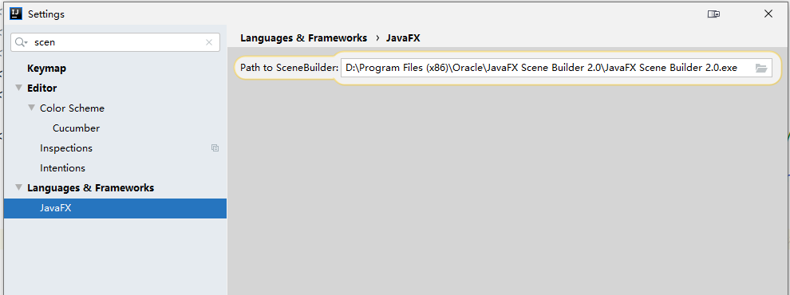
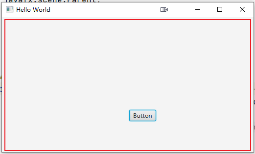
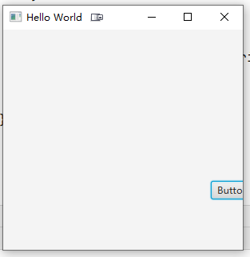

# java fx 图形界面开发
本章讲解怎么用 gradle 搭建一个 java fx 开发环境。

使用到的核心技术和包

- Java Fx 图形界面框架

- [JavaFX Scene Builder 2.0](https://www.oracle.com/java/technologies/javafxscenebuilder-1x-archive-downloads.html) ：帮助我们可视化布局

- logback 输出日志

- spring-context 和 spring-beans ：带给我们 IOC 容器管理功能

  除了 Java Fx 初始化的类，其他我们自己的业务逻辑都可以使用 spring 的方式实现；

  这里没有使用 使用 spring web 这种的框架，作为一个图形界面，我们的测量是主动拉取服务端的数据。

  如果想要服务器主动拉取客户端：或许可以考虑使用 netty 之类的暴露接口？这里不深入研究了

- [javafx-gradle-plugin](https://github.com/FibreFoX/javafx-gradle-plugin)：为我们打包成 windows 执行程序

  ​	使用它打成 exe 安装包，还需要本机安装   [innosetup-5.6.1.exe](https://files.jrsoftware.org/is/5/) ，并添加到 path 环境变量中

- gradle 4.8：用于项目的打包依赖

## 配置 idea 开发环境

安装好 JavaFX Scene Builder 2.0 后，需要在 idea 中设置这个执行路径



打开 `*.fxml` 时才能以图形化方式预览，如下图


但是这里面编辑不是很方便。在 `*.fxml` 右键，可选择本机安装的  JavaFX Scene Builder 打开。我们对 UI 的设计也是在本机上面编辑


下面来写一个简单的入门 HelloWorld，然后讲解 fx 的简单概念

## java fx Hello Word

### 设计一个 UI 界面

这里设计了一个简单的 UI 界面


下面来讲解下他们是怎么意思：

可以看到左右：左边是一个 controller 的代码，右侧是一个 sample.fmxl 的可视化面板，这意味着，一个 fmxl 对应一个 controller 类；

- fmxl 定义了初始的 UI 元素的信息

- controller 类：实现了这些元素的事件交互

  可以想象成是 js，给这个按钮增加点击弹出一个信息框。这样的逻辑就是在 controller 来实现

那么 xml 与 controller 是怎么关联的？

- Hierarchy：这里我添加了一个 Containers/容器

  比如这里添加了一个  Pane 的容器面板，按钮是放在这个容器上的。**一个窗口只能放一个根容器**，同时对应了一个 controller

- controller 关联：在上图  1 的标识处，写的是这个 controller 的类路径；

  那么在 java 项目里面，就意味着你需要在这个类路径下创建左侧这个类；类里面的初始类容，这里给出来了。

  `@FXML` 注解，是把这个 按钮 对象，注入给你，因为我们通过 fxml 来构建的初始界面，fxml 中的信息是框架来帮你完成初始化，我们要访问这个按钮，就需要通过 `@FXML` 注解来注入这个对象。

  按钮的 fx:id  对应的就是 controller 里面这个按钮对象的字段名称；

### 在项目中编写对应的 controller


可以看到我们刚刚设计的 fxml 和它给出对应的 controller 类，类容一对比，就看出来了，他们是怎么关联上的；

### 运行这个 UI

我们需要创建一个启动类

```java
package sample;

import javafx.application.Application;
import javafx.fxml.FXMLLoader;
import javafx.scene.Parent;
import javafx.scene.Scene;
import javafx.stage.Stage;

public class Main extends Application {

    @Override
    public void start(Stage primaryStage) throws Exception{
        Parent root = FXMLLoader.load(getClass().getResource("sample.fxml"));
        primaryStage.setTitle("Hello World");
        primaryStage.setScene(new Scene(root, 300, 275));
        primaryStage.show();
    }


    public static void main(String[] args) {
        launch(args);
    }
}
```

- Application：需要继承这个类，接入 fx 框架

- main 方法：可以直接启动运行的入口

- start：

  所有 JavaFX 应用程序的主要入口点。返回 init 方法之后，以及在系统准备好开始运行应用程序之后，将调用start 方法。

- Stage ：舞台

  

  舞台就是如上图，除了红框以外的部分就是舞台了；也就是我们的程序窗口，有放大缩小等信息；

  可以在舞台上设置应用 **程序场景**。

- Scene ：程序场景

  可以看到代码中是加载了我们的 `sample.fxml` 并把他传递给了场景，场景就是负责渲染 UI 的；

那么一个简单的程序就创建好了，来总结下思路：

1. 通过   Scene Builder  设计一个界面
2. 创建这个界面对应的初始控制器 Controller
3. 运行这个 UI：
   1. 继承 Application 类
   2. 加载 sample.fxml 并创建场景
   3. 把场景给舞台（Stage）显示

### 给按钮增加交互事件

现在按钮没有交互的，点击没有任何事件发生，下面实现这个功能：点击按钮，弹框显示一句话

ui 上给这个按钮绑定 on action


那么对应生成的控制器中代码是

```java
    @FXML
    void btnClick(ActionEvent event) {

    }
```

下面实现这个这个弹框逻辑

```java
package sample;

import javafx.event.ActionEvent;
import javafx.fxml.FXML;
import javafx.scene.control.Alert;
import javafx.scene.control.Button;

public class Controller {

    @FXML
    private Button btn;

    @FXML
    void btnClick(ActionEvent event) {
        final Alert alert = new Alert(Alert.AlertType.INFORMATION);
        alert.setContentText("你好，第一个交互事件");
        alert.show();
    }
}
```

运行 `sample.Main#main` 单击按钮，就有效果了


## 一些通用的点讲解

一个基础完成了，那么来讲解一下几个通用的点

### 窗口显示不全

上面的 HellWorld 代码运行后，窗口显示不全，如下显示



这个问题的原因是：面板容器的 **初始大小**，与你代码中的 **场景大小** 不匹配； 


```java
    @Override
    public void start(Stage primaryStage) throws Exception {
        Parent root = FXMLLoader.load(getClass().getResource("sample.fxml"));
        primaryStage.setTitle("Hello World");
        primaryStage.setScene(new Scene(root, 600 + 20, 400 + 20));
        primaryStage.show();
    }
```

在给定场景的时候，给定足够的大小；这里为什么多增加了 20 ？这个应该是因为边距之类导致的，笔者也不是很清楚

### 自适应窗口

这个笔者没有深入研究，有会的可以提交 issues。

### 多个窗口切换

要实现 2 个窗口：

- 一个用来显示程序启动提示：比如显示正在检查中

  这个检查逻辑我们可以做一些初始化操作，比如，在某个地方生成一个 PID 文件，并用  FileLock 锁住它，只要这个程序不退出，后续多开的程序获取不到锁。达到限制一个程序只能运行一个实例的思路

- 一个窗口显示我们的主要信息：就比如上面的 hello word

这里主要是演示怎么从一个窗口跳转到另外一个窗口

这个很简单

```java
package sample.star;

import sun.applet.Main;

import java.io.RandomAccessFile;
import java.nio.channels.FileChannel;
import java.nio.channels.FileLock;
import java.nio.file.Files;
import java.nio.file.Path;
import java.nio.file.Paths;

import javafx.application.Application;
import javafx.fxml.FXMLLoader;
import javafx.scene.Parent;
import javafx.scene.Scene;
import javafx.scene.control.Alert;
import javafx.stage.Stage;

public class Starman extends Application {

    @Override
    public void start(Stage primaryStage) throws Exception {
        Parent root = FXMLLoader.load(getClass().getResource("starman.fxml"));
        primaryStage.setTitle("第一个窗口");
        primaryStage.setScene(new Scene(root, 600 + 20, 400 + 20));
        primaryStage.show();
        
        checkInstanceUnique(primaryStage);
    }


    public static void main(String[] args) {
        launch(args);
    }

    /**
     * <pre>
     * 检查程序实例是否只有一个运行；
     *
     * 实现思路：通过 filelock只能一个进程锁定文件的机制，来实现是否已经运行该程序
     * </pre>
     *
     * @param primaryStage
     * @throws Exception
     */
    private void checkInstanceUnique(Stage primaryStage) throws Exception {
        final Path rootPath = getWorkPath();
        if (!Files.exists(rootPath)) {
            Files.createDirectories(rootPath);
        }
        final RandomAccessFile randomAccessFile = new RandomAccessFile(rootPath.resolve("pid").toAbsolutePath().toString(), "rw");
        final FileChannel pidChannel = randomAccessFile.getChannel();
        final FileLock fileLock = pidChannel.tryLock();
        if (fileLock == null) {
            Alert alert = new Alert(Alert.AlertType.ERROR);
            alert.setContentText("本程序一台机器只允许运行一个");
            alert.setOnCloseRequest(alertCloseEvent -> {
                System.out.println(alertCloseEvent);
                System.exit(0);
            });
            alert.show();
        } else {
            // 多窗口切换，核心代码就是让当前的窗口隐藏
            // 然后手动初始化另外一个窗口的 main
            primaryStage.hide();
            new sample.Main().start(new Stage());
        }
    }

    private Path getWorkPath() {
        // 获取用户的 目录，比如是 C:\Users\mrcode
        final String userHome = System.getProperties().getProperty("user.home");
        return Paths.get(userHome, ".项目目录");
    }
}


```

### 程序最小化到托盘


```java
MinWindow.getInstance().listen(primaryStage);
// 窗口上点击 x 或则最小化，都会触发此事件，我们不退出
// 这里隐藏到托盘中
primaryStage.setOnCloseRequest(event -> {
    // System.exit(1);
    MinWindow.getInstance().hide(primaryStage);
});
```

下面是别人实现的一个最小化到托盘的工具类；自己阅读下源码也挺简单的。

```java
package sample;


import java.awt.*;
import java.awt.event.ActionListener;
import java.awt.event.MouseAdapter;
import java.awt.event.MouseEvent;
import java.net.URL;

import javafx.application.Platform;
import javafx.stage.Stage;

/**
 * <pre>
 * 让窗口最小化到托盘；只支持对一个窗体进行最小化到托盘
 * https://blog.csdn.net/DENG8623048/article/details/105906735
 * </pre>
 */
public class MinWindow {
    private static MinWindow instance;
    private static MenuItem showItem;
    private static MenuItem exitItem;
    private static TrayIcon trayIcon;
    private static ActionListener showListener;
    private static ActionListener exitListener;
    private static MouseAdapter mouseListener;

    static {
        //执行stage.close()方法,窗口不直接退出
        // 默认情况下，所有窗口都被关闭了，那么程序就结束了
        Platform.setImplicitExit(false);
        //菜单项(打开)中文乱码的问题是编译器的锅,如果使用IDEA,需要在Run-Edit Configuration在LoginApplication中的VM Options中添加-Dfile.encoding=GBK
        //如果使用Eclipse,需要右键Run as-选择Run Configuration,在第二栏Arguments选项中的VM Options中添加-Dfile.encoding=GBK
        showItem = new MenuItem("open");
        //菜单项(退出)
        exitItem = new MenuItem("exit");
        //此处不能选择ico格式的图片,要使用16*16的png格式的图片
        URL url = MinWindow.class.getResource("/ui/life_favicon.png");
        Image image = Toolkit.getDefaultToolkit().getImage(url);
        //系统托盘图标
        trayIcon = new TrayIcon(image);
        //初始化监听事件(空)
        showListener = e -> Platform.runLater(() -> {
        });
        exitListener = e -> {
        };
        mouseListener = new MouseAdapter() {
        };
    }

    public static MinWindow getInstance() {
        if (instance == null) {
            instance = new MinWindow();
        }
        return instance;
    }

    private MinWindow() {
        try {
            //检查系统是否支持托盘
            if (!SystemTray.isSupported()) {
                //系统托盘不支持
                System.out.println(Thread.currentThread().getStackTrace()[1].getClassName() + ":系统托盘不支持");
                return;
            }
            //设置图标尺寸自动适应
            trayIcon.setImageAutoSize(true);
            //系统托盘
            SystemTray tray = SystemTray.getSystemTray();
            //弹出式菜单组件
            final PopupMenu popup = new PopupMenu();
            popup.add(new MenuItem("v1.0"));
            popup.add(showItem);
            popup.add(exitItem);
            trayIcon.setPopupMenu(popup);
            //鼠标移到系统托盘,会显示提示文本
            trayIcon.setToolTip("第一个程序");
            tray.add(trayIcon);
        } catch (Exception e) {
            //系统托盘添加失败
            System.out.println(Thread.currentThread().getStackTrace()[1].getClassName() + ":系统添加失败");
        }
    }

    /**
     * 更改系统托盘所监听的Stage
     */
    public void listen(Stage stage) {
        //防止报空指针异常
        if (showListener == null || exitListener == null || mouseListener == null || showItem == null || exitItem == null || trayIcon == null) {
            return;
        }
        //移除原来的事件
        showItem.removeActionListener(showListener);
        exitItem.removeActionListener(exitListener);
        trayIcon.removeMouseListener(mouseListener);
        //行为事件: 点击"打开"按钮,显示窗口
        showListener = e -> Platform.runLater(() -> showStage(stage));
        //行为事件: 点击"退出"按钮, 就退出系统
        exitListener = e -> {
            System.exit(0);
        };
        //鼠标行为事件: 单机显示stage
        mouseListener = new MouseAdapter() {
            @Override
            public void mouseClicked(MouseEvent e) {
                //鼠标左键
                if (e.getButton() == MouseEvent.BUTTON1) {
                    showStage(stage);
                }
            }
        };
        //给菜单项添加事件
        showItem.addActionListener(showListener);
        exitItem.addActionListener(exitListener);
        //给系统托盘添加鼠标响应事件
        trayIcon.addMouseListener(mouseListener);
    }

    /**
     * 关闭窗口
     */
    public void hide(Stage stage) {
        Platform.runLater(() -> {
            //如果支持系统托盘,就隐藏到托盘,不支持就直接退出
            if (SystemTray.isSupported()) {
                //stage.hide()与stage.close()等价
                stage.hide();
            } else {
                System.exit(0);
            }
        });
    }

    /**
     * 点击系统托盘,显示界面(并且显示在最前面,将最小化的状态设为false)
     */
    private void showStage(Stage stage) {
        //点击系统托盘,
        Platform.runLater(() -> {
            if (stage.isIconified()) {
                stage.setIconified(false);
            }
            if (!stage.isShowing()) {
                stage.show();
            }
            // 将窗口置于前景中：如果被其他窗口覆盖，可以显示在最前面来
            stage.toFront();
        });
    }
}

```

### 在项目中使用 spring 容器配置

使用背景：由于 fxml 中的元素包括 controller 都是 fx 框架初始化的，这一部分我们没有办法干预，对于复杂一点的业务模块，我们要买全部都写静态类，要买就使用 ioc 容器等能力来管理非 fx 初始化的类；

我这里使用了 [spring-core](https://docs.spring.io/spring/docs/5.0.17.RELEASE/spring-framework-reference/core.html#spring-core) 的 ioc 容器等功能。

引用依赖

```
    compile group: 'org.springframework', name: 'spring-beans', version: '5.0.8.RELEASE'
    compile group: 'org.springframework', name: 'spring-context', version: '5.0.8.RELEASE'
```

```java
import org.springframework.context.ApplicationContext;
import org.springframework.context.annotation.AnnotationConfigApplicationContext;

/**
 * 在没有更好的办法下，使用本类进行对象共享; 在非 IOC 管理的类中通过本类获取容器
 */
public class Ioc {
    public static final String SP_ACTIVEPROFILE_KEY = "activeProfile";
    public static ApplicationContext ctx;

    public synchronized static void startForLaunchArgrs(String[] args) {
        if (args != null && args.length > 0) {
            Ioc.start(args[0]);
        } else {
            Ioc.start(null);
        }
    }

    /**
     * 对 spring 进行初始化
     *
     * @param activeProfile 激活哪一个环境，如果为 null，则使用默认的 default
     */
    public synchronized static void start(String activeProfile) {
        if (ctx != null) {
            return;
        }
        final AnnotationConfigApplicationContext ctx = new AnnotationConfigApplicationContext();
        ctx.register(AppConfig.class);
        if (activeProfile != null) {
            ctx.getEnvironment().setActiveProfiles(activeProfile);
        }
        ctx.refresh();
        Ioc.ctx = ctx;
    }
}

@Configuration
@ComponentScan(basePackages = "net.tidebuy.cloud.sem.clientagent")
public class AppConfig {
}
```

容器初始化的时机：由于程序入口是 **每个舞台（UI 窗口）的  man 方法**，只需要在每个 man 里面初始化即可

```java
    public static void main(String[] args) throws InterruptedException {
        Ioc.startForLaunchArgrs(args);
        launch(args);
    }
```

这样配置后，无论是每个界面单独启动，还是完整的打成  exe 包，都能初始化这个容器。

### logback 动态日志路径

使用背景：由于需要打包成 exe 文件，那么日志路径在开发环境下可能就不是在 ` System.getProperty("user.dir") ` 中，`user.dir` 是程序运行所在的目录，开发环境下不应该把日志打到当前的项目中。所以需要区别对待

两个难点：

- 怎么区分开发和生产环境？
- 怎么动态给日志路径？

下面来分别说说思路：

怎么区分开发和生产环境？

我们的程序入口是一个 `main(String[] args)` 方法，可以通过此参数传入一个字符串标识，如规定为 spring 中的 Profile 环境名称。至于 exe 程序怎么配置让他携带参数呢？下面打包的时候再讲解

怎么动态给日志路径？

```java
import ch.qos.logback.classic.Level;
import ch.qos.logback.classic.Logger;
import ch.qos.logback.classic.LoggerContext;
import ch.qos.logback.classic.spi.LoggerContextListener;
import ch.qos.logback.core.Context;
import ch.qos.logback.core.spi.ContextAwareBase;
import ch.qos.logback.core.spi.LifeCycle;

/**
 * <pre>
 * 根据环境不同，分配不同的日志路径；
 *
 * 实现思路：
 *  在 logback 初始化时，将我们需要的路径写入 context.putProperty 中， xml 中就可以获取该值
 * </pre>
 */
public class CustomLogContextListener extends ContextAwareBase implements LoggerContextListener, LifeCycle {
    /**
     * 存储日志路径标识
     */
    public static final String LOG_PAHT_KEY = "LOG_PATH";

    @Override
    public boolean isResetResistant() {
        return false;
    }

    @Override
    public void onStart(LoggerContext loggerContext) {

    }

    @Override
    public void onReset(LoggerContext loggerContext) {

    }

    @Override
    public void onStop(LoggerContext loggerContext) {

    }

    @Override
    public void onLevelChange(Logger logger, Level level) {

    }

    @Override
    public void start() {
        // 无，表示是开发环境
        String path = System.getProperty("user.dir") + "/logs";
        // 这里获取的属性可以在每个界面入口处的  man 方法中 put 进来
        if (System.getProperty(Ioc.SP_ACTIVEPROFILE_KEY) == null) {
            path = "D:/work/logs";
        }
        System.setProperty(LOG_PAHT_KEY, path);
        Context context = getContext();
        context.putProperty(LOG_PAHT_KEY, path);
    }

    @Override
    public void stop() {

    }

    @Override
    public boolean isStarted() {
        return false;
    }
}    
```

logback.xml

```xml
<?xml version="1.0" encoding="UTF-8" ?>
<configuration scan="true" scanPeriod="20 seconds" debug="true">
    <contextListener class="上面编写的监听器CustomLogContextListener"/>
    <property name="COMMON_PATTERN"
              value="%d{yyyy-MM-dd HH:mm:ss.SSS} %-5level [%thread] %logger{80}[%line] %msg%n"/>
    <!-- 控制台输出 -->
    <appender name="CONSOLE" class="ch.qos.logback.core.ConsoleAppender">
        <!-- 日志输出编码 -->
        <encoder>
            <pattern>${COMMON_PATTERN}</pattern>
            <charset>utf8</charset>
        </encoder>
    </appender>

    <!-- 文件输出日志 (文件大小策略进行文件输出，超过指定大小对文件备份)-->
    <appender name="FILE-ALL" class="ch.qos.logback.core.rolling.RollingFileAppender">
        <File>${LOG_PATH}/log.log</File>
        <rollingPolicy class="ch.qos.logback.core.rolling.FixedWindowRollingPolicy">
            <FileNamePattern>
                ${LOG_PATH}/log-%d{yyyy-MM-dd}.%i.log
            </FileNamePattern>
            <!--只保留最近 n天的日志-->
            <maxHistory>7</maxHistory>
        </rollingPolicy>
        <triggeringPolicy class="ch.qos.logback.core.rolling.SizeBasedTriggeringPolicy">
            <MaxFileSize>200MB</MaxFileSize>
        </triggeringPolicy>
        <encoder>
            <pattern>${COMMON_PATTERN}</pattern>
            <charset>utf8</charset>
        </encoder>
    </appender>
    <root level="INFO">
        <appender-ref ref="CONSOLE"/>
    </root>
    <!-- additivity true 信息向上级传递
         logger 本身默认只打印一次（false）：设置为 true，在文件输出的同时，又会在 root 的 console 中打印
     -->
    <logger name="应用程序包路径" level="DEBUG"
            additivity="true">
        <appender-ref ref="FILE-ALL"/>
    </logger>
</configuration>
```

### 如何实现一个界面上显示日志信息的功能

使用背景：上面我们配置了 log 日志，但是一些关键的日志信息，希望在 UI 界面上显示出来，供操作人员了解程序在做什么。但是程序运行日志还是需要记录下来。如下图效果


上图使用了一个  `javafx.scene.control.TextArea` 组件，可通过可视化设计在窗口上。只要拿到这个  textArea 注入的对象引用就可以实现我们的功能封装了。

实现思路：

1. 我们把 textArea 包装成一个 PrintStream 流对象，外部通过此流对象写入要输出的日志
2. 写一个 work 线程，给定一个队列，消费的往 ui 上写入信息

包装一个 PrintStream 

```java
import java.io.ByteArrayOutputStream;
import java.io.PrintStream;

import javafx.application.Platform;
import javafx.scene.control.TextArea;

public class TextAreaPrint extends PrintStream {//可以正常解析utf8和gbk码
    private TextArea console;

    public TextAreaPrint(TextArea console) {
        super(new ByteArrayOutputStream());
        this.console = console;
    }

    @Override
    public void write(byte[] buf, int off, int len) {
        print(new String(buf, off, len));
    }

    @Override
    public void print(String s) {
        // 这里为什么使用这种方式？下一个技术点讲解
        Platform.runLater(() -> console.appendText(s));
    }

    public void clear() {
        Platform.runLater(() -> console.clear());
    }
}
```

实现一个消费队列

```java
import net.tidebuy.cloud.sem.clientagent.TextAreaPrint;

import org.apache.commons.lang3.time.DateFormatUtils;
import org.slf4j.Logger;
import org.slf4j.LoggerFactory;
import org.slf4j.event.Level;

import java.util.Date;
import java.util.concurrent.LinkedBlockingQueue;
import java.util.concurrent.TimeUnit;

/**
 * 该页面日志组件；支持日志的打印，清空操作
 */
public class LayoutConsoleLog {
    private Logger logger = LoggerFactory.getLogger(LayoutConsoleLog.class);
    private TextAreaPrint ps;
    private Integer maxRow;
    private volatile boolean runing = true;
    private LinkedBlockingQueue<String> queue;
    /**
     * 是否同时输出到日志文件
     */
    private boolean outputToLog;

    /**
     * @param ps
     * @param maxRow 最大日志显示多少行。到达这个行数就清空一次
     */
    public LayoutConsoleLog(TextAreaPrint ps, Integer maxRow) {
        this.ps = ps;
        this.maxRow = maxRow;
        queue = new LinkedBlockingQueue(maxRow);
        run();
    }

    public LayoutConsoleLog(TextAreaPrint ps) {
        this(ps, 5000);
    }

    /**
     * 停止打印，停止后就不能再打印了
     */
    public void stop() {
        this.runing = false;
    }

    private void run() {
        new Thread(() -> {
            int lastRow = 0;
            try {
                String templog = null;
                String log = null;
                while (runing) {
                    log = queue.poll(500, TimeUnit.MILLISECONDS);
                    if (log == null) {
                        continue;
                    }
                    if (outputToLog) {
                        templog = log.substring(log.indexOf("|") + 2);
                        if (log.startsWith(Level.ERROR.toString())) {
                            logger.error(templog);
                        } else if (log.startsWith(Level.WARN.toString())) {
                            logger.error(templog);
                        } else {
                            logger.info(templog);
                        }
                    }
                    ps.println(log);
                    lastRow++;
                    if (lastRow >= maxRow) {
                        lastRow = 0;
                        ps.clear();
                    }
                }
            } catch (InterruptedException e) {
                e.printStackTrace();
            }
        }).start();
    }

    public void log(String msg) {
        try {
            queue.offer(msg, 200, TimeUnit.MILLISECONDS);
        } catch (InterruptedException e) {
            e.printStackTrace();
        }
    }

    /**
     * 给日志消息增加前缀时间
     *
     * @param msg
     */
    public void logTime(String msg) {
        this.log(buildLog(Level.INFO, msg, true));
    }

    public void logTimeError(String msg) {
        this.log(buildLog(Level.ERROR, msg, true));
    }

    public void logTimeWarn(String msg) {
        this.log(buildLog(Level.WARN, msg, true));
    }

    /**
     * 构建日志信息
     *
     * @param level 日志级别
     * @param msg   信息
     * @param time  是否在信息前增加时间
     */
    private String buildLog(Level level, String msg, boolean time) {
        final StringBuffer buffer = new StringBuffer();
        buffer.append(level.toString());
        if (time) {
            buffer.append(" " + DateFormatUtils.format(new Date(), "yyyy-MM-dd HH:mm:ss"));
        }
        buffer.append(" | ");
        buffer.append(msg);
        return buffer.toString();
    }

    public boolean isOutputToLog() {
        return outputToLog;
    }

    public void setOutputToLog(boolean outputToLog) {
        this.outputToLog = outputToLog;
    }


```

### 非 UI 线程操作 UI 元素报错

fx 的 UI 线程是单线程的，只要在 controller 中实现一些耗时的操作的话，那么 UI 就会表现出卡顿，甚至会出现「程序无响应」的问题。

也就是说，我们耗时操作需要使用额外的多线程来操作，**那么非 UI 线程操作 UI 元素（如改变往 textArea 中不停写出数据），就会有很大的几率出现异常信息；** 这个是 fx 的机制的原因

正确的异步更新 UI 元素应该这样使用

```java
// javafx.application.Platform#runLater
Platform.runLater(() -> console.appendText(s));
```

需要注意的是：Platform，是界面入口的 Application 初始化后，才能被调用，使用它去更新，实际上它是通过队列去更新的。

### 打包成 windows exe 安装程序

使用了 [javafx-gradle-plugin](https://github.com/FibreFoX/javafx-gradle-plugin) 插件，它封装了 [javapackger](https://docs.oracle.com/javase/8/docs/technotes/guides/deploy/self-contained-packaging.html#A1324980) 的功能，方便我们使用。下面是我实现的一个最简单的打包

build.gradle

```groovy
buildscript {
    dependencies {
        //https://github.com/FibreFoX/javafx-gradle-plugin
        classpath group: 'de.dynamicfiles.projects.gradle.plugins', name: 'javafx-gradle-plugin', version: '8.8.2'
    }
    repositories {
        mavenLocal()
        mavenCentral()
    }
}
plugins {
    id 'java'
}
apply plugin: 'javafx-gradle-plugin'

group 'sample'
version '1.0.0'

sourceCompatibility = 1.8
compileJava.options.encoding = "UTF-8"

repositories {
    mavenLocal()
    // 额外的仓库源
    maven { url "http://maven.aliyun.com/nexus/content/groups/public" }
    maven { url 'https://repo.spring.io/libs-snapshot' }
    maven { url "https://maven.repository.redhat.com/ga/" }
    maven { url "http://maven.nuiton.org/nexus/content/groups/releases/" }
    maven { url "https://repository.cloudera.com/artifactory/cloudera-repos/" }
    mavenCentral()
}

dependencies {
    testCompile group: 'junit', name: 'junit', version: '4.12'
    compile("org.apache.commons:commons-collections4:4.2")
    compile('org.apache.commons:commons-lang3:3.7')
    compile("net.tidebuy.cloud.commons:tlz-cloud-commons-httpclient:1.1.0")
    compile("com.google.guava:guava:29.0-jre")
    compile "ch.qos.logback:logback-core:1.2.3"
    compile "ch.qos.logback:logback-classic:1.2.3"
    compile group: 'org.springframework', name: 'spring-beans', version: '5.0.8.RELEASE'
    compile group: 'org.springframework', name: 'spring-context', version: '5.0.8.RELEASE'
}

tasks.withType(JavaCompile) {
    options.encoding = "UTF-8"
}

jfx {
    vendor = '厂商名称'
    // 应用名称
    appName = "hello-word"
     // 程序版本, 打包后，会变成主要的 exe 文件名称，比如  hello-word-1.0.exe
    nativeReleaseVersion = "1.0" 
	// 程序运存时使用哪一个窗口作为入口运行，前面写好的窗口 man 方法类
    mainClass = 'sample.star.Starman'
    // 这里就是前面说到 spring 的环境在程序运行时怎么传递进去
    // 可以写多个参数
    launcherArguments = ['production']

    // 打包成 exe 安装包，需要安装 https://files.jrsoftware.org/is/5/
    // 并且需要把安装目录配置到 path 中，否则会提示：检测到 [iscc.exe] 版本 0, 但需要版本 5。
    bundler = "exe" // 默认为 all
    needShortcut = true // 生成桌面快捷方式
    needMenu = true // 添加到菜单中
    // 当你重复安装的时候，就会提示你，已经安装过 hello-word.exe 可以渲染自动配置，覆盖安装
    identifier = "hello-word" // 为Windows-bundler设置此设置可以生成可升级的安装程序（使用相同的GUID）
    bundleArguments = [
            //使“全局”成为默认
            systemWide       : true,
            //让用户能够选择安装目标
            installdirChooser: true,
            //  runtime          : null,  // 不要 jre
    ]
}
```

打包执行的 gradle 任务是 `gradle jfxNative`，执行完成后，默认会在 `build/jfx` 下成打包好的程序


#### exe 图标设置


如上图，在 `src/main/deploy/package/windows` 目录下存在两个图片文件：

- exe 图标：appName.ico

  jfx 中的 appName  名称

- exe 安装程序打开后，安装界面显示的图片：appName-setup-icon.bmp

  这个 bmp 格式一定要对，否则打开安装程序，就会报错说 bmp 是无效的。


#### 关于 bundler 的知识点

他默认是 all，有哪些呢？可以通过 `gradle jfxListBundlers` 查看。

如果使用 `bundler=all` 打包的话，笔者的 windows 10 上会出现三种方式


- app 打成的是可运行的 jar 包

  lib 下面是该 jar 包的所有依赖包； 可以通过 `java -jar ` 的方式运行。

- native 下有两种

  1. 安装版本

     最外面哪个 xxx.exe 程序，这个就是当 `bundler=exe` 的时候打出来的 exe 安装包

  2. 绿色版

     就是这个目录下的所有文件，其实就是安装包里面解压出来的，也就是绿色版

     

     里面包含了 jar 包、运行时的 jre、还有 windows 的 dll 文件、exe 程序执行文件

#### 其他更细粒度的控制

这个就需要去仔细研究 ：

-  [javafx-gradle-plugin](https://github.com/FibreFoX/javafx-gradle-plugin) 插件
-  [javapackger](https://docs.oracle.com/javase/8/docs/technotes/guides/deploy/self-contained-packaging.html#A1324980) 
-  [innosetup-5.6.1.exe](https://files.jrsoftware.org/is/5/) ：打包成 exe 安装程序的软件
