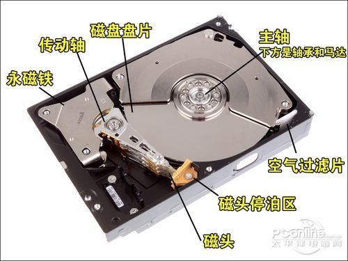
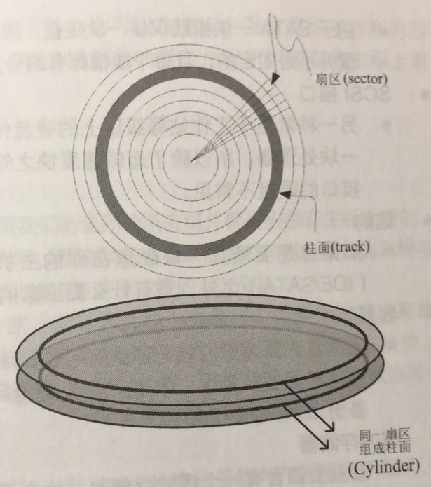

# 00. 计算机概论

## cpu: 负责大量运算
- 微指令集会导致 CPU 的性能
- 频率：CPU 每秒可以进行的工作次数，如 3.0 GHz 的 CPU 每秒可以进行 3*10 的 9 次方次
- CPU 外频与倍频

  各个组件通过南桥与北桥连接至 CPU，

  - 外频：CPU 与外部组件进行数据传输/运算时的速度
  - 倍频：CPU 内部用来加速工作性能的一个倍数

  两者相乘才是 CPU 的频率，比如  3.0 GHz 的外频是 333 MHz，倍频就是 9 （3.0 G = 333M*9，其中 1 G = 1000M）
- 超频

  倍频一般出厂已锁定，所以只能调整外频的数值，从而达到频率提高，但是不稳定
- 32 位与 64 位

  CPU 运算的数据是由内存提供的，内存与 CPU 通信速度靠外部频率，那么每次可以传送数据量的大小就是总线的功能了，每次传送的位数称为「总线宽度」，也就是每秒钟可以传输的最大数据量。

  目前常见的总线宽度就是 32 位与 64 位（bit）

  CPU 每次能够处理的数据量称为 **字组大小（word size）**，字组大小依据 CPU 的设计有 32 位与 64 位。

  所以早期 32 位 CPU 中只能最大支持 4 GB 的内存，就是因为每次解析数据量太小的缘故
- CPU 等级

  CPU 的引脚位不统一导致出现了  i386、i586 等名词出现，64 位 CPU 统称为 x86_64 等级

## 内存
个人计算机的内存主要组件为动态随机访问内存（Dynamic Random Access Memory，DRAM），
内存也分为频率/频宽，也就是有数据传输宽度。

- 双通道设计：一条内存数据宽度为 64，那么双通道则变为 64*2
- CPU 频率与内存的关系

  理论上应该一致为好，比如 CPU 外频为 333HMz，则应该选择内存外频为 333MHz 的较好

-  DRAM 与 SRAM

  DRAM 就是内存，SRAM 就是把内做到到 CPU 中，也就是常听说的 L2 缓存，由于内置在 CPU 内部，传输速度更快
- 只读存储器 ROM

  BIOS 中的数据就是存储在 ROM 中的，但是需要通电才会有数据持久效果，也就是为什么在台式机主板上会有一颗纽扣电池的原因了

## 硬盘

- 硬盘物理组成

  硬盘由许多盘片、机械手臂、磁头与主轴马达所组成。

  数据是写在具有磁性物质的盘片上，而读写主要是通过在机械手臂上的读取头（head）来完成。
  实际运行时，主轴马达让盘片转动，然后机械手臂可以伸展让读取头在盘片上面进行读写操作

  
- 盘片上的数据

  

  - 扇区：每个扇区大小为 512 bytes，该值固定不变
  - 磁道：扇区组成的一个圆叫做磁道（Track）
  - 柱面：多硬盘上同一位置的磁道组成一个柱面，柱面也是我们分隔磁盘的最小单位了
- 传输接口：不同的传输接口传输速度不同

  - IDE : 有跳针，理论上传输速度为每秒 133 MB
  - SATA：1 代每秒 150 MB，2 代每秒 300M
- 容量：硬盘可以算一种消耗品，所以需要注意数据的重要性，该备份还得备份
- 缓冲存储器

  类似一块小内存，作用是将常见数据缓存起来，加快访问。目前主流的产品可达 16 MB
- 转速：因为是利用主轴马达转动盘片来访问，所以转速快慢会影响到性能
- 运转须知：

  由于硬盘的构造，在读取数据时，避免硬盘抖动，造成磁头读写错误数据，
  也应该避免非正常拔出插头，因为机械手臂必须要归回原位，所以正常的关机方式或则弹出，有利于硬盘的保养，因为会让硬盘的机械手臂归回原位
