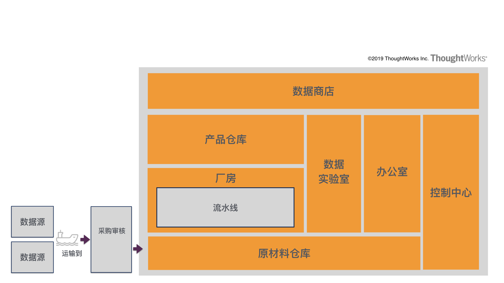

# 中台种类：你听说的中台真的是中台吗？

上一讲我带着你一起重走了近十年的中台发展之路，从时间的维度了解了中台发展的背景，也帮你分析了中台兴起背后的一些原因。

不过最后的时候我们聊到，直到目前，中台的概念仍然存在着很多迷雾，中台到底是什么？中台到底该长什么样子？有哪些种类？对企业到底有什么价值？我需不需要建中台？这些问题在你心中可能仍然没有确切的答案。

今天我就带你一起看一看，截至目前出现过的一些不同种类的中台，看看从这些看似不同种类的中台背后，我们能不能找到一些共同的特点。下一讲我会带你一起来探寻中台的本质，来解答你心中的疑惑。

至于中台的分类，我把目前出现的这些中台分为「主流」和「非主流」两类，下面就带你一一来看。

## 主流代表：业务数据双中台

###  业务中台

业务这个词，其实是有些宽泛的，我听到很多人口中说的业务都不是一个概念。为此，我还特地做了一些功课。业务，更白话一些来说，**就是为了售出产品、换取利润，各行业中需要处理的商业上的相关事务**。所以在早期我们通常会把于销售叫作业务员。

网易副总裁汪源就曾在网易云创峰会上提到过：「所有的中台都是业务中台」。对于这个提法，我也是认同的，因为从广义上来看所有的中台，不论是业务中台还是数据中台，亦或其他，都是为业务，为企业可以更好地以更低的成本、更高的质量、更快的响应速度售出产品、换取利润服务的。

换个角度看，从企业架构的层面看，应用架构、技术架构、数据架构都是要匹配公司的业务架构的，因为 **业务**，即售出产品、换取利润是企业的核心目标。

好，既然所有的中台都是业务中台，那我们经常提到的业务数据双中台中的业务中台，这里的究竟代表的是什么呢？依我来看，**我们常提到的业务中台，是狭义层面的业务概念，业务中台需要具体承载支撑业务开展的必要业务元素，封装着为了保障业务可以顺利开展需要解决的必要问题空间的解决方案**。

这么说可能会比较空，我有一个技巧，当我思考业务中台时，我会不断地问自己一个问题：**企业的业务能够顺利开展，需要解决哪些核心问题？**

比如电商的场景，如果我是一家电商企业，我业务要顺利开展，即把我的产品卖给用户，换取利润，一般要解决的核心问题无非包含：

- 我的用户是谁？从哪里来？
- 我卖的产品是什么？从哪里来？
- 怎么让用户知道我卖的产品？
- 用户为什么会买我卖的产品？
- 用户怎么买？
- 货怎么送？
- 用户怎么退换货？
- 怎么才能让用户不断地买？

这些就是一个电商业务能够正常开展所需要解决的最基本最核心的问题，在 DDD（领域驱动设计）中，对于这些企业业务开展需要关注的核心问题空间有个专有名词，就是 **问题域**。大家常说的用户域、订单域等等的叫法也来源于此。

而对于一家电商企业的不同业务线，大多是因为卖的产品不同，或是卖的区域不同，用户群体不同，但是这些问题也都是要解决的，**大多数情况下解决的方法也是相通和类似的**。这就是业务中台之所以能够存在的原因。

所以，我们 **常提到的业务中台，可以理解成狭义的业务中台**，**通过将不同业务线解决相同问题域的解决方案进行抽象与封装，通过配置化、插件化、服务化等机制兼顾各条业务线的特性需求，实现对于不同业务线的业务支撑**。

### 数据中台

讲完了业务中台，我们再来看目前热度最高的数据中台。数据中台为什么这么火热？我总结下来主要是这么几个原因。

1. 见效快。目前大部分传统企业的问题还在于数据不通，“数据孤岛”现象比较严重，数据中台的建设对于痛点的解决直接，驱动力强。
2. 组织调整负担小。一般来说，有一定规模的企业都已经有了大数据团队或是 BI 团队，这个团队自然就承载着相关的职能，不需要再做大的组织调整。
3. 有一定技术基础储备。大部分企业都进行了多年的数据仓库建设，或是随着前几年大数据的浪潮，已经构建了多年的大数据技术平台。
4. 大势所趋。大家都在讲 DT（Data Technology）时代，对于数据的价值，企业的认识也越来越深刻，大家已经意识到数据不再只是一种运营辅助分析的工具，而逐渐成为企业的核心资产和竞争力。

组织变动小，技术也有了基础，痛点明显，成本低，见效快，又是大势所趋，那么数据中台成为人们关注的热点也就不为怪了。

但是，既然现在都在提 **业务数据化，数据业务化**，既然两个概念也在相互转化和融合，那数据中台与业务中台之间又是什么关系呢？究竟什么才是数据中台？跟过去建设的数据仓库和大数据平台又有什么区别和联系呢？

相信，这些也是很多关注数据中台的同学特别在意的问题。

关于业务中台与数据中台的关系，我比较赞同阿里巴巴技术方案总监谢纯良在一次 InfoQ 采访中提到的观点：「**业务中台就是在产生数据，数据中台是做数据的二次加工，并将结果再服务于业务，为业务进行数据和智能的赋能。**」

而对于数据中台与传统数仓和数据平台的区别，关键在于数据中台相对于数仓、大数据平台，向前台、向业务又迈出了一步，不再只是关心技术层面大数据底座的打造，同时开始更多地关注企业层面的数据治理以及数据资产化的内容：包括但不限于数据的资产化管理（质量、成本、安全），数据服务的构建，数据的体系化建设（统一模型和指标）等。

为了方便理解，在 ThoughtWorks 我们经常把数据中台比喻成一个数据工厂，通过 **收集到原材料仓库，经过厂房流水线的数据加工，最终作为数据产品进入到产品仓库，通过数据商店，以各种方式（例如数据 API 的方式）对于前台或是业务中台赋能，整个过程通过控制中心进行协调调度**。

这个比喻形象生动地体现了数据中台对于数据的二次加工的过程，同时还描述了通过数据实验室承载为数据赋予智能，通过办公室完成数据的治理与资产化的相关处理。

介绍完了我们最常见的业务数据双中台，这里做个小结。

业务中台与数据中台相辅相成，互相支撑，互为输入输出。

- 业务中台承载了企业的通用业务能力，为多业务线赋能；
- 数据中台通过对于业务数据的二次加工，并反馈回业务中台，为业务进行数据和智能方面的赋能。

两者的紧密配合一起为企业构建起了商业战场强大的后方炮火群，这也就构成了最著名的业务数据双中台模式。

## 非主流系列

在业务数据双中台之外，还出现过各式各样的中台，而这些中台的出现也让原本还比较清晰的中台概念变得有些模糊。那接下来我就快速为你介绍一些这几年我所接触过的中台，在我讲述的过程中，你也可以思考一下，这些中台中哪些是李逵，而哪些是李鬼，谁才真正配得上中台的称号，谁又是来蹭流量的。

### 技术中台

除了业务数据双中台，最常被提到，在我看来介于主流和非主流之间的就得属技术中台了。技术中台相比业务中台和数据中台，边界也会更加清晰，简单来讲就是 **在 CloudNative 下将使用云或其他基础设施的能力、各种技术中间件的能力进行整合和包装。过滤掉技术细节，提供简单一致、易于使用的应用技术基础设施的能力接口，助力前台和业务中台、数据中台的快速建设**。不过业界也有说法，认为技术中台没有很强的业务属性，只是一些中间件的集合，顶多算是个中间件平台而已，称不上中台，你怎么看呢？

### 研发中台

软件开发是一项工程，涉及到管理、流程、测试、团队协作等等方面。如何将企业的开发流程、最佳实践沉淀成可重用的「能力」，从而助力创新性应用的快速开发迭代，也是我们看到的很多企业正在做的事情，我们可以管这种关注开发效能管理的平台叫作研发中台。

### 移动中台

在移动互联网时代，移动优先的原则已经成为不争的事实，将 App 开发过程中的通用技术组件进行封装沉淀到移动中台中，就可以在构建新的 App 时大量复用已有组件和能力，快速构建和响应。

### 管理中台

最近很多企业开始尝试把中台思维应用到企业内部，重新对人、事、流程、企业运营进行平台化 / 中台化改造。试图通过中台化建设，加速企业管理标准化和提升运营能力

### 组织中台

在穆胜老师的书《释放潜能：平台型组织的进化路线图》中，通过分析了海尔平台化组织的演进过程，他提出了组织中台的概念。**组织中台很像企业中的内部风投和创新孵化机构**，为前台组织和团队构建创新型前台应用提供类似于投资评估（项目甄别）、投资管理、投后管理（孵化与风控），真正从组织和制度上支撑前台组织和应用的快速迭代和规模化创新。

好了，非主流系列我们就介绍到这里。其实远远不止这些，其他还有像财务中台、采购中台、供应链中台、AI 中台、运营中台、安全中台、管理中台等等，也曾出现在我们的视野里，今天就不一一展开了。

## 总结思考

最后来做个总结。这一讲我带着你一起纵览了一下现在市面上比较常见的中台种类，此时的你可能比之前感觉更蒙了，原来还有这么多不同种类的中台存在，到底哪个是李逵那个李鬼，也傻傻分不清楚。而中台到底是什么这个终极问题，此时也一定还缠绕在你的脑海里。

不用担心，通过前两讲的发散，我想让你和我一样，先把视野打开，从时间的维度和空间的维度先建立起一个全局观，下一讲我们就将做第一次收敛，来探究中台的本质。

最后，给你留几个思考题：

- 你自己企业有中台吗？是哪种类型？
- 对于以上提到的这些中台，你是否也有不同的理解？
- 除了我们今天讲到的，你还见过哪些种类的中台？
- 你自己是否有一个标准来判断哪些是中台？
