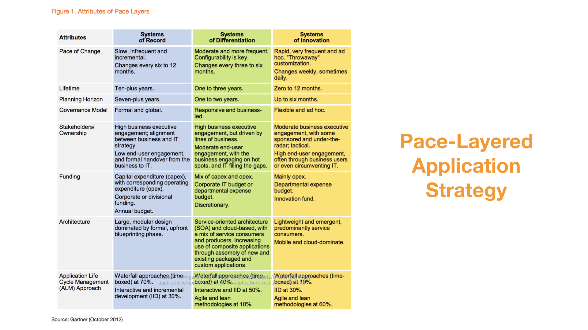

# 中台定义：当我们谈中台时到底在谈些什么？

前面两讲，我带你从时间维度重新走了一遍中台的发展历程，又在空间维度为你介绍了目前市面上出现过的各类中台。

估计你现在一定被这么多种类的中台搞的有点晕头转向了，这些中台都称的上是中台么？**感觉和之前一直在做的平台也没有什么两样啊？**

这也是我过去几年一直在内心不断问自己的问题。这一讲作为概念篇的最后一篇，我就试着带你跳出时间与空间的维度，来分析一下企业为什么要建中台？当我们谈中台时，我们到底在谈些什么？

## 企业为什么要建中台？

我们先来看企业为什么要建中台？想要回答这个问题，咱得先解决另一个问题，那就是企业为什么需要平台化？

企业为什么需要平台化呢？先给我的答案：

**因为在当今这样一个互联网时代，用户才是商业战场的中心，为了快速响应用户的需求，借助平台化的力量可以事半功倍。**

这背后的逻辑很简单，不断地快速响应、探索、挖掘、引领用户的需求，才是企业得以生存和持续发展的关键因素。

那些真正尊重用户，甚至不惜调整自己、颠覆自己来响应用户的企业，将在这场以用户为中心的商业战争中得以生存和发展。反之，那些在过去的成就上故步自封，存在侥幸心理希望用户会像之前一样继续追随自己的企业，则会被用户淘汰。

很残酷，但这就是这个时代最基本的的 **企业生存法则**。

而平台化之所以重要，就是因为在这场以用户为中心的现代商业战争中，它赋予或加强了企业最核心的能力：**用户响应力**。平台化思想（Platform Thinking）恰好鼓励企业不断抽象沉淀自己核心的底层能力，通过平台化包装，得以更好地赋能前台业务，用底层的确定性来帮助企业应对前台业务以及最终用户需求的不确定性。

从结果来看，在不确定性当道的当今商业战场，真正的弄潮儿也大多是那些具备平台化思维并很早就开始发力平台建设的企业，这也在一定层面上佐证了平台化对于一家企业的重要性。

好，现在我们想明白了第一个问题，企业为什么需要平台化。但是平台化并不是一个新概念，很多企业在这个方向上已经做了多年的努力和积淀。那为什么最近几年「中台」这个相对较新的概念又会异军突起？对于企业来讲，传统的「前台 + 后台（或是平台）」的平台化架构为什么不能满足企业的要求呢?

这就引出了我们的核心问题：企业为什么要建中台？

同样，先给我的答案：

**中台化是平台化的下一站，是平台不断对于自身治理演进、打破技术边界、逐渐拥抱业务、容纳业务、具备更强的业务属性的过程。中台关注为前台业务赋能，真正为前台而生。**

为了能够更清楚地讲解我的观点，这里需要先定义一下，在今天我们讨论的上下文下，前台和后台分别指什么。

- 前台：由各类前台系统组成的前端业务平台。每个前台系统都是一个用户触点，大多是企业最终用户直接使用的系统，是企业与最终用户的交点。例如用户直接使用的网站、手机 App、微信公众号、小程序等都属于前台范畴。
- 后台：由后台系统组成的后端支撑平台。每个后台系统一般管理了企业的一类核心资源（数据 + 计算），例如财务系统、产品系统、客户管理系统、仓库物流管理系统等，这类系统构成了企业的后台。（在和很多互联网的朋友聊过之后，在互联网企业很多并没有后台的概念，更多直接使用平台的概念，例如分为前台层和平台层，但位置和作用与传统企业里的后台相似，我这里直接统一使用后台这个概念来代表。）

定义了前台和后台，我们再回过头来看企业为什么要建中台这个问题。

我们看到很多企业的后台，在创建之初的目标，并不是主要服务于前台系统的业务创新，而更多的是为了实现后端资源的电子化管理，解决企业管理的效率问题。这类系统要不就是当年花大价钱采购的套装软件，需要每年支付大量的服务费，并且版本有的也已经非常老旧了，定制化困难；要不就是花大价钱自建，年久失修，一身的补丁，同样变更困难，基本改不动了，也是企业所谓的「遗留系统」的重灾区。

可以这么说，大多数企业已有的后台，要么前台根本就用不了，要么不好用，要么变更速度就根本跟不上前台业务发展的节奏。总结下来就两个字「慢」和「贵」，对业务的响应慢，动不动改个小功能就还要花一大笔钱。

有人会说了，你不能拿遗留系统说事儿啊，我们可以新建后台系统啊，整个 2.0，问题不就解决了？

这是一种解决问题的思路，不过就算是新建的后台系统，因为后台管理的往往是企业的关键核心数据，考虑到企业安全、审计、合规、法律等限制，这样的系统也往往⽆法被前台系统直接使用，或是受到各类限制⽆法快速变化，不能⽀持前台快速的业务创新需求。

此时的前台和后台就像是两个不同转速的齿轮，前台由于要快速响应前端用户的需求，讲究的是快速迭代创新，所以要求转速越快越好；而后台由于面对的是相对稳定的企业核心后端资源，而且往往系统陈旧复杂，甚至还受到法律法规、审计等相关合规约束，一般是追求稳定至上，越稳定越好， 转速也自然是越慢越安全。

所以，随着企业业务的不断发展，这种「前台 + 后台」的齿轮速率「匹配失衡」的问题就逐步显现出来了。

企业业务不断发展壮大，后台修改的成本和风险越来越⾼，这就驱使我们尽量保持后台系统的稳定性，但同时还要响应用户持续不断的需求，怎么办？最自然的就是将大量的业务逻辑（业务能力）直接塞到前台系统中，因为前台离用户近，响应也相对快。

但是这样也是有代价的，这样的后果就是引入重复，同时还导致前台系统不断膨胀，变得臃肿，形成了一个个大泥球的「烟囱式单体应用」。这个局面的结果就是，前台系统的「用户响应力」被渐渐拖垮，用户满意度逐渐降低，企业竞争力也随之不断下降。

对于这样的问题，Gatner 在 2016 年发布了一份报告 Pace-Layered Application Strategy。报告中给出了一种解决方案，即按照「步速」将企业的应用系统划分为三个层次（正好契合前中后台的三个层次），不同的层次采用完全不同的策略。

而 Pace-Layered Application Strategy 也为「中台」产生的必然性，提供了理论上的支撑。

在这份报告中，Gatner 提出，企业构建的系统从 Pace-Layered 的角度来看可以划分为三类：

- SOR（Systems of record ），
- SOD（Systems of differentiation）
- SOI（Systems of innovation）

每一类的系统都有着不同的变化速率，因此也会有不同的生命周期，适合不同的技术架构和不同的开发过程，甚至是采用不同的投资模式。

回到之前说的 **后台与前台的两层架构**，如果映射到这个模型上其实就是只有 SOR（后台）与 SOI（前台）的两层应用架构。这样的情况下，我们又要尽力保持后台（SOR）系统的稳定可靠，⼜要前台系统（SOI）能够⼩而美，快速迭代。因此就自然出现了上文提到的「齿轮匹配失衡」的问题，感觉鱼与熊掌不可兼得。

怎么办？Pace-Layered 中的 SOD 就是答案，它提供了比前台（SOI）更强的稳定性，以及比后台（SOR）更高的灵活性，在稳定与灵活之间寻找到了⼀种美妙的平衡。

中台就是 SOD。有了这层「中台」，我们既可以将早已臃肿不堪的前台系统中稳定通用的业务能力「沉降」到中台层，为前台减肥，恢复前台的响应力；又可以将后台系统中需要频繁变化或是需要被前台直接使用的业务能力「提取」到中台层，赋予这些业务能力更强的灵活度和更低的变更成本；或者干脆直接对于后台进行中台化改造，通过配置化、自助化、白屏化等形式为后台加速，从而为前台提供更强大、更迅捷、更易用的「能力炮火」支援。

中台就像是在前台与后台之间添加的⼀组「变速齿轮」，将前台与后台的速率进行匹配，是前台与后台的桥梁和润滑剂。它为前台而生，易于前台使用，将后台资源顺滑地通过前台导流向用户，支撑企业更好地响应用户。

好了，现在我们可以小结一下，回答企业为什么需要建中台这个问题了。很简单，企业在平台化的过程中，为了能不断地给前台业务提供更好的服务，来支撑企业对于用户的持续响应，增加企业的用户响应力，企业需要构建自己的中台。

## 给中台下个定义

讲了这么关于中台的来龙去脉，以及种种表现形式，也讲了我对于企业平台化与中台化的理解，但你可能仍然会觉得比较抽象，所以我想，一定要试着给中台下个定义。

为什么需要一个定义呢？倒不是因为别的原因，我是觉得需要给自己一把简单的尺子，让我能轻易记住中台的特性，并能用它来快速判断一个所谓的中台是不是满足我对于中台的理解，所以我给中台的定义就是：**企业级能力复用平台。**

很简单，是不是有点失望？但是为了找到一个我觉得还靠谱的定义，我几乎花了快两年的时间，期间有各种各样的定义曾浮现出来，但至少到目前为止，我觉得只有这个定义最贴切、最简单、也最准确，它能解释几乎所有我碰到的关于中台的问题，例如：

- 为什么会有那么多中台？
- 中台化与平台化的区别是什么？
- 中台化和服务化的区别是什么？
- 中台该怎么建设？
- ……

这 9 个字看起来简单，重要的是其背后对「中台」价值的阐释，下面就让我为你一一拆解来看。

### 1. 企业级

企业级定义了中台的范围。不是说一个企业只能有一个中台，也不代表一个中台就是只能包含一家企业，企业级更多代表的是中台处理的问题在企业级别，即至少包含多条业务线或服务多个前台产品（团队），如果一个中台只为了支持一条业务线或产品线，那就不是中台，即使它用了服务化或是大数据等技术。

**企业级这一点非常非常重要**。它让我想清楚了，中台建设的事情并不是一个技术问题，而是一个要上升到企业架构的问题。**做中台建设的时候，一定是跳出单条业务线、站在企业整体视角来审视业务全景**。

想清楚了这一点，我对中台的理解就有了一次质的变化，也终于知道为什么一开始用做系统服务化的方式做中台会面临那么多的问题，比如最常见的组织和干系方以及利益再分配的问题。

从中台的兴起与爆发我们也能看到一个趋势，就是越来越多的企业，无论是想提升自身的运营效率，还是出于业务创新发展的需求，都已经把企业全局视角、跨业务线的能力沉淀，提到了前所未有的战略高度。

### 2. 能力

提到中台，最常听到的一个词就是「能力」。可能是因为能力这个词足够简单，又有着足够的包容度与宽度。

能力定义了中台主要承载的对象。

能力的抽象解释了为什么会有那么多种类中台的存在，也能解释为什么每家企业的中台都不一样，因为不同的企业之所以能够同时存在，就是因为其核心能力不同，可以满足用户不同层面的需求，也就是我们常说的差异化竞争力。

### 3. 复用

复用定义了中台的核心价值，也承载了上面讲到的从平台化到中台化的演进过程。传统的平台化对于「可复用性」和「易复用性」并没有给予足够的关注，更多关注的是如何消除掉重复的能力建设，既所谓的「去重」。

但中台的提出和兴起，体现出一种对于前台业务的使用体验更加关注的趋势。让人们通过对于「可复用性」和「易复用性」的关注，**将目光更多地从平台内部的建设转换到平台对于前台业务的支撑上**。这里有一个从治理到赋能的视角转换，既从「去重」到「复用」的关注上。

「去重」与「复用」虽然经常一起出现，一起被提及，但是谈论的完全不是一件事情，目的不同，难度也不同。

- 「去重」讲的更多是向后看，是技术驱动的；
- 「复用」讲的更多是向前看，是业务驱动和用户驱动的。

而正这个视角的转变，我认为是理解中台概念的关键，所以

- 「复用」是中台更加关注的目标；
- 「可复用性」和「易复用性」是衡量中台建设好坏的重要指标；
- 「业务响应力」和「业务满意度」是考核中台建设进度的重要标准。

这也能解释为什么很多互联网企业，将对于平台的治理，通过业务抽象以及可配置化和白屏化的改造升级，把这个过程称之为对于平台的中台化改造过程。

### 4. 平台

平台定义了中台的主要形式。区别于传统应用系统拼凑的方式，中台通过对于更细粒度能力的识别与平台化沉淀，实现企业能力的柔性复用，更好地支撑前台业务，来满足对于业务的快速响应和复用的需求。

「**企业级能力复用平台**」这个定义虽然看起来简单，但经过这么长时间对于中台的实践与思考，我觉得这个定义背后所代表的意义是目前对中台价值的最贴切的阐释。

- **企业级**：定义了中台的范围，区分开了单系统的服务化与微服务；
- **能力**：定义了中台的主要承载对象，能力的抽象解释了各种各样中台的存在；
- **复用**：定义了中台的核心价值，传统的平台化对于易复用性和前台的用户体验并没有给予足够的关注，中台的提出和兴起，让人们通过可复用性将目光更多的从平台内部设计转换到平台对于前台业务的支撑上；
- **平台**：定义了中台的主要形式，区别于传统的应用系统拼凑的方式，通过对于更细粒度能力的识别与平台化沉淀，实现企业能力的柔性复用，更好地支撑前台业务。

## 总结思考

今天我们从企业为什么需要平台化入手，讨论了企业又为什么需要建中台。结合前两讲的内容给出了我的观点，不知道对你有没有启发，让我最后再来总结一下。

**以用户为中心的持续规模化创新**，是中台建设的核心目标。企业的用户响应能力和规模化创新能力，是互联网时代企业综合竞争力的核心体现。**平台化包括中台化只是帮助企业达到这个目标的手段，并不是目标本身。**

中台（⽆论是技术中台、业务中台还是组织中台）的建设，根本上是为了解决企业响应力困境， 弥补创新驱动需要快速变化的前台和稳定可靠驱动需要变化周期相对较慢的后台之间的矛盾，提供⼀个中间层来适配前台与后台的配速问题，打通并顺滑链接前台需求与后台资源，帮助企业从整体上不断提升用户响应力。

所以，**中台到底是什么根本不重要，如何想方设法持续提高企业对于用户的响应力才是最重要的**。而平台化或是中台化，只是恰巧走在了这条正确的大道上。

最后我们给中台下了一个定义，既 **企业级能力复用平台** 。有了这个定义后，我们不仅可以把它当作一把尺子来丈量一个中台是否货真价实，对于如何建中台的思路也能豁然开朗。

因为如果说「中台就是企业级能力复用平台」的话，那「中台化」也就是「**利用平台化的思维和手段梳理、识别、沉淀与复用企业级核心能力的过程**」。

好了，从下一讲开始我们就正式进入落地篇，一起来看看我们是如何规划与落地实施中台的。

最后，给你留几个思考题：

- 你的企业真的需要中台吗？
- 如果让你用一句话来给中台下个定义，你会怎么讲？
- 在你所在的企业，中台是解决方案还是问题本身？

## 拓展阅读

- 所谓的 BFF 是否算是一种「中台」呢？

  首先这两者不在一个抽象层次上，解决的问题也不同，BFF 更多是技术架构层面，中台更多是在应用架构层面。

  但是，我之前也用 BFF 来类比过中台，主要为了让技术同学们理解「向前看」这个概念。

  不过后来觉得还是有一些不同，主要在于 BFF 和中台虽然都强调「向前看」，但 BFF 往往是专注于服务一个前台；而中台的特点就是通过抽象后可以同时服务多个前台。

  如果非要类比的话，更像是由 GraphQL 实现的统一 BFF 层

