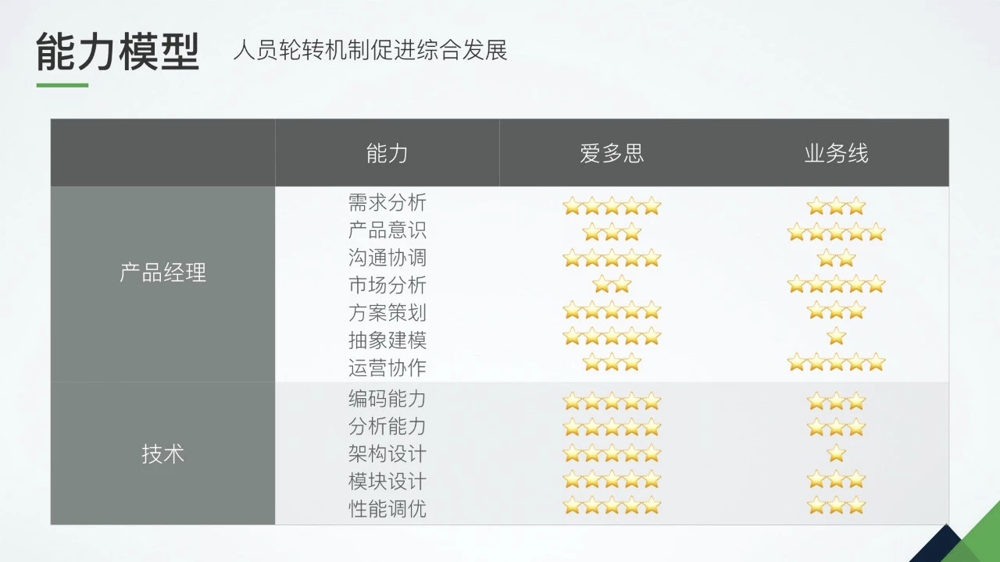
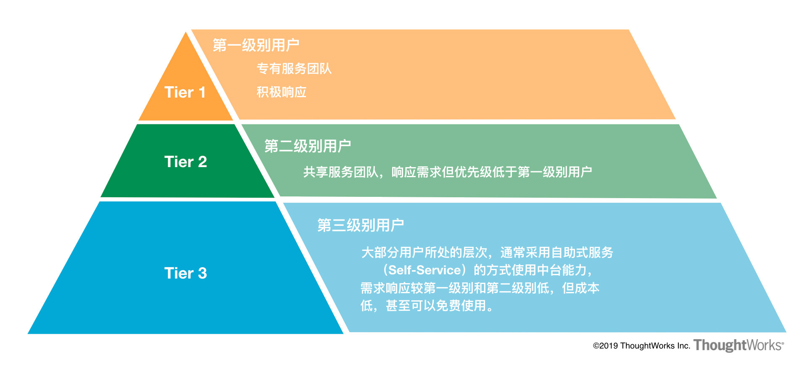

# 中台落地第四步：中台的建设与接入 Delivery

通过上一节课介绍的内容，我们最终拿到了一个 **作为切入点的中台场景**，并且通过业务梳理识别出对于 **数据、流程、功能的复用需求**，并结合 MVP 原则，找到第一个快速验证的需求集，结合前台的接入条件，形成了第一个小的中台建设冲刺计划，并以终为始，在开始前确定好中台建设的验证指标，有了需求、计划、验收条件。

如果能够顺利通过企业内部的立项审核和流程，那么恭喜你，你已经有了第一个正式的中台项目。

接下来就进入了 D4 的第四个阶段，也就是最后一个但可能也是时间最长的交付阶段了。

而交付的第一步一定是要组建一支有战斗力的队伍，中台的建设需要的能力与传统产品还是有比较大的差别。给你分享一个孙志岗老师的 **中台人员能力模型**，我认为非常有启发，希望也能帮助你理解中台对于团队能力的要求。这个模型孙老师写过一篇文章，文章中还提到了中台建设过程中一些难点，我会把文章统一放到最后一篇总结中作为扩展阅读推荐给你。

模型中的「爱多思」指的是网易教育中台。

当组建了一支成型的中台建设团队之后，其实后续的建设工作就和我们一般的项目或产品的建设过程类似了。但是因为中台所处的特殊位置，对产品界定要求和对建模的难度，都比其他终端产品的复杂度要高一个级别，所以我们建议采用 **精益的产品研发流程**，保持小步迭代、快速建设、快速度量、快速反馈、快速调整的流程，保证中台建设是一个持续演进和被业务驱动的过程。

## 精益产品研发流程

这里叫精益产品研发流程，**主要是面对中台建设过程中的不确定性，引入精益思想来实现价值的定义和快速流动及度量，再结合敏捷开发实践，让整个软件开发过程轻量、迅速、敏捷、价值驱动**。

精益这个词相信你应该并不陌生，上一讲我们讲到的 MVP 就来自于精益创业。市面上大家还经常提到精益软件开发、精益生产制造等等，本质上都是将精益思想作用于某一个垂直领域的成果。

精益思想之所以流行，关键在于其定义了一套完整的思想框架，而最终核心目标就是消除浪费、创造价值。在中台的实际建设过程中，我们也建议引入精益思想，结合到软件的开发过程中，小批量快速开发产品，快速引入度量，基于测量的数据快速对于之前的需求假设进行验证和认知，并基于此做快速的调整。

这里你可能会有个疑问，敏捷和精益到底有什么区别？

其实精益和敏捷现在确实是常常掺在一起来讲的，我发现很多时候大家并没有搞清楚两者的区别。简单来讲，**敏捷关注的是价值确定的情况下，如何通过小步快跑的迭代方式按节奏交付价值；而精益关注的则是在价值并不确定的情况下，如何用最小成本，快速定位到真正价值点**。

我们发现，由于中台建设的复杂度非常高，所以将精益思想结合敏捷思想应用到中台的建设和开发过程，再配合后边马上会谈到的中台运营机制的建立，可以让我们更好地应对中台建设过程中的各种问题，例如最经典的中台边界界定问题。

至于我们具体的做法，你可以参考下图，其中涉及的工具和实践都是比较成熟了，这里就不做展开了。其中最主要的就是通过数据运营，也就是基于度量指标的持续验证，来对之前做的需求价值假设做快速验证，并且不断调整，在精益思想中就叫尽善尽美。而团队要做的就是不断地加速这个反馈环路的运转速度。速度越快，我们应对不确定性的能力就越强，交付中台产品价值的能力也就越强。

当然整个过程是一个复杂的系统性工程，一般都会涉及到像云化工程，微服务及服务化能力构建，Devops 相关能力构建，数据运营能力构建，敏捷精益过程改进，遗留系统服务化改造，架构守护与演进，以及与中台相关的治理与运营架构构建等工程。

## 中台的运营、治理与演进

除了中台的建设过程，同样不能忽视的就是对于中台建设过程中的持续治理及演进，以及真正接入了前台之后对于中台的运营管理。

目前市面上我们碰到的很多中台建设过程中的困难和问题，在我看来都是没有做好中台的治理与运营导致的。对于中台的整体治理和运营机制，目前业界的理解也不太一致，毕竟中台作为一个企业的平台类产品，服务的不是企业的最终用户，所以和互联网里经常提到的基于产品的用户侧运营还不太一样，中台在位置上更像是企业内部的一个服务企业前台应用的 ToB 产品。

而对于企业内部的 toB 平台类产品如何做运营，也是目前业界比较关注的点。今天我就讲几点我认为比较关键的部分，注意这几个问题，能让我们在中台建设过程中少走一些弯路，少遇到一些坑。

而第一步要搞清楚的，就是 **中台产品的用户划分**。

看到这里相信你肯定会疑惑，中台作为企业内部的平台类产品，所有的前台都应该是中台的潜在用户，尤其又都是自己企业内部的兄弟部门，为什么还要为前台用户做划分呢？

这就是有意思的地方，也是我在过去中台建设过程中吸取的教训。一开始我们在中台建设过程中，也并没有对于前台做任何划分，一视同仁、平等对待。

但是中台作为一个公共服务部门，一定会碰到多个前台的需求、排期、质量要求、非功能需求出现不同的情况，甚至也会经常出现多个前台之间的需求或是非功能性需求彼此矛盾的时候。而中台的资源有限，且有自己的愿景，不可能无条件地满足所有前台用户的诉求，往往就会陷入疲于应对的状态，对前台的响应和服务质量也会急速降低。

怎么办呢？问题的根本在于，虽然我们说中台是企业级能力复用平台，但我们经常会忽略的一点就是，如果我们采用产品化的思维来构建中台，那中台中所沉淀的能力并不是产品的全部，还需要再加上 NFR（非功能性需求）或是我们常说 SLA（Service-Level Agreement，服务等级协议）才是产品，因为不同的前台用户之间，不只是对于中台产品的功能本身有着不同的诉求，同样对于 NFR 或是 SLA 也有着不同的诉求。简单举个例子，比如核心业务对于中台的 SLA 稳定性的要求可能是 5 个 9，性能是 5 毫秒；而一个新的创新型应用，可能还没有用户，就不需要有这么高的要求。

**Offering = Capability + SLA/NFR**

既然如此，如何利用有限的资源，服务好不同用户的不同诉求呢？答案就是对于前台用户基于需要的能力和 NFR/SLA 做用户划分。这听起来可能会觉得有些新鲜，但是其实环顾一下我们周围，很多的产品都是这样来处理用户划分，从而实现用户的分层响应与运营的。

而最常见的就是 **三层用户划分机制**（3 tiers customer segmentation）。通过对于前台用户的分层，我们就可以为不同层次的用户指定不同的需求响应机制、不同的沟通管理机制、不同的服务质量控制机制、不同的问题处理及升级机制等等。自然不同的服务类型作为前台用户也需要付出不同的成本或是资源（人或钱），甚至前台与中台可以通过签署 SLA 来实现对于前台用户的服务承诺。

举个例子， 当我们开始中台建设时，可以只找到一个或是两个种子用户，作为 Tier1 级别的用户来服务。对于这个种子用户的需求作为最高优先级的需求来对待，并建立例行的沟通机制和服务响应机制。因为此时的服务还处于初建时期，还不是特别的成熟，所以可以采用「免费」的方式动用企业的战略资源来进行建设。这样，对于前台用户来讲，资源是免费的，而且是一对一式服务，自然也会乐意配合到中台的建设过程中。

当中台建设到一定阶段之后，对于种子用户的服务已经接近稳定，有了一定的能力沉淀，也能释放出一定的资源了，就可以利用释放出来的资源开始为 Tier3 层的用户构建自助服务控制台（Self-Service Console），并着手构建中台产品的运营团队，制定 Tier3 层的 NFR/SLA。在很多互联网企业，这个过程常常由于做出来的自助服务控制台比较粗糙，看起来也像是对于平台服务的增强和可用性优化和治理的过程，大多数就是一个白屏幕，加一些的配置选项，所以常被称为 **平台的白屏化**。

当中台的自助服务控制台创建完成，Tier3 层次的 SLA 也构建完成后，我们就可以重新签订 SLA，将之前的 Tier1 用户迁移到 Tier3 层次，即完成之前种子用户从定制化服务到自助式服务的迁移过程，从而释放出更多的资源用于接入新的前台用户。

如果由于种种原因，无法一步到位实现服务的完全自助化，还可以通过构建 Tier2 层的 SLA，也可以通过重新签订 SLA，将之前的 Tier1 用户迁移到 Tier2 层次，通过「自助 +VIP 服务」的方式，保持对前期种子用户服务连贯性的同时释放出尽可能多的资源。

此时我们就已经有了三层的用户划分机制，可以在企业内更大范围地发布 Tier3 的自助式服务，通过这种方式实现更多用户的接入。同时，因为已经释放出一些中台的资源，我们就可以继续选取下一个关键的种子用户（一般是关键业务），作为新的 Tier1 级用户开始第二轮中台建设的推进。

至此，通过中台的用户分层和运营机制，就可以构建不同层次的运营体系，从而实现资源的合理调配。我们也就避开了前面提到的中台建设过程中的各种问题和陷阱，对用户分级运营，从而解决需求矛盾、排期冲突、资源紧张、推广缓慢等问题。

## 总结思考

本次课我们从一个中台项目的启动开始，引入了精益产品研发流程，把精益思想和敏捷实践结合到中台的研发建设过程之中，加快价值流动、快速反馈、快速调整，从而更好地应对中台建设过程中的复杂度和不确定性。

之后我又给你分享了中台建设过程中的运营与治理机制。我并没有深入到运营机制的细节之中，而是从整体思路上，强调了如何对用户进行分层治理，合理调配精力与资源，通过用户的分层 SLA 机制来实现中台建设的平滑推进以及产品化演进。

所以，最后还是要强调一下，中台建设的过程是一个长期且艰苦的过程，不但需要企业具备技术、业务、组织的基础，还需要做好持续探索和演进的决心、耐心和准备。

最后给你留几个思考题：

- 你所在企业的中台建设过程是什么样的？与文中提到的方法有哪些相同和不同呢？
- 你所在企业的中台运营与治理机制是什么样的？有没有做用户划分？是不是存在文中提到的一些需求排期冲突、资源不够、响应变慢等问题呢？