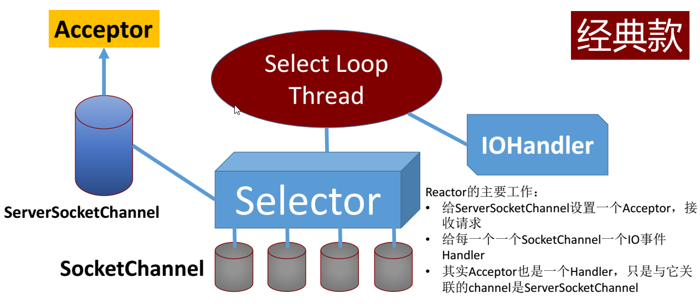
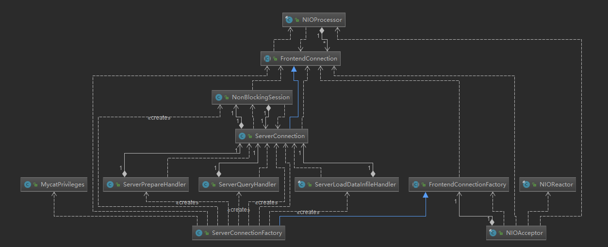
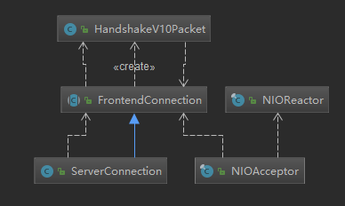

# 前端连接交互探索

前端连接探索之前需要先了解 mysql 协议，了解使用 reactor 模型是怎么和 mysql 服务器交互的，
因为前端连接是模拟 mysql 服务器，和连接到 mycat 的应用进行交互。

> [mysql 协议中初体验](https://github.com/zq99299/hp-note/blob/master/chapter/mysql/client_server_protocol/Overview/index.md)
> 建议去官网先查看文档，先把怎么解析握手包，怎么发送认证包搞定，
>
> 也就是下面 <<初级尝试与 mysal 交互>> 中尝试的 demo 程序


> [mysql 协议中的基本数据类型](https://github.com/zq99299/hp-note/blob/master/chapter/mysql/client_server_protocol/overview/basic_types.md) 在解析和构建包的时候，这两个基本类型是使用频率最高的

> [初级尝试与 mysal 交互](https://github.com/zq99299/newstudy/blob/master/hp-base/src/test/java/cn/mrcode/newstudy/hpbase/mysql/TestDemo.java) 怎么解析握手包，发出登录认证包


> [简化版完整交互应用](https://github.com/zq99299/newstudy/blob/master/hp-base/src/test/java/cn/mrcode/newstudy/hpbase/mysql/mymysql2/NIORactorTest.java) 接收 mysql 命令行的登录命令，执行 sql 查询命令 示例

## 基础知识
Reactor 模型



Acceptor 处理前端连接的入口类， 来分析 Acceptor 的源码  
## 初始化
io.mycat.MycatServer#startup 是 mycat 启动类，里面对 Acceptor 做了初始化操作。
```java


else {
     LOGGER.info("using nio network handler ");

     NIOReactorPool reactorPool = new NIOReactorPool(
         DirectByteBufferPool.LOCAL_BUF_THREAD_PREX + "NIOREACTOR",
         processors.length);
     connector = new NIOConnector(DirectByteBufferPool.LOCAL_BUF_THREAD_PREX + "NIOConnector", reactorPool);
     ((NIOConnector) connector).start();

     manager = new NIOAcceptor(DirectByteBufferPool.LOCAL_BUF_THREAD_PREX + NAME
         + "Manager", system.getBindIp(), system.getManagerPort(), mf, reactorPool);

     // 构建前端连接处理器
     server = new NIOAcceptor(DirectByteBufferPool.LOCAL_BUF_THREAD_PREX + NAME
         + "Server", system.getBindIp(), system.getServerPort(), sf, reactorPool);
   }

   manager.start();
   LOGGER.info(manager.getName() + " is started and listening on " + manager.getPort());

   // 处理器开始工作
   server.start();
   LOGGER.info(server.getName() + " is started and listening on " + server.getPort());

   LOGGER.info("===============================================");
```

构造

```java
public final class NIOAcceptor extends Thread implements SocketAcceptor{
	private static final Logger LOGGER = LoggerFactory.getLogger(NIOAcceptor.class);
	private static final AcceptIdGenerator ID_GENERATOR = new AcceptIdGenerator();

	private final int port;
	private volatile Selector selector;
	private final ServerSocketChannel serverChannel;
	private final FrontendConnectionFactory factory;
	private long acceptCount;
	private final NIOReactorPool reactorPool;

	public NIOAcceptor(String name, String bindIp,int port,
			FrontendConnectionFactory factory, NIOReactorPool reactorPool)
			throws IOException {
		super.setName(name);
    // 经典的构造方式
		this.port = port;
		this.selector = Selector.open();
		this.serverChannel = ServerSocketChannel.open();
    // 同步处理
		this.serverChannel.configureBlocking(false);
		/** 设置TCP属性 */
    //  如果端口忙，但TCP状态位于 TIME_WAIT ，可以重用 端口。
		serverChannel.setOption(StandardSocketOptions.SO_REUSEADDR, true);
    //   在默认情况下，输入流的接收缓冲区是8096个字节（8K）
		serverChannel.setOption(StandardSocketOptions.SO_RCVBUF, 1024 * 16 * 2);
		// backlog=100 当前 socket 连接上可以挂起的连接数量，也就是说
		serverChannel.bind(new InetSocketAddress(bindIp, port), 100);
		this.serverChannel.register(selector, SelectionKey.OP_ACCEPT);
		this.factory = factory;
		this.reactorPool = reactorPool;
	}
```

当有连接 mycat 的请求的时候，会执行

```java
private void accept() {
  SocketChannel channel = null;
  try {
    channel = serverChannel.accept();
    channel.configureBlocking(false);
    // 构造了一个前端连接对象
    FrontendConnection c = factory.make(channel);
    c.setAccepted(true);
    c.setId(ID_GENERATOR.getId());
    // 并且绑定了一个 处理器
    NIOProcessor processor = (NIOProcessor) MycatServer.getInstance()
        .nextProcessor();
    c.setProcessor(processor);

    // 处理读写事件的对象
    NIOReactor reactor = reactorPool.getNextReactor();
    reactor.postRegister(c);

  } catch (Exception e) {
        LOGGER.warn(getName(), e);
    closeChannel(channel);
  }
}
```

目前的代码完成了连接的注册，现在的类图如下


- NIOAcceptor ：前端连接处理
- NIOReactor ：处理读写事件，后续的客户端与 mycat 交互处理类
- FrontendConnection ：前端连接对象，可以想象成是一个数据库连接
- NIOProcessor ：该对象还需要后面源码分析才能明白作用是什么

## 构造 FrontendConnection 时做了什么

> socket 相关属性解说：http://elf8848.iteye.com/blog/1739598

`FrontendConnection c = factory.make(channel);`

是通过工厂构造的

```java
public abstract class FrontendConnectionFactory {
	protected abstract FrontendConnection getConnection(NetworkChannel channel)
			throws IOException;

	public FrontendConnection make(NetworkChannel channel) throws IOException {
    // 设置 socket 通道的属性，端口忙的时候可复用
		channel.setOption(StandardSocketOptions.SO_REUSEADDR, true);
		channel.setOption(StandardSocketOptions.SO_KEEPALIVE, true);

		FrontendConnection c = getConnection(channel);
    // 根据 mycat 的配置，这里就有点不理解了
    // 上面获取连接中已经设置过一次了，这里怎么还设置了一次？
		MycatServer.getInstance().getConfig().setSocketParams(c, true);
		return c;
	}
}
```

```java
public class ServerConnectionFactory extends FrontendConnectionFactory {

    @Override
    protected FrontendConnection getConnection(NetworkChannel channel) throws IOException {
        SystemConfig sys = MycatServer.getInstance().getConfig().getSystem();
        ServerConnection c = new ServerConnection(channel);
        // 设置 socket 相关操作参数
        // 并且初始化了一些 mysql 协议相关的参数，如
        // 最大包大小，包头大小，空闲超时时间，编码
        MycatServer.getInstance().getConfig().setSocketParams(c, true);
        // 特权相关操作支持，如 获取连接用户的表，权限等
        c.setPrivileges(MycatPrivileges.instance());
        // sql 命令处理器，如 select ，set ，COMMIT，ROLLBACK等查询操作处理
        c.setQueryHandler(new ServerQueryHandler(c));
        // 暂时不知道这个是处理什么功能的处理器
        c.setLoadDataInfileHandler(new ServerLoadDataInfileHandler(c));
        // 预处理 sql
        c.setPrepareHandler(new ServerPrepareHandler(c));
        c.setTxIsolation(sys.getTxIsolation());
        // 绑定一个 session
        c.setSession2(new NonBlockingSession(c));
        return c;
    }

}
```



通过这里可以看到，当前段请求连接的时候就先组装了这些处理器。

现在连接相关的已经配置好了，那么是怎么通过用户密码认证的呢？

mysql 握手协议这里先不介绍了，大致流程如下：

1. 连接 mysql 服务器的时候，服务器会发送一个问候包
2. 客户端收到问候包，然后发送 用户名和密码相关参数进行登录认证
3. 服务器接收到认证包，进行解析完成登录。该连接就可以用来执行 sql 操作了

## 前段握手认证流程剖析

开始处理握手认证流程的触发点是下面这句代码，将构造的连接注册到 reactor 中，
一开始的时候 NIOReactor 就被初始化并运行中了，当接收到需要注册的程序时候就开始工作

```java
NIOReactor reactor = reactorPool.getNextReactor();
reactor.postRegister(c);
```

```java
io.mycat.net.NIOReactor#postRegister
private final RW reactorR; // rw 其实就是 经典 Reactor需要做的事情，处理读写事件的对象
final void postRegister(AbstractConnection c) {
  // 放入注册队列中
  reactorR.registerQueue.offer(c);
  // 唤醒选择器，马上开始处理注册请求
  reactorR.selector.wakeup();
}

```

唤醒之后，selector 执行注册逻辑
io.mycat.net.NIOReactor.RW#register

```java
private void register(Selector selector) {
		AbstractConnection c = null;
		if (registerQueue.isEmpty()) {
			return;
		}
		while ((c = registerQueue.poll()) != null) {
			try {
				((NIOSocketWR) c.getSocketWR()).register(selector);
        // 注意这里关键语句，调用了连接对象里面的 注册方法
				c.register();
			} catch (Exception e) {
				c.close("register err" + e.toString());
			}
		}
	}
}
```
### 发送问候包/握手包

io.mycat.net.FrontendConnection#register

```java
@Override
public void register() throws IOException {
  if (!isClosed.get()) {

    // 生成认证数据
    byte[] rand1 = RandomUtil.randomBytes(8);
    byte[] rand2 = RandomUtil.randomBytes(12);

    // 保存认证数据
    byte[] seed = new byte[rand1.length + rand2.length];
    System.arraycopy(rand1, 0, seed, 0, rand1.length);
    System.arraycopy(rand2, 0, seed, rand1.length, rand2.length);
    this.seed = seed;

    // 发送握手数据包
    boolean useHandshakeV10 = MycatServer.getInstance().getConfig().getSystem().getUseHandshakeV10() == 1;
    if(useHandshakeV10) {
      HandshakeV10Packet hs = new HandshakeV10Packet();
      hs.packetId = 0;
      hs.protocolVersion = Versions.PROTOCOL_VERSION;
      hs.serverVersion = Versions.SERVER_VERSION;
      hs.threadId = id;
      hs.seed = rand1;
      hs.serverCapabilities = getServerCapabilities();
      hs.serverCharsetIndex = (byte) (charsetIndex & 0xff);
      hs.serverStatus = 2;
      hs.restOfScrambleBuff = rand2;
      hs.write(this);
    } else {
      HandshakePacket hs = new HandshakePacket();
      hs.packetId = 0;
      hs.protocolVersion = Versions.PROTOCOL_VERSION;
      hs.serverVersion = Versions.SERVER_VERSION;
      hs.threadId = id;
      hs.seed = rand1;
      hs.serverCapabilities = getServerCapabilities();
      hs.serverCharsetIndex = (byte) (charsetIndex & 0xff);
      hs.serverStatus = 2;
      hs.restOfScrambleBuff = rand2;
      hs.write(this);
    }

    // asynread response
    this.asynRead();
  }
}
```

目前的交互核心其实还是这几个类



问候包发送之后，客户端接收到信息，则会发起登录请求（包含用户名和密码）；

### 服务端处理认证包

```java
io.mycat.net.NIOReactor.RW#run

for (SelectionKey key : keys) {
		AbstractConnection con = null;
		try {
			Object att = key.attachment();
			if (att != null) {
				con = (AbstractConnection) att;
				if (key.isValid() && key.isReadable()) {
					try {
            // 当接收到客户端发送来的认证包。则触发读事件
						con.asynRead();
					} catch (IOException e) {
						con.close("program err:" + e.toString());
						continue;
					} catch (Exception e) {
						LOGGER.warn("caught err:", e);
						con.close("program err:" + e.toString());
						continue;
					}
				}

io.mycat.net.AbstractConnection#handle

@Override
public void handle(byte[] data) {
  if (isSupportCompress()) {
    List<byte[]> packs = CompressUtil.decompressMysqlPacket(data, decompressUnfinishedDataQueue);
    for (byte[] pack : packs) {
      if (pack.length != 0) {
        handler.handle(pack);
      }
    }
  } else {
    // 注意这里的调用。handler 的实例就是 FrontendAuthenticator
    handler.handle(data);
  }
}                  
```

读事件最后会委托 `io.mycat.net.handler.FrontendAuthenticator#handle` 处理，
那么 FrontendAuthenticator 是什么时候关联的呢？还记得 `io.mycat.server.ServerConnectionFactory#getConnection` 吗？
工厂构建 FrontendConnection 的时候在构造函数里面初始化 FrontendAuthenticator 的

```java
public FrontendConnection(NetworkChannel channel) throws IOException {
  super(channel);
  InetSocketAddress localAddr = (InetSocketAddress) channel.getLocalAddress();
  InetSocketAddress remoteAddr = null;
  if (channel instanceof SocketChannel) {
    remoteAddr = (InetSocketAddress) ((SocketChannel) channel).getRemoteAddress();

  } else if (channel instanceof AsynchronousSocketChannel) {
    remoteAddr = (InetSocketAddress) ((AsynchronousSocketChannel) channel).getRemoteAddress();
  }

  this.host = remoteAddr.getHostString();
  this.port = localAddr.getPort();
  this.localPort = remoteAddr.getPort();
  // 一个前段连接被初始化的时候，会先绑定一个 握手认证处理器
  this.handler = new FrontendAuthenticator(this);
}
```

### FrontendAuthenticator 认证处理

io.mycat.net.handler.FrontendAuthenticator#handle
```java
@Override
   public void handle(byte[] data) {
       // check quit packet
       if (data.length == QuitPacket.QUIT.length && data[4] == MySQLPacket.COM_QUIT) {
           source.close("quit packet");
           return;
       }

       AuthPacket auth = new AuthPacket();
       auth.read(data);

       //huangyiming add
       int nopassWordLogin = MycatServer.getInstance().getConfig().getSystem().getNonePasswordLogin();
       //如果无密码登陆则跳过密码验证这个步骤
       boolean skipPassWord = false;
       String defaultUser = "";
       if(nopassWordLogin == 1){
         skipPassWord = true;
         Map<String, UserConfig> userMaps =  MycatServer.getInstance().getConfig().getUsers();
         if(!userMaps.isEmpty()){
           setDefaultAccount(auth, userMaps);
         }
       }
       // check user
       // 这里检查 server.xml 中配置的逻辑库配置的用户名和密码是否匹配
       if (!checkUser(auth.user, source.getHost())) {
         failure(ErrorCode.ER_ACCESS_DENIED_ERROR, "Access denied for user '" + auth.user + "' with host '" + source.getHost()+ "'");
         return;
       }
       // check password
       if (!skipPassWord && !checkPassword(auth.password, auth.user)) {
         failure(ErrorCode.ER_ACCESS_DENIED_ERROR, "Access denied for user '" + auth.user + "', because password is error ");
         return;
       }

       // check degrade 检查连接到服务器的用户连接是否超过阀值，如果超过了则降级拒绝连接
       if ( isDegrade( auth.user ) ) {
          failure(ErrorCode.ER_ACCESS_DENIED_ERROR, "Access denied for user '" + auth.user + "', because service be degraded ");
            return;
       }

       // check schema 一般是没有schema的
       switch (checkSchema(auth.database, auth.user)) {
       case ErrorCode.ER_BAD_DB_ERROR:
           failure(ErrorCode.ER_BAD_DB_ERROR, "Unknown database '" + auth.database + "'");
           break;
       case ErrorCode.ER_DBACCESS_DENIED_ERROR:
           String s = "Access denied for user '" + auth.user + "' to database '" + auth.database + "'";
           failure(ErrorCode.ER_DBACCESS_DENIED_ERROR, s);
           break;
       default:
           // 登录成功处理
           success(auth);
       }
   }

   protected void success(AuthPacket auth) {
       source.setAuthenticated(true);
       source.setUser(auth.user);
       source.setSchema(auth.database);
       source.setCharsetIndex(auth.charsetIndex);
       // 注意看这里，source 也就是 io.mycat.net.FrontendConnection 前段连接
       // 在初始化的时候 绑定的就是 FrontendAuthenticator 处理器，
       // 当认证通过之后，就切换了处理器
       source.setHandler(new FrontendCommandHandler(source));

       if (LOGGER.isInfoEnabled()) {
           StringBuilder s = new StringBuilder();
           s.append(source).append('\'').append(auth.user).append("' login success");
           byte[] extra = auth.extra;
           if (extra != null && extra.length > 0) {
               s.append(",extra:").append(new String(extra));
           }
           LOGGER.info(s.toString());
       }

       ByteBuffer buffer = source.allocate();
       // 响应 ok 包客户端完成登录
       source.write(source.writeToBuffer(AUTH_OK, buffer));
       boolean clientCompress = Capabilities.CLIENT_COMPRESS==(Capabilities.CLIENT_COMPRESS & auth.clientFlags);
       boolean usingCompress= MycatServer.getInstance().getConfig().getSystem().getUseCompression()==1 ;
       if(clientCompress&&usingCompress)
       {
           source.setSupportCompress(true);
       }
   }
```


