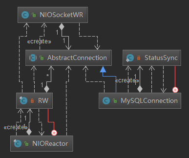
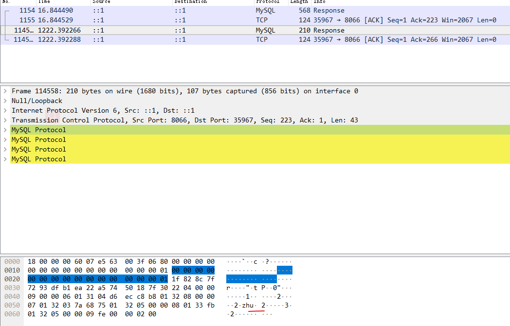

# mysql select 流程 - 响应

上一张讲解到：

1. 语句执行 ：io.mycat.backend.mysql.nio.MySQLConnection#execute
2. 底层 NIO 写操作：io.mycat.net.NIOSocketWR#doNextWriteCheck

一个 MySQLConnection 是有一个 NIOSocketWR 的(负责读写)，是在父类中声明的。

那么入口就很有可能会在这里，而真正的源头大家都知道，是 Reactor 模型中的 NIOReactor.

目前大概涉及了这些主要类



接着继续
## NIOSocketWR.asynRead

```
debug 打点的地方有两处（因为一次 sql 发送，navicat 会发送多条语句），
这样就能清楚的找到下一次确实是查询 sql 的响应包
io.mycat.net.FrontendConnection#query(byte[])

io.mycat.net.NIOSocketWR#asynRead
```


```java
io.mycat.net.AbstractConnection#handle
@Override
public void handle(byte[] data) {
  if (isSupportCompress()) {
    List<byte[]> packs = CompressUtil.decompressMysqlPacket(data, decompressUnfinishedDataQueue);
    for (byte[] pack : packs) {
      if (pack.length != 0) {
        handler.handle(pack);
      }
    }
  } else {
    // 这里的实例是 MySQLConnectionHandler
    handler.handle(data);
  }
}
```

io.mycat.backend.mysql.nio.MySQLConnectionHandler#handle

```java
@Override
public void handle(byte[] data) {
  // 该方法是父类的 BackendAsyncHandler
  offerData(data, source.getProcessor().getExecutor());
}

public abstract class BackendAsyncHandler implements NIOHandler {

	protected void offerData(byte[] data, Executor executor) {
		handleData(data);
	}

	protected abstract void offerDataError();
  // 这里 BackendAsyncHandler 的实例还是 MySQLConnectionHandler
	protected abstract void handleData(byte[] data);

}
```

## 包解析
这里的包解析，需要先了解协议，这里简约的了解下，因为对于响应来说，最后形成一个结果，
在 handleData 中是有状态的。

[该知识点可以参考 demo](https://github.com/zq99299/newstudy/blob/master/hp-base/src/test/java/cn/mrcode/newstudy/hpbase/mysql/mymysql2/MySqlConnectHandler.java)

响应包的结构大致如下：
1. 第一个包：列个数；从sql中select xxx,xxx from 中的列个数
2. 第二部分：列定义，每个列定义为一个包
3. 第三部分：列定义后面跟随一个eof包
4. 第四部分：返回值，一行一个包；行内字段顺序和前面的顺序一致
5. 第五部分：结果后面跟随一个eof包

::: tip
这里需要更改下策略：不要使用 navicat 来，因为在 debug 响应结果的时候，很麻烦。 nio 里面就算一个线程也能处理多个 socket 的交互，有一些 show status 的命令老是乱入。

这里更换为：mysql 自带的命令行来查询：

$ mysql -uroot -p123456 -P8066

$ use TESTDB

$ select * from employee;
:::

```java
io.mycat.backend.mysql.nio.MySQLConnectionHandler#handleData
private volatile List<byte[]> fields;

@Override
protected void handleData(byte[] data) {
  switch (resultStatus) {
    // 第一阶段
    case RESULT_STATUS_INIT:
      switch (data[4]) {
        case OkPacket.FIELD_COUNT:
          handleOkPacket(data);
          break;
        case ErrorPacket.FIELD_COUNT:
          handleErrorPacket(data);
          break;
        case RequestFilePacket.FIELD_COUNT:
          handleRequestPacket(data);
          break;
        default:
          // 获取列个数
          resultStatus = RESULT_STATUS_HEADER;
          header = data;
          // 并初始化列数组
          fields = new ArrayList<byte[]>((int) ByteUtil.readLength(data,
              4));
      }
      break;
      // 第二阶段，获取列定义数据包
    case RESULT_STATUS_HEADER:
      switch (data[4]) {
        case ErrorPacket.FIELD_COUNT:
          resultStatus = RESULT_STATUS_INIT;
          handleErrorPacket(data);
          break;
        case EOFPacket.FIELD_COUNT:
          // 根据协议，列定义后面有一个 eof 包
          resultStatus = RESULT_STATUS_FIELD_EOF;
          handleFieldEofPacket(data);
          break;
        default:
          // 会走三次，因为这次测试的表中只有三个字段
          fields.add(data);
      }
      break;
      // 第三阶段，行数据包解析
    case RESULT_STATUS_FIELD_EOF:
      switch (data[4]) {
        case ErrorPacket.FIELD_COUNT:
          resultStatus = RESULT_STATUS_INIT;
          handleErrorPacket(data);
          break;
        case EOFPacket.FIELD_COUNT:
          resultStatus = RESULT_STATUS_INIT;
          handleRowEofPacket(data);
          break;
        default:
          handleRowPacket(data);
      }
      break;
    default:
      throw new RuntimeException("unknown status!");
  }
}
```

数据包结束处理
```java
io.mycat.backend.mysql.nio.MySQLConnectionHandler#handleFieldEofPacket

/**
 * 字段数据包结束处理
 */
private void handleFieldEofPacket(byte[] data) {
  ResponseHandler respHand = responseHandler;
  if (respHand != null) {
    respHand.fieldEofResponse(header, fields, data, source);
  } else {
    closeNoHandler();
  }
}

这里的实例是
io.mycat.backend.mysql.nio.handler.MultiNodeQueryHandler#fieldEofResponse

```
具体包解析的时候，看上去非常的复杂，中间涉及到，结果集合并，和排序等操作。本章节就不继续深入了。 最后会走该方法，把结果真正写出到 mycat 的客户端； 后面再单独的去跟中这个处理流程
```java
io.mycat.backend.mysql.nio.handler.MultiNodeQueryHandler#outputMergeResult(io.mycat.server.ServerConnection, byte[], java.util.Iterator<io.mycat.memory.unsafe.row.UnsafeRow>, java.util.concurrent.atomic.AtomicBoolean)

}else{
    ByteBuffer byteBuffer = source.writeToBuffer(eof, buffer);

    /**
     * 真正的开始把Writer Buffer的数据写入到channel 中
     */
    session.getSource().write(byteBuffer);
  }
```


这是剩余部分的包，一次性没有发完，发了两个包过来; 行的结果值，一行一个，再带一个 eof 包


## 小结

1. NIOReactor 监听 mysql 发送回来的响应信息
2. 具体 MySQLConnection.NIOSocketWR、MySQLConnectionHandler 解析包信息
3. MultiNodeQueryHandler 最终进行结果集合并等操作，等待接收到最后一个 eof 包。
  开始进行业务处理，并且把处理完的结果集构造成 mysql 协议包，返回到 mycat 的客户端

在之前看到过，一个前端连接会绑定一个 mysql 连接，当路由计算的时候 会创建 MultiNodeQueryHandler 出来，相当于 一个前端连接会绑定一个 处理器，当有结果的时候，就能回调具体的前端连接，进行 nio 的写出
