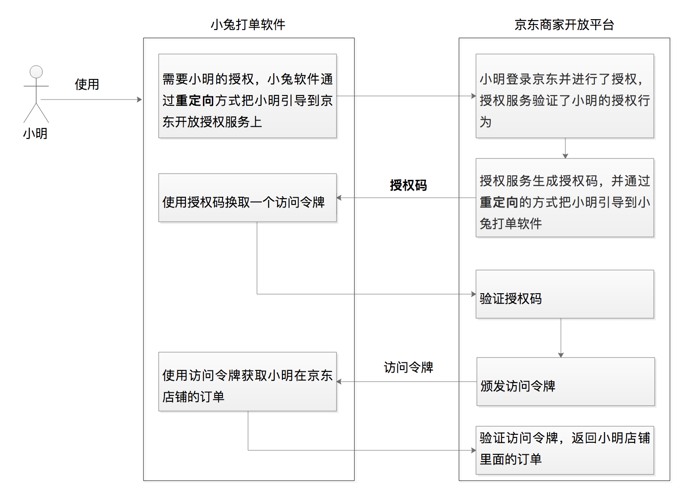

# OAuth 2.0 是要通过什么方式解决什么问题？

我想先问你个问题。第一次使用极客时间 App 的时候，你是直接使用了第三方帐号（比如微信、微博）登录，还是选择了重新注册新用户？如果你选择了重新注册用户，那你还得上传头像、输入用户名等信息。但如果你选择了使用第三方帐号微信来登录，那极客时间会直接使用你微信的这些信息作为基础信息，你就能省心很多。

到这里，我估计你会问，这是怎么实现的？微信把我的个人信息给了极客时间，它又是怎么保证我的数据安全的呢？

其实，微信这一系列授权背后的原理都可以归到一个词上，那就是 OAuth 2.0。今天这节课，我们就来看看 OAuth 2.0 到底是什么、能干什么以及它是怎么干的。

## OAuth 2.0 是什么？

用一句话总结来说，**OAuth 2.0 就是一种授权协议**。那如何理解这里的「授权」呢？

我举个咱们生活中的例子。假如你是一名销售人员，你想去百度拜访你的大客户王总。到了百度的大楼之后，保安拦住了你，问你要工牌。你说：「保安大哥啊，我是来拜访王总的，哪里有什么工牌」。保安大哥说：「那你要去前台做个登记」。

然后你就赶紧来到前台，前台美女问你是不是做了登记。你说王总秘书昨天有要你的手机号，说是已经做过预约。小姐姐确认之后往你的手机发了个验证码，你把验证码告诉了前台小姐姐之后，她给了你一张门禁卡，于是你就可以开心地去见王总了。

你看，这个例子里面 **就有一次授权**。本来你是没有权限进入百度大楼的，但是经过前台小姐姐一系列的验证之后，她发现你确实是来拜访客户的，**于是给了你一张临时工牌。这整个过程就是授权**。

我再举一个电商的场景，你估计更有感觉。假如你是一个卖家，在京东商城开了一个店铺，日常运营中你要将订单打印出来以便给用户发货。但打印这事儿也挺繁琐的，之前你总是手工操作，后来发现有个叫「小兔」的第三方软件，它可以帮你高效率地处理这事。

但你想想，小兔是怎么访问到这些订单数据的呢？其实是这样，**京东商城提供了开放平台，小兔通过京东商家开放平台的 API 就能访问到用户的订单数据**。

只要你在软件里点击同意，小兔就可以拿到一个访问令牌，通过访问令牌来获取到你的订单数据帮你干活儿了。你看，**这里也是有一次授权**。你要是不同意，平台肯定不敢把这些数据给到第三方软件。

## 为什么用 OAuth 2.0？

基于上面两种场景的解决方案，关于授权我们最容易想到的方案就是提供钥匙。比如，你要去百度拜访王总，那前台小姐姐就给你张百度的工牌；小兔要获取你的订单信息，那你就把你的用户名和密码给它。但稍微有些安全意识，我们都不会这样做。

**因为你有了百度工牌，那以后都可以随时自由地进出了**，这显然不是百度想要的。所以，百度有一套完整的机制，**通过给你一张临时工牌，实现在保证安全的情况下，还能让你去大楼里面见到王总**。相应地，小兔软件请求访问你的订单数据的过程，也会涉及这样一套授权机制，那就是 OAuth 2.0。它通过给小兔软件一个访问令牌，而不是让小兔软件拿着你的用户名和密码，去获取你的订单数据帮你干活儿。

其实，除了小兔软件这个场景，在如今的互联网世界里用到 OAuth 2.0 的地方非常多，只是因为它隐藏了实现细节，需要我们多做分析才能发现它。比如，当你使用微信登录其他网站或者 App 的时候，当你开始使用某个小程序的时候，你都在无感知的情况下用到了 OAuth 2.0。

那总结来说，**OAuth 2.0 这种授权协议，就是保证第三方（软件）只有在获得授权之后，才可以进一步访问授权者的数据**。因此，我们常常还会听到一种说法，OAuth 2.0 是一种安全协议。现在你知道了，这种说法也是正确的。

现在访问授权者的数据主要是通过 Web API，所以凡是要保护这种对外的 API 时，都需要这样授权的方式。而 OAuth 2.0 的这种颁发访问令牌的机制，是再合适不过的方法了。同时，这样的 Web API 还在持续增加，所以 OAuth 2.0 是目前 Web 上重要的安全手段之一了。

## OAuth 2.0 是怎样运转的？

现在，我相信你已经对 OAuth 2.0 有了一个整体印象，接下来咱们再看看它是怎么运转的。

我们还是来看上面提到的小兔打单软件的例子吧。假如小明在京东上面开了一个店铺，小明要管理他的店铺里面的订单，于是选择了使用小兔软件。

现在，让我们把「小明」「小兔软件」「京东商家开放平台」放到一个对话里面，看看他们是怎么沟通的吧。

- **小明**：你好，小兔软件。我正在 Google 浏览器上面，需要访问你来帮我处理我在京东商城店铺的订单。

- **小兔软件**：好的，小明，我需要你给我授权。现在我把你引导到京东商家开放平台上，你在那里给我授权吧。
- **京东商家开放平台**：你好，小明。我收到了小兔软件跳转过来的请求，现在已经准备好了一个授权页面。你登录并确认后，点击授权页面上面的授权按钮即可。
- **小明**：好的，京东商家开放平台。我看到了这个授权页面，已经点授权按钮啦😄
- **京东商家开放平台**：你好，小兔打单软件。我收到了小明的授权，现在要给你生成一个授权码 code 值，我通过浏览器重定向到你的回调 URL 地址上面了。
- **小兔软件**：好的，京东商家开放平台。我现在从浏览器上拿到了授权码，现在就用这个授权码来请求你，请给我一个访问令牌 access_token 吧。
- **京东商家开放平台**：好的，小兔打单软件，访问令牌已经发送给你了。
- **小兔打单软件**：太好了，我现在就可以使用访问令牌来获取小明店铺的订单了。
- **小明**：我已经能够看到我的订单了，现在就开始打单操作了。

下面，为了帮助你理解，我再用一张图来描述整个过程：

再分析下这个流程，我们不难发现小兔软件最终的目的，是要获取一个叫做「访问令牌」的东西。从最后一步也能够看出来，在小兔软件获取到 **访问令牌** 之后，才有足够的 「能力」 去请求小明的店铺的订单，也就是才能够帮助小明打印订单。

那么，小兔软件是怎么获取访问令牌的值的呢？我们会发现还有一个叫做「授权码」的东西，也就是说小兔软件是 拿**授权码换取的访问令牌**。

小兔软件又是怎么拿到 **授权码** 的呢？从图中流程刚开始的那一步，我们就会发现，**是在小明授权之后**，才产生的授权码，上面流程中后续的一切动作，实际上都是在小明对小兔软件授权发生以后才产生的。其中主要的动作，就是 `生成授权码 –> 生成访问令牌 –> 使用访问令牌`。

到这里，我们不难发现，**OAuth 2.0 授权的核心就是颁发访问令牌、使用访问令牌，** 而且不管是哪种类型的授权流程都是这样。你一定要理解，或者记住这句话，它是整个流程的核心。你也可以再回想下，去百度拜访王总的例子。如果你是百度这套机制的设计者的话，会怎么设计这套授权机制呢。想清楚了这个问题，你再去理解令牌、授权码啥的也就简单了。

在小兔软件这个例子中呢，我们使用的就是授权码许可（Authorization Code）类型。它是 OAuth 2.0 中最经典、最完备、最安全、应用最广泛的许可类型。除了授权码许可类型外，OAuth 2.0 针对不同的使用场景，还有 3 种基础的许可类型，分别是隐式许可（Implicit）、客户端凭据许可（Client Credentials）、资源拥有者凭据许可（Resource Owner Password Credentials）。相对而言，这 3 种授权许可类型的流程，在流程复杂度和安全性上都有所减弱（在后续与你详细分析）。

因此，在这个课程中，我会频繁用授权码许可类型来举例。至于为什么称它为授权码许可，为什么有两次重定向，以及这种许可类型更详细的通信流程又是怎样的，我会在下一讲给你深入分析，你可以先不用关注。

## 总结

我来回给你举例子，其实就是希望你能理解 OAuth 到底是什么，为什么需要它，以及它大概的运行逻辑是怎样的。总结来说，我需要你记住以下这 3 个关键点：

- OAuth 2.0 的核心是授权许可，更进一步说就是令牌机制。也就是说，像小兔软件这样的第三方软件只有拿到了京东商家开放平台颁发的访问令牌，也就是得到了授权许可，然后才可以 **代表** 用户访问他们的数据。

- 互联网中所有的受保护资源，几乎都是以 Web API 的形式来提供访问的，比如极客时间 App 要获取用户的头像、昵称，小兔软件要获取用户的店铺订单，我们说 OAuth 2.0 与安全相关，是用来保护 Web API 的。另外，第三方软件通过 OAuth 2.0 取得访问权限之后，用户便把这些权限 **委托** 给了第三方软件，我们说 OAuth 2.0 是一种委托协议，也没问题。

- 也正因为像小兔这样的第三方软件，每次都是用访问令牌而不是用户名和密码来请求用户的数据，才大大减少了安全风险上的「攻击面」。不然，我们试想一下，每次都带着用户名和密码来访问数量众多的 Web API ，是不是增加了这个「攻击面」。因此，我们说 OAuth 2.0 的核心，就是颁发访问令牌和使用访问令牌。

## 思考题

你可以再花时间想下小兔软件获取用户订单信息的那个场景，如果让你来设计整个的授权流程，你会怎么设计？还有没有更好的方式？

## 拓展阅读

- 为什么要用授权码换取 token，而不是直接获取 token？

  直接获取 token 的场景是有的，客户端凭据许可类型就是这样的使用场景，但是我们会在课程里面讲到，**授权码许可类型是 OAuth 2.0 最安全 最完备的许可类型**。

  以 Web 场景为例，第一次用户是跟第三方软件建立的联系，三方软件要把用户引导到平台一方去授权，这个时候用户实际上跟三方软件就失去了联系，平台如果这个时候直接把令牌给了三方软件，因为没了联系，三方软件就不能很方便的告诉用户。
