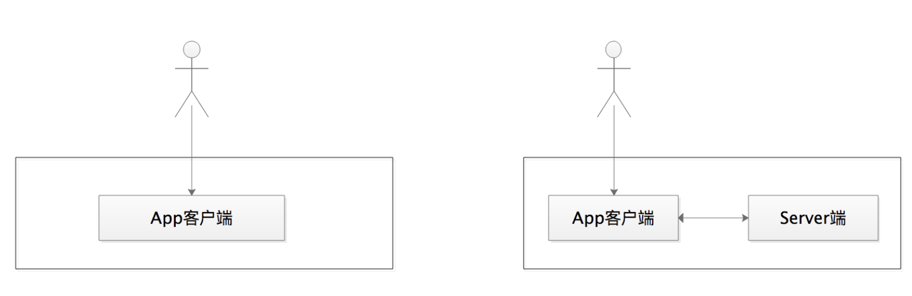
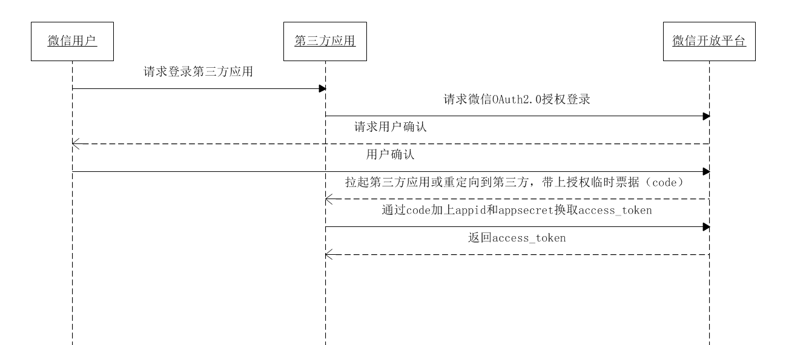
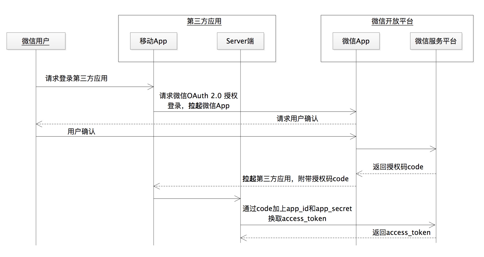

---
tags:
  - PKCE 协议
---


# 如何在移动 App 中使用 OAuth 2.0？

在前面几讲中，我都是基于 Web 应用的场景来讲解的 OAuth 2.0。除了 Web 应用外，现实环境中还有非常多的移动 App。那么，在移动 App 中，能不能使用 OAuth 2.0 ，又该如何使用 OAuth 2.0 呢？

没错，OAuth 2.0 最初的应用场景确实是 Web 应用，但是它的伟大之处就在于，**它把自己的核心协议定位成了一个框架而不是单个的协议**。这样做的好处是，我们可以基于这个基本的框架协议，**在一些特定的领域进行扩展**。

因此，到了桌面或者移动的场景下，OAuth 2.0 的协议一样适用。考虑到授权码许可是最完备、最安全的许可类型，所以我在讲移动 App 如何使用 OAuth 2.0 的时候，依然会用授权码许可来讲解，毕竟要用就用最好的。

当我们开发一款移动 App 的时候，可以选择没有 Server 端的 「纯 App」 架构，比如这款 App 不需要跟自己的 Server 端通信，或者可以调用其它开放的 HTTP 接口；当然也可以选择有服务端的架构，比如这款 App 还想把用户的操作日志记录下来并保存到 Server 端的数据库中。

那总结下来呢，移动 App 可以分为两类，一类是没有 Server 端的 App 应用，一类是有 Server 端的 App 应用。



这两类 App 在使用 OAuth 2.0 时的最大区别，**在于获取访问令牌的方式**：

- 如果有 Server 端，就建议通过 Server 端和授权服务做交互来换取访问令牌；

- 如果没有 Server 端，那么只能通过前端通信来跟授权服务做交互，比如在上一讲中提到的隐式许可授权类型。当然，这种方式的安全性就降低了很多。

有些时候，我们可能觉得自己开发一个 App 不需要一个 Server 端。那好，就让我们先来看看没有 Server 端的 App 应用如何使用授权码许可类型。

## 没有 Server 端的 App

在一个没有 Server 端支持的纯 App 应用中，我们首先想到的是，如何可以像 Web 服务那样，让请求和响应「来去自如」呢。

你可能会想，我是不是可以将一个迷你的 Web 服务器嵌入到 App 里面去，这样不就可以像 Web 应用那样来使用 OAuth 2.0 了么？确实，这是行得通的，而且已经有 App 这样做了。

这样的 App 通过监听运行在 localhost 上的 Web 服务器 URI，就可以做到跟普通的 Web 应用一样的通信机制。但这种方式不是我们这次要讲的重点，如果你想深入了解可以去查些资料。因为当使用这种方式的时候，**请求访问令牌时需要的 app_secret 就只能保存在用户本地设备上，而这并不是我们所建议的**。

到这里，你应该猜到了，**问题的关键在于如何保存 app_secret**，因为 App 会被安装在成千上万个终端设备上，app_secret 一旦被破解，就将会造成灾难性的后果。这时，有的同学突发奇想，如果不用 app_secret，也能在授权码流程里换回访问令牌 access_token，不就可以了吗？

确实可以，但新的问题也来了。在授权码许可类型的流程中，如果没有了 app_secret 这一层的保护，那么通过授权码 code 换取访问令牌的时候，就只有授权码 code 在「冲锋陷阵」了。这时，授权码 code 一旦失窃，就会带来严重的安全问题。那么，我既不使用 app_secret，还要防止授权码 code 失窃，有什么好的方法吗？

有，OAuth 2.0 里面就有这样的指导方法。这个方法就是我们将要介绍的 **PKCE 协议**，全称是 Proof Key for Code Exchange by OAuth Public Clients。

在下面的流程图中，为了突出第三方软件使用 PKCE 协议时与授权服务之间的通信过程，我省略了受保护资源服务和资源拥有者的角色：


首先，App 自己要生成一个随机的、长度在 43~128 字符之间的、参数为 **code_verifier** 的字符串验证码；接着，我们再利用这个  **code_verifier** ，来生成一个被称为 「挑战码」的参数 **code_challenge**。

那怎么生成这个 code_challenge 的值呢？OAuth 2.0 规范里面给出了两种方法，就是看 code_challenge_method 这个参数的值：

- 一种 code_challenge_method=plain，此时 code_verifier 的值就是 code_challenge 的值；

- 另外一种 code_challenge_method=S256，就是将 code_verifier 值进行 ASCII 编码之后再进行哈希，然后再将哈希之后的值进行 BASE64-URL 编码，如下代码所示。

  ```
  code_challenge = BASE64URL-ENCODE(SHA256(ASCII(code_verifier)))
  ```

好了，我知道有这样两个值，也知道它们的生成方法了，但这两个值跟我们的授权码流程有什么关系呢，又怎么利用它们呢？不用着急，我们接着讲。

授权码流程简单概括起来不是有两步吗，第一步是获取授权码 code，第二步是用 `app_id+app_secret+code`  获取访问令牌 access_token。刚才我们的「梦想」不是设想不使用 app_secret，但同时又能保证授权码流程的安全性么？

没错。code_verifier 和 code_challenge 这两个参数，就是来帮我们实现这个梦想的。

在**第一步获取授权码 code 的时候，我们使用 code_challenge** 参数。需要注意的是，我们要同时将 code_challenge_method 参数也传过去，目的是让授权服务知道生成 code_challenge 值的方法是 plain 还是 S256。

```
https://authorization-server.com/auth?
response_type=code&
app_id=APP_ID&
redirect_uri=REDIRECT_URI&
code_challenge=CODE_CHALLENGE&
code_challenge_method=S256
```

在**第二步获取访问令牌的时候，我们使用 code_verifier 参数**，授权服务此时会将 code_verifier 的值进行一次运算。那怎么运算呢？就是上面 code_challenge_method=S256 的这种方式。

没错，第一步请求授权码的时候，已经告诉授权服务生成 code_challenge 的方法了。所以，在第二步的过程中，授权服务将运算的值跟第一步接收到的值做比较，如果相同就颁发访问令牌。

```
POST https://api.authorization-server.com/token?
  grant_type=authorization_code&
  code=AUTH_CODE_HERE&				// 第一步中获取到的授权码
  redirect_uri=REDIRECT_URI&
  app_id=APP_ID& 
  code_verifier=CODE_VERIFIER       // 将自己的随机字符串传递过去
```

现在，你就知道了我们是如何使用 code_verifier 和 code_challenge 这两个参数的了吧。总结一下就是：

1. 换取授权码 code 的时候，我们使用 code_challenge 参数值；

   code_challenge  需要我们用  `BASE64URL-ENCODE(SHA256(ASCII(code_verifier)))`  生成，然后告诉授权服务，我们的随机字符串是用什么方式生成的 code_challenge 

   注意：这一步不传递随机字符串，告诉授权服务，挑战码和挑战码生成的方式

2. 换取访问令牌的时候，我们使用 code_verifier 参数值。

   由于第 1 步中，通过挑战码和挑战码生成方式，获取到了授权码，这里通过授权码 + 随机字符串的方式去换取 token，授权服务会在服务端按第一部中传递过来的挑战码生成方式，对这个随机字符串生成挑战码。

   也就是说：**第一步中的「挑战码」我们需要和发放的「授权码」绑定**，第二步中，在授权服务端对随机字符串生成挑战码，再对比是否与第一步中传递过来的挑战码一致。

那么，有的同学会继续问了，我们为什么要这样做呢。

我们的愿望是，**没有 Server 端的手机 App，也可以使用授权码许可流程**，对吧？app_secret 不能用，因为它只能被存在用户的设备上，我们担心被泄露。

那么，在没有了 app_secret 这层保护的前提下，**即使我们的授权码 code 被截获，再加上 code_challenge 也同时被截获了**，**那也没有办法由 code_challenge 逆推出 code_verifier 的值**。而恰恰在第二步换取访问令牌的时候，授权服务需要的就是 code_verifier 的值。因此，这也就 **避免了访问令牌被恶意换取的安全问题**。

现在，我们可以通过 PKCE 协议的帮助，让没有 Server 端的 App 也能够安全地使用授权码许可类型进行授权了。但是，按照 OAuth 2.0 的规范建议，通过后端通信来换取访问令牌是较为安全的方式。所以呢，在这里，我想跟你探讨的是，我们真的不需要一个 Server 端吗？在做移动应用开发的时候，我们真的从设计上就决定废弃 Server 端了吗？

## 有 Server 端的 App

如果你开发接入过微信登录，就会在微信的官方文档上看到下面这句话：

> 微信 OAuth 2.0 授权登录目前支持 authorization_code 模式，适用于拥有 Server 端的应用授权。

没错，微信的 OAuth 2.0 授权登录，就是建议我们需要一个 Server 端来支持这样的授权接入。

那么，有 Server 端支持的 App 又是如何使用 OAuth 2.0 的授权码许可流程的呢？其实，在前面几讲的基础上，我们现在理解这样的场景并不是什么难事儿。

我们仍以微信登录为例，看一下官方的流程图：



看到这个图，你是不是觉得特别熟悉，跟普通的授权码流程没有区别，仍是两步走的策略：

1. 第一步换取授权码 code，
2. 第二步通过授权码 code 换取访问令牌 access_token。

这里的第三方应用，就是我们作为开发者来开发的应用，包含了移动 App 和 Server 端。我们将其「放大」得到下面这张图：



我们从这张放大的图中，就会发现有 Server 端的 App 在使用授权码流程的时候，跟普通的 Web 应用几乎没有任何差别。

大概流程是：

1. 当我们访问第三方 App 的时候，需要用到微信来登录；
2. 第三方 App 可以拉起微信的 App，我们会在微信的 App 里面进行登录及授权；
3. 微信 Server 端验证成功之后会返回一个授权码 code，通过微信 App 传递给了第三方 App；
4. 后面的流程就是我们熟悉的使用授权码 code 和 app_secret，换取访问令牌 access_token 的值了。

这次使用 app_secret 的时候，我们是在第三方 App 的 Server 端来使用的，因此安全性上没有任何问题。

## 总结

今天这一讲，我重点和你讲了两块内容，没有 Server 端的 App 和有 Server 端的 App 分别是如何使用授权码许可类型的。我希望你能够记住以下两点内容。

1. 我们使用 OAuth 2.0 协议的目的，**就是要起到安全性的作用**

   但有些时候，因为使用不当反而会造成更大的安全问题，**比如将 app_secret 放入 App 中的最基本错误**。如果放弃了 app_secret，又是如何让没有 Server 端的 App 安全地使用授权码许可协议呢？针对这种情况，我和你介绍了 PKCE 协议。它是一种在失去 app_secret 保护的时候，防止授权码失窃的解决方案。

2. 我们需要思考一下，我们的 App 真的不需要一个 Server 端吗？我建议你在开发移动 App 的时候，尽可能地都要搭建一个 Server 端，因为通过后端通信来传输访问令牌比通过前端通信传输要安全得多。我也举了微信的例子，很多官方的开放平台在提供 OAuth 2.0 服务的时候，都会建议开发者要有一个相应的 Server 端。

那么，关于 OAuth 2.0 的使用还有哪些安全方面的防范措施是我们要注意的呢，接下来的一讲中我们会重点跟大家介绍。

## 思考题

在移动 App 中，你还能想到有哪些相对安全的方式来使用 OAuth 2.0 吗？

## 拓展阅读

- 如果采用第一种办法生成 code_verifier，code_challenge_method=plain，那么 code_verifier 的值就是 code_challenge 的值。这时候，不是获得了code_challenge 就可以推出 code_verifier 的值了吗？

  在这种 code_challenge_method=plain 情况下，code_verifier 的值和 code_challenge 的值是一样的。

  **我们首先要清楚 PKCE 的出现是为了解决的是什么：**，客户端如果不想使用服务端来支持，在失去了 secret 的保护下，怎么让 OAuth 2.0 进行的更安全，**实际上是为了防止授权码被截获**，授权码的截获是发生在授权服务响应客户端【第一次】请求授权码的这个过程里面。

  在 code_verifier 的值和 code_challenge 的值是一样的情况下，是做了一个最基本的校验，当客户端【第二次】拿着授权码 code 和 code_verifier 来请求 access_token 的时候，授权服务会判断这次给的 code_verifier 和上次给的 code_challenge 值是否一致，如果不一致，拒绝返回 access_token。

  code_challenge_method=plain、code_challenge_method=S256、给客户端增加一个服务端支持，这三种情况的安全等级是逐渐增高的。

  **安全问题的发生是一个组合问题，安全问题的防护是一个成本问题**。

- 如果 Web 端也采用 PKCE 协议，是不是也不需要服务器端了（既纯 Web 前端也可以对接 OAuth 服务）？

  PKCE 是 OAuth 2.0 的一个增订「协议」，来解决【公共客户端】授权码可能遭劫持的问题。公共客户端无法保存配置时的秘钥等信息。Web 应用有自己的服务端支持，可以很好的解决秘钥的保存问题，所以 Web 应用是不建议这样做的，而且移动 App 也不建议这做我们课程中给出了建议。如果你确实不需要一个服务端的移动 App 可以尝试这样的方式，PKCE 是 RFC 7636 的内容。

- 迷你的 Web 服务器嵌入到 App 里面去，这个不大理解。App 通过监听运行在 localhost 上的 Web 服务器 URI 这个是怎么实现的？

  移动 App 类应用不像 Web 应用或者浏览器应用那样可以让用户通过浏览器来访问，如果为了实现这样的方式，可以尝试的做法是需要移动 App 类应用能够访问操作系统上的浏览器，为了能够监听到这个前端的响应，还需要通过一个 URI 提供服务，可以通过一个微型的内嵌在应用内、运行在 localhost 上的Web服务器。

- 在 PKCE 协议下，第三方应用掌握了太多的秘密（verifier, challenge)，考虑到移动终端千差万别，保证第三方应用的安全并不容易

  移动端类应用，目前各大开放平台都是要求必须有第三方的服务端的支持，由第三方的服务端来跟平台做交互通信。2012 年 10 月发布了 OAuth 2.0 的正式授权协议框架，也就是官方的 RFC 6749，在 2015 年 9 月增补了PKCE 协议，也就是官方的 RFC 7636。PKCE 发布的目的是为了缓解针对公开客户端的攻击，**主要是解决授权码窃听的攻击**。

- 请问如果移动 App 是自家的，用资源拥有者授权的话，app secret 建议存哪里呢？

  存在服务端，有一个专有的秘钥服务器，但只有用户登录之后换回 access_token 然后才可以去请求或者操作【带有用户属性】的数据。

- 用 code_verifier 验证 code_challenge 通过只能证明后一次请求和前一次是从同一个客户端发起的吧？怎么能起到 app_secret 证明客户端是谁是否合法的作用呢？

  PKCE 机制可以【减轻】针对授权码截获的攻击，公共客户端固有的局限性 PKCE 并不能解决，所以它起不到secret 的作用。

  另外，PKCE 是 OAuth 2.0 的一个增补协议可以单独使用，也可以组合使用，比如，如果在具备保存 secret 的环境里面已经使用授权码流程的基础上再增加 PKCE 的支持，将会进一步增强授权码流程的安全性。

- 如果拿到 app_id 是不是就可以冒充该客户端了？ 还是授权服务还必须要验证 app_id 和 redirect_uri
  绑定关系的？

  **PKCE 的推出是为了解决使用授权码许可类型的公开客户端容易遭到授权码窃听的攻击的问题**。但是对于公开客户端固有的弊端 PKCE 是解决不了的。

