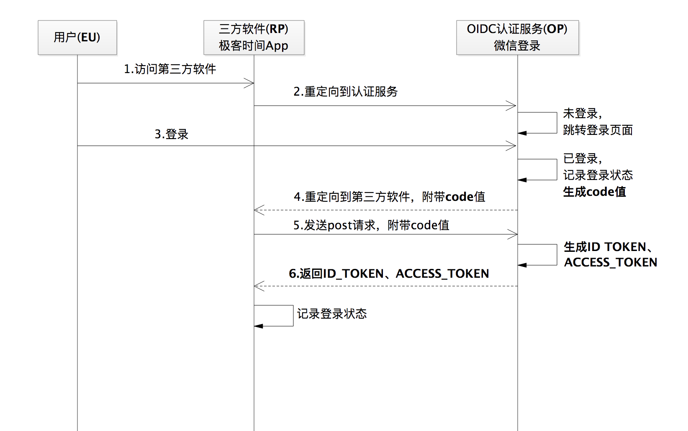
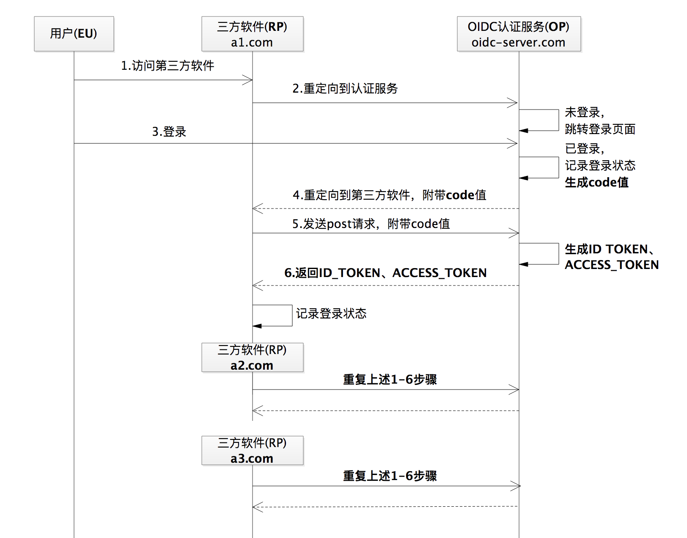

---
tags:
  - 联合登录
---


# 实战：利用 OAuth 2.0 实现一个 OpenID Connect 用户身份认证协议

如果你是一个第三方软件开发者，在实现用户登录的逻辑时，除了可以让用户新注册一个账号再登录外，还可以接入微信、微博等平台，让用户使用自己的微信、微博账号去登录。同时，如果你的应用下面又有多个子应用，还可以让用户只登录一次就能访问所有的子应用，来提升用户体验。

这就是联合登录和单点登录了。再继续深究，它们其实都是 **OpenID Connect**（简称 OIDC）的应用场景的实现。那 OIDC 又是什么呢？

今天，我们就来学习下 OIDC 和 OAuth 2.0 的关系，以及如何用 OAuth 2.0 来实现一个 OIDC 用户身份认证协议。

## OIDC 是什么？

OIDC 其实就是一种 **用户身份认证的开放标准**。使用微信账号登录极客时间的场景，就是这种开放标准的实践。

说到这里，你可能要发问了：「不对呀，使用微信登录第三方 App 用的不是 OAuth 2.0 开放协议吗，怎么又扯上 OIDC 了呢？」

没错，用微信登录某第三方软件，确实使用的是 OAuth 2.0。**但 OAuth2.0 是一种授权协议，而不是身份认证协议**。OIDC 才是身份认证协议，而且是基于 OAuth 2.0 来执行用户身份认证的互通协议。更概括地说，**OIDC 就是直接基于 OAuth 2.0 构建的身份认证框架协议**。

换种表述方式，**OIDC= 授权协议 + 身份认证**，是 OAuth 2.0 的超集。为方便理解，我们可以把 OAuth 2.0 理解为面粉，把 OIDC 理解为面包。这下，你是不是就理解它们的关系了？因此，我们说「第三方 App 使用微信登录用到了 OAuth 2.0」没有错，说「使用到了 OIDC」更没有错。

考虑到单点登录、联合登录，都遵循的是 OIDC 的标准流程，因此今天我们就讲讲如何利用 OAuth2.0 来实现一个 OIDC，「高屋建瓴」 地去看问题。掌握了这一点，我们再去做单点登录、联合登录的场景，以及其他更多关于身份认证的场景，就都不再是问题了。

## OIDC 和 OAuth 2.0 的角色对应关系

说到「如何利用 OAuth 2.0 来构建 OIDC 这样的认证协议」，我们可以想到一个切入点，这个切入点就是 OAuth 2.0 的四种角色。

OAuth 2.0 的授权码许可流程的运转，需要资源拥有者、第三方软件、授权服务、受保护资源这 4 个角色间的顺畅通信、配合才能够完成。如果我们要想在 OAuth 2.0 的授权码许可类型的基础上，来构建 OIDC 的话，这 4 个角色仍然要继续发挥 「它们的价值」。那么，这 4 个角色又是怎么对应到 OIDC 中的参与方的呢？

那么，我们就先想想一个关于身份认证的协议框架，应该有什么角色。你可能已经想出来了：

- 它需要一个登录第三方软件的最终用户
- 一个第三方软件
- 以及一个认证服务来为这个用户提供身份证明的验证判断。

没错，这就是 OIDC 的三个主要角色了。在 OIDC 的官方标准框架中，这三个角色的名字是：

- EU（End User），代表最终用户。

- RP（Relying Party），代表认证服务的依赖方，就是上面我提到的第三方软件。

- OP（OpenID Provider），代表提供身份认证服务方。

EU、RP 和 OP 这三个角色对于 OIDC 非常重要，我后面也会时常使用简称来描述，希望你能先记住。

现在很多 App 都接入了微信登录，那么微信登录就是一个大的身份认证服务（OP）。一旦我们有了微信账号，就可以登录所有接入了微信登录体系的 App（RP），这就是我们常说的 **联合登录**。

现在，我们就借助极客时间的例子，来看一下 OAuth 2.0 的 4 个角色和 OIDC 的 3 个角色之间的对应关系：


## OIDC 和 OAuth 2.0 的关键区别

看到这张角色对应关系图，你是不是有点 恍然大悟 的感觉：要实现一个 OIDC 协议，不就是直接实现一个 OAuth 2.0 协议吗。没错，我在这一讲的开始也说了，OIDC 就是基于 OAuth 2.0 来实现的一个身份认证协议框架。

我再继续给你画一张 OIDC 的通信流程图，你就更清楚 OIDC 和 OAuth 2.0 的关系了：



可以发现，一个基于授权码流程的 OIDC 协议流程，跟 OAuth 2.0 中的授权码许可的流程几乎完全一致，唯一的区别就是多返回了一个 **ID_TOKEN**，我们称之为 **ID 令牌**。这个令牌是身份认证的关键。所以，接下来我就着重和你讲一下这个令牌，而不再细讲 OIDC 的整个流程。

## OIDC 中的 ID 令牌生成和解析方法

在图 2 的 OIDC 通信流程的第 6 步，我们可以看到 ID 令牌（ID_TOKEN）和访问令牌（ACCESS_TOKEN）是一起返回的。关于为什么要同时返回两个令牌，我后面再和你分析。我们先把焦点放在 ID 令牌上。

我们知道，**访问令牌不需要被第三方软件解析，因为它对第三方软件来说是不透明的**。**但 ID 令牌需要能够被第三方软件解析出来，因为第三方软件需要获取 ID 令牌里面的内容，来处理用户的登录态逻辑**。

那 **ID 令牌的内容是什么呢**？

首先，ID 令牌是一个 JWT 格式的令牌。你可以到第 4 讲中复习下 JWT 的相关内容。这里需要强调的是，虽然 JWT 令牌是一种自包含信息体的令牌，为将其作为 ID 令牌带来了方便性，**但是因为 ID 令牌需要能够标识出用户、失效时间等属性来达到身份认证的目的，所以要将其作为 OIDC 的 ID 令牌时，下面这 5 个 JWT 声明参数也是必须要有的**。

- iss，令牌的颁发者，其值就是身份认证服务（OP）的 URL。

- sub，令牌的主题，其值是一个能够代表最终用户（EU）的全局唯一标识符。

- aud，令牌的目标受众，其值是三方软件（RP）的 app_id。

- exp，令牌的到期时间戳，所有的 ID 令牌都会有一个过期时间。

- iat，颁发令牌的时间戳。

生成 ID 令牌这部分的示例代码如下：

```java
//GENATE ID TOKEN
String id_token=genrateIdToken(appId,user);
private String genrateIdToken(String appId,String user){
    String sharedTokenSecret="hellooauthhellooauthhellooauthhellooauth";//秘钥
    Key key = new SecretKeySpec(sharedTokenSecret.getBytes(),
            SignatureAlgorithm.HS256.getJcaName());//采用HS256算法
    Map<String, Object> headerMap = new HashMap<>();//ID令牌的头部信息
    headerMap.put("typ", "JWT");
    headerMap.put("alg", "HS256");
    Map<String, Object> payloadMap = new HashMap<>();//ID令牌的主体信息
    payloadMap.put("iss", "http://localhost:8081/");
    payloadMap.put("sub", user);
    payloadMap.put("aud", appId);
    payloadMap.put("exp", 1584105790703L);
    payloadMap.put("iat", 1584105948372L);
    return Jwts.builder().setHeaderParams(headerMap).setClaims(payloadMap).signWith(key,SignatureAlgorithm.HS256).compact();
}
```

接下来，我们再看看 **处理用户登录状态的逻辑是如何处理的**。

你可以先试想一下，如果 「不跟 OIDC 扯上关系」，也就是 「单纯」 构建一个用户身份认证登录系统，我们是不是得保存用户登录的会话关系。一般的做法是，要么放在远程服务器上，要么写进浏览器的 cookie 中，同时为会话 ID 设置一个过期时间。

但是，当我们有了一个 JWT 这样的结构化信息体的时候，尤其是包含了令牌的主题和过期时间后，不就是有了一个「天然」的会话关系信息么。

所以，依靠 JWT 格式的 ID 令牌，就足以让我们解决身份认证后的登录态问题。这也就是为什么在 OIDC 协议里面要返回 ID 令牌的原因，**ID 令牌才是 OIDC 作为身份认证协议的关键所在**。

那么有了 ID 令牌后，第三方软件应该如何解析它呢？接下来，我们看一段解析 ID 令牌的具体代码，如下：

```java
private Map<String,String> parseJwt(String jwt){
        String sharedTokenSecret="hellooauthhellooauthhellooauthhellooauth";//密钥
        Key key = new SecretKeySpec(sharedTokenSecret.getBytes(),
                SignatureAlgorithm.HS256.getJcaName());//HS256算法
        Map<String,String> map = new HashMap<String, String>();
        Jws<Claims> claimsJws = Jwts.parserBuilder().setSigningKey(key).build().parseClaimsJws(jwt);
        //解析ID令牌主体信息
        Claims body = claimsJws.getBody();
        map.put("sub",body.getSubject());
        map.put("aud",body.getAudience());
        map.put("iss",body.getIssuer());
        map.put("exp",String.valueOf(body.getExpiration().getTime()));
        map.put("iat",String.valueOf(body.getIssuedAt().getTime()));
        
        return map;
    }
```

需要特别指出的是，第三方软件解析并验证 ID 令牌的合法性之后，不需要将整个 JWT 信息保存下来，只需保留 JWT 中的 PAYLOAD（数据体）部分就可以了。因为正是这部分内容，包含了身份认证所需要的用户唯一标识等信息。

另外，**在验证 JWT 合法性的时候，因为 ID 令牌本身已经被身份认证服务（OP）的密钥签名过，所以关键的一点是合法性校验时需要做签名校验**。具体的加密方法和校验方法，你可以回顾下第 4 讲。

这样当第三方软件（RP）拿到 ID 令牌之后，就已经获得了处理身份认证标识动作的信息，也就是拿到了那个能够唯一标识最终用户（EU）的 ID 值，比如 3521。

## 用访问令牌获取 ID 令牌之外的信息

但是，为了提升第三方软件对用户的友好性，在页面上显示 「您好，3521」 肯定不如显示 「您好，小明同学」的体验好。这里的 「小明同学」，恰恰就是用户的昵称。

那如何来获取「小明同学」这个昵称呢。这也很简单，就是 **通过返回的访问令牌 access_token 来重新发送一次请求**。当然，这个流程我们现在也已经很熟悉了，它属于 OAuth 2.0 标准流程中的请求受保护资源服务的流程。

这也就是为什么在 OIDC 协议里面，既给我们返回 ID 令牌又返回访问令牌的原因了。在保证用户身份认证功能的前提下，如果想获取更多的用户信息，就再通过访问令牌获取。在 OIDC 框架里，这部分内容叫做 **创建 UserInfo 端点和获取  UserInfo  信息**。

这样看下来，细粒度地去看 OIDC 的流程就是：**生成 ID 令牌 -> 创建 UserInfo 端点 -> 解析 ID 令牌 -> 记录登录状态 -> 获取 UserInfo**。

好了，利用 OAuth 2.0 实现一个 OIDC 框架的工作，我们就做完了。

用 OAuth 2.0 实现 OIDC 的最关键的方法是：在原有 OAuth 2.0 流程的基础上增加 ID 令牌和 UserInfo 端点，以保障 OIDC 中的第三方软件能够记录用户状态和获取用户详情的功能。

因为第三方软件可以通过解析 ID 令牌的关键用户标识信息来记录用户状态，同时可以通过 Userinfo 端点来获取更详细的用户信息。**有了用户态和用户信息，也就理所当然地实现了一个身份认证**。

接下来，我们就具体看看如何实现单点登录（Single Sign On，SSO）。

## 单点登录

一个用户 G 要登录第三方软件 A，A 有三个子应用，域名分别是 a1.com、a2.com、a3.com。如果 A 想要为用户提供更流畅的登录体验，让用户 G 登录了 a1.com 之后也能顺利登录其他两个域名，就可以创建一个身份认证服务，来支持 a1.com、a2.com 和 a3.com 的登录。

这就是我们说的单点登录，「一次登录，畅通所有」。

那么，可以使用 OIDC 协议标准来实现这样的单点登录吗？我只能说 「太可以了」。如下图所示，只需要让第三方软件（RP）重复我们 OIDC 的通信流程就可以了。



你看，单点登录就是 OIDC 的一种具体应用方式，只要掌握了 OIDC 框架的原理，实现单点登录就不在话下了。关于单点登录的具体实现，在 GitHub 上搜索「通过 OIDC 来实现单点登录」，你就可以看到很多相关的开源内容。

**上图注意查看最右侧的信息**：

- OIDC 里面有用户的 ID，还有用户的登录信息

  只要用户在认证服务里面登录过一次，这些信息就被留在了 OIDC 里面。

- 当用户访问子应用的时候，至少需要有用户 ID 信息吧？才能识别是谁，有没有登录过

  这里有一个问题：如果访问的到 B 应用没有携带用户信息过去，那么它就会被重定向到认证服务上去，最主要的是认证服务已经登录过了，这个可能是靠 cooike 或则 sessionid。

  最直观的操作感受是这样的：

  1. 登录应用 A，会被重定向到认证服务中心，登录后跳回了应用 A

  2. 直接访问应用 B，应用 B 不能识别当前操作者是谁，会重定向到认证服务中心，进行登录后跳转回来

  3. 访问应用 C，其实对于应用 C 来说，它是不知道当前是谁的，还是会重定向到认证服务中心

     不一样的在于：此时认证服务中心是已经登录过了，要么直接跳转会原应用，要么停留在认证中心。

  那么此时就很清楚了：应用如果不能识别当前操作者是谁，则重定向到认证服务中心，在认证服务中心已经登录过，则可以直接会跳原应用，达到一次登陆，畅通所有的原理。

## 总结

在一些较大的、已经具备身份认证服务的平台上，你可能并没有发现 OIDC 的描述，但大可不必纠结。有时候，我们可能会困惑于，到底是先有 OIDC 这样的标准，还是先有类似微信登录这样的身份认证实现方式呢？

其实，要理解这层先后关系，我们可以拿设计模式来举例。当你想设计一个较为松耦合、可扩展的系统时，即使没有接触过设计模式，通过不断地尝试修改后，也会得出一个逐渐符合了设计模式那样「味道」的代码架构思路。理解 OIDC 解决身份认证问题的思路，也是同样的道理。

今天，我们在 OAuth2.0 的基础上实现了一个 OIDC 的流程，我希望你能记住以下两点。

1. **OAuth 2.0 不是一个身份认证协议**

   请一定要记住这点。身份认证强调的是 **谁的问题**，而 OAuth2.0 强调的是授权，是 **可不可以** 的问题。但是，我们可以在 OAuth2.0 的基础上，通过增加 ID 令牌来获取用户的唯一标识，从而就能够去实现一个身份认证协议。

2. 有些 App 不想非常麻烦地自己设计一套注册和登录认证流程，就会寻求统一的解决方案，然后势必会出现一个平台来收揽所有类似的认证登录场景。我们再反过来理解也是成立的。如果有个拥有海量用户的、大流量的访问平台，来 **提供一套统一的登录认证服务**，让其他第三方应用来对接，不就可以解决一个用户使用同一个账号来登录众多第三方 App 的问题了吗？而 OIDC，就是这样的登录认证场景的开放解决方案。

## 思考题

如果你自己通过 OAuth 2.0 来实现一个类似 OIDC 的身份认证协议，你觉得需要注意哪些事项呢？

## 拓展阅读

- 基于SAML和基于 OIDC 的 SSO？一些大的授权服务平台可能二者都提供，不太清楚具体实践中如何选择

  像 Kerberos、SAML 这些的特点就是复杂，至少相对于 OAuth 2.0 要复杂的多，现在基于 OAuth 2.0 的 OIDC 是趋势。

- CAS 和 SSO 有什么区别？

   CAS 是实现 SSO 的一种方式，如果是保护的服务端资源，当然 OAuth 是最好的选择。

  

**问：**还是不清楚 id_token 的用处

1. 客户端需要解析 id_token 的话，需要和服务器端共享密钥，这怎么解决？会不会造成密钥泄漏？

2. 如果只是解析出一些用户信息，发请求给服务器，服务器用 access_token 拿到用户信息，返回给客户端，不是也行吗？只要 access_token 没过期（即还在登录态），客户端就能拿到用户信息。

3. 如果 access_token 过期（即登录已失效），客户端仍然可以用 id_token 解析出用户信息，这岂不是更不合理？

**答：** id_token 是用户身份令牌、access_token 是访问令牌，这两个一定要区别开，**access_token 永远不能被任何第三方软件去解析**，就是一个令牌，用来后续请求受保护资源。

1. id_token 是包含代表用户身份信息的声明，access_token 是访问受保护资源的凭证，是用来请求平台上资源的，id_token 的秘钥可以通过 access_token 来请求获取，如果 access_token 也使用 JWT 格式的数据，两个秘钥肯定不会相同。

2. ID 令牌 **id_token 是在访问令牌 access_token 基础上的补充，而不是替换访问令牌**。

   这是因为这两种令牌有不同的目标受众和用途。这种双令牌的方式可以让访问令牌在常规的 OAuth 2.0 中那样继续保持对第三方软件不透明，而让 ID 令牌能够被解析。而且，这两种令牌还具有不同的生命周期，ID 令牌通常会很快过期。ID 令牌代表一个单独的身份认证结果，并且永远不会传递给外部服务，而访问令牌可以在用户离开后的很长时间内用于获取受保护资源。

   比如举个例子小明使用了小兔打单软件的批量导出订单功能，如果耗时相对比较长，小明不必一直在场。

3. id_token 和 access_token 没有关系，access_token 过期用 refresh_token 刷新，只是在第一次登陆的时候将它们两个同时返回给了三方软件，id_token 的使命本身就是用来标识用户的，这个标识不是用户名，用户登录的时候用的是用户名而不是这个 id_token。

**OIDC 是在 OAuth 2.0 的基础上产生的**。


**问：** 代码中 access_token 中就包含用户信息，获取 accessToken 时候需要带上 id_token 中的用户唯一标识？

答：无论普通的 access_token 还是JWT格式的 access_token，归根结底还是【访问令牌】，**访问令牌永远对第三方软件不透明**，JWT 格式的 access_token 包含用户信息，也是在当第三方软件请求到受保护资源的时候，受保护资源去解析识别。

id_token 是我们说的 OIDC 这样的协议在 OAuth 2.0 的基础上增加的一个可以包含用户 ID 属性的事物。


**问：**单点登陆的那个流程图没有看懂， 为什么 a1.com 输完用户名密码授权登陆后， 在访问 a2.com, a3.com 还有走 1-6 的步骤呢？ 这就不符合一次输入授权，多处登陆了啊？

**答：** 重复 1-6 是从整个流程上来说的，**当然有了第一次登录，服务端有了登录状态，会做相应的判断，就不会让用户再次输入用户名和密码了**。


