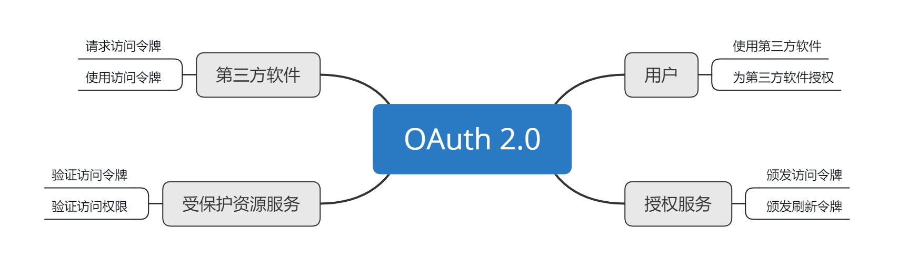

# 串讲：OAuth 2.0 的工作流程与安全问题

今天这一讲，我并不打算带你去解决新的什么问题，而是把我们已经讲过的内容再串一遍，就像学生时代每个学期即将结束时的一次串讲，来回顾下 OAuth 2.0 的整个知识体系。当然了，我也会在这个过程中，与你分享我在实践 OAuth 2.0 的过程中，积累的最值得分享的经验。

好，接下来就让我们先串一串 OAuth 2.0 的工作流程吧。

我们一直在讲 OAuth 2.0 是一种授权协议，这种协议可以让第三方软件 **代表** 用户去执行被允许的操作。那么，第三方软件就需要向用户索取 **授权** 来获得那个令牌。

我们回想下第 1 讲拜访百度王总的例子。只有拿到前台小姐姐给你的门禁卡，你才能够进入百度大楼。这个过程就相当于前台小姐姐给你做了一次 **授权**，**而这个授权的凭证就是门禁卡**。对应到我们的系统中，**门禁卡便相当于访问令牌**。

通过「代表」「授权」这样的关键词，我们可以认识到，**OAuth 2.0 是一个授权协议，也是一个安全协议**。那么，如果我说它也是一种 **委托协议**，你也不要吃惊。

试想一下，用户在微信平台上有修改昵称、修改头像、修改个人兴趣的权限，当第三方软件请求让自己代表用户来操作这些权限的时候，就是第三方软件请求用户把这些权限 **委托** 给自己，用户在批准了委托请求之后，才可以代表用户去执行这些操作。

这时，我们细想一下，**委托才是 OAuth 2.0 授权概念的根基，因为没有「委托」之意就不会有「代表」行为的发生**。

在整个课程讲述授权的过程中，我频繁举例和强调的就是授权码许可流程。在学习授权码流程的时候，你最困惑的一点恐怕莫过于 「为什么要多此一举，非得通过一个 **授权码 code**  来换取访问令牌 access_token」了吧。这个问题我在讲授权码许可的整体流程时也做过分析了，你现在回想起来应该不会再为此痛苦不堪了吧。

我们再来分析下，第三方软件要获取访问令牌，只能通过两个渠道：

1. 一个渠道是第三方软件的前端页面。但是，如果直接返回到前端页面上，访问令牌是很容易被通过浏览器截获的，所以显然不可取。

2. 另外一个渠道是通过后端传输。**第三方软件的后端和授权服务的后端之间通信**，这样就可以避免令牌被直接暴露的问题。

再往深了想，第三方软件的后端总不能向授权服务的后端 「硬要」 吧，总要告诉授权服务是要哪个用户的 access_token 吧，所以还需要用户的参与。

用户一旦参与进来，访问的第一个页面是第三方软件，用户要授权，第三方软件就需要把用户引导到授权服务页面。但这个时候，**用户就跟第三方软件之间没有任何「通信连接」了**。如果授权服务通过后端通信直接将令牌给了第三方软件的后端，那第三方软件该如何通知用户呢，恐怕就不太好实现了。

这种情况下就很巧妙地引入了授权码 code：先把 code 通过重定向返回到第三方软件的页面；第三方软件通过浏览器获取到 code 后，再通过后端通信换取 access_token；待拿到 token 之后，由于此时用户已经在第三方软件的服务上，所以可以很容易地通知到用户。

以上，就是授权码许可的整体工作流程了。我们说，这是 OAuth 2.0 授权体系中最完备的流程，其他的授权许可类型，比如资源拥有者凭据许可、客户端凭据许可、隐式许可，都是以此为基础。因此，**只要你能理解授权码许可的流程，也就掌握了整个 OAuth 2.0 中所有许可类型的运转机制**，在实际工作场景中用上 OAuth 2.0 将不再是问题。

## OAuth 2.0 安全问题串讲

但是，到这里并没有万事大吉，我们只是解决了 OAuth 2.0 的基础使用的问题。要想用好、用对这个协议，成长为这个协议的应用专家，我们还必须关注 OAuth 2.0 的安全问题。

我们在实践 OAuth 2.0 的过程中，还必须按照规范建议来执行，否则便会引发一系列的安全问题。这也往往导致有的同学会发出这样的疑问，OAuth 2.0 不是安全的吗？它不是一直在保护着互联网上成千上万个 Web API 吗，我们不也说它是一种安全协议吗？

首先我们说 OAuth 2.0 是安全协议没问题，但 **如果使用不当也会引起安全上的问题**。比如，我们在 [第 8 讲](./02.md) 中提到了一个很广泛的跨站请求伪造问题。之所以出现这样的安全问题，就是因为我们没有遵循 OAuth 2.0 的使用建议，比如没有使用 state 这样的参数来做请求的校验，或者是没有遵循授权码 code 值只能使用一次，并且还要清除使用过的 code 值跟 token 值之间的绑定关系的建议。

在安全问题上，其实我们一直都没有特别说明一点，那就是 **在使用 OAuth 2.0 的流程中，我们的 HTTP 通信要使用 HTTPS 协议来保护数据传输的安全性**。这是因为 OAuth 2.0 支持的 bearer 令牌类型，也就是任意字符串格式的令牌，并没有提供且没有要求使用信息签名的机制。

你可能会说，JWT 令牌有这样的加密机制啊。但其实，这也正说明了 OAuth 2.0 是一个没有约束普通令牌的规则，所以才有了 JWT 这样对 OAuth 2.0 的额外补充。

实际上，JWT 跟 OAuth 2.0 并没有直接关系，它只是一种结构化的信息存储，可以被用在除了 OAuth 2.0 以外的任何地方。比如，重置密码的时候，会给你的邮箱发送一个链接，这个链接就需要能够标识出用户是谁、不能篡改、有效期 5 分钟，这些特征都跟 JWT 相符合。也就是说，JWT 并不是 OAuth 2.0 协议规范所涵盖的内容。

OAuth 2.0 似乎没有自己的规则约束机制，或者说只有比较弱的约束，但其实不是不约束，而是 **它就致力于做好授权框架这一件事儿**。通过我们前面的学习，也可以验证出它的确很好地胜任了这项工作。

**除此之外，OAuth 2.0 都是用开放的心态来提供基础的支持**，比如 [第 9 讲中的 OpenID Connect（OIDC）身份认证协议框架](./03.md)。这种开放的方式，使得我们可以用「OAuth 2.0 + 另外一个技术」来变成一个新的技术。这就是一个伟大的、可操作的组合了，可以解决不同场景的需求。

也许正是因为 OAuth 2.0 可以支持类似 OIDC 这样的身份认证协议，导致我们总是「坚持」认为 OAuth 2.0 是一种身份认证协议。当然了，OAuth 2.0 并不是身份认证协议，我在第 9 讲中用面粉和面包来类比 OAuth 2.0 和 OIDC 的关系。

这里我再解释一下。究竟是什么原因导致了我们对 OAuth 2.0 有这样的 「误解」 呢？我想大概原因是，OAuth 2.0 中确实包含了身份认证的内容，**即授权服务需要让用户登录以后才可以进行用户确认授权的操作**。

但这样的流程，**仅仅是 OAuth 2.0 涉及到了身份认证的行为，还不足以让 OAuth 2.0 成为一个真正的用户身份认证协议**。因为 OAuth 2.0 关心的只有两点，**颁发令牌和使用令牌**，并且令牌对第三方软件是不透明的；同时，受保护资源服务也不关心是哪个用户来请求，只要有合法的令牌 「递」 过来，就会给出正确的响应，把数据返回给第三方软件。

以上，就是与 OAuth 2.0 安全问题息息相关的内容了。讲到这里，希望你可以按照自己的理解，融会贯通 OAuth 2.0 的这些核心知识了。接下来，我再和你分享一个我在实践 OAuth 2.0 过程中感触最深的一个问题吧。

## 再强调都不为过的安全意识

根据我在开放平台上这些年的工作经验，安全意识是实践 OAuth 2.0 过程中，再怎么强调都不为过的问题。

因为总结起来，**要说使用 OAuth 2.0 的过程中如果能有哪个机会让你「栽个大跟头」的话，那这个机会一定是在安全上**： OAuth 2.0 本就是致力于保护开放的 Web API，保护用户在平台上的资源，如果因为 OAuth 2.0 使用不当而造成安全问题，确实是一件非常 「丢人」 的事情。

而 OAuth2.0 的流程里面能够为安全做贡献的只有两方，一方是第三方软件，一方是平台方。在安全性这个问题上，第三方软件开发者的安全意识参差不齐。那针对这一点，就需要平台方在其官方文档上重笔描述，并给出常见安全漏洞相应的解决方案。同时，作为平台方的内部开发人员，对安全的问题同样不能忽视，而且要有更高的安全意识和认知。

**只有第三方软件开发者和平台方的研发人员共同保有较高的安全意识，才能让「安全的墙」垒得越来越高，让攻击者的成本越来越高。因为安全的本质就是成本问题。**

你看，我花了这么大的篇幅来和你讲解 OAuth 2.0 的安全问题，并单独分析了安全意识，是不是足以凸显安全性这个问题的重要程度了。没错儿，这也是你能用好 OAuth 2.0 的一个关键标志。

## 总结

好了，以上就是我们今天的主要内容了。我希望你能记住以下三点：

1. OAuth 2.0 是一个授权协议，它通过访问令牌来表示这种授权。第三软件拿到访问令牌之后，就可以使用访问令牌来代表用户去访问用户的数据了。所以，我们说 **授权的核心就是获取访问令牌和使用访问令牌**。

2. OAuth 2.0 是一个安全协议，但是 **如果你使用不当，它并不能保证一定是安全的**。如果你不按照 OAuth 2.0 规范中的建议来实施，就会有安全风险。比如，你没有遵循授权服务中的授权码只能使用一次、第三方软件的重定向 URL 要精确匹配等建议。

3. 安全防护的过程一直都是「魔高一尺道高一丈」，相互攀升的过程。因此，在使用 OAuth 2.0 的过程中，第三方软件和平台方都要有足够的安全意识，来把「安全的墙」筑得更高。

最后我想说的是，无论你使用 OAuth 2.0 目的是保护 API，还是作为用户身份认证的基础，OAuth 2.0 都只是解决这些问题的一种工具。而掌握 OAuth 2.0 这种工具的原理及其使用场景，将会帮助你更高效、更优雅地解决这些问题。

## 思考题

如果你是一名第三方软件的开发人员，你觉得应该如何提高自己的安全意识呢？