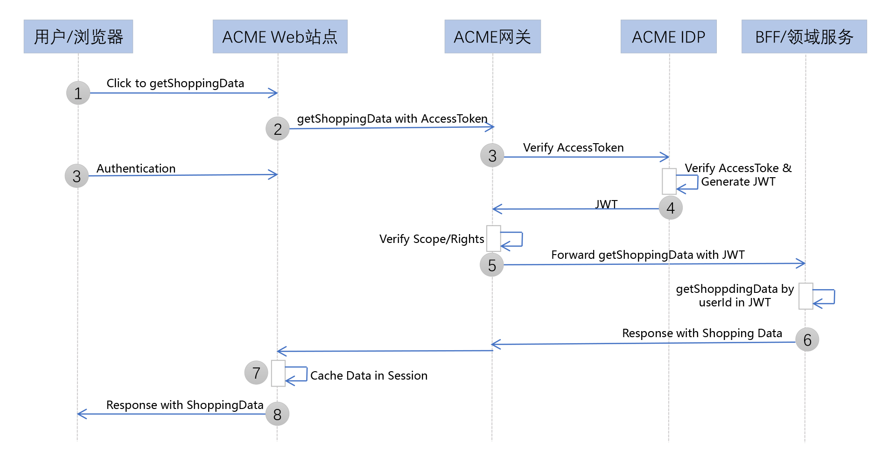

---
tags:
  - KeyCloak
  - Spring Security OAuth
---

# 架构案例：基于 OAuth 2.0/JWT 的微服务参考架构

在前面几讲，我们一起学习了 OAuth 2.0 在开放环境中的使用过程。那么 OAuth 2.0 不仅仅可以用在开放的场景中，它可以应用到我们任何需要授权 / 鉴权的地方，包括微服务。

因此今天，我特别邀请了我的朋友杨波，来和你分享一个基于 OAuth 2.0/JWT 的微服务参考架构。杨波，曾先后担任过携程框架部的研发总监和拍拍贷基础架构部的研发总监，在微服务和 OAuth 2.0 有非常丰富的实践经验。

其中，在携程工作期间，他负责过携程的 API 网关产品的研发工作，包括它和携程的令牌服务的集成；在拍拍贷工作期间，他负责过拍拍贷的令牌服务的研发和运维工作。这两家公司的令牌服务和 OAuth 2.0 类似，但要更简单些。

从单体到微服务架构的演进，是当前企业数字化转型的一大趋势。OAuth 2.0 是当前业界标准的授权协议，它的 **核心是若干个针对不同场景的令牌颁发和管理流程**；而 JWT 是一种轻量级、自包含的令牌，可用于在微服务间安全地传递用户信息。

据我目前了解到的情况，虽然有不少企业已经部分或全部转型到微服务架构，但是在授权认证机制方面，它们一般都是定制自研的，比方说携程和拍拍贷的令牌服务。之所以定制自研，主要原因在于标准的 OAuth 2.0 协议相对比较复杂，门槛也比较高。定制自研固然可以暂时解决企业的问题，但是不具备通用性，也可能有很多潜在的安全风险。

那么，到底应该如何将行业标准的 OAuth 2.0/JWT 和微服务集成起来呢，又有没有可落地的参考架构呢？

针对这个问题，今天我就和你分享一种可落地的参考架构。不过，我要提前说明的是，这个架构的思想源于 MICRO-SERVICES ARCHITECTURE WITH OAUTH2 AND JWT – PART 1 – OVERVIEW 这篇文章。根据原作者 Thijs 的描述，他提出的架构已经在企业落地架构了。如果你还想获得关于原架构的更多细节，建议进一步参考 「What is PKCE？」 这篇文章。

我认为，Thijs 给出的架构确实具有可落地性和参考价值，但是他的架构里面对某些微服务层次的命名，例如 BFF 和 Facade 层，和目前主流的微服务架构不符，还有他的架构应该是手绘，不够清晰，也不容易理解。为此，我专门用今天这一讲，来改进 Thijs 给出的架构，并补充针对不同场景的流程。

为了方便理解，在接下来的讲述中，我会假定有这样一家叫 ACME 的新零售公司，它已经实现了数字化转型，微服务电商平台是支持业务运作的核心基础设施。

在业务架构方面，ACME 有近千家线下门店，这些门店 **通过 POS 系统和电商平台对接**。公司还有一些物流发货中心，拣选（Order Picking）系统也要和电商平台对接。另外，公司还有很多送货司机，通过 App 和电商平台对接。当然，ACME 还有一些电商网站，做线上营销和销售，这些网站是电商平台的主要流量源。

然支持 ACME 公司业务运作的技术平台很复杂，但是它的核心可以用一个简化的微服务架构图来描述：

可以看出，这个微服务架构是运行在 Kubernetes 集群中的。当然了，这个架构实际上并不一定需要 Kubernetes 环境，用传统数据中心也可以。另外，**它的整体认证授权架构是基于 OAuth 2.0/JWT 实现的**。

接下来，我按这个微服务架构的分层方式，依次和你分析下它的每一层，以及应用认证 / 授权和服务调用的相关流程。这样，你不仅可以理解一个典型的微服务架构该如何分层，还可以弄清楚 OAuth 2.0/JWT 该如何与微服务进行集成。

## 微服务分层架构

ACME 公司的微服务架构，大致可以分为 Nginx 反向代理层、Web 应用层、Gateway 网关层、BEF 层和领域服务层，还包括一个 IDP 服务。总体上讲，这是一种目前主流的微服务架构分层方式，每一层职责单一、清晰。

接下来，我们具体看看每一层的主要功能。

## Nginx 反向代理层

首先，Nginx 集群是整个平台的流量入口。Nginx 是 7 层 HTTP 反向代理，主要功能是实现 **反向路由**，也就是将外部流量根据 HOST 主机头或者 PATH，路由到不同的后端，比方说路由到 Web 应用，或者直接到网关 Gateway。

在 Kubernetes 体系中，Nginx 是和 Ingress Controller（入口控制器）配合工作的（总称为 Nginx Ingress），Ingress Controller 支持通过 Ingress Rules，配置 Nginx 的路由规则。

### Web 应用层

这一层主要是一些 Web 应用，`html/css/js`  等资源就住在这一层。

Web 服务层通常采用传统的 Web MVC + 模版引擎方式处理，可以实现服务器端渲染，也可以采用单页 SPA 方式。这一层主要由公司的前端团队负责，通常会使用 Node.js 技术栈来实现，也可以采用 Spring MVC 技术栈实现。具体怎么实现，要看公司的前端团队更擅长哪种技术。当这一层需要后台数据时，可以通过网关调用后台服务获取数据。

### Gateway 网关层

这一层是微服务调用流量的入口。**网关的主要职责是反向路由**，也就是将前端请求根据 HOST 主机头、或者 PATH、或者查询参数，路由到后端目标微服务（比如，图中的 IDP/BFF 或者直接到领域服务)。

另外，网关还承担两个重要的安全职责：

1. 一个是令牌的校验和转换，将前端传递过来的 OAuth 2.0 访问令牌，通过调用 IDP 进行校验，并转换为包含用户和权限信息的 JWT 令牌，再将 JWT 令牌向后台微服务传递。

2. 另外一个是权限校验，网关的路由表可以和 OAuth 2.0 的 Scope 进行关联。这样，网关根据请求令牌中的权限范围 Scope，就可以判断请求是否具有调用后台服务的权限。

关于安全相关的场景和流程，我会在下一章节做进一步解释。

另外，网关还需 **承担集中式限流、日志监控，以及支持 CORS 等功能。**

对于网关层的技术选型，当前主流的 API 网关产品，像 Netflix 开源的 Zuul、Spring Cloud Gateway 等，都可以考虑。

### IDP 服务

IDP 是 Identity Provider 的简称，主要负责 OAuth 2.0 授权协议处理，OAuth 2.0 和 JWT 令牌颁发和管理，以及用户认证等功能。IDP 使用后台的 Login-Service 进行用户认证。

对于 IDP 的技术选型，当前主流的 Spring Security OAuth，或者 RedHat 开源的 KeyCloak，都可以考虑。其中，Spring Security OAuth 是一个 OAuth 2.0 的开发框架，适合企业定制。KeyCloak 则是一个开箱即用的 OAuth 2.0/OIDC 产品。

### BFF 层

BFF 是 Backend for Frontend 的简称，主要实现对 **后台领域服务的聚合（Aggregation，有点类似数据库的 Join）功能**，同时为不同的前端体验（PC/Mobile/ 开放平台等）提供更友好的 API 和数据格式。

BFF 中可以包含一些业务逻辑，甚至还可以有自己的数据库存储。通常，BFF 要调用两个或两个以上的领域服务，甚至还可能调用其它的 BFF（当然一般并不建议这样调用，因为这样会让调用关系变得错综复杂，无法理解）。

如果 BFF 需要获取调用用户或者 OAuth 2.0 Scope 相关信息，它可以从传递过来的 JWT 令牌中直接获取。

BFF 服务可以用 Node.js 开发，也可以用 Java/Spring 等框架开发。

### 领域服务层

领域服务层在整个微服务架构的底层。这些服务包含业务逻辑，通常有自己独立的数据库存储，还可以根据需要调用外部的服务。

根据微服务分层原则，领域服务禁止调用其它的领域服务，更不允许反向调用 BFF 服务。这样做是为了保持微服务职责单一（Single Responsibility）和有界上下文（Bounded Context），避免复杂的领域依赖。领域服务是独立的开发、测试和发布单位。在电商领域，常见的领域服务有用户服务、商品服务、订单服务和支付服务等。

和 BFF 一样，如果领域服务需要获取调用用户或者 OAuth 2.0 Scope 相关信息，它可以从传递过来的 JWT 令牌中直接获取。

可以看到，领域服务和 BFF 服务都是无状态的，它们本身并不存储用户状态，而是通过传递过来的 JWT 数据获取用户信息。所以在整个架构中，微服务都是无状态、可以按需水平扩展的，状态要么存在用户端（浏览器或者手机 App 中），要么存在集中的数据库中。

## OAuth 2.0/JWT 如何与微服务进行集成？

以上，就是 ACME 公司的整个微服务架构的层次了。这个分层架构，对于大部分的互联网业务系统场景都适用。因此，如果你是一家企业的架构师，需要设计一套微服务架构，完全可以参考它来设计。接下来，我再演示几个典型的应用认证场景，以及相应的服务调用流程，来帮助你理解 OAuth 2.0/JWT 是如何和微服务进行集成的。

### 场景 1：第一方 Web 应用 + 资源拥有者凭据模式

这个场景是用户访问 ACME 公司自己的电商网站，假设这个电商网站是用 Spring MVC 开发的。考虑到这是一个第一方场景（也就是公司自己开发的网站应用），我们 **可以选 OAuth 2.0 的资源拥有者凭据许可（Resource Owner Password Credentials Grant）**，也可以选更安全的授权码许可（Authorization Code Grant）。因为这里没有第三方的概念，所以我们就选相对简单的资源拥有者凭据许可。

下面是一个认证授权流程样例。注意，这个只是突出了关键步骤，实际生产的话，还有很多需要完善和优化的地方。另外，为描述简单，这里假定一个成功流程。

在上面的图中，用户对应 OAuth 2.0 中的资源拥有者，ACME IDP 对应 OAuth 2.0 中的授权服务。另外，前面架构图中的后台微服务（包括 BFF 和基础领域服务），对应 OAuth 2.0 中的受保护资源。

下面是流程说明：

1. 用户通过浏览器访问 ACME 公司的电商网站，点击登录链接。

2. Web 应用返回登录界面（这个登录页可以是网站自己定制开发）。

3. 用户输入用户名、密码进行认证。

4. Web 应用将用户名、密码，通过网关转发到 IDP 的令牌获取端点（POST /oauth2/token，grant_type=password）。

5. IDP 通过 Login Service 对用户进行认证。

6. IDP 认证通过，返回有效访问令牌（根据需要也可以返回刷新令牌）。

7. Web 应用接收到访问令牌，创建用户 Session，并将 OAuth 2.0 令牌保存其中，然后返回登录成功到用户端。

8. 用户浏览器中记录 Session Cookie，登录成功。

那接下来，我们再来看看认证授权之后的服务调用流程。同样，这里也只是突出了关键步骤，并假定是一个成功流程。

1. 用户登录后，在网站上点击查看自己的购物历史记录。

2. Web 应用通过网关调用后台 API（查询用户的购物历史记录），请求 HTTP header 中带上 OAuth 2.0 令牌（来自用户 Session）。

3. 网关截取 OAuth 2.0 令牌，去 IDP 进行校验。

4. IDP 校验令牌通过，再通过令牌查询用户和 Scope 信息，构建 JWT 令牌，返回。

5. 网关获得 JWT 令牌，校验 Scope 是否有权限调用 API，如果有就转发到后台 API 进行调用。

6. 后台 BFF（或者领域服务）通过传递过来的 JWT 获取用户信息，根据用户 ID 查询购物历史记录，返回。

7. Web 应用获得用户的购物历史数据，可以根据需要缓存在 Session 中，再返回用户端。

8. 购物历史数据返回到用户浏览器端。

注意，这个服务调用流程，也可以应用在其他场景中，比如我们接下来要学习的「第一方移动应用 + 授权码许可模式」和「第三方 Web 应用 + 授权码许可模式」。基本上只要你理解了这个流程原理，就可以根据实际场景灵活套用。

### 场景 2：第一方移动应用 + 授权码许可模式

第二个场景是用户通过手机访问 ACME 公司自己的电商 App。这是第一方的原生应用（Native App）场景，通常考虑选用 OAuth 2.0 的用户名密码模式，但是并不安全（参考 MICRO-SERVICES ARCHITECTURE WITH OAUTH2 AND JWT – PART 3 – IDP的 Security Consideration 部分），所以业界建议采用授权码模式，而且是要支持 PKCE 扩展的授权码模式。

那接下来，我们来看看这个认证授权的流程。同样，这里只是突出了关键步骤，并假定是一个成功流程。

1. 用户访问电商 App，点击登录。

2. App 生成 PKCE 相关的 code verifier + challenge。

3. App 以内嵌方式启动手机浏览器，访问 IDP 的统一认证页 (GET /authorize)，请求带上 PKCE 的 code challenge 相关参数。

4. IDP 返回统一认证页。

5. 用户认证和授权。

6. IDP 通过 Login Service 对用户进行认证。

7. IDP 返回授权码到 App 浏览器。

8. App 截取浏览器带回的授权码，将授权码 +PKCE code verifer，通过网关转发到 IDP 的令牌获取端点（POST /oauth2/token, grant_type=authorization-code）。

9. IDP 校验 PKCE 和授权码，校验通过则返回有效访问令牌。

10. App 获取令牌，本地存储，登录成功。

之后，App 如果需要和后台交互，可直接通过网关调用后台微服务，请求 HTTP header 中带上 OAuth 2.0 访问令牌即可。后续的服务调用流程，和「第一方应用 + 资源拥有者凭据模式」类似。

### 场景 3：第三方 Web 应用 + 授权码模式

第三个场景是某第三方合作厂商开发了一个 Web 网站，要访问 ACME 公司的电商开放平台 API。这是一个第三方 Web 应用场景，通常选用 OAuth 2.0 的授权码许可模式。

那接下来，我们来看看这个认证授权的流程。同样，这里只是突出了关键步骤，并假设是一个成功流程。

1. 用户访问这个第三方 Web 应用，点击登录链接。

2. Web 应用后台向 ACME 公司的 IPD 服务发送申请授权码请求（GET /authorize）。

3. 用户被重定向到 ACME 公司的 IDP 统一登录页面。

4. 用户进行认证和授权。

5. IDP 通过 Login Service 对用户进行认证。

6. 认证和授权通过，IDP 返回授权码。

7. Web 应用获得授权码，再向 IDP 服务的令牌获取端点发起请求（POST /oauth2/token, grant_type=authorization-code）。

8. IDP 校验授权码，校验通过则返回有效 OAuth 2.0 令牌（根据需要也可以返回刷新令牌）。

9. Web 应用创建用户 Session，将 OAuth 2.0 令牌保存在 Session 中，然后返回登录成功到用户端。

10. 用户浏览器中记录 Session Cookie，登录成功。

之后，第三方 Web 应用如果需要和 ACME 电商平台交互，可直接通过网关调用微服务，请求 HTTP header 中带上 OAuth 2.0 访问令牌即可。后续的服务调用流程，和前面的「第一方应用 + 资源拥有者凭据模式」类似。

### 额外说明

除了上面的三个主要场景和流程，我还要和你分享 6 点。这 6 点是对上面基本流程的补充，也是企业级的 OAuth 2.0 应用要额外考虑的。

**第一点是，IDP 的 API 要支持从 OAuth 2.0 访问令牌到 JWT 令牌的互转**。今天我们提到的集成架构采用 OAuth 2.0 访问令牌 + JWT 令牌的混合模式，中间需要实现 OAuth 2.0 访问令牌到 JWT 令牌的互转。这个互转 API 并非 OAuth 2.0 的标准，有些 IDP 产品（比方 Spring Security OAuth）可能并不支持，因此需要用户定制扩展。

**第二点是，关于单页 SPA 应用场景**。关于单页 SPA 应用场景，简单做法是采用隐式许可，但是这个模式是 OAuth 2.0 中比较不安全的，所以一般不建议采用。对于纯单页 SPA 应用，业界推荐的做法是：

- 如果浏览器支持 Web Crypto for PKCE，则可以考虑使用类似「第一方移动应用」场景下的授权码许可 +PKCE  扩展流程；

- 否则，考虑 SPA+ 传统 Web 混合（hybrid）模式，前端页面可以住在客户浏览器端中，但登录认证还是由后台 Web 站点配合实现，走类似「第一方 Web 应用」场景的资源拥有者凭据模式，或者「第三方 Web 应用」场景下的授权码许可模式。

**第三点是，关于 SSO 单点登录场景**。为了简化描述，上面的流程没有考虑 SSO 单点登录场景。如果要支持 Web SSO，那么各种应用场景都必须通过浏览器 +IDP 登录页集中登录，并且 IDP 要支持 Session，用于维护登录态。如果 IDP 以集群方式部署的话，还要考虑粘性 Sticky Session 或者集中式 Session。

这样，当用户通过一个 Web 应用登录后，后续如果再用其它 Web 应用登录的话，只要 IDP 上的 Session 还存在，那么这个登录就可以自动完成，相当于单点登录。

当然，如果要支持 SSO，IDP 的 Session Cookie 要种在 Web 应用的根域上，也就是说不同 Web 应用的根域必须相同，否则会有跨域问题。

**第四点是关于 IDP 和网关的部署方式**。前面的几张架构图中，IDP 虽然躲在网关后面，但实际上 IDP 可以直接通过 Nginx 对外暴露，不经过网关。或者，IDP 的登录授权页面，可以通过 Nginx 直接暴露，API 接口则走网关。

**第五点是关于刷新令牌**。为了简化描述，上面的流程没有详细说明刷新令牌的集成方式。企业根据场景需要，可以启用刷新令牌，来延长用户的登录时间，具体的集成方式需要考虑安全性的需求。

**第六点是关于 Web Session**。为了简化描述，在上面的流程中，Web 应用登录成功后假设启用 Web Session，也就是服务器端 Session。在实际场景中，Web Session 并非唯一选择，也可以采用简单的客户端 Session 方式，也称无状态 Session，也就是在客户端浏览器 Cookie 中保存 OAuth 2.0 访问令牌。

## 小结

好了，以上就是今天的主要内容了。今天，我和你分享了如何将行业标准的 OAuth 2.0/JWT 和微服务集成起来，你需要记住以下四点。

1. 目前主流的微服务架构大致可以分为 5 层

   分别是：Nginx 流量接入层  -> Web 应用层  -> API 网关层 -> BFF 聚合层  ->  领域服务层。这个架构可以住在云原生的 Kubernetes 环境中，也可以住在传统数据中心里头。

2. API 网关是微服务调用的入口，承担重要的安全认证和鉴权功能。

   主要的安全操作包括：

   1. 通过 IDP 校验 OAuth 2.0 访问令牌，并获取带用户和权限信息的 JWT 令牌；
   2. 基于 OAuth 2.0 的 Scope 对 API 调用进行鉴权。

3. 在微服务架构体系下，通常需要一个集中的 IDP 服务，它相当于一个 Authentication & Authorization as a Service 角色，负责令牌颁发 / 校验 / 管理，还有用户认证。

4. 在今天这一讲提出的架构中
   1. Web 应用层（网关之前）的安全机制主要基于 OAuth 2.0 **访问令牌** 实现（它是一种 **透明令牌** 或者称 **引用令牌**）
   2. 微服务层（网关之后）的安全机制主要基于 JWT 令牌实现（它是一种 **不透明** 的 **自包含令牌**）。网关层在中间实现两种令牌的转换。这是一种 OAuth 2.0 访问令牌 +JWT 令牌的混合模式。

之所以这样设计，是因为 Web 层靠近用户端，如果采用 JWT 令牌，会暴露用户信息，有一定的安全风险，所以采用 OAuth 2.0 访问令牌，它是一个无意义随机字符串。而在网关之后，安全风险相对低，同时很多服务需要用户信息，所以采用自包含用户信息的 JWT 令牌更合适。

当然，如果企业内网没有特别的安全考量，也可以直接传递完全透明的用户信息（例如使用 JSON 格式）。

## 思考题

1. 除了今天我们讲到的 OAuth 2.0 访问令牌 +JWT 令牌的混合模式，实践中也可以全程采用 OAuth 2.0 访问令牌，或者全程采用 JWT 令牌。对比混合模式，如果全程采用 OAuth 2.0 访问令牌，或者全程采用 JWT 令牌，你觉得有哪些利弊呢？

2. 你可以说说自己对基于传统 Web 应用的认证授权机制的理解吗？并对比今天讲到的现代微服务的认证授权机制，你可以说说它们之间的本质差异和相似点吗？

