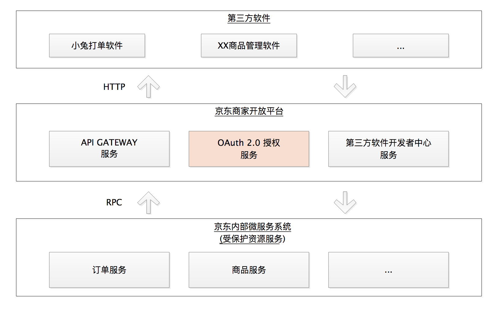
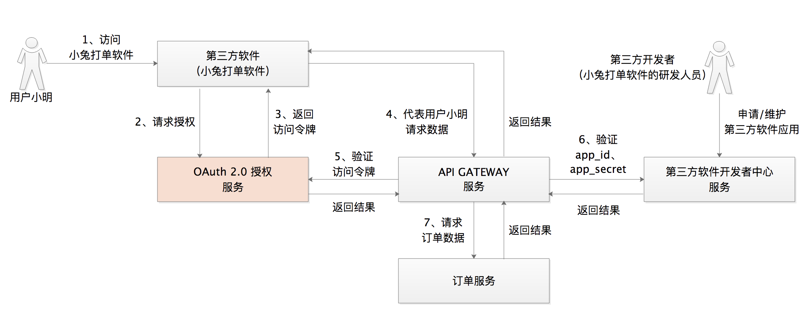
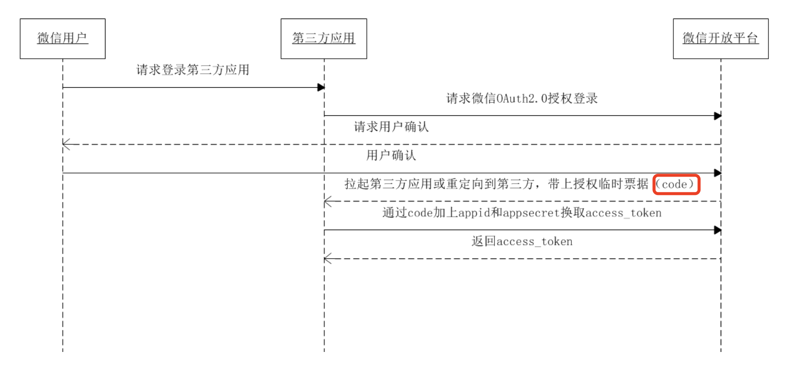
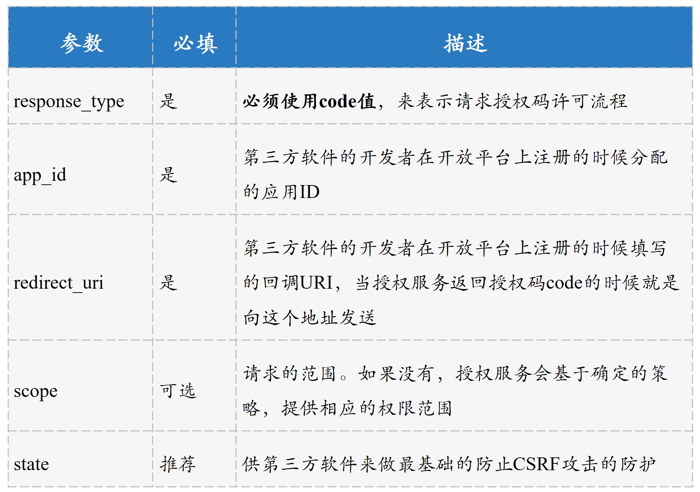
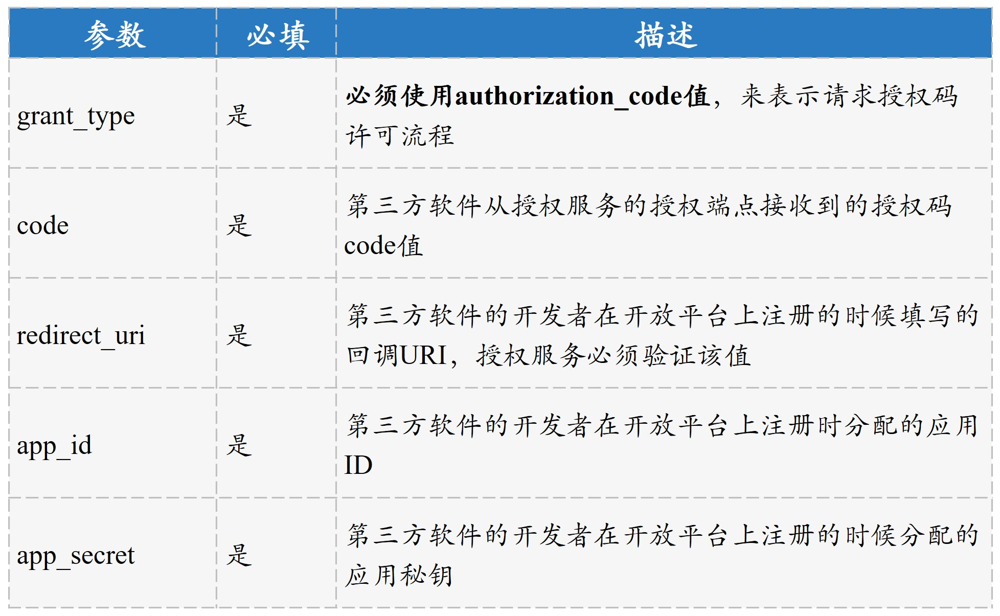
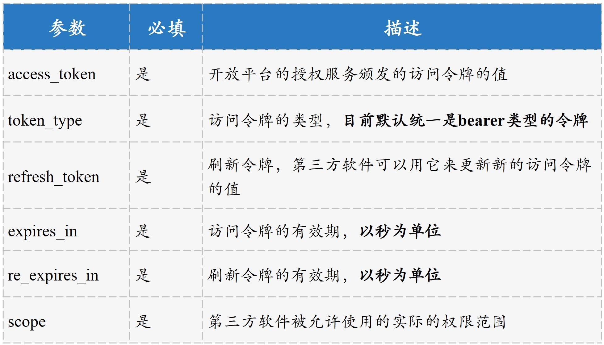

# 各大开放平台是如何使用 OAuth 2.0 的？

在咱们这门课中，我提到了很多次「开放平台」，不难理解，它的作用就是企业把自己的业务能力主要以开放 API 的形式，赋能给外部开发者。而作为第三方开发者或者 ISV（独立软件供应商）在接入这些开放平台的时候，我们最应该关心的就是它们的官方文档，关注接入的流程是怎样的、对应的 API 是什么、每个 API 都传递哪些参数，也就差不多够了。

到这里，你会发现「开放平台的官方文档」会是一个关键点。不过呢，当你去各大开放平台上面看这些文档的时候，就会发现这些文档非常分散。

其中的原因也很简单，那就是开放平台为了让已经具备 OAuth 2.0 知识的研发人员去快速地对接平台上面的业务，把各类对接流程做了分类归档。比如，你会发现微信开放平台上有使用授权码获取授权信息的文档，也有获取令牌的文档，但并没有一份整体的、能够串起来的文档说明。从我的角度来看，这其实也就间接提高了使用门槛，因为如果你不懂 OAuth 2.0，基本是没办法理解那些分类的。

那么，今天我就借着这个点，和你说说以京东、微信、支付宝、美团为代表的各大开放平台是如何使用 OAuth 2.0 的。理解了这个问题，你以后再对接一个开放平台、再阅读一份官方对接文档时，就更能明白它们的底层逻辑了。

在正式介绍各大开放平台的使用细节之前，我们先来看看大厂的开放平台全局体系。据我观察，各个开放平台基本的系统结构和授权系统在中间的交互流程，大同小异，都是 **通过授权服务来授权，通过网关来鉴权**。所以接下来，我就以京东商家开放平台为例，来和你说说开放平台的体系到底是什么样子的。

## 开放平台体系是什么样子的？

我们首先来看一下京东商家开放平台全局体系的结构，如下图所示。

我们可以把这个架构体系分为三部分来看：

1. 第三方软件，一般是指第三方开发者或者 ISV 通过对接开放平台来实现的应用软件，比如小兔打单软件。

2. 京东商家开放平台，包含 API 网关服务、OAuth 2.0 授权服务和第三方软件开发者中心服务。其中：
   - API 网关服务和 OAuth 2.0 授权服务，是开放平台的「两条腿」；
   - 第三方软件开发者中心服务，是为开发者提供管理第三方软件应用基本信息的服务，比如 app_id、app_secret 等信息。

3. 京东内部的各个微服务，比如订单服务、商品服务等。这些微服务，就是我们之前提到的受保护资源服务。

   

从图中我们还可以看到这个体系整体的调用关系是：第三方软件通过 HTTP 协议请求到开放平台，更具体地说是开放平台的 API 网关服务，然后由 API 网关通过内部的 RPC 调用到各个微服务。

接下来，我们再以用户小明使用小兔打单软件为例，来看看这些系统角色之间具体又是怎样交互的？

到这里，我们可以发现，在开放平台体系中各个系统角色间的交互可以归结为：

1. 当用户小明访问小兔软件的时候，小兔会首先向开放平台的 OAuth 2.0 授权服务去请求访问令牌，接着小兔拿着访问令牌去请求 API 网关服务；

2. 在 API 网关服务中，会做最基本的两种校验，一种是访问令牌的合法性校验，比如访问令牌是否过期的校验，另一种是小兔打单软件的基本信息的合法性校验，比如 app_id 和 app_secret 的校验；

3. 都校验成功之后，API 网关服务会发起最终的数据请求。

这里需要说明的是，在第 5 讲中我们提到，验证访问令牌或者第三方软件应用信息的时候，都是在受保护资源服务中去做的。**当有了 API 网关这一层的时候，这些校验工作就会都落到了 API 网关的身上，因为我们不能让很多个受保护资源服务做同样的事情**。

我们理解了京东商家开放平台的体系结构后，可以小结下了。依靠开放平台提供的能力，可以说开放平台、用户和开发者实现了三赢：

- 小明因为使用小兔提高了打单效率；
- 小兔的开发者因为小明的订购服务获得了收益；而通过开放出去的 API 让小兔帮助小明能够极快地处理 C 端用户的订单
- 京东提高了用户的使用体验。

但同时呢，开放也是一把双刃剑。理想状态下，平台、开发者、用户可以实现三赢，但正如我们在第 8 讲和第 10 讲中提到的，安全的问题绝不容忽视，而用户的信息安全又是重中之重。接下来，我就和你分享一个，开放平台体系是如何解决访问令牌安全问题的案例。

我们已经知道，用户给第三方软件授权之后，授权服务就会生成一个访问令牌，而且这个访问令牌是跟用户关联的。比如，小明给小兔打单软件进行了授权，那么此时访问令牌的粒度就是：小兔打单软件 + 小明。

我们还知道了，小兔打单软件可以拿着这个访问令牌去代表小明访问小明的数据；如果访问令牌过期了，小兔打单软件还可以继续使用刷新令牌来访问，直到刷新令牌也过期了。

现在问题来了，如果小明注销了账号，或者修改了自己的密码，那他之前为其它第三方软件进行授权的访问令牌就应该立即失效。否则，在刷新令牌过期之前，第三方软件可以一直拿着之前的访问令牌去请求数据。这显然不合理。

所以在这种情况下，授权服务就要通过 MQ（消息队列）接收用户的注销和修改密码这两类消息，然后对访问令牌进行清理。

其实，这个案例中解决访问令牌安全问题的方式，不仅仅适用于开放平台，还可以为你在企业内构建自己的 OAuth 2.0 授权体系结构时提供借鉴。

以上就是开放平台整体的结构，以及其中需要重点关注的用户访问令牌的安全性问题了。我们作为第三方软件开发者，在对接到这些开放平台或者浏览它们的网站时，几乎都能看到类似这样的一句话：「所有接口都需要接入 OAuth 授权，经过用户确认授权后才可以调用」，这正是 OAuth 2.0 的根本性作用。

理解了开放平台的脉络之后，接下来，就让我们通过一组图看一看开放平台是如何使用 OAuth 2.0 授权流程的吧。

## 各大开放平台授权流程

我们以微信、支付宝、美团为例，看看它们在开放授权上是如何使用 OAuth 2.0 的。我们首先看一下官方的授权流程图：

> 引自微信官方文档

> 引自支付宝开放平台文档

> 引自美团外卖开放平台

我们可以在这三张授权流程图中看到，都有和授权码 code 相关的文字。这就说明，**它们都建议开发者首选授权码流程**。所以，你现在更能明白我为啥在这门课里要花这么多篇幅，来和你讲授权码许可相关的内容了吧。

在这一讲最开始我也提到了，我们作为开发者在对接开放平台的时候，最关心的就是它们提供的官方对接文档了。而 **这些文档里面，最让人头疼就是那些通信过程中需要传递的参数** 了。下面我会带着你从我的角度，以京东商家开放平台为例，给你串下这些参数背后的含义，以及关键点。这样你在做具体接入操作的时候，就可以举重若轻了。

## 授权码流程中的参数说明

概括来讲，在京东商家开放平台的授权服务这一侧，提供服务的就是两个端点：负责生成授权码的 **授权端点** 以及负责颁发访问令牌的 **令牌端点**。整个授权过程中，虽然看着有很多参数，但你可以围绕这两条线，来对它们做归类。

接下来，我们继续以小兔打单软件为例，来看一下它在对接京东商家开放平台的时候都用到了哪些参数。

小明在使用小兔打单软件的时候，首先被小兔通过重定向的方式引导到京东商家开放平台的授权服务上，其实就是引导到了授权服务的授权端点上。这个重定向的过程中用到的参数如下：

这里需要强调的是，对于 state 参数，现在官方都是推荐使用。我们在第 8 讲中说过，OAuth 2.0 官方建议的避免 CSRF 攻击的方式，就是使用 state 参数。所以安全起见，你还是应该使用。

接着，京东商家开放平台授权服务的授权端点，会向小兔软件做出响应。这个响应的过程用到的基本参数，如下：

对于授权码 code 的值，一般建议的最长生命周期是 10 分钟。另外，小兔打单软件只能被允许使用一次该授权码的值，如果使用一次之后还用同样的授权码值来请求，授权服务必须拒绝。

对于这次的 state 值，授权服务每次都是必须要返回给小兔打单软件的。无论小兔打单软件在起初的时候有没有发送该值，都必须返回回去，如果没有就返回空。这样当小兔打单软件日后升级增加该值的时候，京东商家开放平台就不需要改动任何代码逻辑了。

在拿到授权码 code 的值之后，接下来就是小兔打单软件向京东商家开放平台的授权服务的令牌端点发起请求，申请访问令牌。这个过程中需要传递的基本参数，如下：

在授权服务接收到小兔打单软件申请访问令牌的请求后，像授权端点一样，令牌端点也需要向小兔打单软件做出响应。这个过程涉及到的基本参数，如下：

对于这里返回的 scope 值，我要强调下，其实就是小兔软件被允许的实际的权限范围，因为小明有可能给小兔软件授予了小于它在开放平台注册时申请的权限范围。比如，小兔打单软件申请了查询历史订单、查询当天订单两个 API 的权限，但小明可能只给小兔授权了查询当天订单 API 的权限。

## 总结

好了，这一讲就要结束了。我们一起学习了开放平台体系的整体结构和授权流程，以及第三方软件开发者关心的对接开放平台的通信流程中需要传递的参数。现在，我希望你能记住以下三点内容。

1. 当有多个受保护资源服务的时候，基本的鉴权工作，包括访问令牌的验证、第三方软件应用信息的验证都应该抽出一个 API 网关层，并把这些基本的工作放到这个 API 网关层。

2. 各大开放平台都是推荐使用授权码许可流程，无论是网页版的 Web 应用程序，还是移动应用程序。

3. 对于第三方软件开发者重点关注的参数，可以从授权服务的授权端点和令牌端点来区分，授权端点重点是授权码请求和响应的处理，令牌端点重点是访问令牌请求和响应的处理。

## 思考题

在有了 API 网关这一层之后，API 网关向订单服务请求数据的时候，还是传递访问令牌 access_token 的值吗？如果不是的话，它传递的又是什么值呢？

答：API GATEWAY 和 其它微服务系统之间，属于内部通讯，可以直接传递数据，在 APIGATE WAY 这一层，把ACCESS_TOKEN 对应的用户属性【兑换】出来，传递下去。

## 拓展阅读

