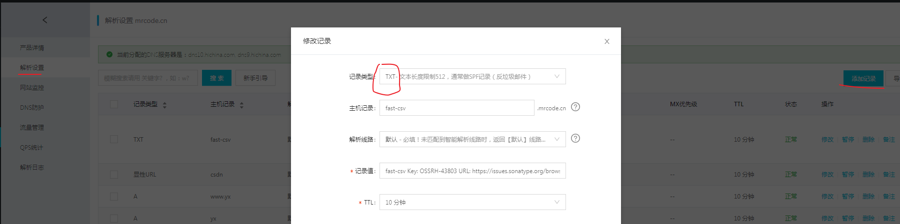
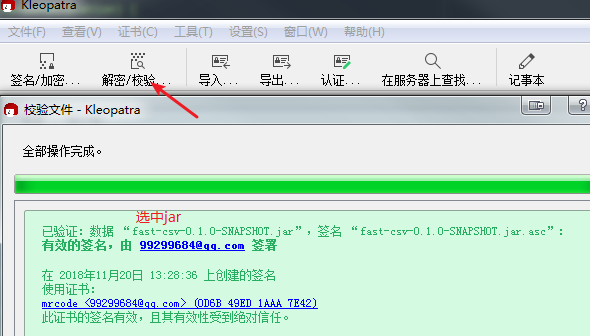
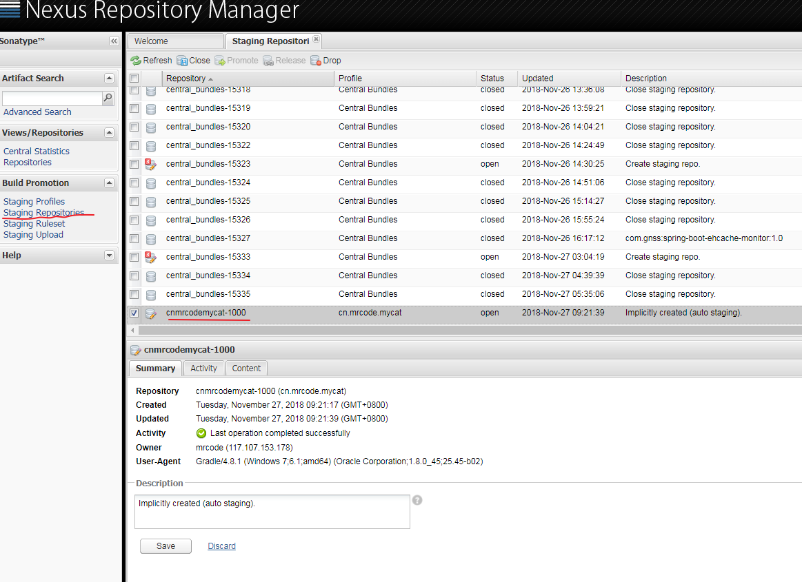
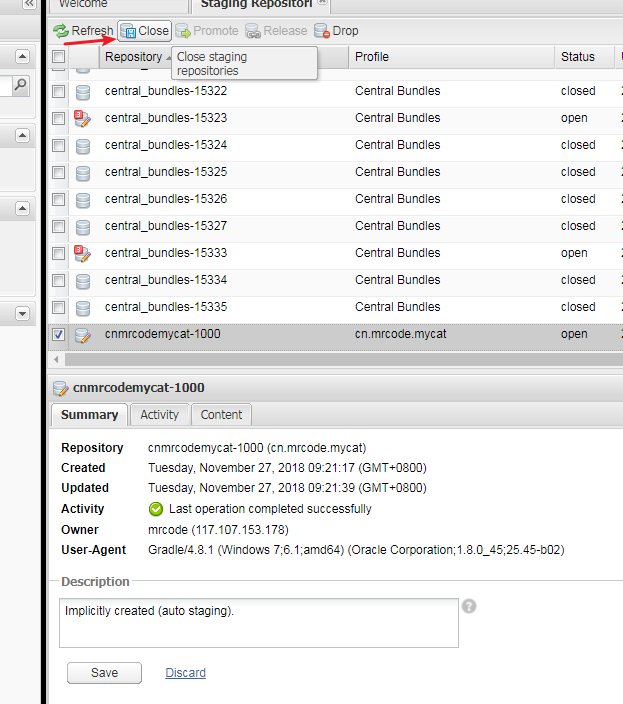
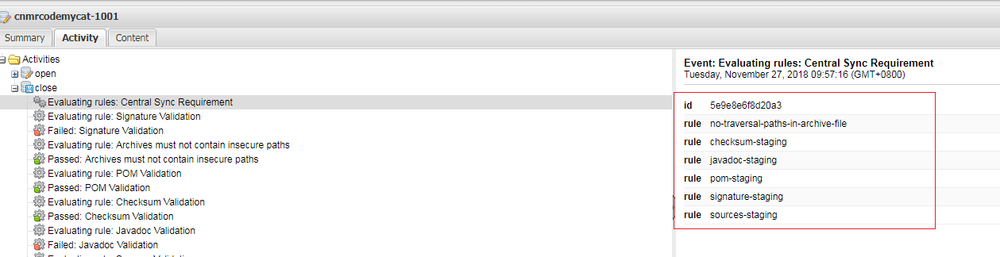

# 发布包到 maven 仓库


## 在 sonatype 做准备工作

效果：发布到 https://oss.sonatype.org/#nexus-search;quick~mrcode 仓库中

首先需要到这个页面注册账户：https://issues.sonatype.org/

登录之后，创建点击顶部导航栏的 create 创建项目


创建完成之后就会出一个 issues, 比如这个： https://issues.sonatype.org/browse/OSSRH-43803


流程：

1. 创建账户
2. 创建 issues 类型为新项目
3. 他们工作人员会要求你证明你提供的 group id 的域名是属于你自己的
  1. 如果不能提供证明，你将不能使用这个域名作为你的 group id
  2. 他也告知你可以使用 github 等域名作为你的 group id
3. 证明 group id 是你的域名之后，就可以发布包到仓库了。

我选择的是在 dns 中增加 txt；如下图，很快就通过认证了



关于 gradle 的最终配置在最后部分。下面的几个配置都是探索的配置过程记录；

## gradle 配置

可直接看后面的 [最终打包配置](push-to-maven.md#最终的打包配置 "最终的打包配置")

```groovy
plugins {
    id 'java'
    id 'maven-publish'  // 添加插件
}

group 'cn.mrcode.mycat'
version '0.1.0-SNAPSHOT'

sourceCompatibility = 1.8

compileJava {
    sourceCompatibility = 1.8
    targetCompatibility = 1.8
    [compileJava]*.options*.encoding = 'UTF-8'
}
compileTestJava {
    sourceCompatibility = 1.8
    targetCompatibility = 1.8
    [compileTestJava]*.options*.encoding = 'UTF-8'
}
repositories {
    mavenCentral()
}

dependencies {
    compile 'org.slf4j:slf4j-api:1.7.25'
    testCompileOnly 'junit:junit:4.12'
    testCompileOnly 'org.apache.commons:commons-lang3:3.8.1'
    testCompileOnly 'ch.qos.logback:logback-core:1.1.7'
    testCompileOnly 'ch.qos.logback:logback-classic:1.1.7'
    testCompileOnly 'org.apache.commons:commons-csv:1.6'
}

// 最主要的是这里
publishing {
    publications {
        // 这一个推送项目名称，mavenJava 相当于是一个 task name
        mavenJava(MavenPublication) {
            groupId project.group
            artifactId project.name
            version "${version}"
            from components.java
            artifact sourceJar

            // 添加 pom 相关信息
            // https://docs.gradle.org/current/dsl/org.gradle.api.publish.maven.MavenPublication.html
            pom {
                name = "fast-csv"
                description = "load csv file for Mycat"
                url = "https://github.com/zq99299/fast-csv"
                licenses {
                    license {
                        name = "The Apache License, Version 2.0"
                        url = "http://www.apache.org/licenses/LICENSE-2.0.txt"
                    }
                }
                developers {
                    // 添加开发者描述，这个id不知道是什么
                    developer {
                        id = "zq99299"
                        name = "mrcode"
                        email = "99299684@qq.com"
                    }
                }
                // 添加你的 git 仓库 信息
                scm {
                    connection = "scm:git:https://github.com/zq99299/fast-csv.git"
                    developerConnection = "scm:git:https://github.com/zq99299/fast-csv.git"
                    url = "https://github.com/zq99299/fast-csv"
                }
            }
        }
    }
    repositories {
        // 添加一个远程仓库地址
        // releases 仓库
        maven {
            // 在对 task 中会生成对应的名称 publishMavenJavaPublicationToxxx
            // 后面的 xxx 就是你这里的名称，表示你要把jar 上传到这个仓库中
            name 'sonatypeRepository'  // 为你这个仓库起名
            url 'https://oss.sonatype.org/service/local/staging/deploy/maven2/'
            credentials {
                username = "${NEXUS_USERNAME}"  // 之前在 sonatype 注册的账户名
                password = "${NEXUS_PASSWORD}" // 对应的密码
            }
        }
        // snapshots 仓库
        maven {
            name = 'sonatypeSnapshotRepository'
            url = 'https://oss.sonatype.org/content/repositories/snapshots/'
            credentials {
                username = "${NEXUS_USERNAME}"
                password = "${NEXUS_PASSWORD}"
            }
        }
    }
}
task sourceJar(type: Jar, dependsOn: classes) {
    description = "打包源码"
    classifier = 'sources'
    from sourceSets.main.allSource
}
```

## 发布
对于发布来说，有两个地址：

- releases  ：
  - 表示正式版，稳定版本
  - 听说需要 gpg 签名才可以发布成功
  - 不需要  -SNAPSHOT 后缀
- snapshots ：
  - 快照版， 不稳定的，开发的时候常用；
  - 必须携带 -SNAPSHOT 后缀

上面的配置对于 snapshots 已经可以发布了，只要执行 task publishMavenJavaPublicationToxxx 对应的仓库名称即可；

## GPG 生成
配置之前需要你现有 gpg 的签名文件，我这里下载 windows 的软件

gpg4win-3.1.5 ：https://gpg4win.org/thanks-for-download.html

这个软件支持中文。创建很简单。直接新建密钥对即可。


下一步后面的信息都是选填的。傻瓜式下一步即可生成。


- 导出 ： 可以导出一个 .gpg 的文件
- 在服务器上发布。弹出询问框，同意之后，会发自动上传到公共服务器上。
- 细节：相当于一个详细信息。里面包含了你这个秘钥的指纹。后面配置需要用到这个指纹的后8位

注意：这个 gpg 你在上传到服务器之前需要生成 吊销证书.rev 。以后还可以使用这个证书进行取消的。不然就没法取消了

> gpg 的详细教程可以参考 阮一峰的教程：http://www.ruanyifeng.com/blog/2013/07/gpg.html


## 签名配置
可直接看后面的 [最终打包配置](push-to-maven.md#最终的打包配置 "最终的打包配置")

首先在顶部 plugins 中增加签名插件     id 'signing'

在配置一下依赖，让插件任务运行
```
// 1. 签名配置
signing {
    sign configurations.archives
}

// 2.
// 这里的 dependsOn 依赖了 signArchives 这个被插件自动添加的任务
// 目的是在 source 前执行签名
task sourceJar(type: Jar, dependsOn: [classes, signArchives]) {
    description = "配置source的路径"
    classifier = 'sources'
    from sourceSets.main.allSource
}

// 3. 在之前的配中增加一项
publishing {
    publications {
        mavenJava(MavenPublication) {
            groupId project.group
            artifactId project.name
            version "${version}"
            from components.java
            artifact sourceJar
            // 增加这个签名名称所在的位置，
            // signArchives 输出文件中以你项目名作为的 key。这里获取这一个签名文件
            artifact signArchives.outputFiles.get('fast_csv')

```

这里可以执行 gradle task publishToMavenLocal 这个任务来查看打到本地 maven 仓库的jar

可以发现如下的目录结构
```
fast-csv-0.1.0-SNAPSHOT.asc   -> 签名文件
fast-csv-0.1.0-SNAPSHOT.jar
fast-csv-0.1.0-SNAPSHOT.pom
fast-csv-0.1.0-SNAPSHOT-sources.jar
maven-metadata-local.xml
```

这一步执行肯定会报错的，因为你没有指定你的签名信息：

在 gradle 中增加以下配置
```
signing.keyId=上面说过 gpg 的秘钥指纹后八位
signing.password=你创建 gpg 密钥对的设置的密码
signing.secretKeyRingFile=C:/Users/Administrator/Desktop/xxxx.gpg   // gpg 路径
```

对于生成之后的这个目录，jar 文件。我们也可以使用之前生成密钥对的工具进行校验




## 尝试 release 版本
这里只是一个尝试发布的过程记录；

执行 gradle publishMavenJavaPublicationToSonatypeRepository 任务，将会打包推送到远程仓库

不过只是被暂存了在 https://oss.sonatype.org/#stagingRepositories 中了，如下图（需要登录后，在最底部才能看到）




选中关闭，会自动刷新。但是应该需要手动刷新获取执行的结果



如下图，这个就构建失败了;


经过尝试发现以下几个是必须的：

1. 提交的所有文件必须签名

  - fast-csv-0.1.0.jar
  - fast-csv-0.1.0.pom
  - fast-csv-0.1.0-sources.jar
2. javadoc 也必须随包一起发布

其实第一个任务就告诉了，这些规则都是必须的。。


## 最终的打包配置
百度了好长时间，不知道怎么配置，最后还是在官网找到了配置教程 : https://docs.gradle.org/current/userguide/publishing_overview.html

build.gradle
```java
plugins {
    id 'java'
    id 'maven-publish'  // maven 发布插件
    id 'signing'  // 签名插件
}

//  组 和 版本配置
group 'cn.mrcode.mycat'
//version '0.1.0-SNAPSHOT'
version '0.1.0'

// 编译版本和编码配置
sourceCompatibility = 1.8

compileJava {
    sourceCompatibility = 1.8
    targetCompatibility = 1.8
    [compileJava]*.options*.encoding = 'UTF-8'
}
compileTestJava {
    sourceCompatibility = 1.8
    targetCompatibility = 1.8
    [compileTestJava]*.options*.encoding = 'UTF-8'
}
// 测试用例没有写好，还不能自动测试
// 跳过所有文件的编译测试；不是跳过compileTestJava task 而是在执行该task的时候，跳过所有的测试文件
test {
    exclude '**/*.class'
}

repositories {
    mavenCentral()
}

dependencies {
    compile 'org.slf4j:slf4j-api:1.7.25'
    testCompileOnly 'junit:junit:4.12'
    testCompileOnly 'org.apache.commons:commons-lang3:3.8.1'
    testCompileOnly 'ch.qos.logback:logback-core:1.1.7'
    testCompileOnly 'ch.qos.logback:logback-classic:1.1.7'
    testCompileOnly 'org.apache.commons:commons-csv:1.6'
}

// 后面的都是打包的配置
task sourcesJar(type: Jar) {
    classifier = 'sources'
    from sourceSets.main.allJava
}
// 生成 javadoc jar
task javadocJar(type: Jar) {
    classifier = 'javadoc'
    from javadoc.destinationDir
}
// javadoc 配置，这里是自定义了 java doc 的一些配置
javadoc {
    description = "Generates project-level javadoc for use in -javadoc jar"

    options.memberLevel = org.gradle.external.javadoc.JavadocMemberLevel.PROTECTED
    options.author = true
    options.version = true
    options.header = project.name
    options.addStringOption('Xdoclint:none', '-quiet')

    // suppress warnings due to cross-module @see and @link references;
    // note that global 'api' task does display all warnings.
    logging.captureStandardError LogLevel.INFO
    logging.captureStandardOutput LogLevel.INFO // suppress "## warnings" message
    options.encoding = "UTF-8"  //编码一定要配置否则直接出错
    options.charSet = 'UTF-8'
}

publishing {
    publications {
        mavenJava(MavenPublication) {
            groupId project.group
            artifactId project.name
            version "${version}"
            from components.java
            artifact sourcesJar
            artifact javadocJar

            // https://docs.gradle.org/current/dsl/org.gradle.api.publish.maven.MavenPublication.html
            pom {
                name = "fast-csv"
                description = "load csv file for Mycat"
                url = "https://github.com/zq99299/fast-csv"
                licenses {
                    license {
                        name = "The Apache License, Version 2.0"
                        url = "http://www.apache.org/licenses/LICENSE-2.0.txt"
                    }
                }
                developers {
                    developer {
                        id = "zq99299"
                        name = "mrcode"
                        email = "99299684@qq.com"
                    }
                }
                scm {
                    connection = "scm:git:https://github.com/zq99299/fast-csv.git"
                    developerConnection = "scm:git:https://github.com/zq99299/fast-csv.git"
                    url = "https://github.com/zq99299/fast-csv"
                }
            }
        }
    }
    repositories {
        maven {
            name 'sonatypeRepository'
            url 'https://oss.sonatype.org/service/local/staging/deploy/maven2/'
            credentials {
                username = "${NEXUS_USERNAME}"
                password = "${NEXUS_PASSWORD}"
            }
        }
        maven {
            name = 'sonatypeSnapshotRepository'
            url = 'https://oss.sonatype.org/content/repositories/snapshots/'
            credentials {
                username = "${NEXUS_USERNAME}"
                password = "${NEXUS_PASSWORD}"
            }
        }
    }
}

// 签名配置，注意这里的顺序，今天第一次知道 gradle 中的 task 等配置也是有顺序的
// 必须在 publishing 配置之后
signing {
    sign publishing.publications.mavenJava
}
```

gradle.properties
```
NEXUS_USERNAME= sonatype 注册的用户名
NEXUS_PASSWORD= sonatype 对应的密码

signing.keyId= 8 位数的秘钥指纹 id。后 8 位
signing.password= gpg 文件的密码
signing.secretKeyRingFile= C:/Users/xxx.gpg // 你的 gpg 文件路径
```

最后看图


再去之前 issues 项目页面  https://issues.sonatype.org/browse/OSSRH-43803 回复下;

还要 release 一下，才会被同步到 中央仓库中；


哈哈哈，为了发布一个包，前前后后折腾了好几天。

## 优化 gradle 配置
现在的配置遇到一个问题。有敏感信息，如何才能让敏感信息不上传到 git 上呢？又能不影响项目的构建？

这些问题在 gradle 官网教程中找到了答案:

- [签名插件的建议](https://docs.gradle.org/current/userguide/signing_plugin.html#sec:signatory_credentials)

  建议把 gradle.properties 文件在 GRADLE_USER_HOME 中；因为这些是私密的信息
- [关于 GRADLE_USER_HOME 的默认和自定义配置说明](https://docs.gradle.org/current/userguide/build_environment.html#sec:gradle_environment_variables)

  1. 在 windows 中使用 set GRADLE_USER_HOME 命令查看自定义配置的路径
  2. 如果没有配置过该环境变量则默认在 $USER_HOME/.gradle 路径下

实践步骤：

1. 把用户名和密码还有签名的配置 移动到 GRADLE_USER_HOME 目录下的 gradle.properties 文件中；

    项目目录下的 gradle.properties 中相同的变量则为覆盖 GRADLE_USER_HOME/gradle.properties 中的配置
2. 项目目录下的 gradle.properties 中只保留用户名和密码并且写上错误的用户名和密码

    在执行 build 的时候，用户名和密码会被读取，如果不存在的话会报错（比如别人下载了你的源码调试，将不能构建成功）

3. 在打包构建的时候，手动去除掉项目中 gradle.properties 的用户名和密码配置。

    让构建的时候获取 GRADLE_USER_HOME/gradle.properties 中的配置,构建完成后，再还原回来（防止别人构建失败）
