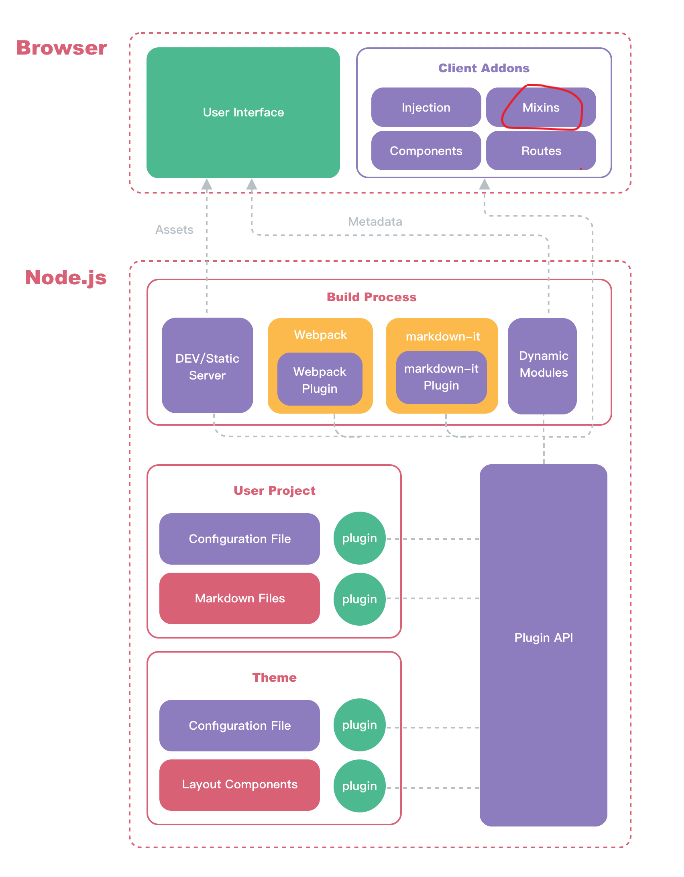
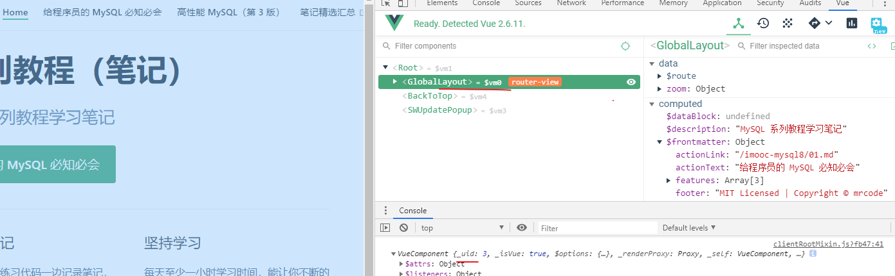

# 插件开发篇

## 插件入口

入口有两种方式：

- 使用本地插件：直接使用了一个纯函数
- 使用打包好的插件

### 使用本地插件

```json
// .vuepress/config.js
module.exports = {
  plugins: [
    [
      (pluginOptions, context) => ({
        name: 'my-xxx-plugin'
        // @1 这里挂载插件 API
      })
    ]
  ]
}
```

以上代码是用在你的写作文档中的，这个入口的好处是，你使用 `yarn docs:dev` 预览你的文档的时候，这里大部分的开发修改也可以热更新，就如果平时你开发 vue-cli 脚手架项目一样的感受。

在 `@1` 处可以挂载这里的其他 [Opetion API](https://vuepress.vuejs.org/zh/plugin/option-api.html)

### 使用打包好的插件

这个就是普通的使用，需要你提前安装插件包，然后在这里配置。不好的就是开发调试不方便


## Option API

[Opetion API](https://vuepress.vuejs.org/zh/plugin/option-api.html) 这里面的每个 API 钩子都有他自己的含义。这里只介绍其中笔者使用的几种

### clientRootMixin



记住这张图，clientRootMixin 让你可以控制根组件的生命周期，据笔者观察，该 mixin 应该是挂在这个 `GlobalLayout` 组件上的，而该组件则是整个网站的布局实现了



那么你可以认为，只要这个挂上去了，你就可以根据以前开发 vue 项目的方式，对该组件进行操控。当然目前笔者水平有限，能想到的操控方式也有限，都用在目前的插件写作上了

注：这里可以直接写一个文件夹中的 mixin，也就是说，插件开发，使用这种方式，可以实时调试了