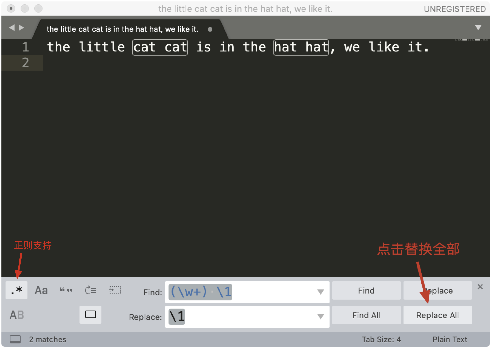

# 02 | 学习正则，我们到底要学什么？

我相信，作为一名程序员或者准程序员，你肯定是知道正则表达式的。作为计算机领域最伟大的发明之一，正则表达式简单、强大，它可以极大地提高我们工作中的文本处理效率。现在，各大操作系统、编程语言、文本编辑器都已经支持正则表达式，甚至我还和极客时间的编辑开玩笑说，他们也应该好好学学正则这门手艺。

但是，当我去和朋友深入聊天的时候，才发现很多人是没有系统学习过正则表达式的，他们和我笑着说，这东西不难，我每次用的时候都是去  Google  搜一搜，然后复制过来改一改，效率特别高，我听完之后哭笑不得。

再后来，我和极客时间合作了一个关于正则表达式的每日一课课程，在课程的留言里，很多用户讲了他们的困惑，我总结了下，主要有 4 点：

1. 学过正则，但觉得过于复杂，根本记不住；

2. 在网上找到的正则和自己的需求有一点出入，看不懂，也不知道该怎么改；

3. 不清楚正则的流派和支持情况，搞不懂为何自己写的正则没达到效果；

4. 不清楚正则的工作原理，结果写出的正则或者从网上随便找来的正则出现了性能问题。

为什么会出现这些问题呢？我觉得是核心原因主要是以下几点：

1. 没重视过正则，觉得没必要专门花时间学习，用的时候才发现书到用时方恨少；

2. 没系统学习过正则，只简单地使用过部分功能，自然也就不清楚正则流派及工作原理等内容了；

3. 没找到正确的方法去学习和记忆，导致学了之后很快就忘了。

所以，我打算通过一个课程，用尽可能通俗易懂的方式，系统化地给你梳理和讲解正则的知识点，希望可以帮助你解决上面这些问题，让正则这个强大的工具在你手上发挥出真正的威力。

但是呢，真要开始学正则，我想你的心头可能会五味杂陈，内心也是纠结万分。美国一位知名程序员杰米·加文斯基（Jamie Zawinski）说过一句话：

> 如果你有一个问题，你想到可以用正则来解决，那么你有两个问题了。
>
> Some people, when confronted with a problem, think “I know, I’ll use regular expressions.” Now they have two problems.

这句话流传在程序员中间，给人一种感觉，就是正则是很难掌握和利用好的工具。也正因如此，很多程序员并不愿意去学正则表达式，心里可能是这么想的：我在工作中用到正则的时候并不多啊，要用的时候搜一下就好了啊，为什么还要专门花时间和精力学它呢？

但我觉得，真实的情况可能是这样的：**不是工作中用不到，而是当你不熟悉一个技能的时候**，**遇到问题时根本不会考虑它** 。比如我们要删除掉文本中的所有数字，不知道正则的话，你可能会想到从 0 到 9 这样一个个替换，操作 10 次，但如果知道正则，那么只需要替换一次就可以搞定这个问题。

## 正则是什么，能做什么？

说了这么多，到底什么是正则呢？它能做什么呢？

我们先来说概念。正则，就是正则表达式，英文是 Regular Expression，简称 RE。顾名思义，正则其实就是一种 **描述文本内容组成规律的表示方式**。

在编程语言中，正则常常用来简化文本处理的逻辑。在 Linux 命令中，它也可以帮助我们轻松地查找或编辑文件的内容，甚至实现整个文件夹中所有文件的内容替换，比如 grep、egrep、sed、awk、vim 等。另外，在各种文本编辑器中，比如 Atom，Sublime Text 或 VS Code 等，在查找或替换的时候也会使用到它。总之，正则是无处不在的，已经渗透到了日常工作的方方面面。

简单来说，正则是一个非常强大的文本处理工具，它的应用极其广泛。我们可以利用它来校验数据的有效性，比如用户输入的手机号是不是符合规则；也可以从文本中提取想要的内容，比如从网页中抽取数据；还可以用来做文本内容替换，从而得到我们想要的内容。


通过它的功能和分布的广泛你也能看出来，正则是一个非常值得花时间和精力好好学习的基本技能。之前你花几十分钟才能搞定的事情，可能用正则很快就搞定了；之前不能解决的问题，你系统地学习正则后，可能发现也能轻松解决了。

## 学习正则，我们到底要学什么？

那么问题来了，想要掌握正则，我们到底要学什么？我在课程中又是怎么安排这些内容的呢？

### 1. 正则的基本知识

正则的很多基本知识其实并不难，只是难记。不过，记住一个东西并不是我们的最终目的，我们的目的是理解并且会用正则这个工具。

比如正则中的各种元字符，在课程中，我会讲有关元字符的记忆技巧，让你不再对元字符感到头疼。再比如各种模式和分组，它们可以在查找和替换时发挥强大的威力。

下面我用 Python 语言示例，从文本中找出连续出现的重复单词。我们可以看到，正则可以很方便地搞定这个需求。

```python
>>> import re
>>> test_str = "the little cat cat in the hat hat."
>>> re.sub(r'(\w+) \1', r'\1', test_str)
'the little cat in the hat.'
```

但上面的示例在任何情况下都能很好地工作么？我们要不要考虑单词的边界？反向引用又有哪些要注意的点？所有这些问题都会在课程中一一进行讲解。

### 2.在常见的编辑器中使用正则的方法

我们经常需要从大段文本中抽取需要的内容，学会使用正则之后，不用写代码就可以完成类似的日常工作。举个例子，假如我们在 Sublime Text 3 中使用正则，查找重复出现的单词，并且想把它替换成单个单词。



菜单中的 `Find -> Replace`，在查找栏中输入 `(\w+) \1`，在替换栏中输入子组的引用  `\1` ，然后点击 `Replace All` 就可以完成替换工作了。这样，通过少量的正则，我们就完成了文本的处理工作了。是不是很方便呢？

### 3. 正则中进阶的内容

除此之外，我还会在课程中讲一些更高阶的正则内容，这部分主要有正则中的断言（包括单词边界、行开始和结束、环视），三种主要流派的区别以及对应的软件实现，正则的工作机制和常见的优化方式等。

掌握这些内容可以让我们更好地理解正则， 也可以避过很多坑。比如，为什么在编程语言中能工作的正则，在 Linux 命令 grep 中就不能工作了呢？正则匹配的原理又是什么？如何写出性能更好的正则呢？

综合以上这三点，我希望你能掌握的是正则中一些重要的概念和功能，这是我们学习和使用正则的基础；然后是有关正则的记忆方法，通过合理的方式，事半功倍地达到学习效果，这是我们学习正则的利器；此外，我还会运用大量的示例让你了解正则在实际工作场景中的使用，只有与现实案例结合，我们的学习才不会脱节，这是我们学习正则的原则。

明确原则、打好基础、掌握利器，我相信你一定可以拿下正则这项技能，在工作中随心所用。学完后，你一定会觉得，手写正则原来也没有那么难。
