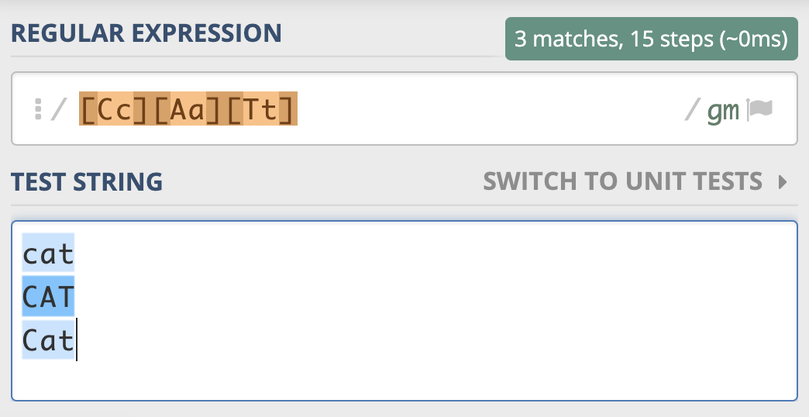
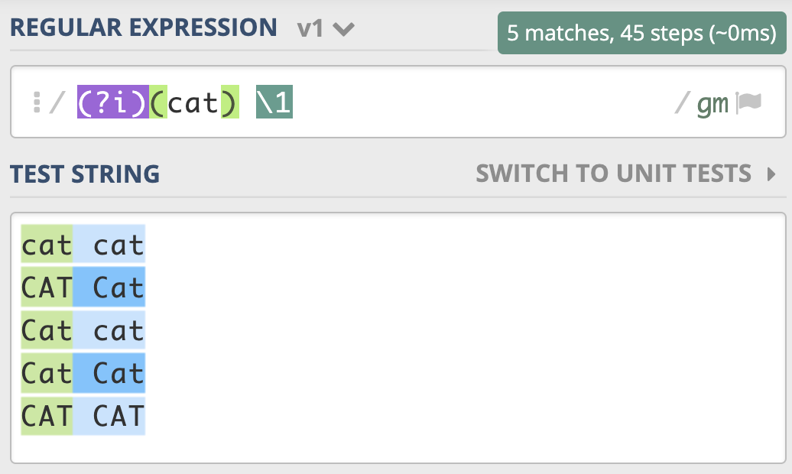
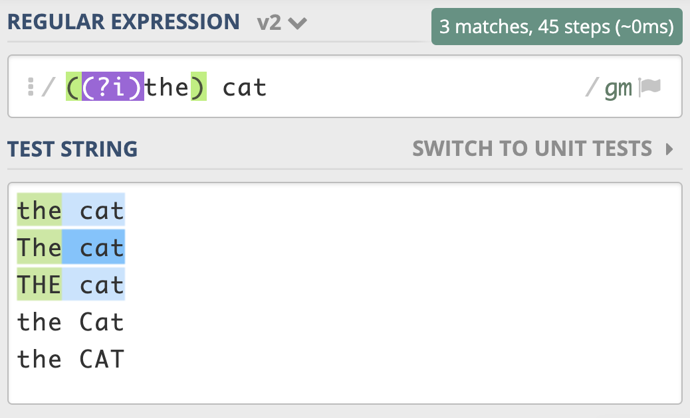
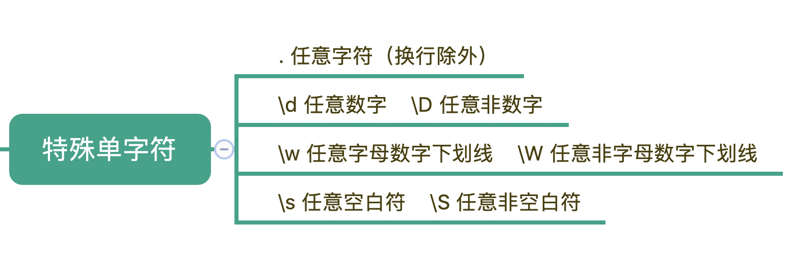
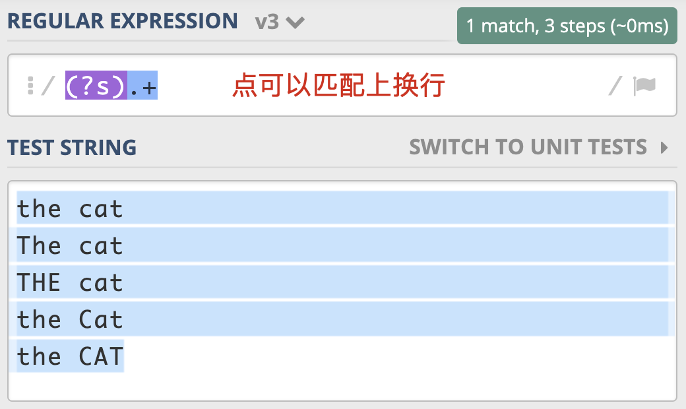
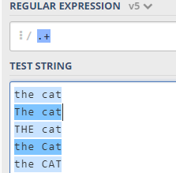
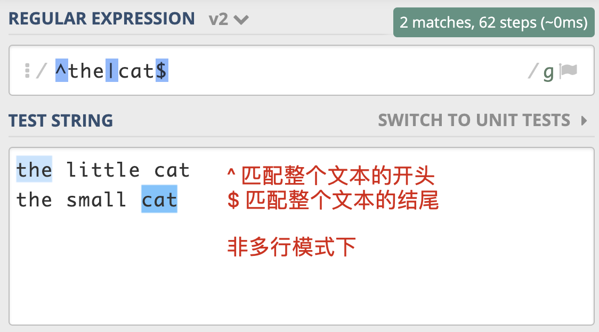
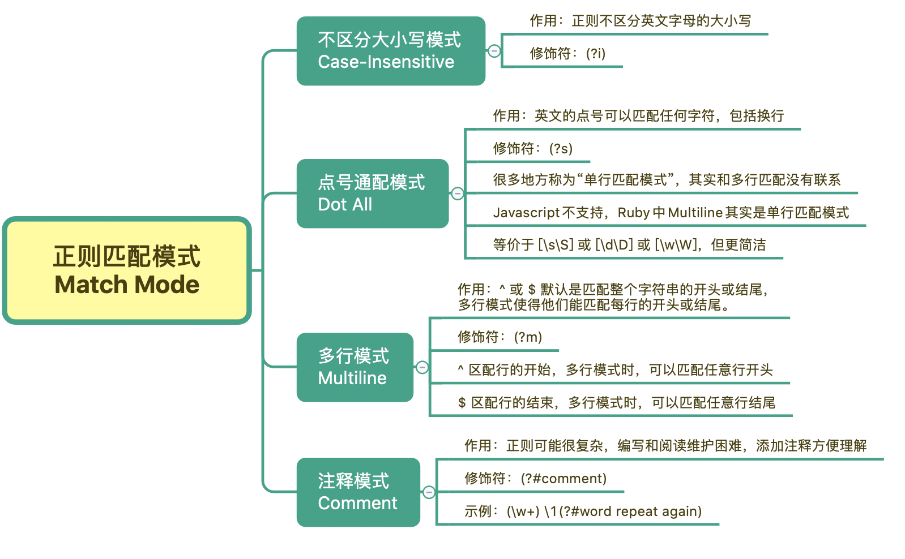
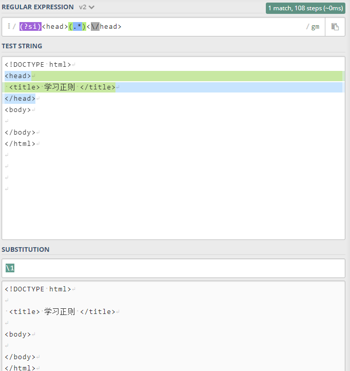

# 04丨匹配模式：一次性掌握正则中常见的 4 种匹配模式

今天我们一起来学习正则中的匹配模式（Match Mode）。

所谓匹配模式，指的是正则中一些 **改变元字符匹配行为** 的方式，比如匹配时不区分英文字母大小写。常见的匹配模式有 4 种，分别是：

- 不区分大小写模式
- 点号通配模式
- 多行模式
- 注释模式

我们今天主要来讲一下这 4 种模式。

需要注意的是，这里的「模式」对应的是英文中的 mode，而不是 pattern。有些地方会把正则表达式 pattern 也翻译成模式，你在网上看到的技术文章中讲的正则模式，有可能指的是正则表达式本身，这一点你需要注意区别。

## 不区分大小写模式（Case-Insensitive）

首先，我们来看一下不区分大小写模式。它有什么用呢？学一个知识的时候，我一般喜欢先从它的应用出发，这样有时候更能激发我学习的兴趣，也更容易看到学习成果。

下面我来举个例子说明一下。在进行文本匹配时，我们要关心单词本身的意义。比如要查找单词 cat，我们并不需要关心单词是 CAT、Cat，还是 cat。根据之前我们学到的知识，你可能会把正则写成这样：`[Cc][Aa][Tt]`，这样写虽然可以达到目的，但不够直观，如果单词比较长，写起来容易出错，阅读起来也比较困难。



那么有没有更好的办法来实现这个需求呢？这时候不区分大小写模式就派上用场了。

我们前面说了，不区分大小写是匹配模式的一种。当我们把 **模式修饰符** 放在整个正则前面时，就表示整个正则表达式都是不区分大小写的。模式修饰符是通过 **(? 模式标识)** 的方式来表示的。  我们只需要把模式修饰符放在对应的正则前，就可以使用指定的模式了。在不区分大小写模式中，由于不分大小写的英文是 `Case-Insensitive`，那么对应的模式标识就是 I 的小写字母 i，所以不区分大小写的 cat 就可以写成  `(?i)cat`。

练习文本为：

```
cat
CAT
Cat
```


你看，和 `[Cc][Aa][Tt]`  相比，这样是不是清晰简洁了很多呢？

我们也可以用它来尝试匹配两个连续出现的 cat，如下图所示，你会发现，即便是第一个 cat 和第二个 cat 大小写不一致，也可以匹配上。



我给到了你一个测试链接，你可以在这里试试不区分大小写模式： https://regex101.com/r/x1lg4P/1

测试文本为

```
cat cat
CAT Cat
Cat cat
Cat Cat
CAT CAT
```

如果我们想要前面匹配上的结果，和第二次重复时的大小写一致，那该怎么做呢？我们只需要用括号把 **修饰符和正则 cat 部分** 括起来，加括号相当于作用范围的限定，让不区分大小写只作用于这个括号里的内容。


需要注意的是，这里正则写成了 `((?i)cat) \1`，而不是  `((?i)(cat)) \1`。也就是说，我们给修饰符和 cat 整体加了个括号，而原来 cat 部分的括号去掉了。如果 cat 保留原来的括号，即 `((?i)(cat)) \1`，这样正则中就会有两个子组，虽然结果也是对的，但这其实没必要。在上一讲里我们已经讲解了相关的内容，如果忘记了你可以回去复习一下。

到这里，我们再进阶一下。如果用正则匹配，实现部分区分大小写，另一部分不区分大小写，这该如何操作呢？就比如说我现在想要，the cat 中的 the 不区分大小写，cat 区分大小写。

通过上面的学习，你应该能很快写出相应的正则，也就是 `((?i)the) cat`。实现的效果如下：



测试文本为

```
the cat
The cat
THE cat
the Cat
the CAT
```

有一点需要你注意一下，上面讲到的通过 **修饰符指定匹配模式** 的方式，在大部分编程语言中都是可以直接使用的，但在 JS 中我们需要使用 `/regex/i`  来指定匹配模式。在编程语言中通常会提供一些预定义的常量，来进行匹配模式的指定。比如 Python 中可以使用 `re.IGNORECASE` 或  `re.I` ，来传入正则函数中来表示不区分大小写。我下面给出了你一个示例，你可以看一下。

```python
>>> import re
>>> re.findall(r"cat", "CAT Cat cat", re.IGNORECASE)
['CAT', 'Cat', 'cat']
```

到这里我简单总结一下不区分大小写模式的要点：

1. 不区分大小写模式的指定方式，使用模式修饰符 `(?i)`；

2. 修饰符如果在括号内，作用范围是这个括号内的正则，而不是整个正则；

3. 使用编程语言时可以使用预定义好的常量来指定匹配模式。

## 点号通配模式（Dot All）

在基础篇的第一讲里，我为你讲解了元字符相关的知识，你还记得英文的点（`.`）有什么用吗？它可以匹配上任何符号，但不能匹配换行。当我们需要匹配真正的「任意」符号的时候，可以使用 `[\s\S]`  或  `[\d\D]`  或 `[\w\W]` 等。



但是这么写不够简洁自然，所以正则中提供了一种模式，让英文的点（`.`）可以匹配上包括换行的任何字符。

这个模式就是 **点号通配模式**，有很多地方把它称作 **单行匹配模式**，**但这么说容易造成误解，毕竟它与多行匹配模式没有联系**，因此在课程中我们统一用更容易理解的 「**点号通配模式**」。

单行的英文表示是 `Single Line`，单行模式对应的修饰符是 `(?s)`，我还是选择用 the cat 来给你举一个点号通配模式的例子。如下图所示：



需要注意的是，JavasScript 不支持此模式，那么我们就可以使用前面说的 `[\s\S]` 等方式替代。在 Ruby 中则是用 Multiline，来表示点号通配模式（单行匹配模式），我猜测设计者的意图是把点（`.`）号理解成 **能匹配多行**。

::: tip

上图是使用了 `(?s)` 单行匹配模式，可以将多行识别为一行。

如果只使用 `.+`，那么只会识别成下面这样，



:::

测试文本为

```
the cat
The cat
THE cat
the Cat
the CAT
```

## 多行匹配模式（Multiline）

讲完了点号通配模式，我们再来看看多行匹配模式。通常情况下，`^` 匹配整个字符串的开头，`$` 匹配整个字符串的结尾。**多行匹配模式改变的就是 `^` 和 `$`  匹配行为**。



测试文本为

```
the little cat
the small cat
```

::: tip

不知道是否这个测试文本有问题，不使用多行模式，测试就是后面多行模式的效果

:::

多行模式的作用在于，使  `^`  和  `$`  能匹配上 **每行** 的开头或结尾，我们可以使用模式修饰符号  `(?m)`  来指定这个模式。


这个模式有什么用呢？**在处理日志时，如果日志以时间开头，有一些日志打印了堆栈信息，占用了多行，我们就可以使用多行匹配模式，在日志中匹配到以时间开头的每一行日志**。(这里不知道如何操作)

值得一提的是，正则中还有 `\A`  和  `\z`（Python 中是 `\Z`） 这两个元字符容易混淆，`\A`  仅匹配整个字符串的开始，`\z` 仅匹配整个字符串的结束，在多行匹配模式下，它们的匹配行为不会改变，如果只想匹配整个字符串，而不是匹配每一行，用这个更严谨一些。

## 注释模式（Comment）

在实际工作中，正则可能会很复杂，这就导致编写、阅读和维护正则都会很困难。我们在写代码的时候，通常会在一些关键的地方加上注释，让代码更易于理解。很多语言也支持在正则中添加注释，让正则更容易阅读和维护，这就是正则的注释模式。正则中注释模式是使用 `(?#comment)` 来表示。

比如我们可以把单词重复出现一次的正则  `(\w+) \1`  写成下面这样，这样的话，就算不是很懂正则的人也可以通过注释看懂正则的意思。

```
(\w+)(?#word) \1(?#word repeat again)
```


在很多编程语言中也提供了 x 模式来书写正则，也可以起到注释的作用。我用 Python3 给你举了一个例子，你可以参考一下。

```python
import re
regex = r'''(?mx)  # 使用多行模式和x模式
^          # 开头
(\d{4})    # 年
(\d{2})    # 月
$          # 结尾
'''
re.findall(regex, '202006\n202007')
# 输出结果 [('2020', '06'), ('2020', '07')]
```

需要注意的是在 x 模式下，所有的换行和空格都会被忽略。为了换行和空格的正确使用，我们可以通过把空格放入字符组中，或将空格转义来解决换行和空格的忽略问题。我下面给了你一个示例，你可以看看。

```python

regex = r'''(?mx)
^          # 开头
(\d{4})    # 年
[ ]        # 空格
(\d{2})    # 月
$          # 结尾
'''
re.findall(regex, '2020 06\n2020 07')
# 输出结果 [('2020', '06'), ('2020', '07')]
```

## 总结

最后，我来给你总结一下，正则中常见的四种匹配模式，分别是：不区分大小写、点号通配模式、多行模式和注释模式。

1. 不区分大小写模式，它可以让整个正则或正则中某一部分进行不区分大小写的匹配。

2. 点号通配模式也叫单行匹配，改变的是点号的匹配行为，让其可以匹配任何字符，包括换行。

3. 多行匹配说的是 `^` 和 `$` 的匹配行为，让其可以匹配上每行的开头或结尾。

4. 注释模式则可以在正则中添加注释，让正则变得更容易阅读和维护。



## 思考题

HTML 标签是不区分大小写的，比如我们要提取网页中的 head 标签中的内容，用正则如何实现呢？


测试文本

```html
<!DOCTYPE html>
<head>
 <title> 学习正则 </title>
</head>
<body>

</body>
</html>
```

正则为:

```
# (?si) 是模式开关：s 单行匹配模式  i 是不区分大小写
(?si)<head>(.*)<\/head>
```



